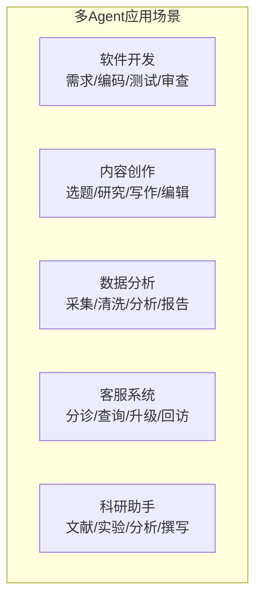
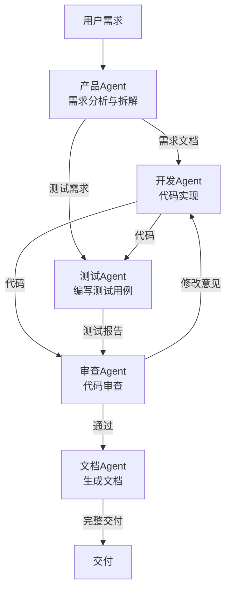
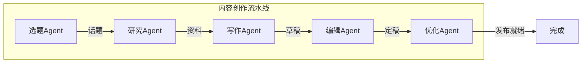
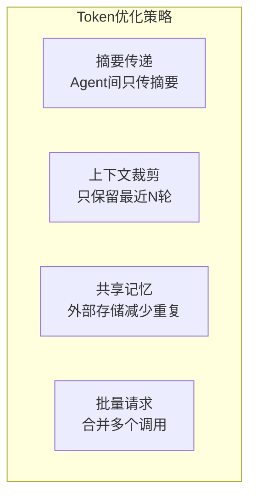
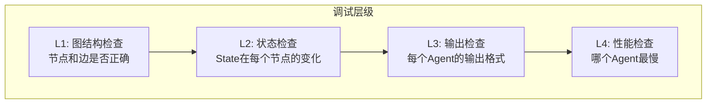
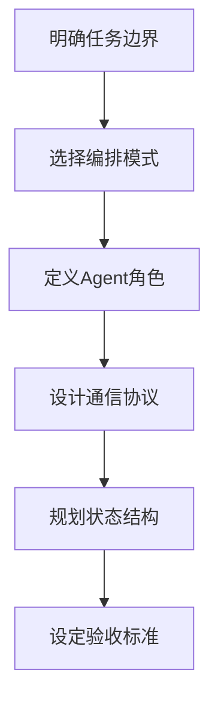

# KB117：多 Agent 协作综合应用与最佳实践

> **阶段 23 | 方向四：多 Agent 协作综合应用与最佳实践**
> 技术基准：langgraph 1.0.7、langchain-core 1.5.3、LangSmith Studio
> 面向零基础学习者，配图文说明

---

## 1 多 Agent 协作应用场景

### 1.1 典型应用场景



### 1.2 场景选择指南

| 场景 | Agent数量 | 编排模式 | 关键挑战 |
|------|----------|---------|---------|
| 软件开发 | 4-6 | Supervisor | 代码质量保障 |
| 内容创作 | 3-4 | Pipeline | 创意一致性 |
| 数据分析 | 3-5 | Swarm | 数据安全 |
| 客服系统 | 3-5 | Supervisor | 响应延迟 |
| 科研助手 | 4-6 | Network | 准确性验证 |

---

## 2 完整案例：多 Agent 软件开发系统

### 2.1 系统架构



### 2.2 完整实现

```python
from langgraph.graph import StateGraph, END, START
from langchain_openai import ChatOpenAI
from langchain_core.messages import HumanMessage, SystemMessage
from typing import TypedDict, Annotated
from langgraph.graph.message import add_messages
import json

llm = ChatOpenAI(model="gpt-4o-mini", temperature=0)

class DevState(TypedDict):
    messages: Annotated[list, add_messages]
    user_request: str
    requirements: str
    code: str
    test_code: str
    test_result: str
    review_feedback: str
    docs: str
    iteration: int
    max_iterations: int
    step: str

def product_agent(state: DevState):
    """产品Agent：分析需求并拆解为技术任务"""
    response = llm.invoke([
        SystemMessage(content="""你是产品经理Agent。分析用户需求，输出:
1. 功能需求列表
2. 技术实现要点
3. 验收标准
用简洁的Markdown格式输出。"""),
        HumanMessage(content=f"用户需求: {state['user_request']}")
    ])
    return {"requirements": response.content, "step": "develop"}

def dev_agent(state: DevState):
    """开发Agent：基于需求编写代码"""
    iteration = state.get("iteration", 0)
    feedback = state.get("review_feedback", "")
    
    prompt = f"需求: {state['requirements']}"
    if feedback:
        prompt += f"\n\n审查意见（请修改）: {feedback}"
    
    response = llm.invoke([
        SystemMessage(content="你是开发Agent，输出完整的Python代码。只输出代码块。"),
        HumanMessage(content=prompt)
    ])
    return {"code": response.content, "step": "test"}

def test_agent(state: DevState):
    """测试Agent：编写测试用例"""
    response = llm.invoke([
        SystemMessage(content="你是测试Agent，为给定代码编写pytest测试用例。只输出代码块。"),
        HumanMessage(content=f"待测试代码:\n{state['code']}")
    ])
    return {"test_code": response.content, "step": "review"}

def review_agent(state: DevState):
    """审查Agent：审查代码质量"""
    iteration = state.get("iteration", 0) + 1
    max_iter = state.get("max_iterations", 3)
    
    response = llm.invoke([
        SystemMessage(content=f"""你是代码审查Agent。检查代码质量和测试覆盖。
如果通过，回复: APPROVED
如果需要修改，回复: NEEDS_FIX: 具体问题
当前迭代: {iteration}/{max_iter}"""),
        HumanMessage(content=f"代码:\n{state['code']}\n\n测试:\n{state['test_code']}")
    ])
    
    content = response.content
    if "APPROVED" in content or iteration >= max_iter:
        return {"review_feedback": "", "step": "docs", "iteration": iteration}
    else:
        return {"review_feedback": content, "step": "develop", "iteration": iteration}

def docs_agent(state: DevState):
    """文档Agent：生成项目文档"""
    response = llm.invoke([
        SystemMessage(content="你是文档Agent，基于代码和测试生成README文档。"),
        HumanMessage(content=f"代码:\n{state['code']}\n测试:\n{state['test_code']}\n需求:\n{state['requirements']}")
    ])
    return {"docs": response.content, "step": "done"}

def route_dev(state: DevState):
    step = state.get("step", "develop")
    mapping = {
        "develop": "developer",
        "test": "tester",
        "review": "reviewer",
        "docs": "documenter",
        "done": END
    }
    return mapping.get(step, "developer")

# 构建图
g = StateGraph(DevState)
g.add_node("product", product_agent)
g.add_node("developer", dev_agent)
g.add_node("tester", test_agent)
g.add_node("reviewer", review_agent)
g.add_node("documenter", docs_agent)

g.set_entry_point("product")
g.add_conditional_edges("product", route_dev)
g.add_conditional_edges("developer", route_dev)
g.add_conditional_edges("tester", route_dev)
g.add_conditional_edges("reviewer", route_dev)
g.add_edge("documenter", END)

app = g.compile()

# 运行
result = app.invoke({
    "messages": [],
    "user_request": "实现一个支持增删改查的待办事项管理器",
    "requirements": "", "code": "", "test_code": "",
    "test_result": "", "review_feedback": "", "docs": "",
    "iteration": 0, "max_iterations": 3, "step": "develop"
})

print("=== 最终交付 ===")
print(f"需求: {result['requirements'][:200]}")
print(f"代码: {result['code'][:200]}")
print(f"测试: {result['test_code'][:200]}")
print(f"文档: {result['docs'][:200]}")
```

---

## 3 完整案例：多 Agent 内容创作系统

### 3.1 系统架构



### 3.2 实现

```python
from langgraph.graph import StateGraph, END
from langchain_openai import ChatOpenAI
from typing import TypedDict, Annotated
from langgraph.graph.message import add_messages

llm = ChatOpenAI(model="gpt-4o-mini", temperature=0.7)

class ContentState(TypedDict):
    messages: Annotated[list, add_messages]
    topic: str
    research_data: str
    outline: str
    draft: str
    edited: str
    optimized: str

def topic_agent(state: ContentState):
    """选题Agent"""
    response = llm.invoke([
        {"role": "system", "content": "你是选题编辑。根据用户方向生成3个选题建议，选最好的一个。"},
        {"role": "user", "content": f"方向: {state['topic']}"}
    ])
    return {"topic": response.content}

def research_agent_content(state: ContentState):
    """研究Agent"""
    response = llm.invoke([
        {"role": "system", "content": "你是研究助手。围绕主题收集要点，输出Markdown格式研究笔记。"},
        {"role": "user", "content": f"主题: {state['topic']}"}
    ])
    return {"research_data": response.content}

def outline_agent(state: ContentState):
    """大纲Agent"""
    response = llm.invoke([
        {"role": "system", "content": "你是内容策划师。基于研究笔记生成文章大纲。"},
        {"role": "user", "content": f"主题: {state['topic']}\n研究: {state['research_data']}"}
    ])
    return {"outline": response.content}

def draft_agent(state: ContentState):
    """写作Agent"""
    response = llm.invoke([
        {"role": "system", "content": "你是技术作家。基于大纲和研究笔记写完整文章。"},
        {"role": "user", "content": f"大纲: {state['outline']}\n研究: {state['research_data']}"}
    ])
    return {"draft": response.content}

def edit_agent(state: ContentState):
    """编辑Agent"""
    response = llm.invoke([
        {"role": "system", "content": "你是编辑。审查并修改文章，确保逻辑清晰、语言流畅。直接输出修改后的全文。"},
        {"role": "user", "content": f"草稿: {state['draft']}"}
    ])
    return {"edited": response.content}

def seo_agent(state: ContentState):
    """SEO优化Agent"""
    response = llm.invoke([
        {"role": "system", "content": "你是SEO专家。优化文章标题、关键词、结构。输出优化后的完整文章。"},
        {"role": "user", "content": f"文章: {state['edited']}"}
    ])
    return {"optimized": response.content}

# 构建流水线
g = StateGraph(ContentState)
g.add_node("topic", topic_agent)
g.add_node("research", research_agent_content)
g.add_node("outline", outline_agent)
g.add_node("draft", draft_agent)
g.add_node("edit", edit_agent)
g.add_node("seo", seo_agent)

g.set_entry_point("topic")
g.add_edge("topic", "research")
g.add_edge("research", "outline")
g.add_edge("outline", "draft")
g.add_edge("draft", "edit")
g.add_edge("edit", "seo")
g.add_edge("seo", END)

app = g.compile()
```

---

## 4 性能优化最佳实践

### 4.1 并行化

```python
# 并行执行多个Agent
from langgraph.graph import StateGraph, END
from typing import TypedDict, Annotated
import operator
import asyncio

class ParallelState(TypedDict):
    messages: list
    research_result: str
    market_result: str
    competitor_result: str
    combined: str

async def research_node(state: ParallelState):
    """研究Agent"""
    return {"research_result": "研究完成"}

async def market_node(state: ParallelState):
    """市场分析Agent"""
    return {"market_result": "市场分析完成"}

async def competitor_node(state: ParallelState):
    """竞品分析Agent"""
    return {"competitor_result": "竞品分析完成"}

def combine_node(state: ParallelState):
    """汇总Agent"""
    combined = f"研究: {state['research_result']}\n市场: {state['market_result']}\n竞品: {state['competitor_result']}"
    return {"combined": combined}

# 构建并行图
g = StateGraph(ParallelState)
g.add_node("research", research_node)
g.add_node("market", market_node)
g.add_node("competitor", competitor_node)
g.add_node("combine", combine_node)

# 三个Agent并行执行
g.set_entry_point("research")
g.add_edge("research", "combine")
g.set_entry_point("market")
g.add_edge("market", "combine")
g.set_entry_point("competitor")
g.add_edge("competitor", "combine")
g.add_edge("combine", END)

app = g.compile()
```

### 4.2 缓存优化

```python
from functools import lru_cache
import hashlib
import json

class AgentCache:
    """Agent结果缓存"""
    
    def __init__(self, maxsize: int = 100):
        self.cache = {}
        self.maxsize = maxsize
    
    def _key(self, agent_name: str, input_data: dict) -> str:
        content = json.dumps(input_data, sort_keys=True)
        return hashlib.md5(f"{agent_name}:{content}".encode()).hexdigest()
    
    def get(self, agent_name: str, input_data: dict):
        key = self._key(agent_name, input_data)
        return self.cache.get(key)
    
    def set(self, agent_name: str, input_data: dict, result):
        key = self._key(agent_name, input_data)
        if len(self.cache) >= self.maxsize:
            # 简单的LRU淘汰
            oldest = next(iter(self.cache))
            del self.cache[oldest]
        self.cache[key] = result
    
    def cached_call(self, agent_name: str, agent_fn, input_data: dict):
        """带缓存的Agent调用"""
        cached = self.get(agent_name, input_data)
        if cached is not None:
            return cached
        result = agent_fn(input_data)
        self.set(agent_name, input_data, result)
        return result
```

### 4.3 Token 优化策略



```python
# 上下文摘要传递
def summarize_for_next_agent(content: str, max_tokens: int = 500) -> str:
    """为下一个Agent生成内容摘要"""
    # 简单截断（实际应用中使用LLM摘要）
    if len(content) > max_tokens * 4:  # 粗略估算
        return content[:max_tokens * 4] + "\n...(已截断)"
    return content

# Agent间传递时使用摘要
def research_agent_optimized(state):
    full_result = llm.invoke([...])
    # 只传递摘要给下一个Agent
    return {"research_summary": summarize_for_next_agent(full_result.content)}
```

---

## 5 调试与可观测性

### 5.1 LangSmith 追踪

```python
import os
os.environ["LANGCHAIN_TRACING_V2"] = "true"
os.environ["LANGCHAIN_PROJECT"] = "multi-agent-v30"

# LangSmith会自动追踪每个Agent的调用
# 在LangSmith Studio中可以可视化查看Agent间的调用链
```

### 5.2 自定义追踪

```python
from datetime import datetime
import json

class AgentTracer:
    """多Agent调用追踪器"""
    
    def __init__(self):
        self.traces = []
    
    def trace(self, agent_name: str, input_data: dict, output_data: dict, duration: float):
        self.traces.append({
            "agent": agent_name,
            "input_size": len(str(input_data)),
            "output_size": len(str(output_data)),
            "duration": duration,
            "timestamp": datetime.now().isoformat()
        })
    
    def get_trace_summary(self):
        total_time = sum(t["duration"] for t in self.traces)
        by_agent = {}
        for t in self.traces:
            name = t["agent"]
            if name not in by_agent:
                by_agent[name] = {"calls": 0, "total_time": 0}
            by_agent[name]["calls"] += 1
            by_agent[name]["total_time"] += t["duration"]
        
        return {
            "total_calls": len(self.traces),
            "total_time": round(total_time, 2),
            "by_agent": {k: {"calls": v["calls"], "avg_time": round(v["total_time"]/v["calls"], 2)} 
                        for k, v in by_agent.items()}
        }

# 使用追踪器包装Agent
tracer = AgentTracer()

def traced_agent(name: str, agent_fn):
    """追踪Agent调用"""
    import time
    def wrapper(state):
        start = time.time()
        result = agent_fn(state)
        duration = time.time() - start
        tracer.trace(name, state, result, duration)
        return result
    return wrapper
```

### 5.3 调试技巧



```python
# 使用LangGraph的stream模式调试
def debug_graph(app, initial_state):
    """流式调试多Agent图"""
    print("=== 开始调试 ===")
    for event in app.stream(initial_state):
        for node_name, node_output in event.items():
            print(f"\n--- {node_name} ---")
            for key, value in node_output.items():
                if isinstance(value, str):
                    print(f"  {key}: {value[:100]}...")
                else:
                    print(f"  {key}: {value}")
    print("\n=== 调试结束 ===")

# 获取执行图
print(app.get_graph().draw_ascii())
```

---

## 6 安全与治理

### 6.1 Agent 权限控制

```python
from enum import Enum
from typing import Set

class AgentPermission(Enum):
    READ = "read"
    WRITE = "write"
    EXECUTE_CODE = "execute_code"
    NETWORK = "network"
    DELETE = "delete"

class AgentSecurityPolicy:
    """Agent安全策略"""
    
    def __init__(self):
        self.policies = {}
    
    def set_policy(self, agent_name: str, permissions: Set[AgentPermission]):
        self.policies[agent_name] = permissions
    
    def check_permission(self, agent_name: str, action: AgentPermission) -> bool:
        allowed = self.policies.get(agent_name, set())
        return action in allowed
    
    def audit(self, agent_name: str, action: str, details: str):
        """审计日志"""
        allowed = action in [p.value for p in self.policies.get(agent_name, set())]
        log_entry = {
            "agent": agent_name,
            "action": action,
            "allowed": allowed,
            "details": details,
            "timestamp": datetime.now().isoformat()
        }
        print(f"[AUDIT] {log_entry}")
        return log_entry
```

### 6.2 输出验证

```python
class OutputValidator:
    """Agent输出验证器"""
    
    @staticmethod
    def validate_code_output(output: str) -> tuple:
        """验证代码Agent的输出"""
        if "```python" not in output and "```" not in output:
            return False, "代码Agent输出缺少代码块"
        return True, "验证通过"
    
    @staticmethod
    def validate_research_output(output: str) -> tuple:
        """验证研究Agent的输出"""
        if len(output) < 50:
            return False, "研究输出过短"
        return True, "验证通过"
    
    @staticmethod
    def sanitize_output(output: str) -> str:
        """清理输出中的敏感信息"""
        import re
        # 清理API密钥模式
        output = re.sub(r'sk-[a-zA-Z0-9]{20,}', 'sk-REDACTED', output)
        # 清理IP地址
        output = re.sub(r'\b\d{1,3}\.\d{1,3}\.\d{1,3}\.\d{1,3}\b', 'REDACTED_IP', output)
        return output
```

---

## 7 成本控制

### 7.1 成本估算

```python
class CostTracker:
    """多Agent系统成本追踪"""
    
    # 各模型的大致成本（美元/1K tokens）
    PRICING = {
        "gpt-4o-mini": {"input": 0.00015, "output": 0.0006},
        "gpt-4o": {"input": 0.0025, "output": 0.01},
    }
    
    def __init__(self, model: str = "gpt-4o-mini"):
        self.model = model
        self.total_input_tokens = 0
        self.total_output_tokens = 0
        self.by_agent = {}
    
    def track(self, agent_name: str, input_tokens: int, output_tokens: int):
        self.total_input_tokens += input_tokens
        self.total_output_tokens += output_tokens
        
        if agent_name not in self.by_agent:
            self.by_agent[agent_name] = {"input": 0, "output": 0}
        self.by_agent[agent_name]["input"] += input_tokens
        self.by_agent[agent_name]["output"] += output_tokens
    
    def get_cost(self) -> dict:
        pricing = self.PRICING.get(self.model, {"input": 0, "output": 0})
        input_cost = self.total_input_tokens / 1000 * pricing["input"]
        output_cost = self.total_output_tokens / 1000 * pricing["output"]
        
        return {
            "total_cost": round(input_cost + output_cost, 4),
            "input_tokens": self.total_input_tokens,
            "output_tokens": self.total_output_tokens,
            "by_agent": {
                name: {
                    "tokens": v["input"] + v["output"],
                    "cost": round((v["input"] * pricing["input"] + v["output"] * pricing["output"]) / 1000, 4)
                }
                for name, v in self.by_agent.items()
            }
        }
```

### 7.2 成本优化策略

| 策略 | 节省比例 | 实现难度 | 副作用 |
|------|---------|---------|--------|
| 用小模型做路由 | 30-50% | 低 | 路由可能不准 |
| 缓存重复结果 | 20-40% | 中 | 缓存过期问题 |
| 摘要代替全文 | 15-30% | 中 | 信息损失 |
| 批量合并请求 | 10-20% | 高 | 延迟增加 |
| 限制最大迭代 | 10-25% | 低 | 任务可能未完成 |

---

## 8 最佳实践清单

### 8.1 设计阶段



### 8.2 开发阶段

- [ ] 每个Agent有清晰的系统提示词（角色/输入/输出/约束）
- [ ] 设置最大迭代次数防止无限循环
- [ ] 所有Agent输出经过格式验证
- [ ] 关键路径有异常处理和降级方案
- [ ] 添加日志和追踪（LangSmith或自定义）

### 8.3 部署阶段

- [ ] Agent间通信有超时机制
- [ ] 实现健康检查和故障转移
- [ ] 设置成本上限和token限制
- [ ] 敏感信息经过清洗和审计
- [ ] 监控指标已接入告警系统

### 8.4 运维阶段

- [ ] 定期审查Agent输出质量
- [ ] 监控成本趋势并优化
- [ ] 更新Agent提示词适应新需求
- [ ] 收集失败案例用于改进
- [ ] 评估是否需要增加/减少Agent

---

## 9 总结

本篇通过完整案例和最佳实践，系统展示了多 Agent 协作的综合应用：

- **软件开发系统**：产品-开发-测试-审查-文档的完整流水线
- **内容创作系统**：选题-研究-写作-编辑-优化的创作流水线
- **性能优化**：并行化、缓存、Token优化策略
- **调试可观测性**：LangSmith追踪、自定义追踪器、流式调试
- **安全治理**：权限控制、输出验证、审计日志
- **成本控制**：成本追踪、优化策略、最佳实践清单

多 Agent 系统是从"能用 AI"到"用好 AI"的关键跃升。掌握架构模式、通信协议和工程实践，才能构建出真正可靠的多 Agent 生产系统。

---

> **参考文献**
> - LangGraph Multi-Agent: https://langchain-ai.github.io/langgraph/concepts/multi_agent/
> - LangSmith Tracing: https://docs.smith.langchain.com/observability/concepts
> - Multi-Agent System Design: https://langchain-ai.github.io/langgraph/concepts/multi_agent/
