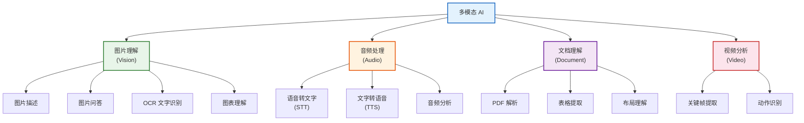
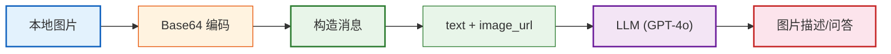
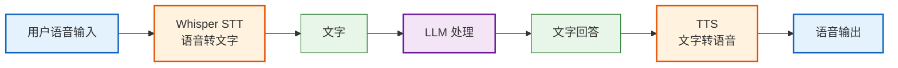
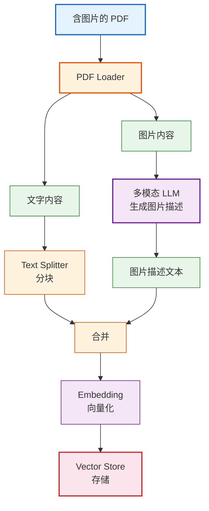
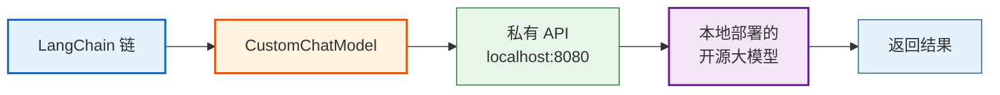

# 多模态与高级模型集成技术手册

> **定位**：系统讲解 LangChain 中的多模态能力（图片/音频/视频处理）、流式工具调用、结构化输出进阶和自定义模型集成。

---

## 目录

1. [多模态概述](#1-多模态概述)
2. [图片处理](#2-图片处理)
3. [音频处理](#3-音频处理)
4. [多模态 RAG](#4-多模态-rag)
5. [流式工具调用](#5-流式工具调用)
6. [结构化输出进阶](#6-结构化输出进阶)
7. [自定义模型集成](#7-自定义模型集成)

---

## 1. 多模态概述



> **图解说明**：多模态 AI 覆盖四种模态——图片（描述/问答/OCR/图表理解）、音频（语音转文字/文字转语音/音频分析）、文档（PDF解析/表格提取/布局理解）、视频（关键帧/动作识别）。LangChain 对图片和文档支持最完善。

### 多模态模型对比

| 模型 | 图片 | 音频 | 视频 | 输入上限 | 价格 |
|------|------|------|------|---------|------|
| GPT-4o | ✅ | ✅ | 限 | 128K token | $2.5/$10 |
| GPT-4o-mini | ✅ | ✅ | ❌ | 128K token | $0.15/$0.6 |
| Claude 3.5 Sonnet | ✅ | ❌ | ❌ | 200K token | $3/$15 |
| Gemini 1.5 Pro | ✅ | ✅ | ✅ | 2M token | $1.25/$5 |
| Gemini 1.5 Flash | ✅ | ✅ | ✅ | 1M token | $0.075/$0.3 |

---

## 2. 图片处理

### 2.1 基本图片理解

```python
from langchain_openai import ChatOpenAI
from langchain_core.messages import HumanMessage

llm = ChatOpenAI(model="gpt-4o-mini")

# 方式1: URL
message = HumanMessage(content=[
    {"type": "text", "text": "描述这张图片"},
    {"type": "image_url", "image_url": {"url": "https://example.com/photo.jpg"}},
])
response = llm.invoke([message])
print(response.content)

# 方式2: 本地图片 Base64
import base64
from pathlib import Path

def image_to_base64(path: str) -> str:
    with open(path, "rb") as f:
        return base64.b64encode(f.read()).decode()

b64 = image_to_base64("data/chart.png")
message = HumanMessage(content=[
    {"type": "text", "text": "这张图表展示了什么数据?"},
    {"type": "image_url", "image_url": {"url": f"data:image/png;base64,{b64}"}},
])
response = llm.invoke([message])
```

### 2.2 多图片对比

```python
# 同时传入多张图片进行对比
message = HumanMessage(content=[
    {"type": "text", "text": "对比这两张图表的差异"},
    {"type": "image_url", "image_url": {"url": f"data:image/png;base64,{img1_b64}"}},
    {"type": "image_url", "image_url": {"url": f"data:image/png;base64,{img2_b64}"}},
])
response = llm.invoke([message])
```



> **图解说明**：图片处理流程——本地图片 → Base64 编码 → 构造 content 消息（text + image_url 两部分）→ 发送给多模态 LLM → 获取描述/问答结果。也可以用 URL 直接传图片。

---

## 3. 音频处理

### 3.1 语音转文字 (STT)

```python
# 使用 OpenAI Whisper
from langchain_community.chat_models import ChatOpenAI
import openai

def transcribe_audio(audio_path: str) -> str:
    """音频转文字"""
    with open(audio_path, "rb") as f:
        transcript = openai.Audio.transcribe(
            model="whisper-1",
            file=f,
            language="zh",
        )
    return transcript.text

# 在链中使用
from langchain_core.runnables import RunnableLambda

audio_chain = (
    RunnableLambda(lambda x: transcribe_audio(x["audio_path"]))
    | prompt
    | llm
    | StrOutputParser()
)
```

### 3.2 文字转语音 (TTS)

```python
def text_to_speech(text: str, output_path: str):
    """文字转语音"""
    response = openai.Audio.speech(
        model="tts-1",
        voice="nova",
        input=text,
    )
    response.stream_to_file(output_path)

# 完整语音助手
def voice_assistant(audio_input: str) -> str:
    # 1. 语音转文字
    text = transcribe_audio(audio_input)
    # 2. LLM 回答
    answer = chain.invoke(text)
    # 3. 文字转语音
    text_to_speech(answer, "response.mp3")
    return answer
```



> **图解说明**：完整语音助手流程——用户语音 → Whisper 转文字 → LLM 处理 → TTS 转语音 → 播放。每一步都是独立的 API 调用，用 LangChain 的 Runnable 串联。

---

## 4. 多模态 RAG

### 4.1 图片+文字混合检索

```python
from langchain_community.document_loaders import UnstructuredPDFLoader
from langchain_text_splitters import RecursiveCharacterTextSplitter

# 加载含图片的 PDF
loader = UnstructuredPDFLoader("report.pdf", strategy="hi_res")
docs = loader.load()

# 对图片用多模态模型生成描述
def describe_images(docs):
    for doc in docs:
        if doc.metadata.get("images"):
            for img in doc.metadata["images"]:
                description = llm.invoke([
                    HumanMessage(content=[
                        {"type": "text", "text": "描述这张图片"},
                        {"type": "image_url", "image_url": {"url": f"data:image/png;base64,{img}"}},
                    ])
                ]).content
                # 将图片描述添加到文档内容中
                doc.page_content += f"\n[图片描述: {description}]"
    return docs
```



> **图解说明**：多模态 RAG 的关键——把 PDF 中的图片先用多模态 LLM 转成文字描述，然后和正文一起分块、向量化、存储。这样检索时就能同时匹配文字和图片内容。

---

## 5. 流式工具调用

```python
from langchain_core.tools import Tool
from langchain.agents import create_tool_calling_agent, AgentExecutor

# 工具调用中的流式输出
async def stream_agent(input_text: str):
    agent = create_tool_calling_agent(llm, tools, prompt)
    executor = AgentExecutor(agent=agent, tools=tools)

    async for event in executor.astream_events(
        {"input": input_text},
        version="v2",
    ):
        if event["event"] == "on_chat_model_stream":
            # LLM 正在生成文本
            yield event["data"]["chunk"].content
        elif event["event"] == "on_tool_start":
            yield f"\n[正在调用工具: {event['name']}]"
        elif event["event"] == "on_tool_end":
            yield f"\n[工具结果: {event['data'].get('output', '')[:100]}]"
```

---

## 6. 结构化输出进阶

### 6.1 嵌套结构

```python
from pydantic import BaseModel, Field

class Step(BaseModel):
    action: str = Field(description="步骤描述")
    tool: str = Field(description="使用的工具")

class Plan(BaseModel):
    goal: str = Field(description="目标")
    steps: list[Step] = Field(description="执行步骤")
    estimated_time: int = Field(description="预计时间(分钟)")

structured_llm = llm.with_structured_output(Plan)
result = structured_llm.invoke("制定一个数据分析的计划")
# result.goal, result.steps[0].action, result.steps[0].tool
```

### 6.2 动态枚举

```python
from enum import Enum
from typing import Literal

class CategoryResponse(BaseModel):
    category: Literal["技术", "产品", "运营", "市场", "其他"]
    confidence: float = Field(ge=0, le=1, description="置信度 0-1")

categorizer = llm.with_structured_output(CategoryResponse)
result = categorizer.invoke("这篇文章讲的是如何用 AI 优化推荐算法")
print(result.category)  # "技术"
```

---

## 7. 自定义模型集成

### 7.1 自定义 LLM

```python
from langchain_core.language_models import BaseChatModel
from langchain_core.messages import BaseMessage, AIMessage

class CustomChatModel(BaseChatModel):
    """自定义模型——对接私有部署的模型"""

    api_url: str
    api_key: str

    def _generate(self, messages, stop=None, **kwargs):
        # 转换消息格式
        formatted = [{"role": m.type, "content": m.content} for m in messages]
        # 调用私有 API
        response = requests.post(
            self.api_url,
            json={"messages": formatted},
            headers={"Authorization": f"Bearer {self.api_key}"},
        )
        result = response.json()
        return {
            "message": AIMessage(content=result["text"]),
            "usage": result.get("usage", {}),
        }

    @property
    def _llm_type(self):
        return "custom"

# 使用
custom_llm = CustomChatModel(
    api_url="http://localhost:8080/v1/chat",
    api_key="local-key",
)
chain = prompt | custom_llm | parser
```



> **图解说明**：自定义模型集成——继承 BaseChatModel，实现 _generate 方法，将 LangChain 的标准消息格式转换为私有 API 格式。这样本地部署的开源模型也能接入 LangChain 生态。

---

## 附录：多模态模型选型决策

| 需求 | 推荐模型 | 理由 |
|------|---------|------|
| 图片描述/问答 | GPT-4o-mini | 性价比最高 |
| 复杂图表理解 | GPT-4o | 推理能力强 |
| 长文档分析 | Gemini 1.5 Pro | 2M token 上下文 |
| 音频处理 | GPT-4o | 原生音频支持 |
| 视频分析 | Gemini 1.5 Flash | 唯一支持视频 |
| 本地部署 | LLaVA + Ollama | 离线可用 |

---

## 配套课程

- 📖 `学习课程/第14课_多模态AI_处理图片和音频.md` — 多模态教学版
