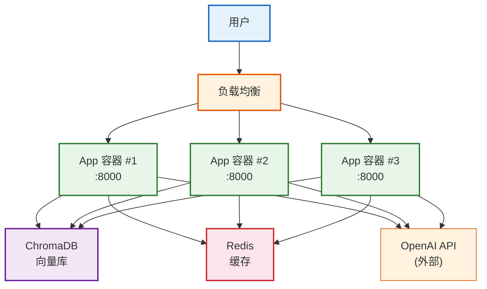
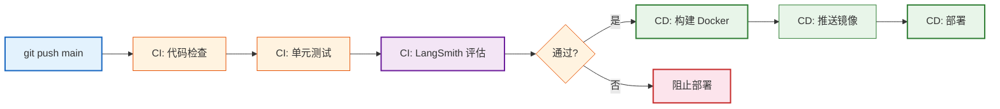
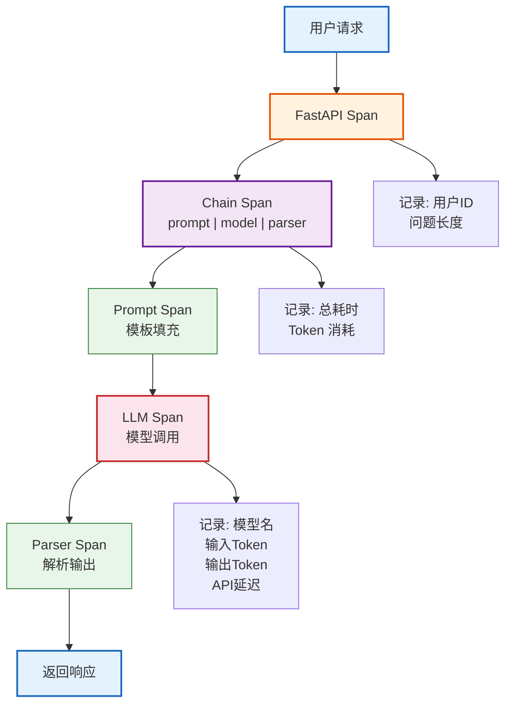
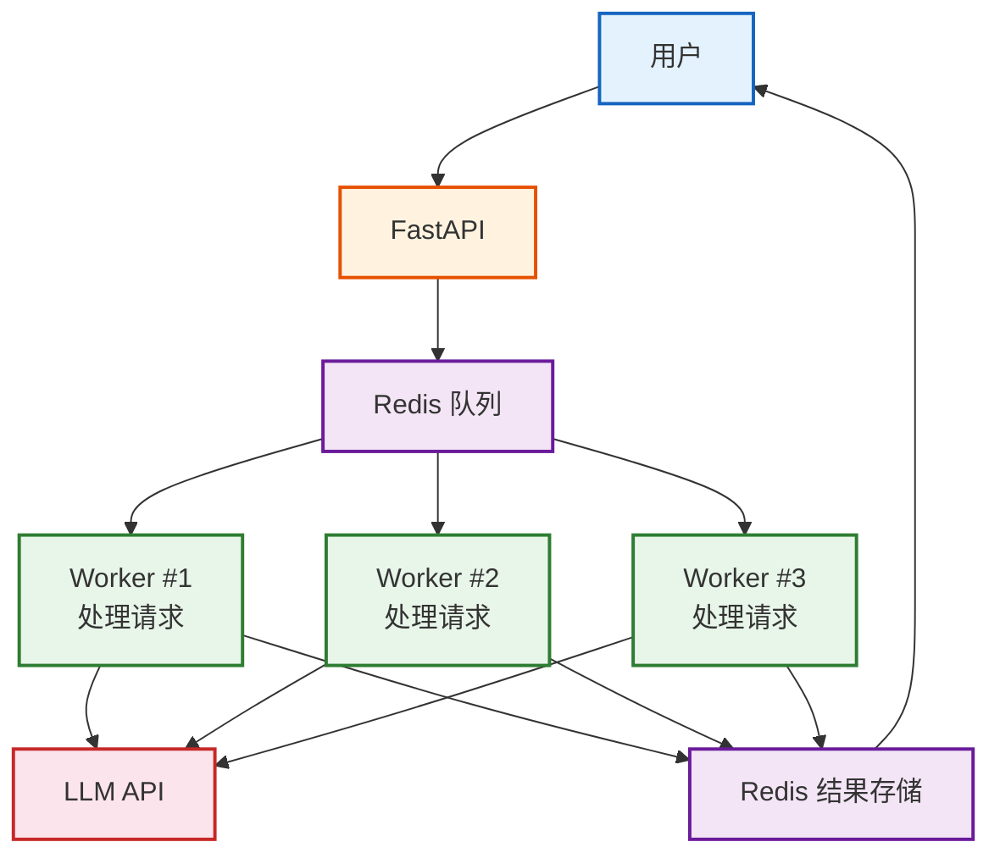

# 生产部署模式与可观测性技术参考

> **定位**：深入讲解 LangChain 应用的 Docker 容器化、CI/CD 流水线、日志/追踪/指标三位一体可观测性，以及生产环境的高可用与扩展。

---

## 目录

1. [Docker 容器化](#1-docker-容器化)
2. [CI/CD 流水线](#2-cicd-流水线)
3. [日志体系](#3-日志体系)
4. [分布式追踪](#4-分布式追踪)
5. [指标监控](#5-指标监控)
6. [高可用与扩展](#6-高可用与扩展)
7. [生产检查清单](#7-生产检查清单)

---

## 1. Docker 容器化

### 1.1 Dockerfile

```dockerfile
FROM python:3.11-slim

WORKDIR /app

# 安装系统依赖
RUN apt-get update && apt-get install -y \
    gcc \
    && rm -rf /var/lib/apt/lists/*

# 先装依赖（利用缓存层）
COPY requirements.txt .
RUN pip install --no-cache-dir -r requirements.txt

# 复制代码
COPY . .

# 暴露端口
EXPOSE 8000

# 健康检查
HEALTHCHECK --interval=30s --timeout=5s --retries=3 \
    CMD curl -f http://localhost:8000/health || exit 1

# 启动命令
CMD ["uvicorn", "app:app", "--host", "0.0.0.0", "--port", "8000", "--workers", "4"]
```

### 1.2 docker-compose.yml

```yaml
version: '3.9'
services:
  app:
    build: .
    ports:
      - "8000:8000"
    env_file:
      - .env
    depends_on:
      - chroma
      - redis
    restart: always
    deploy:
      resources:
        limits:
          memory: 2G
          cpus: '2'

  chroma:
    image: chromadb/chroma:latest
    ports:
      - "8001:8001"
    volumes:
      - chroma-data:/chroma/chroma
    restart: always

  redis:
    image: redis:7-alpine
    ports:
      - "6379:6379"
    restart: always

volumes:
  chroma-data:
```



> **图解说明**：生产架构——负载均衡将流量分发给多个 App 容器实例，每个容器都连接同一个 ChromaDB 向量库和 Redis 缓存。多个容器实现了水平扩展，任一容器挂了不影响服务。

---

## 2. CI/CD 流水线

### 2.1 GitHub Actions

```yaml
# .github/workflows/deploy.yml
name: Deploy
on:
  push:
    branches: [main]

jobs:
  test:
    runs-on: ubuntu-latest
    steps:
      - uses: actions/checkout@v4
      - uses: actions/setup-python@v5
        with:
          python-version: '3.11'
      - run: pip install -r requirements.txt
      - run: pip install pytest
      - run: pytest tests/ -v
      - name: LangSmith 评估
        run: python evaluate.py
        env:
          OPENAI_API_KEY: ${{ secrets.OPENAI_API_KEY }}
          LANGSMITH_API_KEY: ${{ secrets.LANGSMITH_API_KEY }}

  deploy:
    needs: test
    runs-on: ubuntu-latest
    steps:
      - uses: actions/checkout@v4
      - name: Build Docker
        run: docker build -t myapp:${{ github.sha }} .
      - name: Push to Registry
        run: |
          docker tag myapp:${{ github.sha }} registry.example.com/myapp:latest
          docker push registry.example.com/myapp:latest
```



> **图解说明**：CI/CD 流水线——代码推送后依次执行代码检查→单元测试→LangSmith 质量评估。全部通过才构建 Docker 镜像并部署。任一步骤失败都会阻止部署，保证只有高质量的代码才能上线。

---

## 3. 日志体系

### 3.1 结构化日志

```python
import logging
import json
from datetime import datetime

# 结构化 JSON 日志
class StructuredFormatter(logging.Formatter):
    def format(self, record):
        log = {
            "timestamp": datetime.now().isoformat(),
            "level": record.levelname,
            "message": record.getMessage(),
            "module": record.module,
            "function": record.funcName,
            "line": record.lineno,
        }
        if hasattr(record, "extra_data"):
            log["data"] = record.extra_data
        return json.dumps(log, ensure_ascii=False)

logger = logging.getLogger("app")
handler = logging.StreamHandler()
handler.setFormatter(StructuredFormatter())
logger.addHandler(handler)
logger.setLevel(logging.INFO)

# 使用
logger.info("用户请求", extra={"extra_data": {
    "user_id": "user123",
    "question": "什么是RAG",
    "model": "gpt-4o-mini",
}})
# {"timestamp": "...", "level": "INFO", "message": "用户请求",
#  "data": {"user_id": "user123", "question": "什么是RAG", ...}}
```

---

## 4. 分布式追踪

### 4.1 LangSmith 追踪配置

```python
import os
os.environ["LANGSMITH_TRACING"] = "true"
os.environ["LANGSMITH_PROJECT"] = "production"

# 每次调用自动记录完整追踪
from langchain_openai import ChatOpenAI
from langchain_core.prompts import ChatPromptTemplate
from langchain_core.output_parsers import StrOutputParser

llm = ChatOpenAI(model="gpt-4o-mini")
chain = prompt | llm | StrOutputParser()

# 这一次调用会在 LangSmith 中生成完整追踪
result = chain.invoke({"question": "什么是RAG"})
# 可在 smith.langchain.com 查看:
# - 每一步的输入输出
# - 每一步的耗时
# - Token 消耗
# - 错误信息（如有）
```

### 4.2 OpenTelemetry 集成

```python
from opentelemetry import trace
from opentelemetry.sdk.trace import TracerProvider

trace.set_tracer_provider(TracerProvider())
tracer = trace.get_tracer(__name__)

@app.post("/ask")
async def ask(question: str):
    with tracer.start_as_current_span("user_request") as span:
        span.set_attribute("user.question", question)
        span.set_attribute("user.id", current_user.id)

        result = chain.invoke(question)

        span.set_attribute("response.length", len(result))
        return {"answer": result}
```



> **图解说明**：分布式追踪把一次请求拆成嵌套的 Span——FastAPI→Chain→Prompt→LLM→Parser。每个 Span 记录关键信息（耗时、Token、模型名），形成完整的调用树。出问题时能精准定位是哪一步慢或出错。

---

## 5. 指标监控

### 5.1 Prometheus 指标

```python
from prometheus_client import Counter, Histogram, Gauge, make_asgi_app

# 定义指标
REQUEST_COUNT = Counter(
    "app_requests_total", "总请求数", ["method", "status"]
)
REQUEST_LATENCY = Histogram(
    "app_request_latency_seconds", "请求延迟(秒)", ["endpoint"]
)
ACTIVE_REQUESTS = Gauge(
    "app_active_requests", "当前活跃请求数"
)
TOKEN_USAGE = Counter(
    "app_token_usage_total", "Token 消耗", ["model", "type"]
)
ERROR_COUNT = Counter(
    "app_errors_total", "错误数", ["type"]
)

# 在应用中使用
@app.middleware("http")
async def metrics_middleware(request, call_next):
    ACTIVE_REQUESTS.inc()
    start = time.time()
    response = await call_next(request)
    latency = time.time() - start

    REQUEST_COUNT.labels(
        method=request.method, status=response.status_code
    ).inc()
    REQUEST_LATENCY.labels(endpoint=request.url.path).observe(latency)
    ACTIVE_REQUESTS.dec()
    return response

# 挂载 Prometheus 端点
app.mount("/metrics", make_asgi_app())
```

### 5.2 关键指标看板

| 指标 | 正常 | 告警 | 严重 |
|------|------|------|------|
| QPS | 10-50 | 100+ | 500+ |
| P50 延迟 | < 1s | 2-3s | > 5s |
| P99 延迟 | < 5s | 10s | > 30s |
| 错误率 | < 0.5% | 2-5% | > 10% |
| Token/请求 | 500-2000 | 3000+ | 5000+ |
| 活跃连接 | 10-50 | 100+ | 200+ |

---

## 6. 高可用与扩展

### 6.1 缓存层

```python
import redis
import json
from langchain_core.runnables import RunnableLambda

redis_client = redis.Redis(host='redis', port=6379)

def cached_invoke(chain, question: str, ttl=3600):
    """带 Redis 缓存的调用"""
    cache_key = f"qa:{hash(question)}"

    # 先查缓存
    cached = redis_client.get(cache_key)
    if cached:
        return json.loads(cached)

    # 缓存未命中——调用 LLM
    result = chain.invoke(question)

    # 写入缓存
    redis_client.setex(cache_key, ttl, json.dumps(result))
    return result
```

### 6.2 队列模式

```python
from celery import Celery

celery_app = Celery('tasks', broker='redis://redis:6379')

@celery_app.task
def process_question(question: str) -> str:
    """异步处理用户问题——适合长时间任务"""
    try:
        result = chain.invoke(question)
        return result
    except Exception as e:
        return f"处理失败: {e}"

# API 端点——提交任务
@app.post("/ask/async")
async def ask_async(question: str):
    task = process_question.delay(question)
    return {"task_id": task.id}

# 查询结果
@app.get("/result/{task_id}")
async def get_result(task_id: str):
    result = process_question.AsyncResult(task_id)
    if result.ready():
        return {"status": "done", "result": result.result}
    return {"status": "processing"}
```



> **图解说明**：队列模式实现异步处理——用户提交请求后立即返回 task_id，后台多个 Worker 从队列取任务处理，处理完存入 Redis。用户通过 task_id 轮询结果。适合需要 30 秒以上的长任务（如复杂 RAG + Agent）。

---

## 7. 生产检查清单

### 部署前
- [ ] Docker 镜像构建成功且体积 < 500MB
- [ ] docker-compose 本地运行正常
- [ ] 健康检查端点 `/health` 返回 200
- [ ] 环境变量通过 .env 或密钥管理注入（非硬编码）
- [ ] 依赖已锁版本（requirements.txt 精确版本）

### 可观测性
- [ ] 结构化日志输出到 stdout（JSON 格式）
- [ ] LangSmith 追踪已启用
- [ ] Prometheus `/metrics` 端点可访问
- [ ] 配置了错误率告警（阈值 > 5%）
- [ ] 配置了延迟告警（P99 > 10s）
- [ ] 配置了 Token 预算告警（日限额 80%）

### 安全
- [ ] API 端点需要认证
- [ ] 速率限制生效（如 10 次/分钟）
- [ ] 输入有 PII 脱敏
- [ ] 输出有内容审核
- [ ] CORS 配置正确

### 高可用
- [ ] 至少 2 个容器实例
- [ ] 配置了自动重启（restart: always）
- [ ] Redis 缓存层已配置
- [ ] 长任务使用队列异步处理
- [ ] 模型调用有 fallback 和 retry

---

## 配套课程

- 📖 `学习课程/第16课_生产部署进阶_Docker与监控.md` — 部署教学版
- 📖 `知识库/05_API集成与部署技术参考.md` — 基础部署参考
