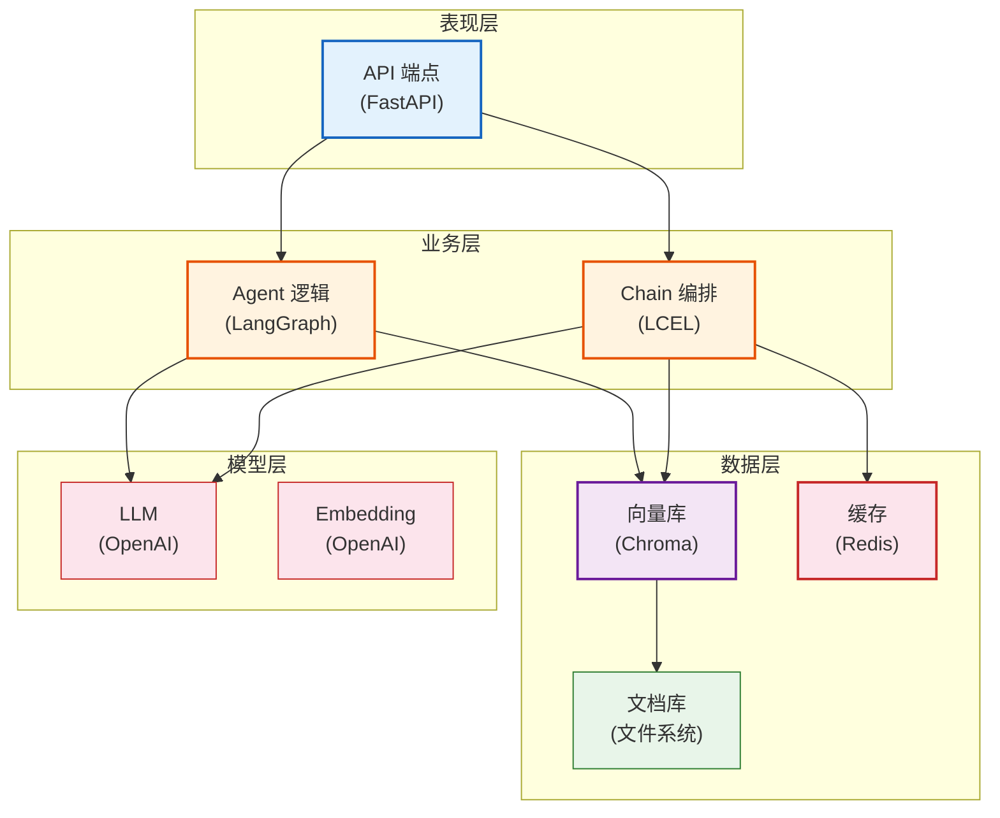
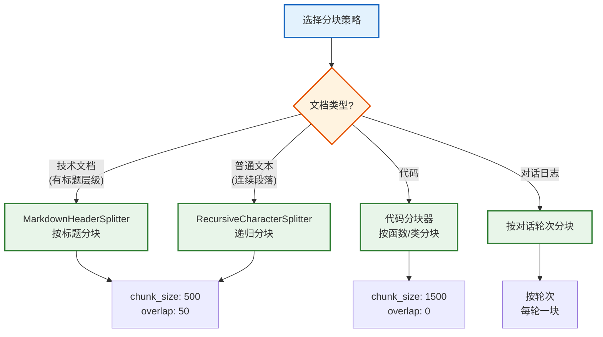
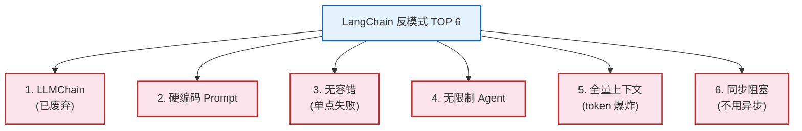
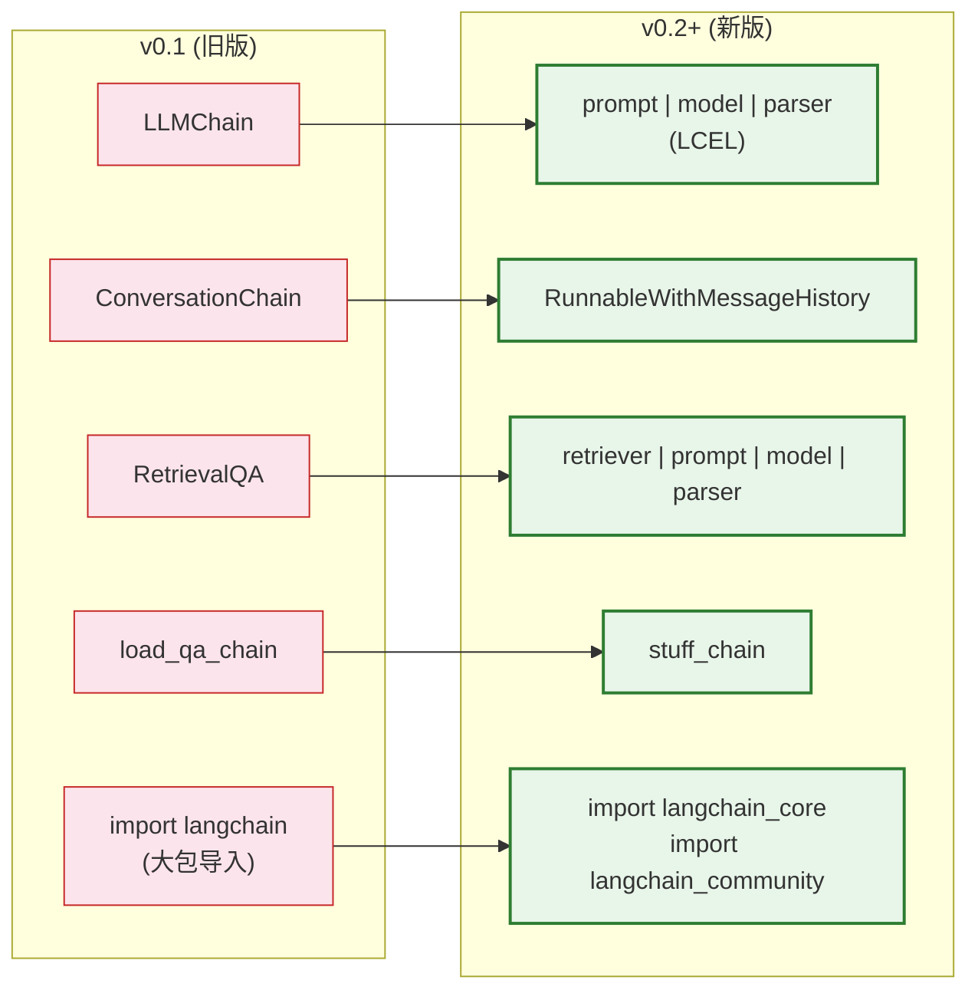

# 最佳实践与反模式手册

> **定位**：系统总结 LangChain 开发的最佳实践、常见反模式（Anti-Pattern）、代码审查清单和 v0.1→v0.3 迁移指南，帮助写出专业级代码。

---

## 目录

1. [架构最佳实践](#1-架构最佳实践)
2. [Prompt 最佳实践](#2-prompt-最佳实践)
3. [RAG 最佳实践](#3-rag-最佳实践)
4. [Agent 最佳实践](#4-agent-最佳实践)
5. [性能最佳实践](#5-性能最佳实践)
6. [常见反模式](#6-常见反模式)
7. [代码审查清单](#7-代码审查清单)
8. [v0.1 迁移指南](#8-v01-迁移指南)

---

## 1. 架构最佳实践

### 1.1 分层架构



> **图解说明**：专业级架构分四层——表现层（API）、业务层（Chain/Agent编排）、数据层（向量库/缓存/文档）、模型层（LLM/Embedding）。每层职责清晰，互不越权。

### 1.2 配置管理

```python
# ✅ 正确: 使用 pydantic-settings 管理配置
from pydantic_settings import BaseSettings

class Settings(BaseSettings):
    openai_api_key: str
    model_name: str = "gpt-4o-mini"
    temperature: float = 0.0
    chunk_size: int = 500
    chunk_overlap: int = 50
    max_retries: int = 3
    cache_ttl: int = 3600

    class Config:
        env_file = ".env"

settings = Settings()

# ❌ 错误: 散落在代码中的魔法数字
llm = ChatOpenAI(model="gpt-4o-mini", temperature=0.0)
# 500 是什么？魔法数字
splitter = RecursiveCharacterTextSplitter(chunk_size=500, chunk_overlap=50)
```

---

## 2. Prompt 最佳实践

### 2.1 好的 Prompt vs 坏的 Prompt

```python
# ❌ 坏的 Prompt
bad_prompt = "帮我回答问题"

# ✅ 好的 Prompt
good_prompt = """你是一个专业的技术文档问答助手。

## 你的职责
- 根据提供的文档上下文回答用户问题
- 引用文档原文作为依据
- 如果文档中没有相关信息，说"文档中未找到相关内容"

## 回答格式
1. 直接回答（2-3句话）
2. 引用来源：[文档段落标题]

## 限制
- 不编造文档中不存在的信息
- 不回答与文档无关的问题
"""
```

### 2.2 Prompt 版本管理

```python
from langchain_core.prompts import ChatPromptTemplate
import hashlib

class PromptRegistry:
    """Prompt 注册表——版本管理和 A/B 测试"""
    _registry = {}

    @classmethod
    def register(cls, name: str, version: str, prompt: str):
        key = f"{name}:{version}"
        cls._registry[key] = prompt
        return key

    @classmethod
    def get(cls, name: str, version: str = "latest"):
        if version == "latest":
            versions = [k for k in cls._registry if k.startswith(f"{name}:")]
            if not versions:
                raise KeyError(f"Prompt '{name}' not found")
            return cls._registry[max(versions)]
        return cls._registry[f"{name}:{version}"]

# 注册不同版本
PromptRegistry.register("qa_system", "v1", "你是问答助手。")
PromptRegistry.register("qa_system", "v2", "你是专业的文档问答助手。引用来源。")

# 使用
system_prompt = PromptRegistry.get("qa_system", "v2")
```

---

## 3. RAG 最佳实践

### 3.1 分块策略选择



> **图解说明**：分块策略应根据文档类型选择——有标题层级的用 Markdown 分块器、普通文本用递归分块器、代码按函数分块、对话日志按轮次分块。统一的 chunk_size 和 overlap 适配大多数场景。

### 3.2 RAG 质量检查

```python
# ✅ 正确: RAG 链有质量检查
def rag_chain_with_check(question: str) -> dict:
    # 1. 检索
    docs = retriever.invoke(question)
    if not docs:
        return {"answer": "未找到相关文档", "sources": []}

    # 2. 检查检索质量
    top_score = docs[0].metadata.get("score", 0)
    if top_score < 0.5:  # 相似度太低
        return {"answer": "检索结果相关性不足", "sources": []}

    # 3. 生成回答
    answer = chain.invoke({"context": docs, "question": question})

    # 4. 返回带来源的结果
    return {
        "answer": answer,
        "sources": [{"content": d.page_content[:100], "page": d.metadata.get("page")} for d in docs],
        "retrieval_score": top_score,
    }
```

---

## 4. Agent 最佳实践

### 4.1 工具设计原则

```python
# ✅ 正确: 工具描述清晰，参数明确
from langchain_core.tools import tool

@tool
def search_documents(query: str, top_k: int = 5) -> str:
    """在文档库中搜索相关内容。

    当用户问关于已上传文档的问题时使用此工具。
    参数:
        query: 搜索关键词，从用户问题中提取
        top_k: 返回的文档数量，默认5
    """
    results = retriever.invoke(query)[:top_k]
    return "\n".join(d.page_content for d in results)

# ❌ 错误: 描述模糊，LLM 不知道何时用
@tool
def search(query: str) -> str:
    """搜索"""
    return "..."
```

### 4.2 Agent 迭代限制

```python
# ✅ 正确: 限制迭代次数防止死循环
agent_executor = AgentExecutor(
    agent=agent,
    tools=tools,
    max_iterations=5,          # 最多5轮
    handle_parsing_errors=True,
    early_stopping_method="generate",  # 超限时让 LLM 生成最终回答
)

# ❌ 错误: 无限制迭代
agent_executor = AgentExecutor(agent=agent, tools=tools)  # 默认15轮太多
```

---

## 5. 性能最佳实践

### 5.1 异步优先

```python
# ✅ 正确: 用异步处理并发请求
async def process_batch(questions: list[str]) -> list[str]:
    semaphore = asyncio.Semaphore(5)  # 限制并发5个
    async def process_one(q):
        async with semaphore:
            return await chain.ainvoke(q)
    return await asyncio.gather(*[process_one(q) for q in questions])

# ❌ 错误: 同步串行——慢且浪费
def process_batch_sync(questions: list[str]) -> list[str]:
    return [chain.invoke(q) for q in questions]
```

### 5.2 缓存策略

```python
# ✅ 正确: 多级缓存
from langchain_community.cache import RedisCache
from langchain.globals import set_llm_cache
import redis

# L1: 进程内缓存（最快）
# L2: Redis 缓存（跨进程共享）
redis_client = redis.Redis(host='redis', port=6379)
set_llm_cache(RedisCache(redis_client))
```

---

## 6. 常见反模式



> **图解说明**：LangChain 开发中最常见的六大反模式——使用已废弃的 LLMChain、Prompt 硬编码在业务代码中、没有容错降级、Agent 不限迭代导致死循环、把所有文档塞进上下文导致 token 爆炸、不用异步导致性能低下。

### 反模式详解

| 反模式 | 问题 | 正确做法 |
|--------|------|---------|
| 用 `LLMChain` | v0.2 后已废弃 | 用 LCEL `prompt \| model \| parser` |
| 硬编码 Prompt | 难维护、难测试 | 用 `ChatPromptTemplate` 变量化 |
| 无容错 | API 挂了全盘崩溃 | `with_fallbacks` + `with_retry` |
| 无限 Agent | 可能死循环烧钱 | `max_iterations=5` |
| 全量上下文 | Token 爆炸 + 成本高 | RAG 只传 Top-K |
| 同步阻塞 | 性能差 | `ainvoke`/`abatch`/`astream` |

---

## 7. 代码审查清单

```python
# 代码审查模板
REVIEW_CHECKLIST = {
    "架构": [
        "配置通过 Settings 管理，非硬编码",
        "分层清晰，职责单一",
        "使用 LCEL 而非旧版 Chain",
    ],
    "Prompt": [
        "使用 ChatPromptTemplate 模板化",
        "System Prompt 有安全边界",
        "Prompt 版本可管理",
    ],
    "RAG": [
        "分块策略匹配文档类型",
        "检索结果有相关性检查",
        "返回结果带来源引用",
    ],
    "Agent": [
        "工具描述清晰、参数明确",
        "max_iterations 已限制",
        "handle_parsing_errors=True",
    ],
    "性能": [
        "使用异步 ainvoke/abatch",
        "配置了 LLM 缓存",
        "批量请求用 batch/abatch",
    ],
    "安全": [
        "API 端点有认证",
        "速率限制已配置",
        "输入有 PII 脱敏",
    ],
    "可观测": [
        "LangSmith 追踪已启用",
        "结构化日志输出",
        "关键指标可监控",
    ],
    "容错": [
        "with_fallbacks 配置备用模型",
        "with_retry 配置重试",
        "超时时间已设置",
    ],
}
```

---

## 8. v0.1 迁移指南

### 8.1 主要变化



> **图解说明**：LangChain v0.1→v0.2+ 迁移——旧版用 LLMChain/ConversationChain/RetrievalQA 等封装类，新版统一用 LCEL 管道符 `|`。旧版从 `langchain` 大包导入，新版拆分为 `langchain_core`/`langchain_community`/`langchain_openai` 等。

### 8.2 迁移示例

```python
# ❌ v0.1 旧版
from langchain.chains import LLMChain, RetrievalQA
from langchain import PromptTemplate

chain = LLMChain(llm=llm, prompt=prompt)
qa = RetrievalQA.from_chain_type(llm=llm, retriever=retriever)

# ✅ v0.2+ 新版
from langchain_core.prompts import ChatPromptTemplate
from langchain_core.output_parsers import StrOutputParser

chain = prompt | llm | StrOutputParser()
qa = (
    {"context": retriever | format_docs, "question": RunnablePassthrough()}
    | prompt | llm | StrOutputParser()
)
```

### 8.3 导入路径变化

| v0.1 (旧) | v0.2+ (新) |
|-----------|-----------|
| `from langchain import ChatOpenAI` | `from langchain_openai import ChatOpenAI` |
| `from langchain import PromptTemplate` | `from langchain_core.prompts import ChatPromptTemplate` |
| `from langchain.chains import LLMChain` | 使用 LCEL `prompt \| model \| parser` |
| `from langchain.chains import RetrievalQA` | 使用 LCEL `retriever \| prompt \| model` |
| `from langchain.memory import ConversationBufferMemory` | `RunnableWithMessageHistory` |

---

## 配套课程

- 📖 `学习课程/第17课_最佳实践_写出专业级代码.md` — 最佳实践教学版
