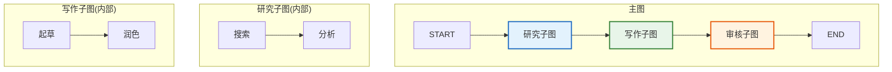
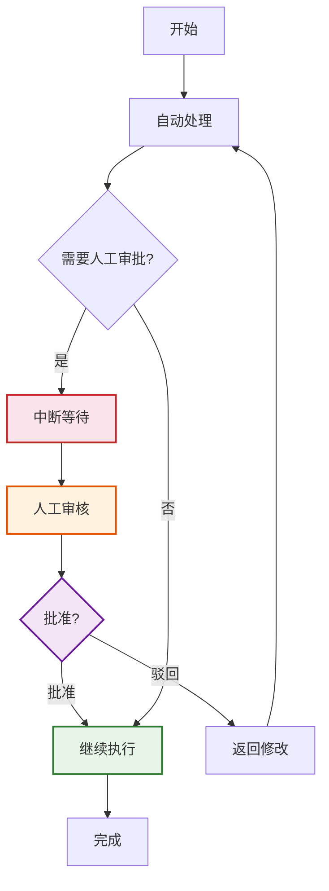
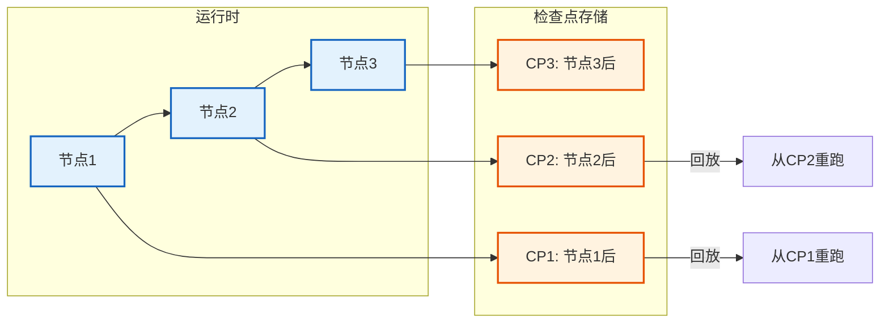
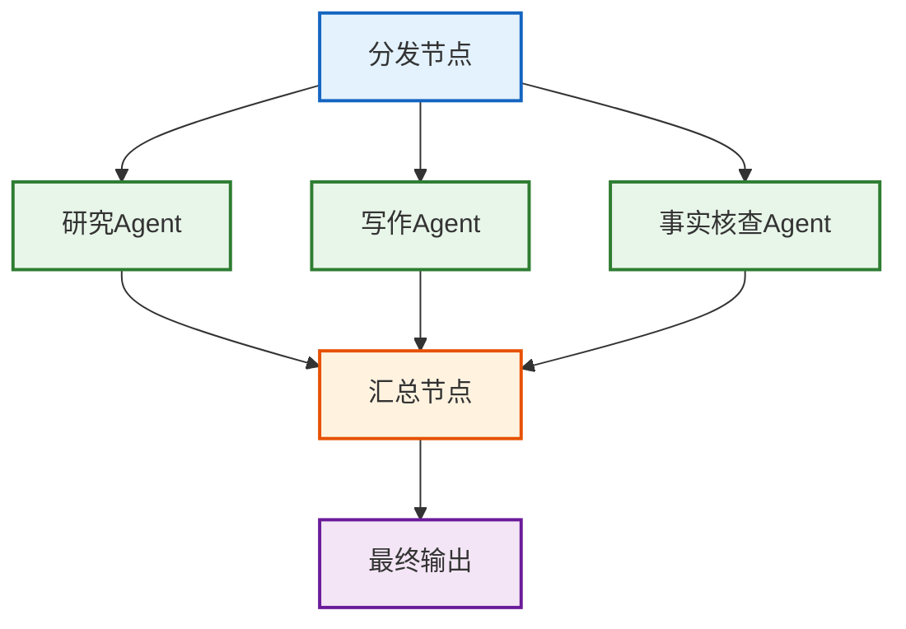
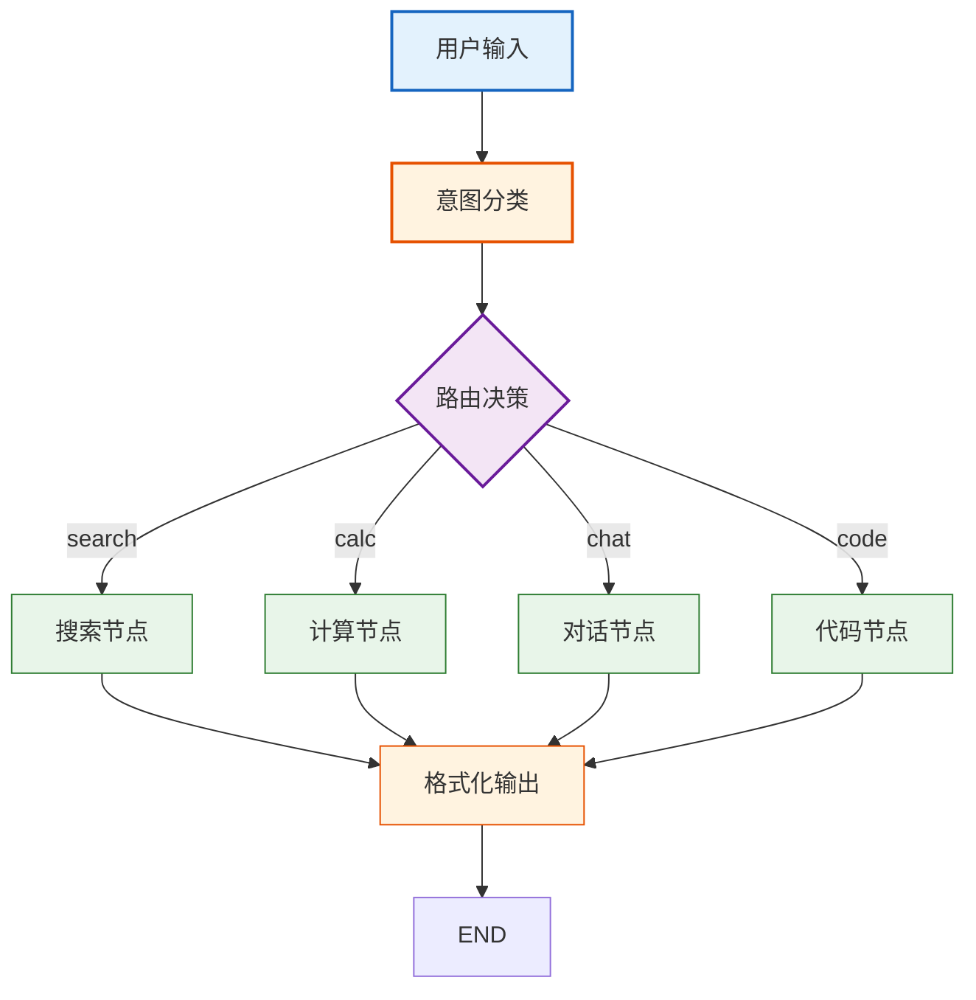
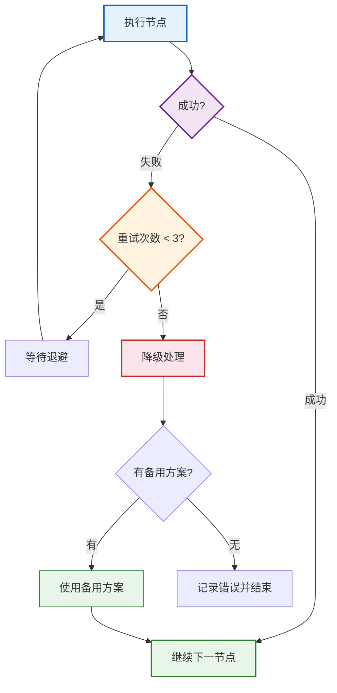

# LangGraph 高级模式技术手册

> **定位**：深入 LangGraph 的高级特性——子图、人在回路、检查点持久化、并行执行、动态路由与错误恢复，提供完整代码示例与架构决策参考。

> **配套课程**：`学习课程/第18课_LangGraph进阶_子图与人在回路.md`

---

## 目录

1. [子图(Subgraphs)——模块化复杂图](#1-子图subgraphs模块化复杂图)
2. [人在回路(Human-in-the-Loop)](#2-人在回路human-in-the-loop)
3. [检查点与状态持久化](#3-检查点与状态持久化)
4. [并行执行与扇出/扇入](#4-并行执行与扇出扇入)
5. [动态路由与条件分支](#5-动态路由与条件分支)
6. [错误恢复与重试策略](#6-错误恢复与重试策略)

---

## 1. 子图(Subgraphs)——模块化复杂图

### 1.1 核心概念

子图是将复杂工作流拆分为可复用模块的机制。主图通过调用子图节点，将子图的状态映射到主图状态中。



> **图解说明**：主图包含三个子图节点——研究、写作、审核。每个子图内部有自己的节点和边。主图只关心子图的入口和出口，不关心内部实现，实现了关注点分离。

### 1.2 状态映射模式

```python
from typing import TypedDict, Annotated
from langgraph.graph import StateGraph, START, END

# === 主图状态 ===
class MainState(TypedDict):
    topic: str
    research_results: list
    report: str

# === 子图状态 ===
class ResearchState(TypedDict):
    topic: str
    search_results: Annotated[list, lambda x, y: x + y]
    analysis: str

# === 子图节点 ===
def search_node(state: ResearchState) -> dict:
    """模拟搜索"""
    results = [f"搜索结果: {state['topic']}"]
    return {"search_results": results}

def analyze_node(state: ResearchState) -> dict:
    """分析结果"""
    return {"analysis": f"分析完成: {state['search_results']}"}

# === 构建子图 ===
research_graph = StateGraph(ResearchState)
research_graph.add_node("search", search_node)
research_graph.add_node("analyze", analyze_node)
research_graph.add_edge(START, "search")
research_graph.add_edge("search", "analyze")
research_graph.add_edge("analyze", END)
research_app = research_graph.compile()

# === 主图节点: 调用子图 ===
def research_subgraph_node(state: MainState) -> dict:
    """主图节点调用子图，做状态映射"""
    # 映射主图状态 → 子图状态
    subgraph_input = {
        "topic": state["topic"],
        "search_results": [],
    }
    # 执行子图
    result = research_app.invoke(subgraph_input)
    # 映射子图状态 → 主图状态
    return {"research_results": result["search_results"]}

def write_node(state: MainState) -> dict:
    return {"report": f"基于 {state['research_results']} 写报告"}

# === 构建主图 ===
main_graph = StateGraph(MainState)
main_graph.add_node("research", research_subgraph_node)
main_graph.add_node("write", write_node)
main_graph.add_edge(START, "research")
main_graph.add_edge("research", "write")
main_graph.add_edge("write", END)
main_app = main_graph.compile()
```

### 1.3 子图设计决策表

| 决策点 | 选择 | 原因 |
|--------|------|------|
| 状态映射方式 | 手动映射 | 控制清晰，字段明确 |
| 子图复用 | 独立编译 | 可被多个主图调用 |
| 子图嵌套深度 | 最多2层 | 过深难调试 |
| 子图状态隔离 | 独立 TypedDict | 避免状态污染 |

---

## 2. 人在回路(Human-in-the-Loop)

### 2.1 中断与审批模式



> **图解说明**：人在回路流程——自动处理到需要审批的节点时中断，等待人工审核。批准则继续，驳回则返回修改。这保证了关键决策有人把关。

### 2.2 interrupt_before / interrupt_after

```python
from langgraph.graph import StateGraph, START, END
from langgraph.checkpoint.memory import MemorySaver

class State(TypedDict):
    messages: list
    draft: str
    final: str

def draft_node(state: State) -> dict:
    return {"draft": "这是草稿内容"}

def review_node(state: State) -> dict:
    return {"final": state["draft"] + " (已审核)"}

def publish_node(state: State) -> dict:
    return {"messages": state.get("messages", []) + [state["final"]]}

graph = StateGraph(State)
graph.add_node("draft", draft_node)
graph.add_node("review", review_node)
graph.add_node("publish", publish_node)
graph.add_edge(START, "draft")
graph.add_edge("draft", "review")
graph.add_edge("review", "publish")
graph.add_edge("publish", END)

# 关键: 在 review 之前中断
app = graph.compile(
    checkpointer=MemorySaver(),
    interrupt_before=["review"],  # 进入 review 前暂停
)

# === 使用: 第一次调用会在 review 前暂停 ===
config = {"configurable": {"thread_id": "thread-1"}}
result = app.invoke({"messages": [], "draft": "", "final": ""}, config=config)
# 此时 draft 已完成, review 未执行
print(result["draft"])  # "这是草稿内容"

# === 人工审核后恢复 ===
# 可以查看状态、修改草稿
current_state = app.get_state(config)
print(current_state.values)

# 恢复执行 (从中断处继续)
result = app.invoke(None, config=config)  # 传 None 表示继续
print(result["final"])  # "这是草稿内容 (已审核)"
```

### 2.3 人工干预场景表

| 场景 | 中断位置 | 恢复条件 |
|------|---------|---------|
| 内容审核 | publish 前 | 人工批准 |
| 工具调用确认 | tool 前 | 人工确认工具参数 |
| 敏感操作 | 执行前 | 人工授权 |
| 质量检查 | 写作后发布前 | 人工评分达标 |
| 费用控制 | API 调用前 | 人工确认预算 |

---

## 3. 检查点与状态持久化

### 3.1 检查点架构



> **图解说明**：每个节点执行后，状态自动保存到检查点。可以从任意检查点回放——修改某个节点的逻辑后从该点重跑，不需要从头开始。这对调试和错误恢复非常有用。

### 3.2 持久化后端对比

| 后端 | 安装 | 适用场景 | 特点 |
|------|------|---------|------|
| MemorySaver | 内置 | 开发调试 | 内存中，重启丢失 |
| SqliteSaver | `langgraph-checkpoint-sqlite` | 本地持久化 | SQLite 文件，轻量 |
| PostgresSaver | `langgraph-checkpoint-postgres` | 生产环境 | 高可用，支持并发 |

```python
from langgraph.checkpoint.sqlite import SqliteSaver

# SQLite 持久化
checkpointer = SqliteSaver.from_conn_string("checkpoints.db")
app = graph.compile(checkpointer=checkpointer)

# 每次调用用 thread_id 区分会话
config = {"configurable": {"thread_id": "user-123-session-1"}}
result = app.invoke({"messages": []}, config=config)

# 同一线程可恢复
state = app.get_state(config)
# 可从检查点回放
```

### 3.3 状态回放与时间旅行

```python
# 获取状态历史
state_history = list(app.get_state_history(config))

# 查看每个检查点
for state in state_history:
    print(f"Step: {state.config['configurable']['checkpoint_id']}")
    print(f"  Values: {state.values}")
    print(f"  Next: {state.next}")

# 从历史检查点恢复执行
# 找到要回放的检查点
target_state = state_history[2]  # 第3个检查点
# 用该检查点的配置重新执行
for chunk in app.stream(
    None,
    {**config, "configurable": {
        "thread_id": "new-thread",
        "checkpoint_id": target_state.config["configurable"]["checkpoint_id"],
    }},
):
    print(chunk)
```

---

## 4. 并行执行与扇出/扇入

### 4.1 扇出模式



> **图解说明**：扇出/扇入模式——分发节点同时启动多个并行 Agent，各自独立工作，完成后汇总节点合并结果。这比串行执行快 3 倍。

### 4.2 代码实现

```python
import operator
from typing import TypedDict, Annotated

class ParallelState(TypedDict):
    topic: str
    results: Annotated[list, operator.add]  # 并行结果自动合并

def research_agent(state: ParallelState) -> dict:
    return {"results": [f"研究: {state['topic']}"]}

def writing_agent(state: ParallelState) -> dict:
    return {"results": [f"写作: {state['topic']}"]}

def fact_check_agent(state: ParallelState) -> dict:
    return {"results": [f"核查: {state['topic']}"]}

def aggregator(state: ParallelState) -> dict:
    return {"results": [f"汇总: {state['results']}"]}

graph = StateGraph(ParallelState)
graph.add_node("research", research_agent)
graph.add_node("writing", writing_agent)
graph.add_node("factcheck", fact_check_agent)
graph.add_node("aggregate", aggregator)

# 扇出: 从 START 到三个并行节点
graph.add_edge(START, "research")
graph.add_edge(START, "writing")
graph.add_edge(START, "factcheck")

# 扇入: 三个节点都到 aggregate
graph.add_edge("research", "aggregate")
graph.add_edge("writing", "aggregate")
graph.add_edge("factcheck", "aggregate")
graph.add_edge("aggregate", END)

app = graph.compile()
```

### 4.3 并行 vs 串行性能对比

| 模式 | 3个节点各10秒 | 总耗时 | 利用率 |
|------|-------------|--------|--------|
| 串行 | 10+10+10 | 30秒 | 低 |
| 并行 | max(10,10,10) | 10秒 | 高 |
| 混合 | 部分+部分 | 15秒 | 中 |

---

## 5. 动态路由与条件分支

### 5.1 基于状态的路由

```python
from langgraph.graph import StateGraph, START, END

class State(TypedDict):
    query: str
    intent: str
    response: str

def classify_intent(state: State) -> dict:
    """意图分类"""
    query = state["query"].lower()
    if "搜索" in query or "查找" in query:
        return {"intent": "search"}
    elif "计算" in query or "数学" in query:
        return {"intent": "calc"}
    else:
        return {"intent": "chat"}

def search_node(state: State) -> dict:
    return {"response": f"搜索结果: {state['query']}"}

def calc_node(state: State) -> dict:
    return {"response": f"计算结果: 42"}

def chat_node(state: State) -> dict:
    return {"response": f"对话回复: {state['query']}"}

def route(state: State) -> str:
    """路由函数"""
    intent = state["intent"]
    if intent == "search":
        return "search"
    elif intent == "calc":
        return "calc"
    else:
        return "chat"

graph = StateGraph(State)
graph.add_node("classify", classify_intent)
graph.add_node("search", search_node)
graph.add_node("calc", calc_node)
graph.add_node("chat", chat_node)

graph.add_edge(START, "classify")
# 条件边: 根据路由函数决定走哪个节点
graph.add_conditional_edges(
    "classify",
    route,
    {
        "search": "search",
        "calc": "calc",
        "chat": "chat",
    }
)
# 所有处理节点都到 END
graph.add_edge("search", END)
graph.add_edge("calc", END)
graph.add_edge("chat", END)

app = graph.compile()
```

### 5.2 动态路由决策树



> **图解说明**：动态路由——意图分类节点根据用户输入判断意图，路由函数返回不同节点名，条件边据此将流程导向不同处理节点。所有处理完成后统一到格式化输出。

### 5.3 循环路由(自循环)

```python
# 循环路由: 质量不达标时返回重做
def quality_check(state: State) -> str:
    """质量检查路由"""
    if len(state["response"]) < 50:
        return "rewrite"  # 不达标，重写
    return "pass"  # 达标，通过

graph.add_node("generate", generate_node)
graph.add_node("check", check_node)
graph.add_node("rewrite", rewrite_node)

graph.add_edge(START, "generate")
graph.add_edge("generate", "check")
graph.add_conditional_edges(
    "check",
    quality_check,
    {"rewrite": "generate", "pass": END}
)
```

---

## 6. 错误恢复与重试策略

### 6.1 错误恢复架构



> **图解说明**：错误恢复策略——节点执行失败后先重试（最多3次），重试用完则降级到备用方案，没有备用方案则记录错误并优雅结束。

### 6.2 实现

```python
import time
from functools import wraps

def retry_with_backoff(max_retries=3, base_delay=1.0):
    """指数退避重试装饰器"""
    def decorator(func):
        @wraps(func)
        def wrapper(state):
            for attempt in range(max_retries):
                try:
                    return func(state)
                except Exception as e:
                    if attempt == max_retries - 1:
                        # 最后一次失败，返回错误状态
                        return {
                            "error": str(e),
                            "status": "failed",
                        }
                    delay = base_delay * (2 ** attempt)
                    time.sleep(delay)
            return {"error": "unreachable", "status": "failed"}
        return wrapper
    return decorator

# 使用
@retry_with_backoff(max_retries=3, base_delay=1.0)
def api_call_node(state):
    # 可能失败的API调用
    response = call_external_api(state["query"])
    return {"result": response}

def fallback_node(state):
    """降级节点: 使用本地缓存"""
    return {"result": "缓存结果(降级)"}

# 图中配置
graph = StateGraph(State)
graph.add_node("api_call", api_call_node)
graph.add_node("fallback", fallback_node)
graph.add_edge(START, "api_call")
# 条件边: 有错误走 fallback
graph.add_conditional_edges(
    "api_call",
    lambda s: "fallback" if s.get("error") else END,
    {"fallback": "fallback", END: END}
)
graph.add_edge("fallback", END)
```

### 6.3 错误恢复策略对比

| 策略 | 适用场景 | 优点 | 缺点 |
|------|---------|------|------|
| 重试 | 网络抖动 | 简单自动 | 增加延迟 |
| 降级 | 非核心功能 | 保证可用 | 质量下降 |
| 跳过 | 可选节点 | 不阻塞流程 | 丢失数据 |
| 中断 | 关键路径 | 人工介入 | 需要监控 |
| 回滚 | 事务性操作 | 数据一致 | 实现复杂 |

---

## 检查清单

| 检查项 | 要点 |
|--------|------|
| 子图状态映射 | 主图↔子图字段显式映射 |
| 人在回路 | interrupt_before/after 正确配置 |
| 检查点 | 生产环境用 PostgresSaver |
| 并行扇出 | 用 Annotated[list, operator.add] 合并 |
| 动态路由 | 路由函数返回值与映射一致 |
| 错误恢复 | 重试+降级+日志三重保障 |
| 状态隔离 | 子图用独立 TypedDict |
| 调试 | 用 get_state_history 回放 |

---

## 配套文档

- 📖 `知识库/04_LangGraph技术手册.md` — LangGraph 基础
- 📖 `学习课程/第08课_LangGraph_构建复杂工作流.md` — 入门课程
- 📖 `学习课程/第18课_LangGraph进阶_子图与人在回路.md` — 进阶课程
