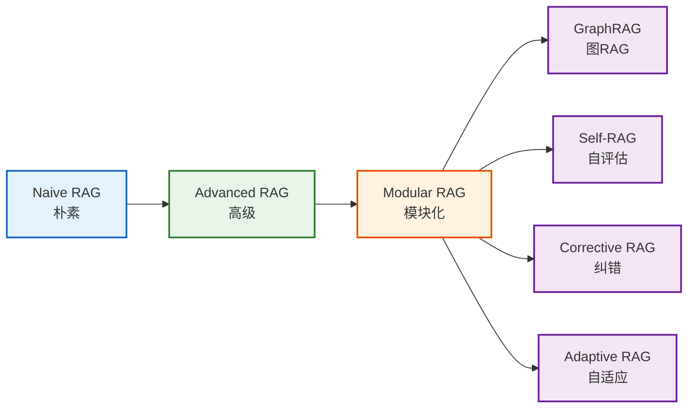
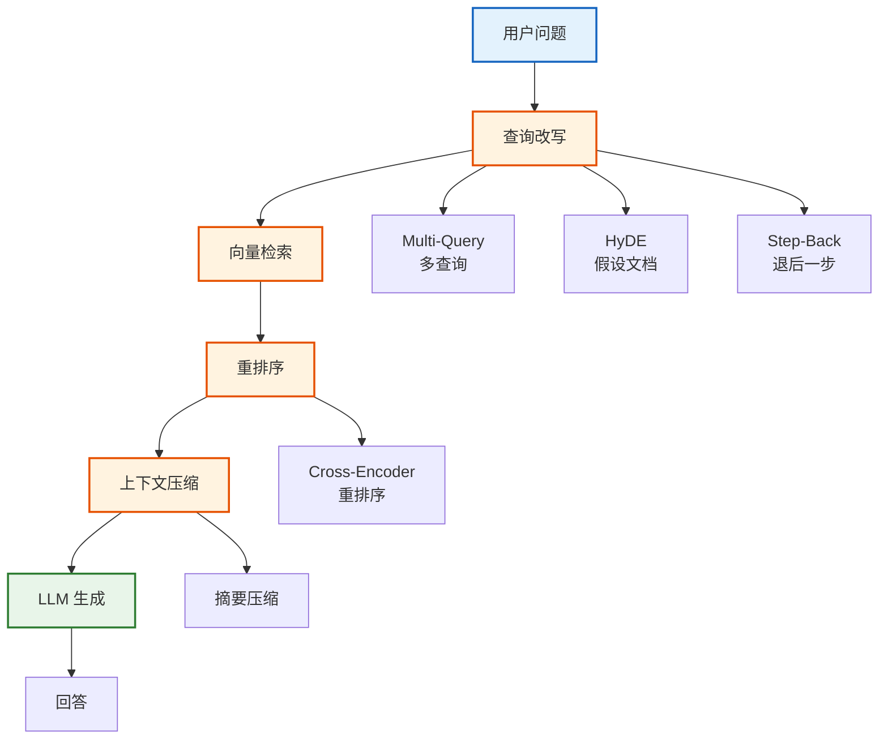
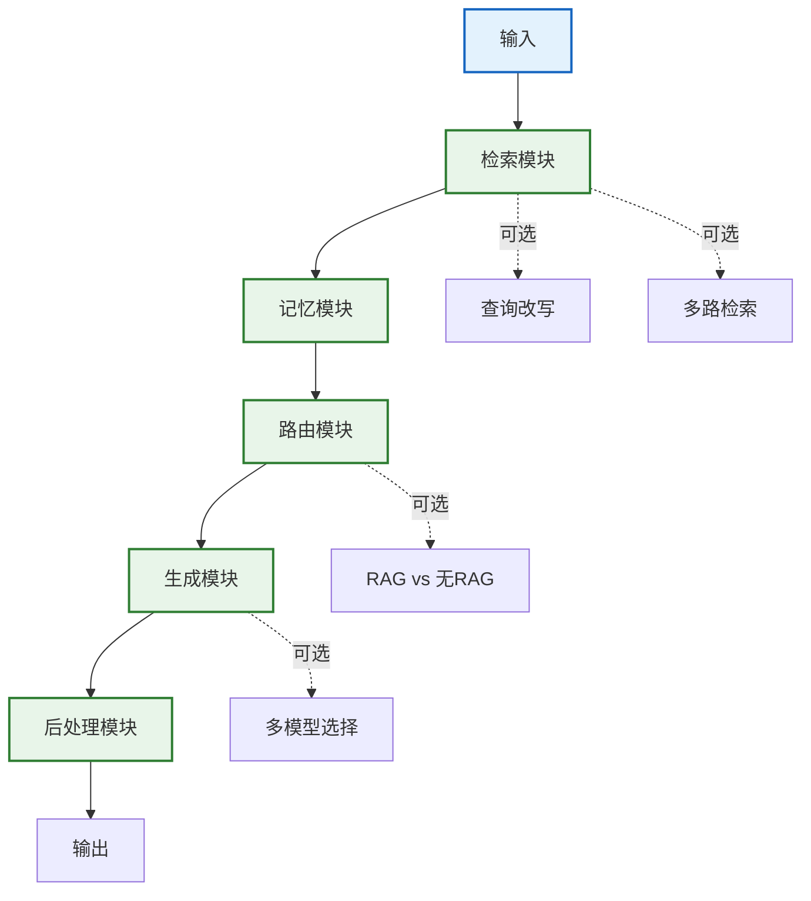
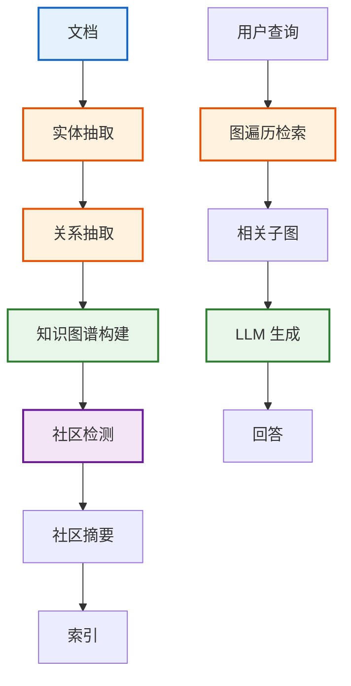
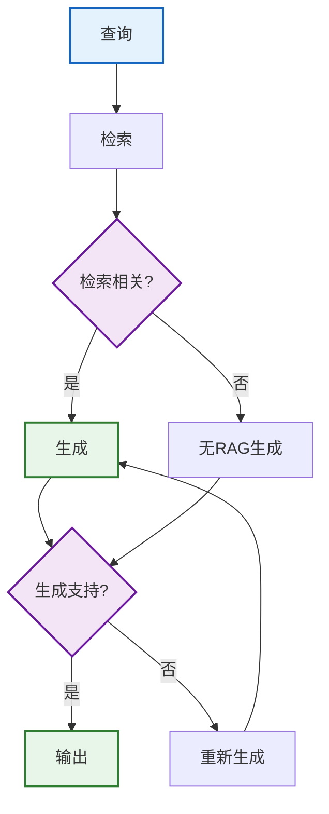
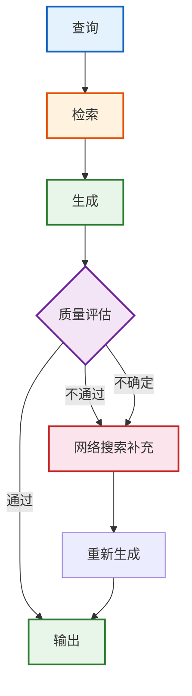
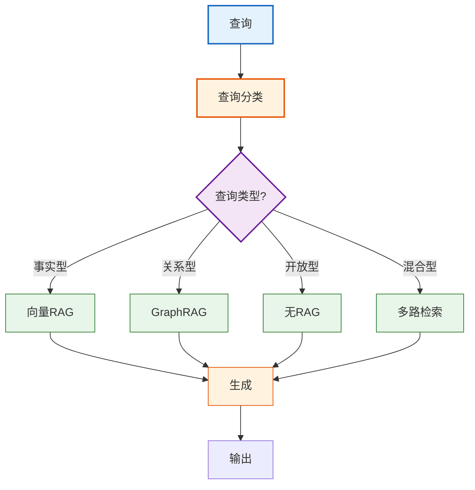
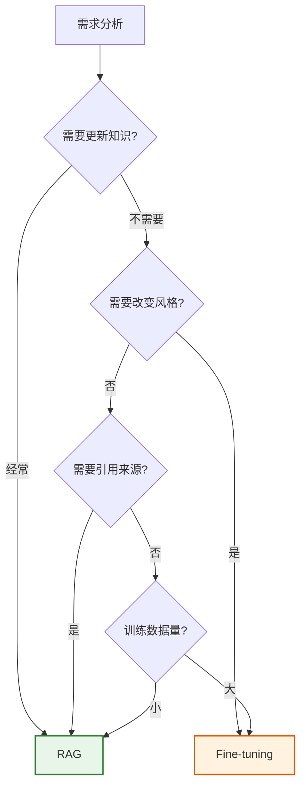

# RAG 架构模式技术手册

> **定位**：系统梳理 RAG 架构的演进路线——从 Naive RAG 到 Modular RAG，覆盖 GraphRAG、Self-RAG、Corrective RAG、Adaptive RAG 等高级架构模式，提供选型决策与代码实现。

> **配套课程**：`学习课程/第20课_RAG架构模式_从简单到高级.md`

---

## 目录

1. [RAG 架构演进总览](#1-rag-架构演进总览)
2. [Naive RAG（朴素 RAG）](#2-naive-rag朴素-rag)
3. [Advanced RAG（高级 RAG）](#3-advanced-rag高级-rag)
4. [Modular RAG（模块化 RAG）](#4-modular-rag模块化-rag)
5. [GraphRAG](#5-graphrag)
6. [Self-RAG 与 Corrective RAG](#6-self-rag-与-corrective-rag)
7. [Adaptive RAG（自适应 RAG）](#7-adaptive-rag自适应-rag)
8. [RAG vs Fine-tuning 决策](#8-rag-vs-fine-tuning-决策)

---

## 1. RAG 架构演进总览



> **图解说明**：RAG 架构的演进路线——从朴素 RAG（检索+生成）到高级 RAG（优化每个环节）到模块化 RAG（可插拔组件），再衍生出 GraphRAG、Self-RAG、Corrective RAG、Adaptive RAG 等专用架构。

### 架构对比总表

| 架构 | 复杂度 | 准确率 | 延迟 | 适用场景 |
|------|--------|--------|------|---------|
| Naive RAG | 低 | 基准 | 低 | 原型/简单问答 |
| Advanced RAG | 中 | +15% | 中 | 生产通用 |
| Modular RAG | 中高 | +20% | 中 | 灵活定制 |
| GraphRAG | 高 | +25%(关系类) | 高 | 知识图谱 |
| Self-RAG | 高 | +30% | 高 | 高精度要求 |
| Corrective RAG | 高 | +28% | 中高 | 容错场景 |
| Adaptive RAG | 高 | +22% | 可变 | 动态需求 |

---

## 2. Naive RAG（朴素 RAG）

### 2.1 架构图


> **图解说明**：朴素 RAG 最简单——问题转向量→检索 Top-K 文档→拼成上下文→LLM 生成回答。没有优化、没有质量控制、没有错误检查，但实现最简单。

### 2.2 代码实现

```python
from langchain_openai import ChatOpenAI, OpenAIEmbeddings
from langchain_chroma import Chroma
from langchain_core.prompts import ChatPromptTemplate
from langchain_core.output_parsers import StrOutputParser
from langchain_core.runnables import RunnablePassthrough

llm = ChatOpenAI(model="gpt-4o-mini", temperature=0)
embedding = OpenAIEmbeddings()
vectorstore = Chroma(persist_directory="./db", embedding_function=embedding)
retriever = vectorstore.as_retriever(search_kwargs={"k": 4})

prompt = ChatPromptTemplate.from_template("""
基于以下文档回答问题:
{context}
问题: {question}
""")

def format_docs(docs):
    return "\n\n".join(d.page_content for d in docs)

# Naive RAG: 一条管道
rag_chain = (
    {"context": retriever | format_docs, "question": RunnablePassthrough()}
    | prompt | llm | StrOutputParser()
)

result = rag_chain.invoke("什么是 Transformer?")
```

### 2.3 局限性

| 问题 | 说明 |
|------|------|
| 检索质量差 | 无查询改写、无重排序 |
| 上下文冗余 | Top-K 可能包含重复 |
| 无质量检查 | 不验证检索是否相关 |
| 无错误处理 | 检索为空时仍生成 |

---

## 3. Advanced RAG（高级 RAG）

### 3.1 架构图



> **图解说明**：高级 RAG 在朴素 RAG 的基础上增加了三个优化环节——查询改写（让问题更精确）、重排序（让结果更相关）、上下文压缩（减少 token 消耗）。每个环节都有多种可选策略。

### 3.2 高级 RAG 代码

```python
from langchain_community.cross_encoders import HuggingFaceCrossEncoder
from langchain.retrievers import ContextualCompressionRetriever
from langchain.retrievers.document_compressors import CrossEncoderReranker

# === 查询改写: Multi-Query ===
from langchain.retrievers.multi_query import MultiQueryRetriever
mq_retriever = MultiQueryRetriever.from_llm(
    retriever=retriever, llm=llm
)

# === 重排序 ===
reranker_model = HuggingFaceCrossEncoder(model_name="BAAI/bge-reranker-base")
reranker = CrossEncoderReranker(model=reranker_model, top_n=3)

# === 上下文压缩 ===
compressor = ContextualCompressionRetriever(
    base_retriever=mq_retriever,
    base_compressor=reranker,
)

# === 完整 Advanced RAG ===
advanced_rag = (
    {"context": compressor | format_docs, "question": RunnablePassthrough()}
    | prompt | llm | StrOutputParser()
)
```

### 3.3 各优化环节对比

| 优化环节 | 技术选项 | 效果 | 代价 |
|---------|---------|------|------|
| 查询改写 | Multi-Query | +15%召回 | +1次LLM调用 |
| 查询改写 | HyDE | +20%精度 | +1次LLM调用 |
| 重排序 | Cross-Encoder | +10%精度 | +100ms延迟 |
| 上下文压缩 | 摘要 | -50%token | +1次LLM调用 |
| 分块策略 | 语义分块 | +10%精度 | 预处理时间 |

---

## 4. Modular RAG（模块化 RAG）

### 4.1 架构图



> **图解说明**：模块化 RAG 把流程拆成可插拔的模块——检索、记忆、路由、生成、后处理。每个模块可独立替换，虚线表示可选扩展。这是现代 RAG 系统的主流架构。

### 4.2 模块化代码框架

```python
from langchain_core.runnables import RunnableLambda, RunnablePassthrough

class ModularRAG:
    def __init__(self, config):
        self.retriever = config["retriever"]
        self.memory = config.get("memory", None)
        self.router = config.get("router", None)
        self.generator = config["generator"]
        self.postprocessor = config.get("postprocessor", None)

    def __call__(self):
        # 检索
        retrieve = RunnableLambda(lambda q: self.retriever.invoke(q))
        # 格式化
        format_context = RunnableLambda(format_docs)
        # 生成
        generate = self.generator
        # 后处理
        if self.postprocessor:
            postprocess = RunnableLambda(self.postprocessor)
            return retrieve | format_context | generate | postprocess
        return retrieve | format_context | generate

# 使用
rag = ModularRAG({
    "retriever": reranking_retriever,
    "generator": prompt | llm | StrOutputParser(),
    "postprocessor": lambda x: x.strip(),
})
chain = rag()
```

---

## 5. GraphRAG

### 5.1 架构图



> **图解说明**：GraphRAG 用知识图谱替代向量检索——先从文档中抽取实体和关系构建知识图谱，再做社区检测生成摘要。查询时通过图遍历找到相关子图，生成回答。特别适合需要理解实体关系的场景。

### 5.2 GraphRAG vs Vector RAG

| 维度 | Vector RAG | GraphRAG |
|------|-----------|----------|
| 检索方式 | 向量相似度 | 图遍历 |
| 关系理解 | 弱 | 强 |
| 构建成本 | 低 | 高(需实体抽取) |
| 查询类型 | 事实型 | 关系型、推理型 |
| 更新 | 增量简单 | 需重构图 |
| 适用 | 通用 | 专业领域 |

### 5.3 简化实现

```python
from langchain_community.graphs import Neo4jGraph
from langchain_experimental.graph_transformers import LLMGraphTransformer

# === 构建知识图谱 ===
graph = Neo4jGraph(url="bolt://localhost:7687", username="neo4j", password="pass")

# 用 LLM 从文档抽取实体和关系
transformer = LLMGraphTransformer(llm=llm)
graph_documents = transformer.convert_to_graph_documents(docs)
graph.add_graph_documents(graph_documents)

# === 图检索 ===
from langchain.chains import GraphCypherQAChain
qa_chain = GraphCypherQAChain.from_llm(
    llm=llm, graph=graph, verbose=True,
)
result = qa_chain.invoke({"query": "谁和谁合作过?"})
```

---

## 6. Self-RAG 与 Corrective RAG

### 6.1 Self-RAG 架构



> **图解说明**：Self-RAG 的自评估机制——检索后先判断是否相关，不相关则不走 RAG。生成后再判断回答是否有文档支持，不支持则重新生成。通过两次自评估保证质量。

### 6.2 Corrective RAG 架构



> **图解说明**：Corrective RAG 的纠错机制——生成后做质量评估，不通过或不确定时，用网络搜索补充信息后重新生成，确保答案可靠。

### 6.3 代码实现(Corrective RAG)

```python
from langchain_core.runnables import RunnableLambda

def grade_documents(state):
    """评估检索文档的相关性"""
    docs = state["documents"]
    question = state["question"]
    graded = []
    for doc in docs:
        # 用 LLM 评估相关性
        grade = llm.invoke(
            f"文档是否与问题相关? 回答 yes 或 no.\n文档: {doc.page_content}\n问题: {question}"
        )
        if "yes" in grade.content.lower():
            graded.append(doc)
    return {"documents": graded, "question": question}

def decide_to_generate(state):
    """决策: 是否需要网络搜索补充"""
    if len(state["documents"]) == 0:
        return "web_search"  # 无相关文档, 用网络搜索
    return "generate"  # 有相关文档, 直接生成

# LangGraph 构建
from langgraph.graph import StateGraph, START, END

graph = StateGraph(State)
graph.add_node("retrieve", retrieve_node)
graph.add_node("grade", grade_documents)
graph.add_node("generate", generate_node)
graph.add_node("web_search", web_search_node)

graph.add_edge(START, "retrieve")
graph.add_edge("retrieve", "grade")
graph.add_conditional_edges("grade", decide_to_generate, {
    "generate": "generate",
    "web_search": "web_search",
})
graph.add_edge("web_search", "generate")
graph.add_edge("generate", END)

app = graph.compile()
```

---

## 7. Adaptive RAG（自适应 RAG）

### 7.1 架构图



> **图解说明**：Adaptive RAG 根据查询类型动态选择检索策略——事实型走向量 RAG、关系型走 GraphRAG、开放型不走 RAG 直接用 LLM、混合型多路检索。一个系统适配多种场景。

### 7.2 代码实现

```python
def classify_query(state):
    """查询分类"""
    query = state["question"]
    result = llm.invoke(
        f"判断查询类型(返回一个词): "
        f"fact(事实型) / relation(关系型) / open(开放型) / mixed(混合型)\n"
        f"查询: {query}"
    )
    return {"query_type": result.content.strip().lower()}

def route_query(state):
    """路由到不同检索策略"""
    qtype = state["query_type"]
    if "fact" in qtype:
        return "vector_rag"
    elif "relation" in qtype:
        return "graph_rag"
    elif "open" in qtype:
        return "no_rag"
    else:
        return "multi_retrieval"

# LangGraph 构建
graph = StateGraph(State)
graph.add_node("classify", classify_query)
graph.add_node("vector_rag", vector_rag_node)
graph.add_node("graph_rag", graph_rag_node)
graph.add_node("no_rag", no_rag_node)
graph.add_node("multi_retrieval", multi_retrieval_node)
graph.add_node("generate", generate_node)

graph.add_edge(START, "classify")
graph.add_conditional_edges("classify", route_query, {
    "vector_rag": "vector_rag",
    "graph_rag": "graph_rag",
    "no_rag": "no_rag",
    "multi_retrieval": "multi_retrieval",
})
graph.add_edge("vector_rag", "generate")
graph.add_edge("graph_rag", "generate")
graph.add_edge("no_rag", "generate")
graph.add_edge("multi_retrieval", "generate")
graph.add_edge("generate", END)

app = graph.compile()
```

---

## 8. RAG vs Fine-tuning 决策

### 8.1 决策矩阵

| 维度 | RAG | Fine-tuning |
|------|-----|-------------|
| 知识更新 | 即时(更新索引) | 慢(重新训练) |
| 成本 | 低(检索) | 高(GPU训练) |
| 可解释性 | 高(有来源) | 低(黑盒) |
| 私密数据 | 安全(不出域) | 有泄露风险 |
| 响应速度 | 中(检索+生成) | 快(直接推理) |
| 风格控制 | 弱 | 强 |
| 推理能力 | 依赖模型 | 可增强 |
| 适用 | 知识问答 | 风格/格式/领域 |

### 8.2 何时用 RAG、何时用 Fine-tuning



> **图解说明**：RAG vs Fine-tuning 决策树——需要频繁更新知识→RAG；需要改变输出风格→Fine-tuning；需要引用来源→RAG；训练数据量小→RAG，大→Fine-tuning。也可以两者结合：先 Fine-tune 增强能力，再用 RAG 补充知识。

---

## 检查清单

| 检查项 | 要点 |
|--------|------|
| 架构选择 | 根据场景选 Naive/Advanced/Modular |
| 查询改写 | 至少加 Multi-Query |
| 重排序 | 生产环境必加 |
| 质量评估 | 用 Self-RAG 自评估 |
| 错误纠正 | 加 Corrective RAG 补充 |
| 动态路由 | 用 Adaptive RAG 适配多场景 |
| 图谱 | 关系密集场景用 GraphRAG |
| 评估 | 用 RAGAS 量化质量 |

---

## 配套文档

- 📖 `知识库/03_数据连接与RAG.md` — RAG 基础
- 📖 `知识库/08_高级RAG与检索策略.md` — 高级 RAG 技术
- 📖 `知识库/15_向量数据库选型与对比技术参考.md` — 向量库选型
- 📖 `学习课程/第07课_RAG_让AI读懂你的文档.md` — RAG 入门
- 📖 `学习课程/第12课_高级RAG技术_让检索更精准.md` — 高级 RAG 课程
- 📖 `学习课程/第20课_RAG架构模式_从简单到高级.md` — 架构课程
