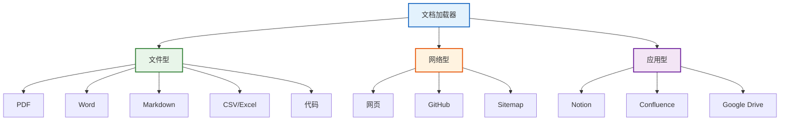
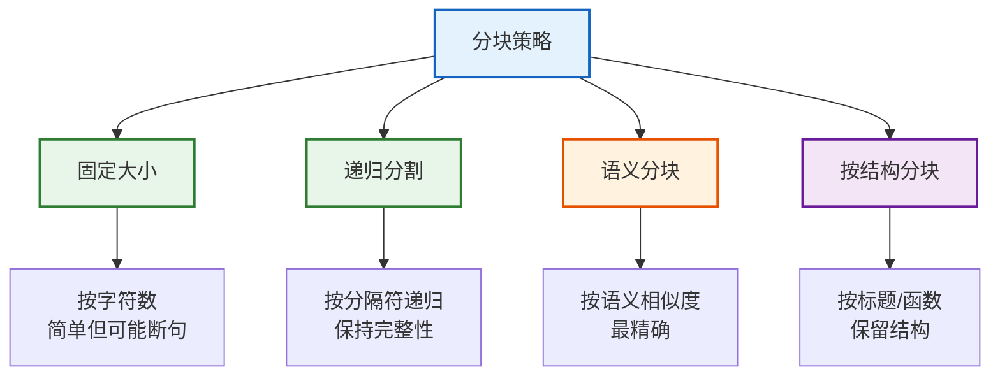
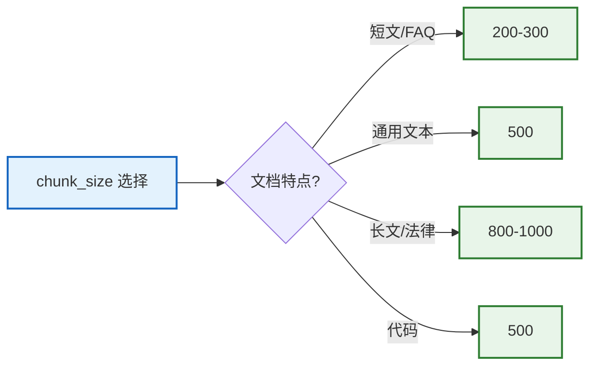

# 文档解析与数据预处理技术参考

> **定位**：系统梳理 LangChain 文档加载、分块策略、元数据管理和数据清洗管道，覆盖 PDF/HTML/代码/表格/Markdown 各类文档的解析方法与最佳实践。

> **配套课程**：`学习课程/第21课_数据预处理_让文档变得可搜索.md`

---

## 目录

1. [文档加载器总览](#1-文档加载器总览)
2. [PDF 文档解析](#2-pdf-文档解析)
3. [HTML 与网页解析](#3-html-与网页解析)
4. [代码与 Markdown 解析](#4-代码与-markdown-解析)
5. [分块策略详解](#5-分块策略详解)
6. [元数据管理与数据清洗](#6-元数据管理与数据清洗)

---

## 1. 文档加载器总览

### 1.1 文档加载器分类



> **图解说明**：LangChain 文档加载器分三大类——文件型（PDF/Word/Markdown/表格/代码）、网络型（网页/GitHub/Sitemap）、应用型（Notion/Confluence/Google Drive）。不同类型用不同的 Loader。

### 1.2 加载器速查表

| 类型 | 加载器 | 输入 | 安装 |
|------|--------|------|------|
| PDF | PyPDFLoader | .pdf 文件 | `pip install pypdf` |
| PDF | PDFPlumberLoader | .pdf 文件 | `pip install pdfplumber` |
| Word | Docx2txtLoader | .docx 文件 | `pip install docx2txt` |
| HTML | WebBaseLoader | URL | `pip install beautifulsoup4` |
| Markdown | UnstructuredMarkdownLoader | .md 文件 | `pip install unstructured` |
| CSV | CSVLoader | .csv 文件 | 内置 |
| Excel | UnstructuredExcelLoader | .xlsx 文件 | `pip install unstructured` |
| 代码 | GenericTextLoader | .py/.js 文件 | 内置 |
| GitHub | GitHubLoader | 仓库 URL | `pip install langchain-community` |
| 网页 | WebBaseLoader | URL | 内置 |

---

## 2. PDF 文档解析

### 2.1 PDF 加载器对比

| 加载器 | 速度 | 表格支持 | 图片支持 | 布局保留 | 推荐 |
|--------|------|---------|---------|---------|------|
| PyPDFLoader | 快 | 差 | 不支持 | 差 | 通用 |
| PDFPlumberLoader | 中 | 好 | 不支持 | 中 | 有表格 |
| UnstructuredPDFLoader | 慢 | 好 | 支持 | 好 | 复杂PDF |
| PyMuPDFLoader | 极快 | 中 | 不支持 | 中 | 大量PDF |

### 2.2 代码示例

```python
from langchain_community.document_loaders import (
    PyPDFLoader, PyMuPDFLoader, UnstructuredPDFLoader
)

# === PyPDF: 通用快速 ===
loader = PyPDFLoader("document.pdf")
pages = loader.load()
print(f"页数: {len(pages)}")
print(f"第一页内容: {pages[0].page_content[:200]}")
print(f"元数据: {pages[0].metadata}")  # {'source': 'document.pdf', 'page': 0}

# === PyMuPDF: 快速大量 ===
loader = PyMuPDFLoader("document.pdf")
pages = loader.load_and_split()  # 按页分割

# === 目录加载: 多个PDF ===
from langchain_community.document_loaders import DirectoryLoader
loader = DirectoryLoader(
    "./pdfs",
    glob="**/*.pdf",
    loader_cls=PyPDFLoader,
    show_progress=True,
)
docs = loader.load()
print(f"总文档: {len(docs)}")
```

### 2.3 PDF 解析常见问题

| 问题 | 原因 | 解决 |
|------|------|------|
| 乱码 | 编码问题 | 用 PyMuPDF 替代 PyPDF |
| 表格丢失 | PDF 无表格标记 | 用 PDFPlumber |
| 图片丢失 | PDF Loader 不提图 | UnstructuredPDF |
| 分页不准 | PDF 结构异常 | 按字节分块替代按页 |
| OCR 需要 | 扫描件 | Unstructured + tesseract |

---

## 3. HTML 与网页解析

### 3.1 网页加载方式

```python
from langchain_community.document_loaders import (
    WebBaseLoader, SitemapLoader, BSHTMLLoader
)

# === 单个网页 ===
loader = WebBaseLoader("https://example.com/article")
docs = loader.load()
print(docs[0].page_content[:200])
print(docs[0].metadata)  # {'source': 'https://example.com/article', 'title': '...'}

# === 多个网页 ===
urls = ["https://example.com/1", "https://example.com/2"]
loader = WebBaseLoader(urls)
docs = loader.load()

# === 整站抓取 (Sitemap) ===
loader = SitemapLoader("https://example.com/sitemap.xml")
docs = loader.load()

# === 自定义解析 ===
from bs4 import BeautifulSoup
loader = WebBaseLoader(
    "https://example.com",
    bs_kwargs={"parse_only": BeautifulSoup("html.parser")},
)
```

### 3.2 HTML 清洗管道

```python
from langchain_core.documents import Document
import re

def clean_html_content(text: str) -> str:
    """清洗 HTML 提取的文本"""
    # 移除多余空白
    text = re.sub(r'\s+', ' ', text)
    # 移除脚本和样式残留
    text = re.sub(r'javascript:.*?["\']', '', text)
    # 移除 HTML 实体
    text = text.replace('&nbsp;', ' ').replace('&amp;', '&')
    # 移除导航菜单等噪声(简化版)
    lines = text.split('\n')
    clean_lines = [l.strip() for l in lines if len(l.strip()) > 10]
    return '\n'.join(clean_lines)

# 应用清洗
docs = loader.load()
for doc in docs:
    doc.page_content = clean_html_content(doc.page_content)
```

---

## 4. 代码与 Markdown 解析

### 4.1 代码文档加载

```python
from langchain_community.document_loaders import (
    GenericTextLoader, PythonLoader, TextLoader
)

# === Python 代码 ===
loader = PythonLoader("main.py")
docs = loader.load()

# === 目录下所有代码 ===
loader = GenericTextLoader("./src", glob="**/*.py")
docs = loader.load()

# === 按函数/类分割代码 ===
from langchain_text_splitters import RecursiveCharacterTextSplitter
splitter = RecursiveCharacterTextSplitter.from_language(
    language="python",
    chunk_size=500,
    chunk_overlap=50,
)
chunks = splitter.split_documents(docs)
```

### 4.2 支持的代码语言

| 语言 | 参数 | 分块策略 |
|------|------|---------|
| Python | `"python"` | 按函数/类 |
| JavaScript | `"js"` | 按函数/类 |
| TypeScript | `"ts"` | 按函数/类 |
| Java | `"java"` | 按方法/类 |
| Go | `"go"` | 按函数 |
| Rust | `"rust"` | 按函数 |
| SQL | `"sql"` | 按语句 |
| HTML | `"html"` | 按标签 |
| Markdown | `"markdown"` | 按标题 |

### 4.3 Markdown 解析

```python
from langchain_community.document_loaders import UnstructuredMarkdownLoader
from langchain_text_splitters import MarkdownHeaderTextSplitter

# === 加载 Markdown ===
loader = UnstructuredMarkdownLoader("guide.md")
docs = loader.load()

# === 按标题分块(保留结构) ===
headers_to_split_on = [
    ("#", "Header 1"),
    ("##", "Header 2"),
    ("###", "Header 3"),
]
md_splitter = MarkdownHeaderTextSplitter(headers_to_split_on=headers_to_split_on)
md_chunks = md_splitter.split_text(docs[0].page_content)

for chunk in md_chunks:
    print(f"标题: {chunk.metadata}")
    print(f"内容: {chunk.page_content[:100]}")
```

---

## 5. 分块策略详解

### 5.1 分块策略对比



> **图解说明**：四种分块策略——固定大小（最简单但可能切断句子）、递归分割（按分隔符层级递归保持完整性）、语义分块（按语义相似度最精确）、按结构分块（按标题/函数保留文档结构）。

### 5.2 分块策略选择表

| 文档类型 | 推荐策略 | chunk_size | chunk_overlap | 原因 |
|---------|---------|------------|---------------|------|
| 纯文本 | 递归分割 | 500 | 50 | 通用、平衡 |
| 技术文档 | Markdown 标题 | - | - | 保留结构 |
| 代码 | 按语言分割 | 500 | 50 | 保留函数 |
| 法律合同 | 递归分割 | 1000 | 200 | 长上下文 |
| FAQ | 按问答分块 | - | - | 保持完整 |
| 论文 | 按段落 | 800 | 100 | 保留论证 |

### 5.3 代码实现

```python
from langchain_text_splitters import (
    RecursiveCharacterTextSplitter,
    CharacterTextSplitter,
    MarkdownHeaderTextSplitter,
    Language,
)
from langchain_experimental.text_splitter import SemanticChunker
from langchain_openai import OpenAIEmbeddings

# === 1. 递归分割(最常用) ===
recursive_splitter = RecursiveCharacterTextSplitter(
    chunk_size=500,
    chunk_overlap=50,
    separators=["\n\n", "\n", "。", ".", " ", ""],
)
chunks = recursive_splitter.split_documents(docs)

# === 2. 固定大小分割 ===
char_splitter = CharacterTextSplitter(
    chunk_size=500,
    chunk_overlap=50,
    separator="\n\n",
)

# === 3. 语义分块(最精确) ===
semantic_splitter = SemanticChunker(
    OpenAIEmbeddings(),
    breakpoint_threshold_type="percentile",
    breakpoint_threshold_amount=95,
)
semantic_chunks = semantic_splitter.split_documents(docs)

# === 4. 代码分块 ===
code_splitter = RecursiveCharacterTextSplitter.from_language(
    language=Language.PYTHON,
    chunk_size=500,
    chunk_overlap=50,
)
code_chunks = code_splitter.split_documents(code_docs)

# === 5. Markdown 按标题分块 ===
md_splitter = MarkdownHeaderTextSplitter(
    headers_to_split_on=[("#", "h1"), ("##", "h2"), ("###", "h3")],
)
md_chunks = md_splitter.split_text(md_content)
```

### 5.4 chunk_size 调优指南

| 参数 | 小值(200-300) | 大值(800-1000) |
|------|-------------|---------------|
| 检索精度 | 高(精准匹配) | 低(更多上下文) |
| 生成质量 | 可能信息不足 | 可能信息过多 |
| Token 消耗 | 少 | 多 |
| 适用 | 短问答 | 长文分析 |



> **图解说明**：chunk_size 调优——短文/FAQ 用 200-300 精准匹配、通用文本用 500 平衡、长文/法律用 800-1000 保留上下文、代码用 500 保持函数完整。

---

## 6. 元数据管理与数据清洗

### 6.1 元数据结构

```python
from langchain_core.documents import Document

# === 标准元数据 ===
doc = Document(
    page_content="这是内容",
    metadata={
        "source": "report.pdf",        # 来源
        "page": 0,                      # 页码
        "section": "第一章",             # 章节
        "author": "张三",               # 作者
        "date": "2026-08-26",           # 日期
        "language": "zh",              # 语言
        "doc_type": "pdf",            # 文档类型
        "chunk_index": 0,              # 分块序号
        "total_chunks": 42,            # 总块数
    },
)

# === 元数据过滤检索 ===
results = vectorstore.similarity_search(
    "查询内容",
    filter={"section": "第一章"},  # 只在第一章中搜索
    k=5,
)
```

### 6.2 数据清洗管道


> **图解说明**：数据清洗管道——加载→去重→清洗→分块→元数据标注→向量化→入索引。每一步都有质量检查点，确保进入索引的数据干净、完整、可检索。

### 6.3 清洗代码

```python
import re
from langchain_core.documents import Document

def deduplicate_docs(docs: list) -> list:
    """去重: 基于内容哈希"""
    seen = set()
    unique = []
    for doc in docs:
        h = hash(doc.page_content[:200])
        if h not in seen:
            seen.add(h)
            unique.append(doc)
    return unique

def clean_content(text: str) -> str:
    """清洗文本内容"""
    # 移除多余空白
    text = re.sub(r'\s+', ' ', text)
    # 移除特殊字符
    text = re.sub(r'[\x00-\x08\x0b\x0c\x0e-\x1f\x7f]', '', text)
    # 移除页眉页脚(简化版)
    text = re.sub(r'第\s*\d+\s*页', '', text)
    # 规范化标点
    text = text.replace(',,', ',').replace('。。', '。')
    return text.strip()

def add_metadata(docs: list, source: str) -> list:
    """批量添加元数据"""
    for i, doc in enumerate(docs):
        doc.metadata.update({
            "source": source,
            "chunk_index": i,
            "total_chunks": len(docs),
            "char_count": len(doc.page_content),
        })
    return docs

# === 完整管道 ===
def process_documents(file_path: str) -> list:
    """完整文档处理管道"""
    # 1. 加载
    loader = PyPDFLoader(file_path)
    docs = loader.load()

    # 2. 去重
    docs = deduplicate_docs(docs)

    # 3. 清洗
    for doc in docs:
        doc.page_content = clean_content(doc.page_content)

    # 4. 分块
    splitter = RecursiveCharacterTextSplitter(chunk_size=500, chunk_overlap=50)
    chunks = splitter.split_documents(docs)

    # 5. 元数据标注
    chunks = add_metadata(chunks, file_path)

    # 6. 过滤空块
    chunks = [c for c in chunks if len(c.page_content.strip()) > 10]

    print(f"处理完成: {file_path} → {len(chunks)} 块")
    return chunks
```

### 6.4 数据质量检查

| 检查项 | 阈值 | 处理 |
|--------|------|------|
| 空块率 | < 2% | 过滤 |
| 重复率 | < 5% | 去重 |
| 平均块长 | 200-800字 | 调参 |
| 特殊字符率 | < 1% | 清洗 |
| 元数据完整率 | 100% | 补充 |
| 分块完整性 | 句末结尾 | 调参 |

---

## 配套文档

- 📖 `知识库/03_数据连接与RAG.md` — 数据连接基础
- 📖 `知识库/08_高级RAG与检索策略.md` — 检索优化
- 📖 `知识库/16_RAG架构模式技术手册.md` — RAG 架构
- 📖 `学习课程/第07课_RAG_让AI读懂你的文档.md` — RAG 入门
- 📖 `学习课程/第21课_数据预处理_让文档变得可搜索.md` — 预处理课程
