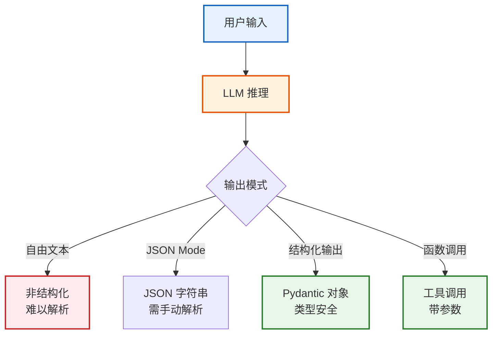
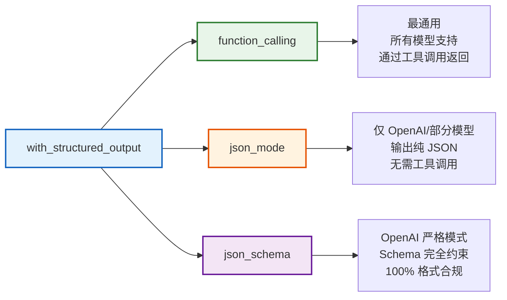
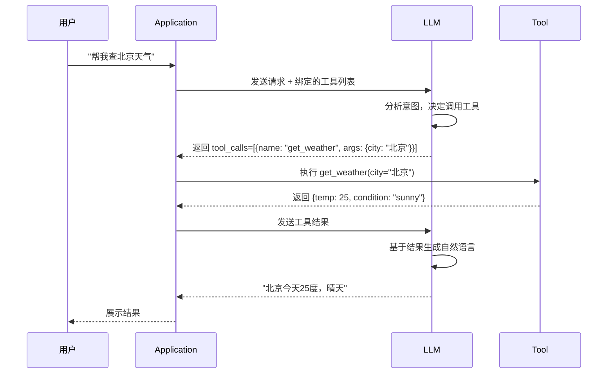

# 结构化输出与函数调用技术手册

> **知识库 18 · 技术参考**  
> 本手册系统覆盖 LangChain 中的结构化输出（Structured Output）与函数调用（Function Calling）机制，包括 API 用法、Schema 定义、错误处理、模型对比与最佳实践。

---

## 目录

1. [核心概念与架构](#1-核心概念与架构)
2. [with_structured_output 详解](#2-with_structured_output-详解)
3. [函数调用协议](#3-函数调用协议)
4. [Pydantic Schema 设计](#4-pydantic-schema-设计)
5. [错误处理与重试策略](#5-错误处理与重试策略)
6. [模型能力对比矩阵](#6-模型能力对比矩阵)
7. [高级模式与最佳实践](#7-高级模式与最佳实践)

---

## 1. 核心概念与架构

### 1.1 什么是结构化输出

结构化输出是指让 LLM 以预定义的格式（如 JSON、Pydantic 模型）返回数据，而非自由文本。这是构建可靠 LLM 应用的基石。



### 1.2 三种输出模式对比

| 模式 | 原理 | 可靠性 | 适用场景 |
|------|------|--------|---------|
| 自由文本 | LLM 直接输出自然语言 | 低 | 聊天对话 |
| JSON Mode | 指定输出 JSON 格式 | 中 | 简单数据提取 |
| Structured Output | 使用 Schema 约束输出 | 高 | 生产应用 |
| Function Calling | 绑定工具函数 | 高 | Agent / 工具调用 |

### 1.3 LangChain 中的统一接口

LangChain 通过 `with_structured_output()` 方法统一了不同模型的结构化输出接口，底层自动适配各模型的 API 差异。

```python
from langchain_openai import ChatOpenAI
from langchain_core.pydantic_v1 import BaseModel, Field

# 定义输出 Schema
class PersonInfo(BaseModel):
    name: str = Field(description="人物姓名")
    age: int = Field(description="年龄", ge=0, le=150)
    occupation: str = Field(description="职业")
    skills: list[str] = Field(description="技能列表")

# 绑定结构化输出
llm = ChatOpenAI(model="gpt-4o", temperature=0)
structured_llm = llm.with_structured_output(PersonInfo)

# 调用 — 直接返回 Pydantic 对象
result = structured_llm.invoke("张三，28岁，是一名Python后端工程师，精通Docker和FastAPI")
print(type(result))  # <class 'PersonInfo'>
print(result.name)    # 张三
print(result.skills)  # ['Docker', 'FastAPI']
```

---

## 2. with_structured_output 详解

### 2.1 方法签名与参数

```python
def with_structured_output(
    schema: Union[dict, type[BaseModel], type],
    *,
    method: str = "function_calling",  # "function_calling" | "json_mode" | "json_schema"
    include_raw: bool = False,
    strict: bool = False,  # OpenAI strict mode
    **kwargs
) -> Runnable
```

### 2.2 三种方法对比



### 2.3 使用 Pydantic 定义 Schema

```python
from typing import Optional
from langchain_core.pydantic_v1 import BaseModel, Field

class ExtractionResult(BaseModel):
    """从文本中提取的结构化信息"""
    entities: list[str] = Field(
        description="提取的实体名称列表"
    )
    sentiment: str = Field(
        description="情感倾向：positive/negative/neutral"
    )
    confidence: float = Field(
        description="置信度 0-1",
        ge=0.0, le=1.0
    )
    summary: str = Field(
        description="一句话摘要",
        max_length=100
    )
    keywords: Optional[list[str]] = Field(
        default=None,
        description="关键词列表（可选）"
    )

# 使用
llm = ChatOpenAI(model="gpt-4o")
extractor = llm.with_structured_output(ExtractionResult)
result = extractor.invoke("苹果公司发布了新款iPhone，市场反应热烈，股价上涨3.2%")
```

### 2.4 使用 TypedDict 定义 Schema

```python
from typing import TypedDict, Annotated

class MovieReview(TypedDict):
    """电影评论结构化输出"""
    title: Annotated[str, ..., "电影标题"]
    rating: Annotated[int, ..., "评分 1-5"]
    pros: Annotated[list[str], ..., "优点列表"]
    cons: Annotated[list[str], ..., "缺点列表"]
    recommendation: Annotated[str, ..., "推荐意见"]

# TypedDict 方式（不需要 Pydantic 依赖）
reviewer = llm.with_structured_output(MovieReview)
```

### 2.5 使用 JSON Schema（字典）

```python
schema = {
    "title": "WeatherReport",
    "description": "天气预报信息",
    "type": "object",
    "properties": {
        "city": {"type": "string", "description": "城市名"},
        "temperature": {"type": "number", "description": "温度（摄氏度）"},
        "condition": {
            "type": "string",
            "enum": ["sunny", "cloudy", "rainy", "snowy"],
            "description": "天气状况"
        },
        "humidity": {"type": "integer", "description": "湿度百分比", "minimum": 0, "maximum": 100}
    },
    "required": ["city", "temperature", "condition"]
}

weather_llm = llm.with_structured_output(schema)
```

### 2.6 include_raw 参数

```python
# include_raw=True 时返回原始响应 + 解析结果
structured_llm = llm.with_structured_output(PersonInfo, include_raw=True)
result = structured_llm.invoke("李四，35岁，数据科学家")

# result 包含:
# result["raw"]      — AIMessage 原始对象
# result["parsed"]   — 解析后的 Pydantic 对象
# result["parsing_error"] — 解析错误（如有）
```

---

## 3. 函数调用协议

### 3.1 函数调用工作流



### 3.2 bind_tools 方法

```python
from langchain_core.tools import tool

@tool
def search_weather(city: str) -> dict:
    """查询指定城市的天气信息。
    
    Args:
        city: 城市名称，如"北京"、"上海"
    
    Returns:
        包含温度、天气状况等信息的字典
    """
    # 实际实现
    return {"city": city, "temperature": 25, "condition": "sunny"}

@tool
def calculate(expression: str) -> str:
    """计算数学表达式。
    
    Args:
        expression: 数学表达式，如 "2 + 3 * 4"
    
    Returns:
        计算结果
    """
    try:
        return str(eval(expression))
    except Exception as e:
        return f"计算错误: {e}"

# 绑定工具
llm = ChatOpenAI(model="gpt-4o")
llm_with_tools = llm.bind_tools([search_weather, calculate])

# 调用 — LLM 决定是否使用工具
response = llm_with_tools.invoke("北京今天多少度？")
print(response.tool_calls)  # [{'name': 'search_weather', 'args': {'city': '北京'}}]
```

### 3.3 手动处理工具调用

```python
# 完整的工具调用循环
tools = {"search_weather": search_weather, "calculate": calculate}

response = llm_with_tools.invoke("北京天气如何？然后帮我算 15 * 23")

# 可能有多个工具调用
while response.tool_calls:
    # 执行每个工具调用
    results = []
    for tc in response.tool_calls:
        tool_name = tc["name"]
        tool_args = tc["args"]
        tool_func = tools[tool_name]
        result = tool_func.invoke(tool_args)
        results.append(ToolMessage(content=str(result), tool_call_id=tc["id"]))
    
    # 将工具结果发回 LLM
    response = llm_with_tools.invoke(
        [HumanMessage("北京天气如何？然后帮我算 15 * 23")] + results
    )

print(response.content)  # 最终自然语言回复
```

### 3.4 工具 Schema 自动生成

```python
from langchain_core.tools import tool
import inspect

@tool
def create_user(name: str, age: int, email: str, roles: list[str]) -> dict:
    """创建新用户账号。
    
    Args:
        name: 用户姓名
        age: 用户年龄（18-120）
        email: 电子邮箱地址
        roles: 角色列表，如 ["admin", "user"]
    
    Returns:
        创建结果，包含用户ID
    """
    return {"user_id": "12345", "status": "created"}

# LangChain 自动从函数签名和文档字符串生成 JSON Schema
print(create_user.args_schema.schema())
# {
#   "title": "create_user",
#   "description": "创建新用户账号。",
#   "type": "object",
#   "properties": {
#     "name": {"type": "string", "description": "用户姓名"},
#     "age": {"type": "integer", "description": "用户年龄（18-120）"},
#     "email": {"type": "string", "description": "电子邮箱地址"},
#     "roles": {"type": "array", "items": {"type": "string"}, "description": "角色列表"}
#   },
#   "required": ["name", "age", "email", "roles"]
# }
```

---

## 4. Pydantic Schema 设计

### 4.1 嵌套结构

```python
from typing import Optional
from langchain_core.pydantic_v1 import BaseModel, Field

class Address(BaseModel):
    """地址信息"""
    province: str = Field(description="省份")
    city: str = Field(description="城市")
    district: str = Field(description="区/县")
    street: str = Field(description="街道地址")
    postal_code: Optional[str] = Field(default=None, description="邮编")

class Company(BaseModel):
    """公司信息"""
    name: str = Field(description="公司名称")
    industry: str = Field(description="所属行业")
    founded: int = Field(description="成立年份", ge=1800, le=2025)
    headquarters: Address = Field(description="总部地址")
    employees: int = Field(description="员工数量", ge=0)
    products: list[str] = Field(description="主要产品列表", default_factory=list)

class CompanyReport(BaseModel):
    """公司分析报告"""
    company: Company = Field(description="公司基本信息")
    market_cap: Optional[float] = Field(default=None, description="市值（亿元）")
    competitors: list[str] = Field(description="竞争对手列表", default_factory=list)
    risk_factors: list[str] = Field(description="风险因素", default_factory=list)
    recommendation: str = Field(description="投资建议：buy/hold/sell")

# 使用嵌套 Schema
llm = ChatOpenAI(model="gpt-4o")
analyzer = llm.with_structured_output(CompanyReport)
```

### 4.2 枚举与约束

```python
from enum import Enum

class Priority(str, Enum):
    """任务优先级"""
    critical = "critical"
    high = "high"
    medium = "medium"
    low = "low"

class Task(BaseModel):
    """任务结构"""
    title: str = Field(description="任务标题", max_length=200)
    description: str = Field(description="详细描述")
    priority: Priority = Field(description="优先级")
    estimated_hours: float = Field(description="预计工时", gt=0, le=1000)
    tags: list[str] = Field(description="标签", max_items=10)
    deadline: Optional[str] = Field(default=None, description="截止日期 YYYY-MM-DD")
```

### 4.3 自定义验证器

```python
from langchain_core.pydantic_v1 import BaseModel, Field, validator

class EmailData(BaseModel):
    """邮件提取结果"""
    sender: str = Field(description="发件人邮箱")
    subject: str = Field(description="邮件主题")
    body: str = Field(description="邮件正文")
    recipients: list[str] = Field(description="收件人列表")
    
    @validator("sender")
    def validate_email(cls, v):
        if "@" not in v:
            raise ValueError(f"无效的邮箱地址: {v}")
        return v.lower()
    
    @validator("subject")
    def validate_subject(cls, v):
        if len(v) > 200:
            raise ValueError("主题过长")
        return v.strip()
```

---

## 5. 错误处理与重试策略

### 5.1 常见错误类型

| 错误类型 | 原因 | 处理策略 |
|---------|------|---------|
| Schema 不匹配 | LLM 输出不符合定义的 Schema | 使用 OutputParser 重试 |
| 字段缺失 | 必填字段未返回 | 设默认值 + 重试 |
| 类型错误 | 返回字符串而非数字等 | Pydantic 自动转换或报错 |
| 幻觉字段 | 返回了 Schema 中没有的字段 | Pydantic 忽略多余字段 |
| JSON 解析失败 | 输出非合法 JSON | 正则提取 + 重试 |

### 5.2 自动重试机制

```python
from langchain_core.output_parsers import PydanticOutputParser
from langchain_core.exceptions import OutputParserException

# 方式 1：使用 with_structured_output（内置重试）
structured_llm = llm.with_structured_output(
    PersonInfo,
    method="function_calling",  # 最可靠
    include_raw=False
)

# 方式 2：使用 OutputParser + 自定义重试
parser = PydanticOutputParser(pydantic_object=PersonInfo)

def parse_with_retry(llm, prompt_template, max_retries=3):
    """带重试的解析"""
    for attempt in range(max_retries):
        try:
            response = llm.invoke(prompt_template)
            return parser.parse(response.content)
        except OutputParserException as e:
            if attempt == max_retries - 1:
                raise
            # 将错误信息加入下一次 prompt，帮助 LLM 纠正
            prompt_template += f"\n\n上一次输出有误: {e}\n请严格按照格式输出。"
    
# 方式 3：使用 RunnableWithFallbacks
from langchain_core.runnables import RunnableWithFallbacks

reliable_llm = structured_llm.with_fallbacks([
    llm.with_structured_output(PersonInfo, method="json_mode"),
    llm.with_structured_output(PersonInfo, method="json_schema"),
])
```

### 5.3 容错最佳实践

```python
from typing import Union
from langchain_core.pydantic_v1 import BaseModel, Field

# 定义成功和失败两种输出
class SuccessResult(BaseModel):
    """成功解析结果"""
    status: str = Field(description="success")
    data: dict = Field(description="解析得到的数据")

class ErrorResult(BaseModel):
    """解析失败结果"""
    status: str = Field(description="error")
    error_message: str = Field(description="错误原因")
    raw_output: str = Field(description="原始输出")

# 让 LLM 自己判断是否成功
result_llm = llm.with_structured_output(Union[SuccessResult, ErrorResult])
```

---

## 6. 模型能力对比矩阵

### 6.1 结构化输出支持

| 模型 | function_calling | json_mode | json_schema | strict | 嵌套对象 | 枚举 |
|------|:-:|:-:|:-:|:-:|:-:|:-:|
| GPT-4o | ✅ | ✅ | ✅ | ✅ | ✅ | ✅ |
| GPT-4o-mini | ✅ | ✅ | ✅ | ✅ | ✅ | ✅ |
| GPT-4-turbo | ✅ | ✅ | ✅ | ❌ | ✅ | ✅ |
| Claude 3.5 Sonnet | ✅ | ❌ | ❌ | N/A | ✅ | ✅ |
| Claude 3 Opus | ✅ | ❌ | ❌ | N/A | ✅ | ✅ |
| Gemini 1.5 Pro | ✅ | ✅ | ❌ | N/A | ✅ | ✅ |
| Qwen2.5-72B | ✅ | ❌ | ❌ | N/A | ✅ | ✅ |
| DeepSeek-V3 | ✅ | ✅ | ❌ | N/A | ✅ | ✅ |

### 6.2 性能对比

| 模型 | 格式合规率 | 嵌套深度支持 | 响应速度 | 成本/1K tokens |
|------|-----------|------------|---------|--------------|
| GPT-4o (strict) | ~100% | 5+ 层 | 中 | $5/$15 |
| GPT-4o-mini | ~98% | 3 层 | 快 | $0.15/$0.60 |
| Claude 3.5 Sonnet | ~95% | 4 层 | 中 | $3/$15 |
| Gemini 1.5 Pro | ~93% | 3 层 | 快 | $1.25/$5 |
| DeepSeek-V3 | ~90% | 3 层 | 快 | $0.14/$0.28 |

### 6.3 跨模型适配

```python
from langchain_openai import ChatOpenAI
from langchain_anthropic import ChatAnthropic
from langchain_google_genai import ChatGoogleGenerativeAI
from langchain_core.pydantic_v1 import BaseModel

class AnalysisResult(BaseModel):
    summary: str
    sentiment: str
    score: float

def get_structured_llm(provider: str, model: str):
    """跨模型获取结构化输出 LLM"""
    if provider == "openai":
        llm = ChatOpenAI(model=model, temperature=0)
        return llm.with_structured_output(AnalysisResult, method="function_calling")
    elif provider == "anthropic":
        llm = ChatAnthropic(model=model, temperature=0)
        return llm.with_structured_output(AnalysisResult)
    elif provider == "google":
        llm = ChatGoogleGenerativeAI(model=model, temperature=0)
        return llm.with_structured_output(AnalysisResult, method="function_calling")
    else:
        raise ValueError(f"不支持的 provider: {provider}")
```

---

## 7. 高级模式与最佳实践

### 7.1 多 Schema 路由

```python
from typing import Union
from langchain_core.pydantic_v1 import BaseModel, Field

class SearchQuery(BaseModel):
    """搜索意图"""
    query: str = Field(description="搜索关键词")
    filters: dict = Field(description="过滤条件", default_factory=dict)

class SummaryRequest(BaseModel):
    """摘要意图"""
    text: str = Field(description="待摘要文本")
    max_length: int = Field(description="最大字数", default=200)

class CodeReviewRequest(BaseModel):
    """代码审查意图"""
    code: str = Field(description="待审查代码")
    language: str = Field(description="编程语言")

# 使用 Union 让 LLM 选择正确的 Schema
router_llm = llm.with_structured_output(
    Union[SearchQuery, SummaryRequest, CodeReviewRequest]
)
```

### 7.2 流式结构化输出

```python
# 流式获取部分结果
structured_llm = llm.with_structured_output(PersonInfo)

# 使用 stream 获取部分解析结果
for chunk in structured_llm.stream("描述一个叫王五的人，30岁，是AI工程师"):
    # chunk 是部分填充的 Pydantic 对象
    if hasattr(chunk, "name") and chunk.name:
        print(f"名字: {chunk.name}")
    if hasattr(chunk, "age") and chunk.age:
        print(f"年龄: {chunk.age}")
```

### 7.3 最佳实践清单

| 实践 | 说明 | 优先级 |
|------|------|--------|
| 用 function_calling 方法 | 最通用、最可靠 | ⭐⭐⭐ |
| 定义清晰的 Field description | 帮助 LLM 理解期望输出 | ⭐⭐⭐ |
| 使用 Optional 处理可选字段 | 避免因缺失字段而报错 | ⭐⭐⭐ |
| 设置 temperature=0 | 减少输出随机性 | ⭐⭐ |
| 用 validator 做后处理验证 | 补充 Schema 无法覆盖的规则 | ⭐⭐ |
| 用 include_raw 调试 | 保留原始响应用于排查 | ⭐⭐ |
| 设 fallback LLM | 主模型失败时降级 | ⭐ |
| 避免过深嵌套 | 超过 3 层嵌套降低合规率 | ⭐⭐ |
| 使用枚举约束取值 | 避免自由文本输出 | ⭐⭐ |
| 测试 Schema 边界 | 用极端值验证约束 | ⭐⭐ |

### 7.4 调试技巧

```python
# 调试模式：获取原始输出 + 解析结果 + 错误信息
debug_llm = llm.with_structured_output(PersonInfo, include_raw=True)
result = debug_llm.invoke("张三28岁工程师")

print("=== 调试信息 ===")
print(f"解析结果: {result.get('parsed')}")
print(f"解析错误: {result.get('parsing_error')}")
print(f"原始响应: {result.get('raw').content[:200]}")

# 如果解析失败，检查原始输出
if result.get("parsing_error"):
    raw = result["raw"].content
    print(f"原始输出前500字符: {raw[:500]}")
```

---

## 相关文档

- [知识库 02：组件详解](./02_组件详解技术手册.md) — 输出解析器基础
- [学习课程第 05 课：输出解析](../学习课程/第05课_输出解析_让AI说规范的话.md) — 入门概念
- [学习课程第 22 课：结构化输出](../学习课程/第22课_结构化输出_让AI说规范的话.md) — 教学版
- [附录 B：术语表与 API 速查卡](../附录/附录B_术语表与API速查卡.md) — API 参考
