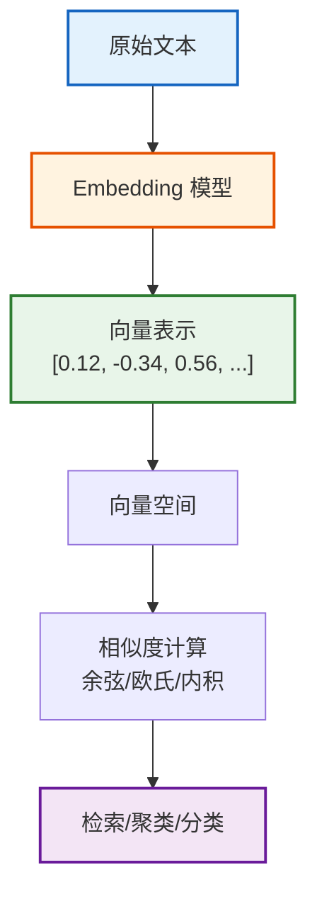
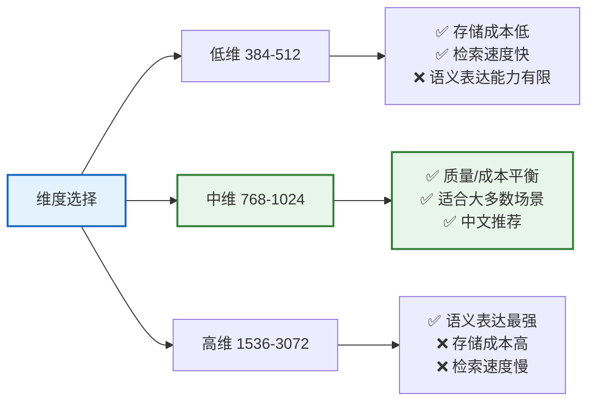
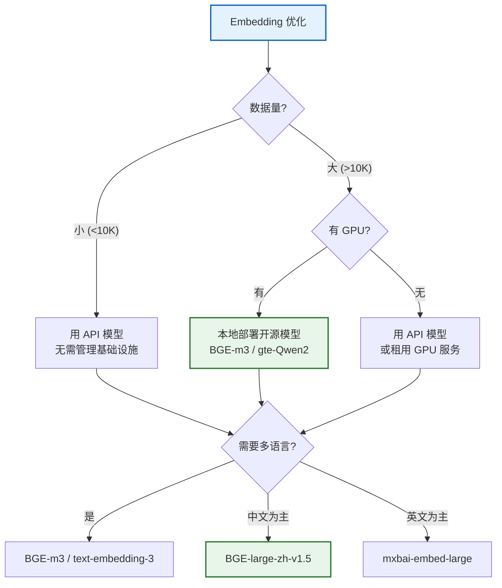

# Embedding 模型与策略技术参考

> **知识库 19 · 技术参考**  
> 本手册系统覆盖 Embedding 模型的选型、使用、优化策略，包括主流模型对比、维度分析、性能基准、选型决策框架和实用代码示例。

---

## 目录

1. [Embedding 基础概念](#1-embedding-基础概念)
2. [主流 Embedding 模型对比](#2-主流-embedding-模型对比)
3. [性能基准与评测](#3-性能基准与评测)
4. [LangChain 中的 Embedding 使用](#4-langchain-中的-embedding-使用)
5. [Embedding 策略与优化](#5-embedding-策略与优化)
6. [多语言 Embedding](#6-多语言-embedding)
7. [选型决策框架](#7-选型决策框架)

---

## 1. Embedding 基础概念

### 1.1 什么是 Embedding

Embedding 是将文本映射为高维稠密向量的过程，使得语义相似的文本在向量空间中距离更近。



### 1.2 核心指标

| 指标 | 说明 | 典型范围 |
|------|------|---------|
| 维度 (Dimension) | 向量的维度数 | 384-4096 |
| 最大输入长度 | 模型能处理的最大 token 数 | 512-32768 |
| 多语言支持 | 是否支持中文等非英语 | 是/否 |
| 开源/闭源 | 模型是否可本地部署 | 开源/闭源 |
| 推理速度 | 编码单条文本的时间 | 5-100ms |

### 1.3 相似度计算方法

```python
import numpy as np
from numpy.linalg import norm

# 余弦相似度（最常用）
def cosine_similarity(a, b):
    return np.dot(a, b) / (norm(a) * norm(b))

# 欧氏距离
def euclidean_distance(a, b):
    return norm(a - b)

# 内积（点积，适用于已归一化的向量）
def inner_product(a, b):
    return np.dot(a, b)

# 示例
vec1 = np.array([0.1, 0.2, 0.3, 0.4])
vec2 = np.array([0.15, 0.25, 0.35, 0.45])
print(f"余弦相似度: {cosine_similarity(vec1, vec2):.4f}")  # ~0.998
print(f"欧氏距离: {euclidean_distance(vec1, vec2):.4f}")     # ~0.07
print(f"内积: {inner_product(vec1, vec2):.4f}")             # ~0.33
```

---

## 2. 主流 Embedding 模型对比

### 2.1 闭源 API 模型

| 模型 | 提供商 | 维度 | 最大输入 | 多语言 | 价格/1K tokens | 特点 |
|------|--------|------|---------|--------|--------------|------|
| text-embedding-3-large | OpenAI | 3072 | 8191 | ✅ | $0.013 | 最强通用模型 |
| text-embedding-3-small | OpenAI | 1536 | 8191 | ✅ | $0.002 | 性价比高 |
| text-embedding-ada-002 | OpenAI | 1536 | 8191 | ✅ | $0.0001 | 旧版，兼容性好 |
| voyage-3 | Voyage AI | 1024 | 32000 | ✅ | $0.012 | 长文本优势 |
| voyage-3-lite | Voyage AI | 512 | 32000 | ✅ | $0.003 | 轻量版 |
| cohere/embed-v3 | Cohere | 1024 | 512 | ✅ | $0.0001 | 搜索优化 |

### 2.2 开源模型

| 模型 | 维度 | 最大输入 | 多语言 | 中文支持 | 推荐用途 |
|------|------|---------|--------|---------|---------|
| BGE-large-zh-v1.5 | 1024 | 512 | 中英 | ⭐⭐⭐⭐⭐ | 中文检索首选 |
| BGE-m3 | 1024 | 8192 | 100+ 语言 | ⭐⭐⭐⭐⭐ | 多语言长文本 |
| bge-large-en-v1.5 | 1024 | 512 | 英文 | ⭐⭐⭐ | 英文场景 |
| gte-large-zh | 1024 | 512 | 中英 | ⭐⭐⭐⭐⭐ | 阿里达摩院 |
| gte-Qwen2-7B-instruct | 3584 | 32768 | 多语言 | ⭐⭐⭐⭐⭐ | 超长上下文 |
| jina-embeddings-v3 | 1024 | 8192 | 89 语言 | ⭐⭐⭐⭐ | 多任务优化 |
| nomic-embed-text | 768 | 8192 | 英文 | ⭐⭐⭐ | 开源可复现 |
| mxbai-embed-large | 1024 | 512 | 英文 | ⭐⭐ | 英文最强开源 |

### 2.3 中文场景推荐

```python
# 中文场景推荐排序
chinese_recommendations = {
    "best_quality": "BGE-m3 (多语言+长文本)",
    "best_chinese": "BGE-large-zh-v1.5 (中文专精)",
    "best_long_context": "gte-Qwen2-7B-instruct (32K)",
    "best_value_openai": "text-embedding-3-small",
    "best_value_open_source": "BGE-large-zh-v1.5 (免费本地部署)",
    "best_multilingual": "jina-embeddings-v3",
}
```

---

## 3. 性能基准与评测

### 3.1 MTEB 中文排行榜

| 排名 | 模型 | 平均分 | 检索 | 聚类 | 分类 | STS |
|------|------|--------|------|------|------|-----|
| 1 | BGE-m3 | 66.3 | 65.1 | 58.2 | 70.1 | 72.0 |
| 2 | gte-Qwen2-7B | 65.8 | 64.3 | 57.5 | 69.2 | 72.1 |
| 3 | BGE-large-zh-v1.5 | 64.2 | 63.1 | 56.8 | 68.5 | 68.5 |
| 4 | text-embedding-3-large | 63.5 | 62.0 | 56.0 | 67.8 | 68.2 |
| 5 | gte-large-zh | 62.8 | 61.5 | 55.5 | 67.0 | 67.2 |
| 6 | jina-embeddings-v3 | 62.0 | 60.8 | 55.0 | 66.5 | 65.8 |
| 7 | text-embedding-3-small | 60.5 | 58.2 | 54.2 | 65.0 | 64.5 |

### 3.2 维度与质量权衡



### 3.3 实测速度对比

| 模型 | 单条编码耗时 | 批量 100 条 | GPU 需求 |
|------|------------|------------|---------|
| text-embedding-3-small (API) | 50ms | 200ms | 无需 |
| text-embedding-3-large (API) | 80ms | 350ms | 无需 |
| BGE-large-zh (CPU) | 120ms | 2000ms | 无需 |
| BGE-large-zh (GPU T4) | 8ms | 50ms | 4GB VRAM |
| BGE-m3 (GPU T4) | 15ms | 80ms | 4GB VRAM |
| gte-Qwen2-7B (GPU A10) | 25ms | 120ms | 16GB VRAM |

---

## 4. LangChain 中的 Embedding 使用

### 4.1 OpenAI Embedding

```python
from langchain_openai import OpenAIEmbeddings

# 基础用法
embeddings = OpenAIEmbeddings(
    model="text-embedding-3-small",
    # 可自定义维度（仅 3 系列）
    dimensions=512  # 降维以节省存储
)

# 编码单条文本
vec = embeddings.embed_query("LangChain 是什么？")
print(f"维度: {len(vec)}")  # 512

# 批量编码
texts = ["文本1", "文本2", "文本3"]
vecs = embeddings.embed_documents(texts)
print(f"批量: {len(vecs)} 条, 每条 {len(vecs[0])} 维")
```

### 4.2 开源模型（HuggingFace）

```python
from langchain_huggingface import HuggingFaceEmbeddings

# 使用 BGE 中文模型
embeddings = HuggingFaceEmbeddings(
    model_name="BAAI/bge-large-zh-v1.5",
    model_kwargs={"device": "cpu"},  # 或 "cuda"
    encode_kwargs={"normalize_embeddings": True}  # 归一化，便于内积检索
)

vec = embeddings.embed_query("LangChain 框架介绍")
print(f"BGE 维度: {len(vec)}")  # 1024
```

### 4.3 BGE-m3 多功能 Embedding

```python
from langchain_huggingface import HuggingFaceEmbeddings

# BGE-m3 支持稠密向量 + 稀疏向量 + 多向量
embeddings = HuggingFaceEmbeddings(
    model_name="BAAI/bge-m3",
    model_kwargs={"device": "cuda"},
    encode_kwargs={"normalize_embeddings": True}
)

# 稠密向量（用于语义检索）
dense_vec = embeddings.embed_query("如何使用LangChain构建RAG应用")
print(f"稠密维度: {len(dense_vec)}")  # 1024
```

### 4.4 与向量数据库集成

```python
from langchain_community.vectorstores import Chroma
from langchain_openai import OpenAIEmbeddings
from langchain_text_splitters import RecursiveCharacterTextSplitter

# 完整管道：文本 → 分块 → Embedding → 存储
embeddings = OpenAIEmbeddings(model="text-embedding-3-small")
splitter = RecursiveCharacterTextSplitter(chunk_size=500, chunk_overlap=50)

texts = [
    "LangChain 是一个用于开发 LLM 应用的框架。",
    "LangGraph 是 LangChain 的图结构编程扩展。",
    "RAG 是检索增强生成的缩写。",
]

splits = splitter.create_documents(texts)
vectorstore = Chroma.from_documents(
    documents=splits,
    embedding=embeddings,
    collection_name="langchain_docs"
)

# 检索
results = vectorstore.similarity_search("什么是 LangChain？", k=2)
for r in results:
    print(r.page_content)
```

### 4.5 动态切换 Embedding 模型

```python
from langchain_core.embeddings import Embeddings

class MultiModelEmbeddings(Embeddings):
    """支持动态切换的 Embedding 包装器"""
    
    def __init__(self, default_model="openai"):
        self.models = {}
        self.default_model = default_model
    
    def _get_model(self, model_name=None):
        name = model_name or self.default_model
        if name not in self.models:
            if name == "openai":
                from langchain_openai import OpenAIEmbeddings
                self.models[name] = OpenAIEmbeddings(model="text-embedding-3-small")
            elif name == "bge":
                from langchain_huggingface import HuggingFaceEmbeddings
                self.models[name] = HuggingFaceEmbeddings(
                    model_name="BAAI/bge-large-zh-v1.5",
                    encode_kwargs={"normalize_embeddings": True}
                )
        return self.models[name]
    
    def embed_query(self, text, model=None):
        return self._get_model(model).embed_query(text)
    
    def embed_documents(self, texts, model=None):
        return self._get_model(model).embed_documents(texts)

# 使用
embeddings = MultiModelEmbeddings(default_model="bge")
```

---

## 5. Embedding 策略与优化

### 5.1 Embedding 优化决策树



### 5.2 降维策略

```python
# OpenAI 3 系列支持原生降维
embeddings = OpenAIEmbeddings(
    model="text-embedding-3-large",
    dimensions=256  # 从 3072 降到 256
)
# 质量：3072→1024 几乎无损，1024→512 轻微下降，512→256 明显下降

# 手动降维（PCA）
from sklearn.decomposition import PCA
import numpy as np

def reduce_dimensions(vectors, target_dim=256):
    """使用 PCA 降维"""
    pca = PCA(n_components=target_dim)
    reduced = pca.fit_transform(vectors)
    # 重新归一化
    norms = np.linalg.norm(reduced, axis=1, keepdims=True)
    return reduced / norms

# 量化压缩（float32 → int8）
def quantize_vectors(vectors):
    """将 float32 向量量化为 int8，节省 75% 存储"""
    # 归一化后乘以 127 再取整
    norms = np.linalg.norm(vectors, axis=1, keepdims=True)
    normalized = vectors / norms
    quantized = np.round(normalized * 127).astype(np.int8)
    return quantized
```

### 5.3 批处理优化

```python
import time
from langchain_core.embeddings import Embeddings

class BatchEmbeddingOptimizer:
    """批量 Embedding 优化器"""
    
    def __init__(self, embeddings: Embeddings, batch_size=100, max_retries=3):
        self.embeddings = embeddings
        self.batch_size = batch_size
        self.max_retries = max_retries
    
    def embed_large_dataset(self, texts: list[str]):
        """批量编码大规模数据集"""
        all_vectors = []
        total = len(texts)
        
        for i in range(0, total, self.batch_size):
            batch = texts[i:i + self.batch_size]
            
            for attempt in range(self.max_retries):
                try:
                    vectors = self.embeddings.embed_documents(batch)
                    all_vectors.extend(vectors)
                    break
                except Exception as e:
                    if attempt == self.max_retries - 1:
                        raise
                    wait = 2 ** attempt
                    print(f"批次 {i//self.batch_size} 失败，{wait}s 后重试: {e}")
                    time.sleep(wait)
            
            if (i // self.batch_size) % 10 == 0:
                print(f"进度: {i + len(batch)}/{total}")
        
        return all_vectors
```

### 5.4 缓存策略

```python
from langchain_community.cache import InMemoryCache
from langchain_core.globals import set_llm_cache

# 内存缓存（适合开发阶段）
set_llm_cache(InMemoryCache())

# Redis 缓存（适合生产环境）
from langchain_community.cache import RedisCache
from redis import Redis

redis_client = Redis(host="localhost", port=6379)
set_llm_cache(RedisCache(redis_client))

# 重复查询相同的文本时直接从缓存返回，节省 API 调用
```

---

## 6. 多语言 Embedding

### 6.1 多语言模型推荐

| 模型 | 支持语言数 | 中文质量 | 跨语言检索 | 推荐场景 |
|------|-----------|---------|-----------|---------|
| BGE-m3 | 100+ | ⭐⭐⭐⭐⭐ | ✅ | 多语言 RAG |
| jina-embeddings-v3 | 89 | ⭐⭐⭐⭐ | ✅ | 国际化应用 |
| text-embedding-3-large | 90+ | ⭐⭐⭐⭐ | ✅ | API 调用 |
| BGE-large-zh-v1.5 | 中英 | ⭐⭐⭐⭐⭐ | ❌ | 纯中文 |
| LaBSE | 109 | ⭐⭐⭐ | ✅ | 低资源语言 |

### 6.2 跨语言检索示例

```python
from langchain_huggingface import HuggingFaceEmbeddings
from langchain_community.vectorstores import Chroma

# 使用 BGE-m3 进行跨语言检索
embeddings = HuggingFaceEmbeddings(
    model_name="BAAI/bge-m3",
    encode_kwargs={"normalize_embeddings": True}
)

# 存入中文文档
docs = [
    "LangChain 是一个用于开发 LLM 应用的框架。",
    "RAG 通过检索外部知识来增强生成质量。",
    "向量数据库用于存储和检索 Embedding。",
]

vectorstore = Chroma.from_documents(
    [{"page_content": d, "metadata": {"lang": "zh"}} for d in docs],
    embedding=embeddings
)

# 用英文查询检索中文文档
results = vectorstore.similarity_search("What is LangChain?", k=1)
print(results[0].page_content)
# 输出: "LangChain 是一个用于开发 LLM 应用的框架。"
```

---

## 7. 选型决策框架

### 7.1 完整选型决策表

| 场景 | 推荐模型 | 维度 | 理由 |
|------|---------|------|------|
| 中文 RAG（小规模） | BGE-large-zh-v1.5 | 1024 | 中文最佳开源，免费本地部署 |
| 中文 RAG（大规模） | BGE-m3 | 1024 | 多功能+长文本+多语言 |
| 英文 RAG（API） | text-embedding-3-small | 1536 | 性价比最高 |
| 英文 RAG（本地） | mxbai-embed-large | 1024 | 英文 MTEB 排名第一 |
| 多语言 RAG | BGE-m3 | 1024 | 100+ 语言，跨语言检索 |
| 超长文档 | gte-Qwen2-7B | 3584 | 32K 上下文 |
| 低延迟场景 | text-embedding-3-small | 1536 | API 调用快 |
| 低存储成本 | text-embedding-3-small (256维) | 256 | 降维节省 83% 存储 |
| 最高质量 | text-embedding-3-large | 3072 | 最强通用模型 |
| 预算为零 | BGE-large-zh-v1.5 | 1024 | 完全免费 |

### 7.2 迁移成本评估

```python
# 迁移 Embedding 模型时的注意事项
migration_checklist = {
    "维度变化": "需要重新生成所有向量（不能混用不同维度）",
    "归一化差异": "检查新旧模型是否都做了归一化",
    "最大输入长度": "新模型支持的 token 数是否覆盖现有数据",
    "性能影响": "检索质量可能变化，需要重新评估",
    "存储成本": "维度变化影响存储大小",
    "API 兼容性": "LangChain 的 Embedding 接口统一，代码改动小",
}

# 迁移步骤
migration_steps = [
    "1. 选择新模型，小规模测试检索质量",
    "2. 评估存储和性能影响",
    "3. 批量重新生成所有文档的 Embedding",
    "4. 创建新索引，对比验证",
    "5. 切换应用指向新索引",
    "6. 保留旧索引作为回退方案",
]
```

### 7.3 成本估算公式

```
月度成本 = (文档数量 × 平均 chunk 数 × 维度 × 4字节) 
         + (查询次数 × 每次查询的 API 调用费)

示例（10万文档，OpenAI text-embedding-3-small）:
  存储 = 100,000 × 10 chunks × 1536 × 4B = 6.1 GB
  API = 100,000 × 10 chunks × 500 tokens × $0.002/1K = $10.00
  查询 = 10,000 次/月 × $0.002/1K × 50 tokens = $0.50
  总计 ≈ $10.50 一次性 + $0.50/月
```

---

## 相关文档

- [知识库 03：数据连接与 RAG](./03_数据连接与RAG技术手册.md) — RAG 基础架构
- [知识库 15：向量数据库选型](./15_向量数据库选型与对比技术参考.md) — 向量库对比
- [知识库 16：RAG 架构模式](./16_RAG架构模式技术手册.md) — RAG 进阶架构
- [学习课程第 23 课：Embedding 模型](../学习课程/第23课_Embedding模型_选择合适的向量表示.md) — 教学版
