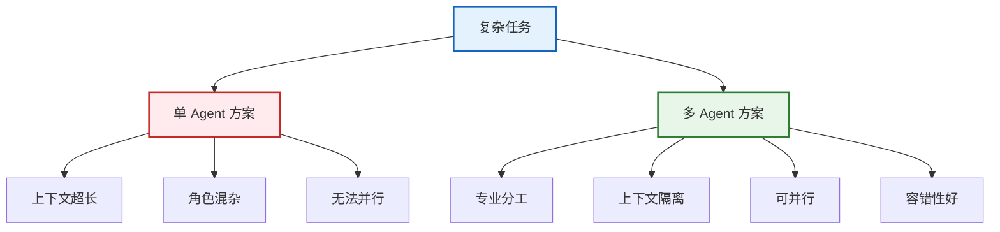
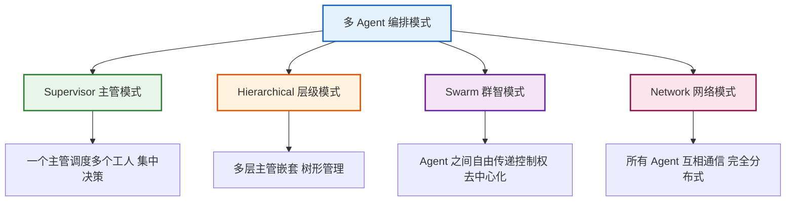
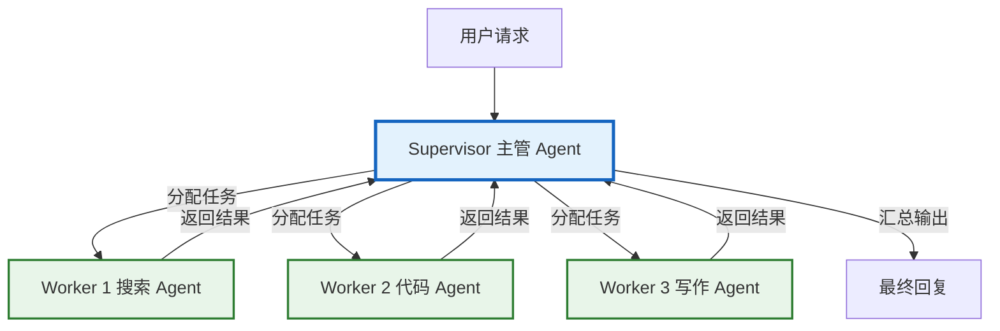
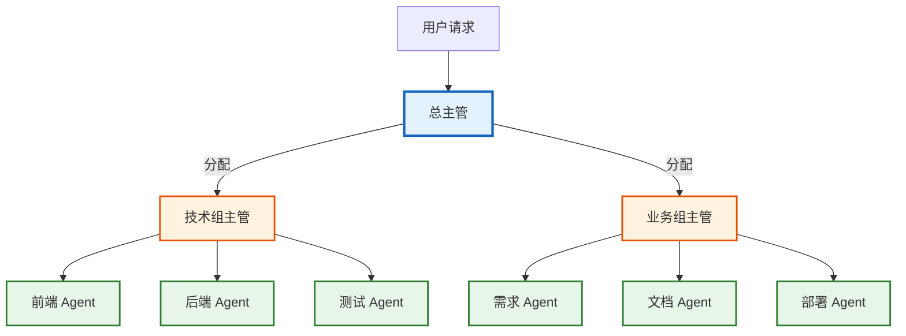
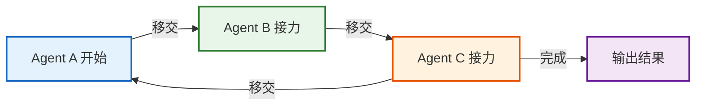
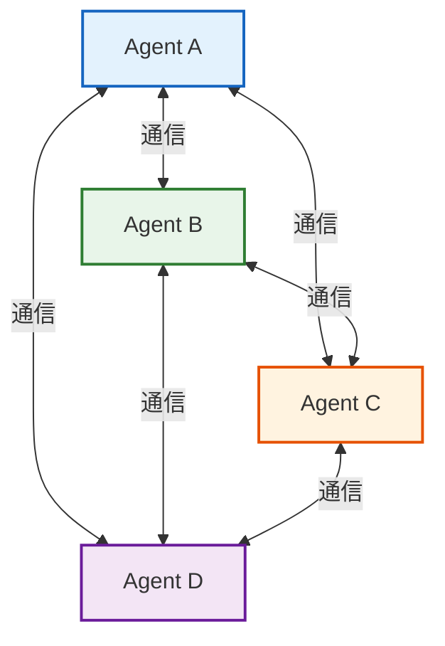
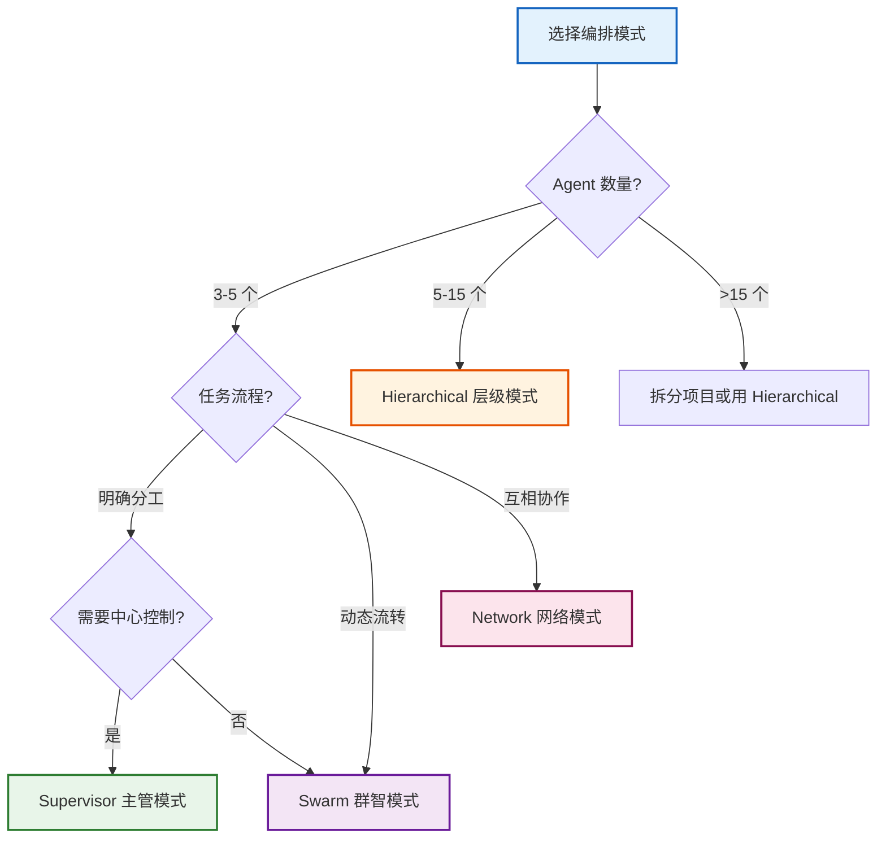

# 多 Agent 编排模式技术手册

> **知识库 20 · 技术参考**  
> 本手册系统覆盖 LangChain/LangGraph 中的多 Agent 编排模式，包括 Supervisor、Hierarchical、Swarm、Network 四大模式，含完整架构图、代码示例与选型指南。

---

## 目录

1. [多 Agent 编排概述](#1-多-agent-编排概述)
2. [Supervisor 主管模式](#2-supervisor-主管模式)
3. [Hierarchical 层级模式](#3-hierarchical-层级模式)
4. [Swarm 群智模式](#4-swarm-群智模式)
5. [Network 网络模式](#5-network-网络模式)
6. [模式对比与选型](#6-模式对比与选型)

---

## 1. 多 Agent 编排概述

### 1.1 为什么需要多 Agent

单个 Agent 在处理复杂任务时存在局限：上下文窗口限制、单一专业领域、难以并行处理。多 Agent 编排通过将任务分解给多个专业 Agent 协同完成。



### 1.2 四大编排模式总览



### 1.3 适用场景速查

| 模式 | 适用场景 | 复杂度 | 控制流 | 典型用例 |
|------|---------|--------|--------|---------|
| Supervisor | 明确分工的流水线 | 低 | 集中 | 客服系统 |
| Hierarchical | 大型复杂项目 | 中 | 层级 | 软件开发 |
| Swarm | 动态任务传递 | 中 | 去中心化 | 研究分析 |
| Network | 全互联协作 | 高 | 分布式 | 复杂决策 |

---

## 2. Supervisor 主管模式

### 2.1 架构图



### 2.2 完整实现（手动构建）

```python
from langchain_openai import ChatOpenAI
from langchain_core.messages import HumanMessage
from langgraph.graph import StateGraph, START, END
from typing import Annotated
import operator
from typing_extensions import TypedDict

class AgentState(TypedDict):
    messages: Annotated[list, operator.add]
    next_agent: str

def create_worker(name, system_prompt, tools):
    llm = ChatOpenAI(model="gpt-4o", temperature=0)
    llm_with_tools = llm.bind_tools(tools)
    def worker_node(state: AgentState):
        messages = [HumanMessage(content=system_prompt)] + state["messages"]
        response = llm_with_tools.invoke(messages)
        return {"messages": [response]}
    return worker_node

def build_supervisor_graph():
    workers = {
        "searcher": create_worker("searcher", "你是搜索专家", []),
        "coder": create_worker("coder", "你是编程专家", []),
        "writer": create_worker("writer", "你是写作专家", []),
    }
    # Supervisor 使用 LLM 决定下一步路由
    llm = ChatOpenAI(model="gpt-4o", temperature=0)
    def supervisor_node(state: AgentState):
        response = llm.invoke(
            [HumanMessage(content="分析任务，决定下一步Worker。可选: searcher/coder/writer/FINISH")]
            + state["messages"]
        )
        return {"next_agent": response.content.strip()}
    
    graph = StateGraph(AgentState)
    graph.add_node("supervisor", supervisor_node)
    for name, worker in workers.items():
        graph.add_node(name, worker)
    graph.add_edge(START, "supervisor")
    def route(state):
        nxt = state.get("next_agent", "FINISH")
        return END if nxt == "FINISH" else nxt
    graph.add_conditional_edges("supervisor", route)
    for name in workers:
        graph.add_edge(name, "supervisor")
    return graph.compile()
```

### 2.3 使用官方库

```python
from langgraph.supervisor import create_supervisor
from langgraph.prebuilt import create_react_agent

searcher = create_react_agent(
    model=ChatOpenAI(model="gpt-4o"), tools=[search_tool],
    name="searcher", prompt="你是搜索专家"
)
coder = create_react_agent(
    model=ChatOpenAI(model="gpt-4o"), tools=[code_tool],
    name="coder", prompt="你是编程专家"
)
writer = create_react_agent(
    model=ChatOpenAI(model="gpt-4o"), tools=[],
    name="writer", prompt="你是写作专家"
)
supervisor = create_supervisor(
    model=ChatOpenAI(model="gpt-4o"),
    agents=[searcher, coder, writer],
    prompt="你是任务主管，负责分配任务给合适的Agent",
)
app = supervisor.compile()
result = app.invoke({"messages": [{"role": "user", "content": "搜索信息写代码并总结"}]})
```

---

## 3. Hierarchical 层级模式

### 3.1 架构图



### 3.2 实现

```python
from langgraph.supervisor import create_supervisor
from langgraph.prebuilt import create_react_agent

# 底层 Workers
frontend = create_react_agent(
    model=ChatOpenAI(model="gpt-4o-mini"), tools=[frontend_tool],
    name="frontend_dev", prompt="你是前端开发"
)
backend = create_react_agent(
    model=ChatOpenAI(model="gpt-4o-mini"), tools=[backend_tool],
    name="backend_dev", prompt="你是后端开发"
)
tester = create_react_agent(
    model=ChatOpenAI(model="gpt-4o-mini"), tools=[test_tool],
    name="tester", prompt="你是测试工程师"
)

# 技术组子主管
tech_supervisor = create_supervisor(
    model=ChatOpenAI(model="gpt-4o"),
    agents=[frontend, backend, tester],
    prompt="你是技术组主管，协调前端后端和测试",
    supervisor_name="tech_lead"
)
tech_team = tech_supervisor.compile()

# 业务 Workers
requirement = create_react_agent(
    model=ChatOpenAI(model="gpt-4o-mini"), tools=[],
    name="requirement_analyst", prompt="你是需求分析师"
)
doc_writer = create_react_agent(
    model=ChatOpenAI(model="gpt-4o-mini"), tools=[],
    name="doc_writer", prompt="你是文档工程师"
)

# 总主管（将技术组作为一个整体 + 业务 Workers）
top_supervisor = create_supervisor(
    model=ChatOpenAI(model="gpt-4o"),
    agents=[tech_team, requirement, doc_writer],
    prompt="你是项目总管，协调技术组和业务组",
    supervisor_name="project_manager"
)
app = top_supervisor.compile()
```

### 3.3 层级模式设计要点

| 设计要点 | 说明 | 推荐 |
|---------|------|------|
| 层级深度 | 主管嵌套层数 | 2-3 层为宜 |
| 团队大小 | 每个子主管管理的 Worker 数 | 3-5 个 |
| 模型分配 | 上层用强模型，底层用快模型 | 主管 GPT-4o，Worker GPT-4o-mini |
| 状态隔离 | 每个子团队有独立状态 | 避免上下文污染 |
| 通信协议 | 层间通过消息传递 | 只传结果不传中间过程 |

---

## 4. Swarm 群智模式

### 4.1 架构图



### 4.2 核心概念：Handoff

Swarm 模式的核心是 **handoff（移交）**：Agent 通过调用 handoff 工具将控制权移交给另一个 Agent。每个 Agent 自主决定何时移交、移交给谁。

```python
from langgraph.swarm import create_swarm, create_handoff_tool
from langgraph.prebuilt import create_react_agent

# 创建 handoff 工具
handoff_to_writer = create_handoff_tool(
    agent_name="writer",
    description="当任务涉及写作时，移交给写作 Agent"
)
handoff_to_coder = create_handoff_tool(
    agent_name="coder",
    description="当任务涉及编程时，移交给编程 Agent"
)
handoff_to_searcher = create_handoff_tool(
    agent_name="searcher",
    description="当任务涉及搜索时，移交给搜索 Agent"
)

# 创建 Agents（每个 Agent 都有 handoff 工具）
searcher = create_react_agent(
    model=ChatOpenAI(model="gpt-4o"),
    tools=[search_tool, handoff_to_writer, handoff_to_coder],
    name="searcher",
    prompt="你是搜索 Agent。任务不是搜索时移交给合适 Agent。"
)
writer = create_react_agent(
    model=ChatOpenAI(model="gpt-4o"),
    tools=[write_tool, handoff_to_searcher, handoff_to_coder],
    name="writer",
    prompt="你是写作 Agent。任务不是写作时移交给合适 Agent。"
)
coder = create_react_agent(
    model=ChatOpenAI(model="gpt-4o"),
    tools=[code_tool, handoff_to_searcher, handoff_to_writer],
    name="coder",
    prompt="你是编程 Agent。任务不是编程时移交给合适 Agent。"
)

# 创建 Swarm
swarm = create_swarm(
    agents=[searcher, writer, coder],
    default_active_agent="searcher"
)
app = swarm.compile()

# 运行 - Agent 之间自动传递控制权
result = app.invoke({
    "messages": [{"role": "user", "content": "搜索信息写介绍然后写代码"}]
})
```

### 4.3 Swarm vs Supervisor 对比

| 特性 | Supervisor | Swarm |
|------|-----------|-------|
| 决策方式 | 集中（主管决定） | 去中心化（Agent 自主移交） |
| 通信开销 | 每次经过主管 | Agent 之间直接传递 |
| 控制粒度 | 全局可见 | 局部可见 |
| 适合场景 | 明确分工 | 动态流程 |
| 实现复杂度 | 较简单 | 中等 |
| Agent 自主性 | 低 | 高 |
| 可预测性 | 高 | 中 |

---

## 5. Network 网络模式

### 5.1 架构图



### 5.2 实现

```python
from langgraph.graph import StateGraph, START, END
from langgraph.prebuilt import create_react_agent
from langchain_openai import ChatOpenAI
from typing import Annotated
import operator
from typing_extensions import TypedDict

class NetworkState(TypedDict):
    messages: Annotated[list, operator.add]
    active_agents: list[str]  # 当前活跃的 Agent 列表

# 创建多个 Agent，每个都能与其他 Agent 通信
def create_network_agent(name, system_prompt, tools):
    llm = ChatOpenAI(model="gpt-4o", temperature=0)
    def agent_node(state: NetworkState):
        messages = [{"role": "system", "content": system_prompt}]
        messages += state["messages"]
        response = llm.invoke(messages)
        return {"messages": [response]}
    return agent_node

# 构建 Network 图
def build_network_graph():
    agents = {
        "analyst": create_network_agent("analyst", "你是数据分析师", []),
        "researcher": create_network_agent("researcher", "你是研究员", []),
        "critic": create_network_agent("critic", "你是审查员，负责质疑和验证", []),
        "synthesizer": create_network_agent("synthesizer", "你是综合者，负责汇总", []),
    }
    
    graph = StateGraph(NetworkState)
    for name, agent in agents.items():
        graph.add_node(name, agent)
    
    # 每个 Agent 可以路由到其他任意 Agent
    def route_agent(state: NetworkState):
        # 简化：循环调度
        last_msg = state["messages"][-1].content if state["messages"] else ""
        if "完成" in last_msg or "FINAL" in last_msg:
            return END
        # 轮转到下一个 Agent
        agent_names = list(agents.keys())
        return agent_names[len(state["messages"]) % len(agent_names)]
    
    for name in agents:
        graph.add_conditional_edges(name, route_agent)
    
    graph.add_edge(START, "analyst")
    return graph.compile()
```

### 5.3 Network 模式注意事项

| 注意点 | 说明 |
|--------|------|
| 死循环风险 | Agent 互相调用无限循环，需设最大轮次 |
| 状态膨胀 | 消息列表不断增长，需裁剪策略 |
| 收敛困难 | 难以确定何时结束，需明确终止条件 |
| 成本控制 | N 个 Agent 互相调用，token 消耗指数增长 |
| 建议轮次 | 设定 max_iterations=10-20 防止失控 |

---

## 6. 模式对比与选型

### 6.1 全面对比矩阵

| 维度 | Supervisor | Hierarchical | Swarm | Network |
|------|-----------|-------------|-------|---------|
| 控制结构 | 星形 | 树形 | 链式 | 网状 |
| 决策方式 | 集中 | 分层集中 | 去中心化 | 完全分布式 |
| Agent 数量 | 3-5 | 5-15 | 3-6 | 3-5 |
| 实现难度 | 低 | 中 | 中 | 高 |
| 可预测性 | 高 | 高 | 中 | 低 |
| 灵活性 | 中 | 中 | 高 | 最高 |
| Token 成本 | 中 | 高 | 中 | 最高 |
| 适合项目 | 中小 | 大型 | 中型 | 探索性 |

### 6.2 选型决策树



### 6.3 按场景推荐

| 场景 | 推荐模式 | 理由 |
|------|---------|------|
| 客服系统（路由到不同部门） | Supervisor | 明确分工，集中路由 |
| 软件开发项目（多角色协作） | Hierarchical | 层级管理，团队隔离 |
| 研究报告（搜索-分析-写作） | Swarm | 动态传递，灵活流转 |
| 复杂决策（多视角讨论） | Network | 全互联，多角度碰撞 |
| 简单流水线（步骤固定） | Supervisor | 最简单，最可控 |
| 用户请求不确定的通用助手 | Swarm | 自主移交，适应性强 |

---

## 相关文档

- [知识库 04：LangGraph 技术手册](./04_LangGraph技术手册.md) — LangGraph 基础
- [知识库 14：LangGraph 高级模式](./14_LangGraph高级模式技术手册.md) — 子图与人在回路
- [学习课程第 09 课：多 Agent](../学习课程/第09课_多Agent_让AI团队协作.md) — 入门概念
- [学习课程第 24 课：多 Agent 编排](../学习课程/第24课_多Agent编排_主管与层级模式.md) — 教学版
