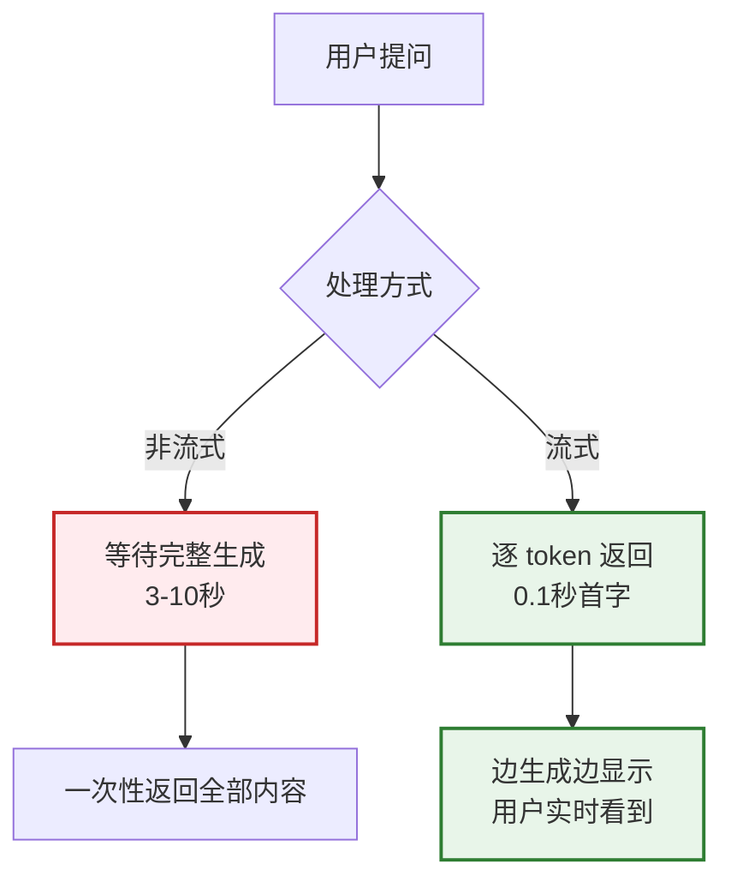
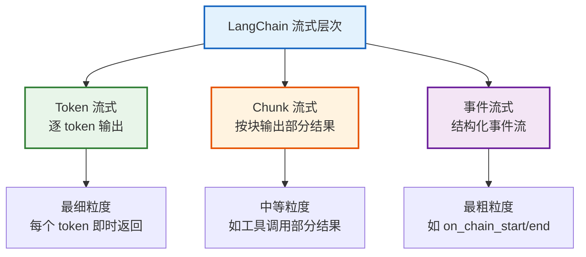
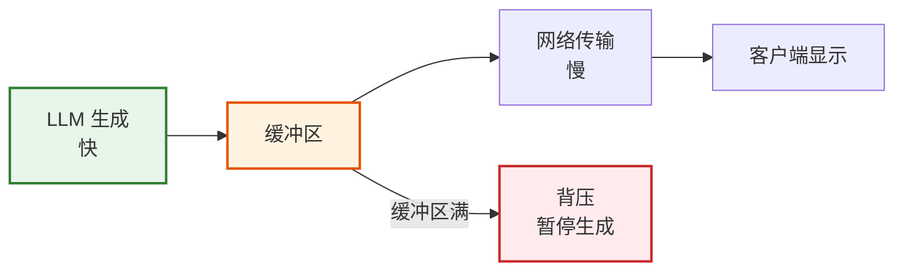

# 流式处理与异步编程技术参考

> **知识库 21 · 技术参考**  
> 本手册系统覆盖 LangChain 中的流式处理（Streaming）与异步编程（Async），包括 token 流、部分结果流、WebSocket/SSE 集成、批处理与背压处理。

---

## 目录

1. [流式处理基础](#1-流式处理基础)
2. [LangChain 流式 API](#2-langchain-流式-api)
3. [异步编程模式](#3-异步编程模式)
4. [WebSocket 与 SSE 集成](#4-websocket-与-sse-集成)
5. [批处理优化](#5-批处理优化)
6. [背压处理与性能调优](#6-背压处理与性能调优)

---

## 1. 流式处理基础

### 1.1 为什么需要流式



### 1.2 流式与非流式对比

| 维度 | 非流式 | 流式 |
|------|--------|------|
| 首字延迟 | 3-10秒 | 0.1-0.5秒 |
| 用户体验 | 等待感强 | 流畅感强 |
| 实现复杂度 | 简单 | 中等 |
| 网络利用率 | 低（一次性传输） | 高（持续传输） |
| 中断处理 | 全部重传 | 可中途停止 |
| 适用场景 | 后台任务 | 用户交互 |

### 1.3 流式层次



---

## 2. LangChain 流式 API

### 2.1 基础流式调用

```python
from langchain_openai import ChatOpenAI

llm = ChatOpenAI(model="gpt-4o", streaming=True)

# 方式 1: stream() 方法
for chunk in llm.stream("用300字介绍LangChain"):
    print(chunk.content, end="", flush=True)
# 输出: 逐 token 打印

# 方式 2: invoke() + stream_usage 配置
# invoke 不支持流式，但可以用 astream 异步流式
import asyncio

async def async_stream():
    async for chunk in llm.astream("用300字介绍LangChain"):
        print(chunk.content, end="", flush=True)

asyncio.run(async_stream())
```

### 2.2 Chain 流式

```python
from langchain_core.prompts import ChatPromptTemplate
from langchain_openai import ChatOpenAI

prompt = ChatPromptTemplate.from_messages([
    ("system", "你是一个专业的技术写作助手"),
    ("human", "{topic}")
])

chain = prompt | ChatOpenAI(model="gpt-4o") | {"output": lambda x: x.content}

# 流式获取 Chain 输出
for chunk in chain.stream({"topic": "LangChain RAG"}):
    if "output" in chunk:
        print(chunk["output"], end="", flush=True)
```

### 2.3 流式事件（astream_events）

```python
from langchain_openai import ChatOpenAI
from langchain_core.prompts import ChatPromptTemplate
import asyncio

llm = ChatOpenAI(model="gpt-4o")
prompt = ChatPromptTemplate.from_messages([
    ("system", "你是技术助手"),
    ("human", "{input}")
])
chain = prompt | llm

async def stream_with_events():
    """使用 astream_events 获取结构化事件流"""
    async for event in chain.astream_events(
        {"input": "介绍LangChain"},
        version="v2"
    ):
        kind = event["event"]
        
        if kind == "on_chat_model_start":
            print(f"\n[模型开始调用]")
        
        elif kind == "on_chat_model_stream":
            # 逐 token 流式输出
            chunk = event["data"]["chunk"]
            if chunk.content:
                print(chunk.content, end="", flush=True)
        
        elif kind == "on_chat_model_end":
            print(f"\n[模型调用结束]")
        
        elif kind == "on_chain_start":
            print(f"[Chain 开始: {event['name']}]")
        
        elif kind == "on_chain_end":
            print(f"[Chain 结束: {event['name']}]")

asyncio.run(stream_with_events())
```

### 2.4 事件类型完整列表

| 事件 | 触发时机 | 常用字段 |
|------|---------|---------|
| on_chain_start | Chain 开始执行 | name, input |
| on_chain_end | Chain 执行完成 | name, output |
| on_chain_stream | Chain 中间输出 | data |
| on_chat_model_start | LLM 开始调用 | name |
| on_chat_model_stream | LLM 逐 token 输出 | chunk |
| on_chat_model_end | LLM 调用完成 | output |
| on_tool_start | 工具开始执行 | name, input |
| on_tool_end | 工具执行完成 | name, output |
| on_retriever_start | 检索开始 | name |
| on_retriever_end | 检索完成 | documents |
| on_prompt_start | Prompt 模板渲染 | name |
| on_prompt_end | Prompt 渲染完成 | prompt |

---

## 3. 异步编程模式

### 3.1 同步 vs 异步

```python
import asyncio
import time
from langchain_openai import ChatOpenAI

llm = ChatOpenAI(model="gpt-4o-mini")

# 同步：串行执行
def sync_batch():
    start = time.time()
    results = []
    for q in ["问题1", "问题2", "问题3"]:
        r = llm.invoke(q)
        results.append(r.content)
    print(f"同步耗时: {time.time()-start:.1f}s")  # ~6s
    return results

# 异步：并行执行
async def async_batch():
    start = time.time()
    tasks = [llm.ainvoke(q) for q in ["问题1", "问题2", "问题3"]]
    results = await asyncio.gather(*tasks)
    print(f"异步耗时: {time.time()-start:.1f}s")  # ~2s
    return [r.content for r in results]

# 异步流式
async def async_stream_batch():
    start = time.time()
    tasks = [llm.astream(q) for q in ["问题1", "问题2", "问题3"]]
    # 并行流式
    async def consume(aiter, idx):
        result = ""
        async for chunk in aiter:
            result += chunk.content
        return result
    
    consumers = [consume(t, i) for i, t in enumerate(tasks)]
    results = await asyncio.gather(*consumers)
    print(f"异步流式耗时: {time.time()-start:.1f}s")
    return results
```

### 3.2 异步 Chain

```python
from langchain_core.prompts import ChatPromptTemplate
from langchain_openai import ChatOpenAI
from langchain_core.runnables import RunnableParallel

# 异步 Chain
prompt = ChatPromptTemplate.from_template("{topic} 的最新进展")
chain = prompt | ChatOpenAI(model="gpt-4o")

# 并行处理多个输入
parallel_chain = RunnableParallel(
    branch_a=chain,
    branch_b=chain,
    branch_c=chain,
)

async def run_parallel():
    result = await parallel_chain.ainvoke({
        "topic": "LangChain",
    })
    # 等效于同时调用 3 次链
    print(result["branch_a"].content[:100])
    print(result["branch_b"].content[:100])
    print(result["branch_c"].content[:100])

asyncio.run(run_parallel())
```

### 3.3 异步 RAG

```python
from langchain_community.vectorstores import Chroma
from langchain_openai import OpenAIEmbeddings, ChatOpenAI
from langchain_core.prompts import ChatPromptTemplate

embeddings = OpenAIEmbeddings()
vectorstore = Chroma(embedding_function=embeddings)
retriever = vectorstore.as_retriever()
llm = ChatOpenAI(model="gpt-4o")

prompt = ChatPromptTemplate.from_messages([
    ("system", "基于以下上下文回答问题：\n{context}"),
    ("human", "{question}")
])

# 异步 RAG 链
async def async_rag(question: str):
    # 异步检索 + 异步生成（并行）
    docs_task = retriever.ainvoke(question)
    # 可以同时做其他异步操作
    context = "\n".join(doc.page_content for doc in await docs_task)
    response = await llm.ainvoke(prompt.format(
        context=context, question=question
    ))
    return response.content

# 并行处理多个问题
async def batch_rag(questions: list[str]):
    tasks = [async_rag(q) for q in questions]
    return await asyncio.gather(*tasks)

result = asyncio.run(batch_rag(["什么是RAG?", "什么是LangGraph?"]))
```

---

## 4. WebSocket 与 SSE 集成

### 4.1 FastAPI + SSE 流式

```python
from fastapi import FastAPI
from fastapi.responses import StreamingResponse
from langchain_openai import ChatOpenAI
import asyncio, json

app = FastAPI()
llm = ChatOpenAI(model="gpt-4o", streaming=True)

@app.get("/chat")
async def chat(q: str):
    """SSE 端点：逐 token 推送给前端"""
    async def event_stream():
        async for chunk in llm.astream(q):
            if chunk.content:
                # SSE 格式：data: {json}\n\n
                yield f"data: {json.dumps({'content': chunk.content}, ensure_ascii=False)}\n\n"
        yield f"data: {json.dumps({'done': True})}\n\n"
    
    return StreamingResponse(
        event_stream(),
        media_type="text/event-stream"
    )

# 前端接收（JavaScript）
"""
const eventSource = new EventSource('/chat?q=介绍LangChain');
eventSource.onmessage = (e) => {
    const data = JSON.parse(e.data);
    if (data.done) { eventSource.close(); return; }
    document.getElementById('output').textContent += data.content;
};
"""
```

### 4.2 WebSocket 流式

```python
from fastapi import FastAPI, WebSocket
from langchain_openai import ChatOpenAI
import asyncio

app = FastAPI()
llm = ChatOpenAI(model="gpt-4o", streaming=True)

@app.websocket("/ws/chat")
async def websocket_chat(ws: WebSocket):
    await ws.accept()
    try:
        while True:
            msg = await ws.receive_text()
            # 流式返回
            async for chunk in llm.astream(msg):
                if chunk.content:
                    await ws.send_text(chunk.content)
            await ws.send_text("[DONE]")
    except Exception as e:
        print(f"WebSocket 断开: {e}")
    finally:
        await ws.close()
```

### 4.3 LangServe 流式

```python
from langserve import add_routes
from langchain_openai import ChatOpenAI
from langchain_core.prompts import ChatPromptTemplate
from fastapi import FastAPI

app = FastAPI()

prompt = ChatPromptTemplate.from_template("{question}")
chain = prompt | ChatOpenAI(model="gpt-4o")

# LangServe 自动支持流式端点
add_routes(app, chain, path="/chat")
# 访问 /chat/stream 获取流式输出
# 访问 /chat/invoke 获取非流式输出
```

---

## 5. 批处理优化

### 5.1 批量调用 API

```python
from langchain_openai import ChatOpenAI
import asyncio

llm = ChatOpenAI(model="gpt-4o")

# 方式 1: batch() 方法（内置并发）
results = llm.batch(["问题1", "问题2", "问题3", "问题4", "问题5"])
# 自动并发处理，默认 max_concurrency=5

# 方式 2: 自定义并发度
results = llm.batch(
    [f"问题{i}" for i in range(20)],
    config={"max_concurrency": 10}  # 同时最多 10 个请求
)

# 方式 3: 异步 batch
async def async_batch():
    results = await llm.abatch(["问题1", "问题2", "问题3"])
    return results

# 方式 4: Chain 批处理
from langchain_core.prompts import ChatPromptTemplate
prompt = ChatPromptTemplate.from_template("总结: {text}")
chain = prompt | llm

texts = [f"文本内容{i}" for i in range(10)]
results = chain.batch(
    [{"text": t} for t in texts],
    config={"max_concurrency": 5}
)
```

### 5.2 批处理 RAG

```python
async def batch_rag_pipeline(questions: list[str], batch_size=5):
    """批量 RAG 处理，带并发控制"""
    all_results = []
    
    for i in range(0, len(questions), batch_size):
        batch = questions[i:i + batch_size]
        # 并行处理一个批次
        tasks = [async_rag(q) for q in batch]
        results = await asyncio.gather(*tasks)
        all_results.extend(results)
        print(f"已完成 {min(i+batch_size, len(questions))}/{len(questions)}")
    
    return all_results

# 大规模处理
questions = [f"问题{i}" for i in range(100)]
results = asyncio.run(batch_rag_pipeline(questions, batch_size=10))
```

---

## 6. 背压处理与性能调优

### 6.1 背压问题



### 6.2 背压处理代码

```python
import asyncio
from collections import deque

class BackpressureStream:
    """带背压控制的流式处理器"""
    
    def __init__(self, max_buffer=100):
        self.queue = deque()
        self.max_buffer = max_buffer
        self._event = asyncio.Event()
        self._closed = False
    
    async def put(self, item):
        """生产者：放入数据（背压控制）"""
        while len(self.queue) >= self.max_buffer:
            # 缓冲区满，等待消费者
            self._event.clear()
            await self._event.wait()
        self.queue.append(item)
    
    async def get(self):
        """消费者：取出数据"""
        while not self.queue and not self._closed:
            await asyncio.sleep(0.01)
        if not self.queue and self._closed:
            return None
        item = self.queue.popleft()
        self._event.set()  # 通知生产者可以继续
        return item
    
    def close(self):
        self._closed = True
        self._event.set()
```

### 6.3 性能调优清单

| 调优项 | 说明 | 推荐值 |
|--------|------|--------|
| max_concurrency | 并发请求数 | 5-20（取决于 API 限制） |
| chunk_timeout | 单 token 超时 | 30s |
| total_timeout | 总超时 | 120s |
| buffer_size | 缓冲区大小 | 100-500 |
| retry_count | 重试次数 | 3 |
| retry_delay | 重试间隔 | 指数退避 1s/2s/4s |
| batch_size | 批处理大小 | 5-10 |

### 6.4 监控指标

```python
import time
from contextlib import asynccontextmanager

@asynccontextmanager
async def track_stream_metrics():
    """流式性能监控"""
    metrics = {
        "start_time": time.time(),
        "first_token_time": None,
        "token_count": 0,
        "total_tokens": 0,
    }
    
    class TokenTracker:
        def __init__(self):
            self.metrics = metrics
        def on_token(self, token: str):
            if metrics["first_token_time"] is None:
                metrics["first_token_time"] = time.time()
            metrics["token_count"] += 1
            metrics["total_tokens"] += len(token)
    
    tracker = TokenTracker()
    yield tracker
    
    # 计算指标
    total_time = time.time() - metrics["start_time"]
    first_token_delay = (metrics["first_token_time"] - metrics["start_time"]) if metrics["first_token_time"] else 0
    tokens_per_sec = metrics["token_count"] / total_time if total_time > 0 else 0
    
    print(f"首 token 延迟: {first_token_delay:.2f}s")
    print(f"总耗时: {total_time:.2f}s")
    print(f"Token 数: {metrics['token_count']}")
    print(f"Tokens/s: {tokens_per_sec:.1f}")

# 使用
async def stream_with_monitoring():
    async with track_stream_metrics() as tracker:
        async for chunk in llm.astream("介绍LangChain"):
            tracker.on_token(chunk.content)
            print(chunk.content, end="", flush=True)

asyncio.run(stream_with_monitoring())
```

---

## 相关文档

- [知识库 05：API 集成与部署](./05_API集成与部署技术手册.md) — 部署基础
- [知识库 07：LCEL 深入](./07_LCEL深入技术手册.md) — Runnable 接口
- [知识库 12：生产部署与可观测性](./12_生产部署模式与可观测性技术参考.md) — 监控
- [学习课程第 25 课：流式处理](../学习课程/第25课_流式处理_让AI回复如流水.md) — 教学版
