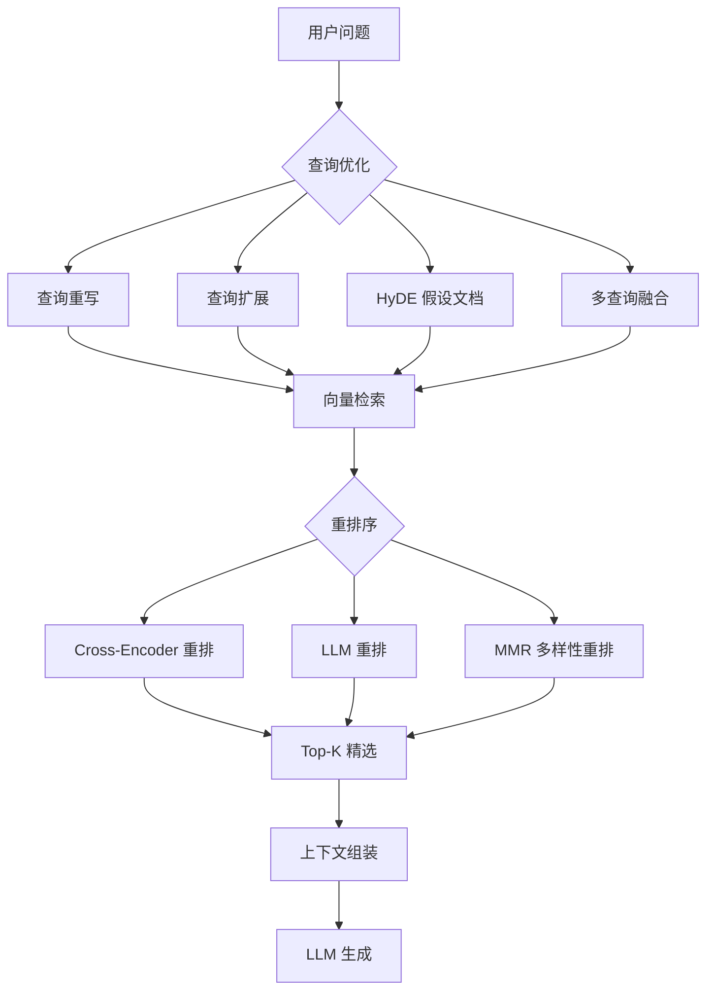
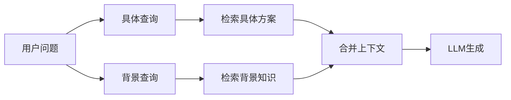
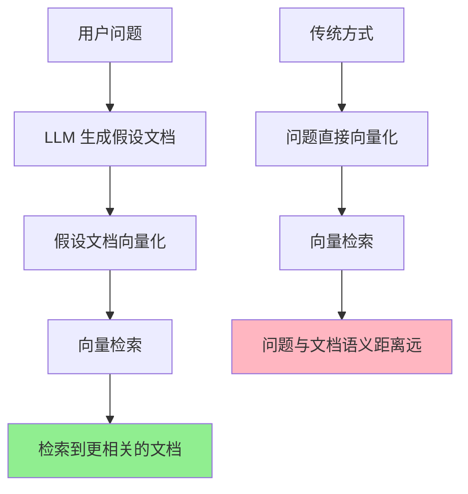
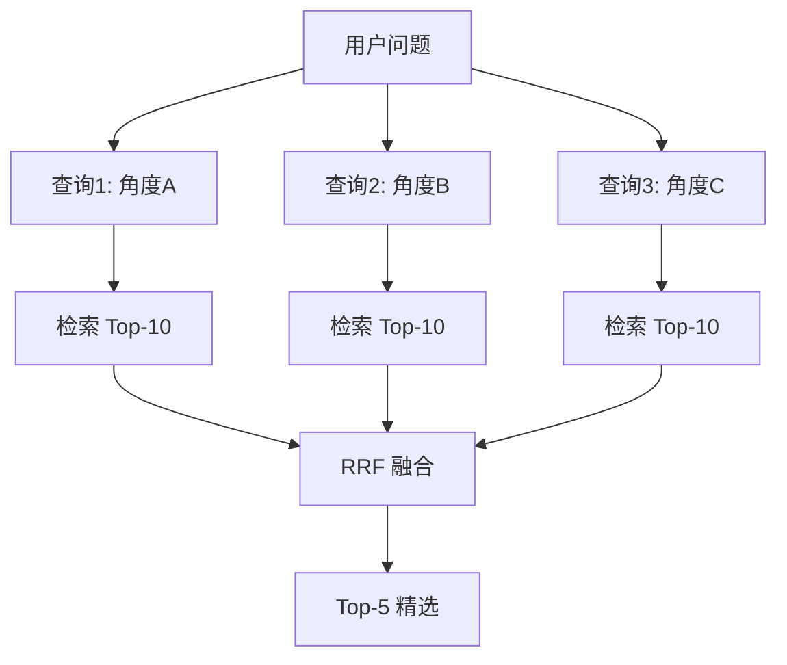
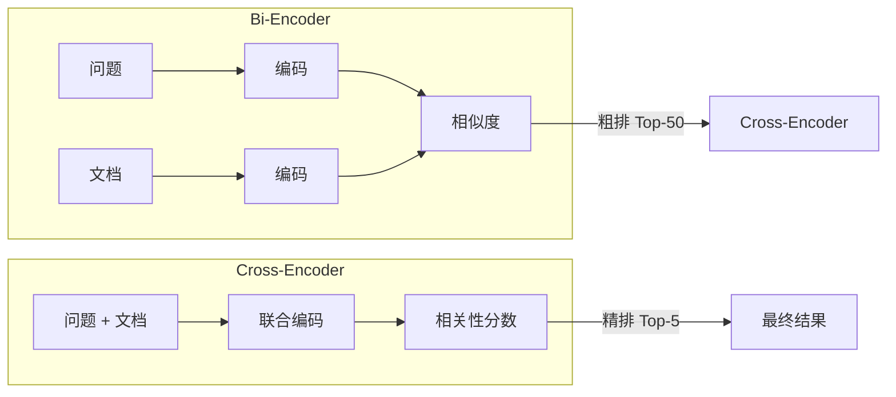
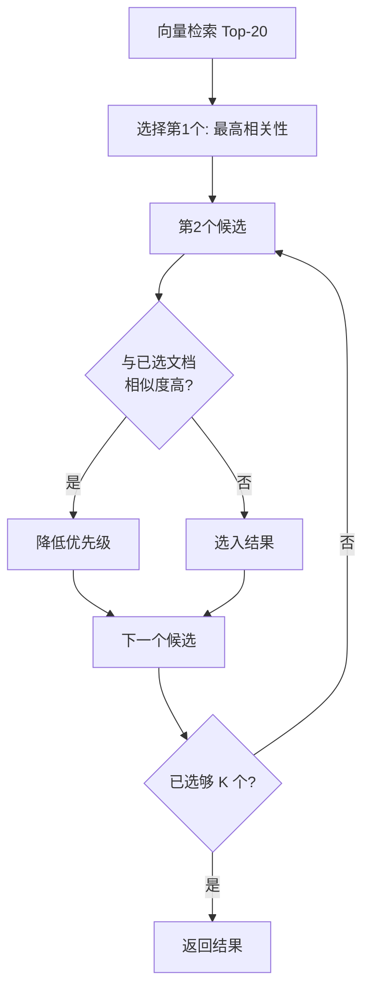

# 高级 RAG 优化——重排与查询变换技术参考

> **定位**：技术参考手册 | **前置知识**：第07课 RAG入门、第12课 高级RAG、第20课 RAG架构模式 | **难度**：高级

---

## 1. RAG 优化全景

标准 RAG 流程（检索→生成）存在四大瓶颈，高级优化逐一解决：



### 四大瓶颈与对应优化

| 瓶颈 | 症状 | 优化技术 |
|------|------|---------|
| 查询表达差 | 用户口语化，检索不准 | 查询重写/扩展 |
| 向量召回有噪声 | Top-K 含不相关文档 | 重排序 |
| 上下文冗余 | 文档内容重复 | MMR 去冗余 |
| 检索缺口 | 单一查询遗漏信息 | 多查询融合 |

---

## 2. 查询重写（Query Rewriting）

### LLM 查询重写

```python
from langchain_openai import ChatOpenAI
from langchain_core.prompts import ChatPromptTemplate

rewrite_prompt = ChatPromptTemplate.from_messages([
    ("system", """你是一个查询重写专家。将用户的口语化问题重写为更适合检索的查询。
    
规则：
1. 保留原始意图
2. 使用关键词而非完整句子
3. 去除停用词
4. 添加相关同义词
5. 输出格式：重写后的查询，一行一个"""),
    ("human", "原始问题: {question}")
])

llm = ChatOpenAI(temperature=0)
rewrite_chain = rewrite_prompt | llm

# 示例
result = rewrite_chain.invoke({"question": "怎么用Python读取一个CSV文件"})
# 输出: "Python read CSV file\ncsv模块 pandas read_csv\n文件读取 数据导入"
```

### 步骤回退（Step-Back Prompting）

```python
step_back_prompt = ChatPromptTemplate.from_messages([
    ("system", """你是一个问题分析专家。对于用户的具体问题，生成一个更宽泛的背景问题。

示例：
- 具体问题: "Python的pandas库怎么读取CSV"
- 背景问题: "Python有哪些处理CSV文件的方法和库"

- 具体问题: "BERT模型的注意力机制怎么工作"
- 背景问题: "Transformer架构中注意力机制的原理是什么"
"""),
    ("human", "具体问题: {question}\n\n背景问题:")
])

step_back_chain = step_back_prompt | llm

# 用背景问题检索通用知识，用具体问题检索具体方案
question = "LangChain的ConversationBufferMemory怎么设置滑动窗口"
bg_result = step_back_chain.invoke({"question": question})
# 背景问题: "LangChain有哪些记忆类型和配置方法"
```



---

## 3. HyDE——假设文档嵌入

HyDE（Hypothetical Document Embeddings）：先让 LLM 生成一个假设性回答文档，用该文档去向量检索。

```python
from langchain_openai import ChatOpenAI
from langchain_core.prompts import ChatPromptTemplate

# 步骤1：生成假设文档
hyde_prompt = ChatPromptTemplate.from_messages([
    ("system", "请为以下问题写一段200字左右的假设性回答文档。即使不确定也要给出合理推测。"),
    ("human", "问题: {question}\n\n假设文档:")
])

llm = ChatOpenAI(temperature=0.3)
hyde_chain = hyde_prompt | llm

# 步骤2：用假设文档而非原始问题去检索
question = "如何优化RAG系统的检索准确率"
hypothetical_doc = hyde_chain.invoke({"question": question}).content

# 用假设文档检索（比原始问题更接近答案的向量空间）
docs = vectorstore.similarity_search(hypothetical_doc, k=5)
```



### HyDE vs 传统检索对比

| 维度 | 传统检索 | HyDE |
|------|---------|------|
| 检索输入 | 问题原文 | 假设文档 |
| 语义距离 | 问题↔答案（远） | 假设答案↔真实答案（近） |
| 额外成本 | 无 | 1次LLM调用 |
| 效果提升 | 基准 | +10-25% |
| 适用场景 | 简单关键词查询 | 复杂/抽象问题 |

---

## 4. 多查询融合（Multi-Query Fusion）

### 生成多视角查询

```python
from langchain_openai import ChatOpenAI
from langchain_core.prompts import ChatPromptTemplate

multi_query_prompt = ChatPromptTemplate.from_messages([
    ("system", """你是一个搜索策略专家。为用户问题生成3个不同角度的检索查询。

要求：
1. 每个查询从不同角度切入
2. 使用不同的关键词组合
3. 覆盖问题的不同方面
4. 每行一个查询"""),
    ("human", "问题: {question}\n\n查询:")
])

llm = ChatOpenAI(temperature=0)
multi_query_chain = multi_query_prompt | llm

question = "如何构建一个高性能的RAG系统"
queries_text = multi_query_chain.invoke({"question": question}).content
queries = [q.strip() for q in queries_text.strip().split("\n") if q.strip()]
# ["RAG系统架构设计 组件选型", "检索增强生成 性能优化 延迟降低", "向量检索 准确率 召回率 提升"]
```

### RRF 融合算法

```python
from collections import defaultdict

def reciprocal_rank_fusion(
    results_list: list[list],
    k: int = 60
) -> list:
    """Reciprocal Rank Fusion 融合多路检索结果"""
    scores = defaultdict(float)
    
    for results in results_list:
        for rank, doc in enumerate(results, 1):
            # RRF 公式: score += 1 / (k + rank)
            scores[doc.page_content] += 1.0 / (k + rank)
    
    # 按融合分数排序
    ranked = sorted(scores.items(), key=lambda x: -x[1])
    return ranked[:5]  # 返回Top-5

# 对每个查询分别检索，然后融合
all_results = []
for query in queries:
    docs = vectorstore.similarity_search(query, k=10)
    all_results.append(docs)

fused_results = reciprocal_rank_fusion(all_results)
```



---

## 5. Cross-Encoder 重排序

向量检索用 Bi-Encoder（双编码器），速度快但精度有限；Cross-Encoder（交叉编码器）将问题和文档一起输入，精度高但慢。



### 使用 Cohere Reranker

```python
from langchain_cohere import CohereRerank
from langchain_community.vectorstores import FAISS

# 第一步：向量检索召回 Top-50（高召回率）
retriever = vectorstore.as_retriever(search_kwargs={"k": 50})

# 第二步：Cross-Encoder 重排序 Top-5（高精度）
compressor = CohereRerank(
    model="rerank-multilingual-v3.0",
    top_n=5  # 重排后保留前5个
)

from langchain.retrievers import ContextualCompressionRetriever
rerank_retriever = ContextualCompressionRetriever(
    base_compressor=compressor,
    base_retriever=retriever
)

# 使用
docs = rerank_retriever.invoke("如何优化RAG性能")
# 返回经过 Cross-Encoder 精排的 Top-5 文档
```

### 使用 HuggingFace Cross-Encoder

```python
from langchain.retrievers.document_compressors import DocumentConverter
from sentence_transformers import CrossEncoder

class LocalReranker:
    """本地 Cross-Encoder 重排序"""
    
    def __init__(self, model_name: str = "BAAI/bge-reranker-base"):
        self.model = CrossEncoder(model_name)
    
    def rerank(self, query: str, documents: list, top_k: int = 5) -> list:
        # 构造 query-doc 对
        pairs = [[query, doc.page_content] for doc in documents]
        # 计算相关性分数
        scores = self.model.predict(pairs)
        # 按分数排序
        ranked = sorted(zip(documents, scores), key=lambda x: -x[1])
        return [doc for doc, score in ranked[:top_k]]

reranker = LocalReranker()
reranked_docs = reranker.rerank("查询内容", retrieved_docs, top_k=5)
```

---

## 6. MMR——最大边际相关性

MMR（Maximal Marginal Relevance）在相关性和多样性之间取平衡，避免返回内容重复的文档。

```python
from langchain_community.vectorstores import FAISS

# MMR 检索
retriever = vectorstore.as_retriever(
    search_type="mmr",
    search_kwargs={
        "k": 5,              # 最终返回5个
        "fetch_k": 20,       # 先召回20个候选
        "lambda_mult": 0.5   # 0=最大多样性, 1=最大相关性
    }
)

docs = retriever.invoke("LangChain的特点")
```



### lambda 参数调优

| lambda_mult | 效果 | 适用场景 |
|-------------|------|---------|
| 0.0 | 最大多样性 | 覆盖面广的信息检索 |
| 0.3 | 偏多样性 | 多角度信息汇总 |
| 0.5 | 均衡（默认） | 通用场景 |
| 0.7 | 偏相关性 | 精确答案查找 |
| 1.0 | 最大相关性 | 单一精确答案 |

---

## 7. LLM 重排序

用 LLM 对检索结果进行语义级别重排，灵活性最高。

```python
from langchain_openai import ChatOpenAI
from langchain_core.prompts import ChatPromptTemplate

rerank_prompt = ChatPromptTemplate.from_messages([
    ("system", """你是一个文档相关性评估专家。对以下文档按照与问题的相关性排序。

输出格式：只输出排序后的文档编号，逗号分隔，如：3,1,4,2,5

评分标准：
- 5: 直接回答问题
- 4: 部分回答问题
- 3: 提供相关背景
- 2: 间接相关
- 1: 不相关"""),
    ("human", "问题: {question}\n\n文档:\n{documents}\n\n排序:")
])

llm = ChatOpenAI(temperature=0, model="gpt-4")
rerank_chain = rerank_prompt | llm

def llm_rerank(question: str, docs: list, top_k: int = 5) -> list:
    """LLM 重排序"""
    # 格式化文档
    doc_text = "\n".join(
        f"[{i+1}] {d.page_content[:200]}" for i, d in enumerate(docs)
    )
    result = rerank_chain.invoke({
        "question": question, "documents": doc_text
    }).content
    
    # 解析排序结果
    try:
        order = [int(x.strip()) - 1 for x in result.split(",")]
        return [docs[i] for i in order[:top_k]]
    except:
        return docs[:top_k]  # fallback
```

---

## 8. 检索评估指标

```python
def evaluate_retrieval(
    retrieved_docs: list,
    relevant_docs: set,
    k: int = 5
) -> dict:
    """评估检索质量"""
    retrieved_set = set(d.page_content[:100] for d in retrieved_docs[:k])
    
    # 精确率：检索到的相关文档比例
    precision = len(retrieved_set & relevant_docs) / len(retrieved_set) if retrieved_set else 0
    
    # 召回率：相关文档被检索到的比例
    recall = len(retrieved_set & relevant_docs) / len(relevant_docs) if relevant_docs else 0
    
    # MRR：第一个相关文档的倒数排名
    mrr = 0
    for i, doc in enumerate(retrieved_docs[:k], 1):
        if doc.page_content[:100] in relevant_docs:
            mrr = 1 / i
            break
    
    # NDCG：考虑排序位置的增益
    import math
    dcg = sum(
        (1 if retrieved_docs[i].page_content[:100] in relevant_docs else 0) / math.log(i + 2, 2)
        for i in range(min(k, len(retrieved_docs)))
    )
    idcg = sum(1 / math.log(i + 2, 2) for i in range(min(k, len(relevant_docs))))
    ndcg = dcg / idcg if idcg > 0 else 0
    
    return {
        "precision@k": round(precision, 4),
        "recall@k": round(recall, 4),
        "mrr": round(mrr, 4),
        "ndcg@k": round(ndcg, 4)
    }
```

| 指标 | 含义 | 适用场景 |
|------|------|---------|
| Precision@K | Top-K 中相关文档占比 | 评估精度 |
| Recall@K | 相关文档被召回比例 | 评估覆盖 |
| MRR | 首个相关文档排名倒数 | 评估排序 |
| NDCG | 考虑位置折扣的增益 | 综合评估 |

---

## 9. 完整优化管线

```python
from langchain_openai import ChatOpenAI
from langchain_community.vectorstores import FAISS
from langchain_cohere import CohereRerank
from langchain.retrievers import ContextualCompressionRetriever

class OptimizedRAGPipeline:
    """集成所有优化的 RAG 管线"""
    
    def __init__(self, vectorstore, llm, reranker):
        self.vectorstore = vectorstore
        self.llm = llm
        self.reranker = reranker
    
    def retrieve(self, question: str, top_k: int = 5) -> list:
        """优化检索管线"""
        # 1. 查询重写
        rewritten = self.rewrite_query(question)
        
        # 2. 多视角查询 + RRF 融合
        multi_queries = self.generate_multi_queries(question)
        all_docs = []
        for q in [rewritten] + multi_queries:
            docs = self.vectorstore.similarity_search(q, k=20)
            all_docs.append(docs)
        fused = self.rrf_fuse(all_docs, top_k=20)
        
        # 3. Cross-Encoder 重排
        reranked = self.reranker.rerank(question, fused, top_k=10)
        
        # 4. MMR 去冗余
        final = self.mmr_select(question, reranked, top_k=top_k)
        return final
    
    def rewrite_query(self, q):
        # 简化实现
        return q
    
    def generate_multi_queries(self, q):
        return [q]  # 简化实现
    
    def rrf_fuse(self, results, top_k=20):
        from collections import defaultdict
        scores = defaultdict(float)
        for docs in results:
            for rank, doc in enumerate(docs, 1):
                scores[doc.page_content[:100]] += 1.0 / (60 + rank)
        return sorted(scores.items(), key=lambda x: -x[1])[:top_k]
    
    def mmr_select(self, query, docs, top_k=5):
        return docs[:top_k]  # 简化实现
    
    def generate(self, question: str) -> str:
        docs = self.retrieve(question)
        context = "\n\n".join(d.page_content if isinstance(d, str) else str(d) for d in docs)
        return self.llm.invoke(
            f"上下文:\n{context}\n\n问题: {question}"
        ).content
```

---

## 10. 优化效果对比与选型


| 优化技术 | 效果提升 | 额外成本 | 推荐优先级 |
|---------|---------|---------|-----------|
| Cross-Encoder 重排 | +20-30% | API 调用 | ★★★★★ |
| 查询重写 | +10-15% | 1次LLM调用 | ★★★★ |
| MMR 去冗余 | +5-10% | 几乎无成本 | ★★★★ |
| 多查询融合 | +10-20% | N次检索+LLM | ★★★ |
| HyDE | +10-25% | 1次LLM调用 | ★★★ |
| 步骤回退 | +5-15% | 1次LLM调用 | ★★ |

实施建议：先加 Cross-Encoder 重排（性价比最高），再加查询重写和 MMR，最后考虑多查询和 HyDE。
