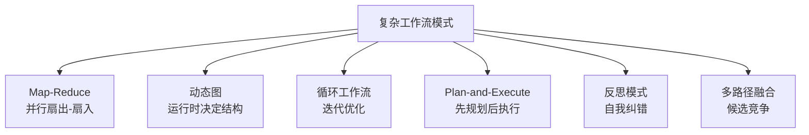
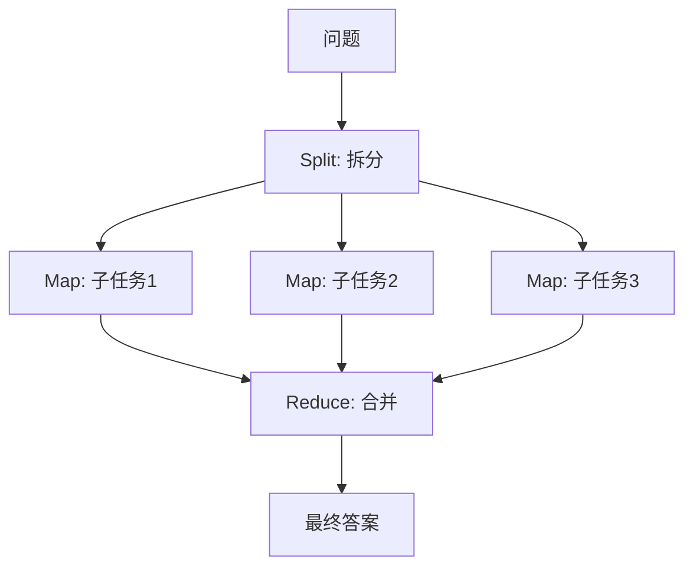
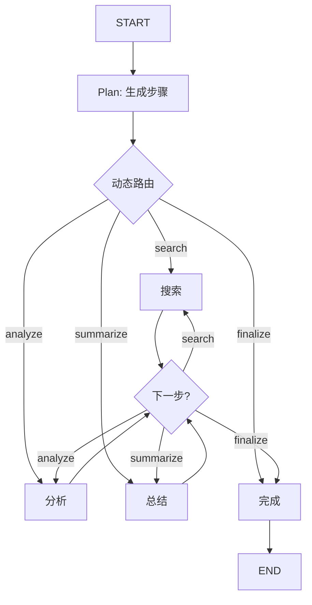
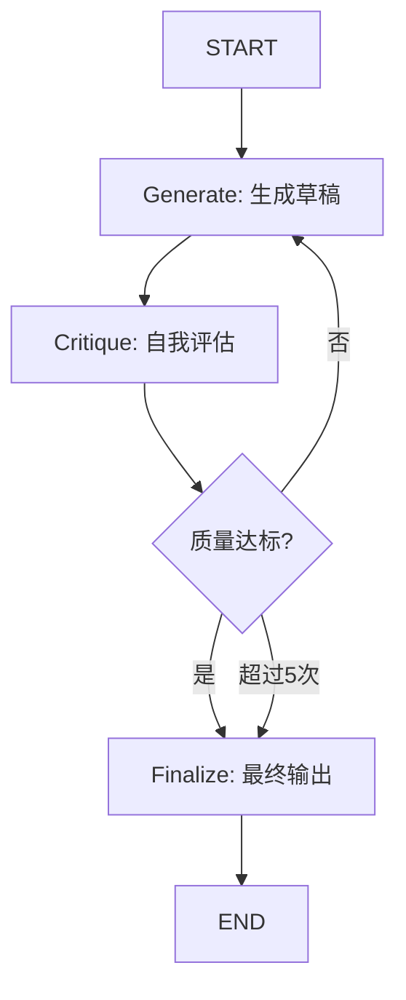
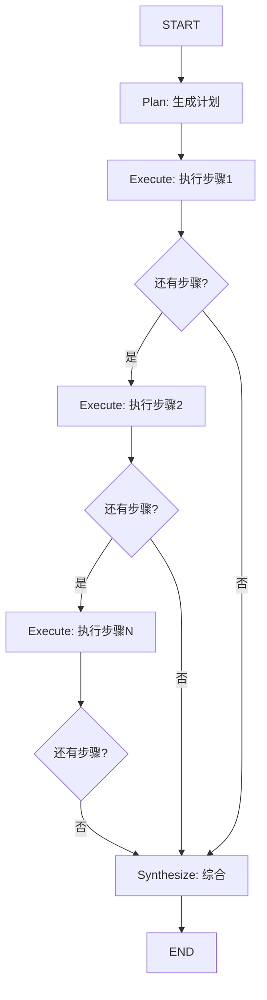
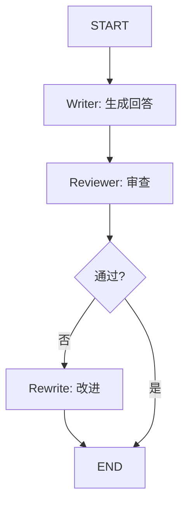
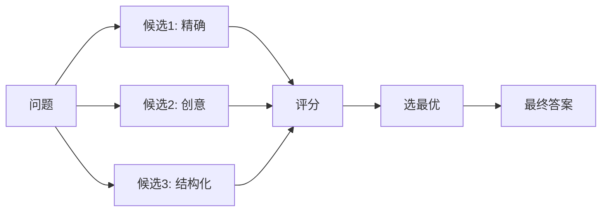
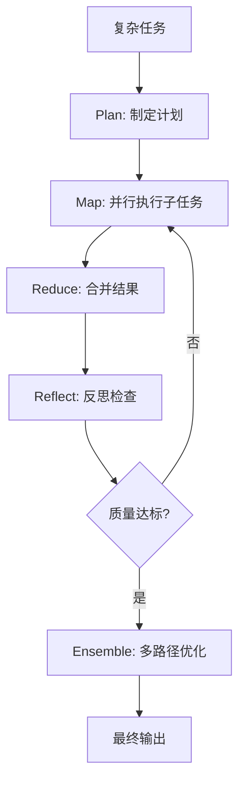
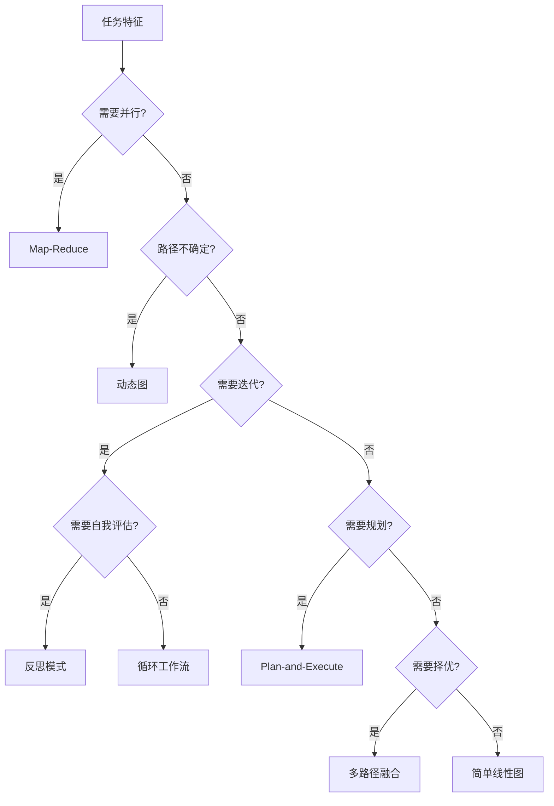

# LangGraph 复杂工作流模式技术手册

> **定位**：技术参考手册 | **前置知识**：KB 14 LangGraph高级模式、KB 24 状态管理 | **难度**：高级

---

## 1. 复杂工作流模式全景

LangGraph 的高级价值在于构建**非线性的、自适应的**复杂工作流。



| 模式 | 核心思想 | 适用场景 |
|------|---------|---------|
| Map-Reduce | 分解→并行处理→合并 | 大批量数据处理 |
| 动态图 | 运行时构建图结构 | 条件分支多变 |
| 循环工作流 | 迭代直到满足条件 | 优化、纠错 |
| Plan-and-Execute | 先做计划再逐步执行 | 复杂多步任务 |
| 反思模式 | 执行后自我评估并修正 | 提高质量 |
| 多路径融合 | 多个候选并行竞争择优 | 创意生成、答案优选 |

---

## 2. Map-Reduce 模式

将大任务分解为子任务并行执行，再合并结果。

```python
from langgraph.graph import StateGraph, END, START
from typing import Annotated, TypedDict
from operator import add
import concurrent.futures

class MapReduceState(TypedDict):
    question: str
    sub_tasks: list
    results: Annotated[list, add]
    final_answer: str

def split_node(state: MapReduceState):
    """将问题拆分为子任务"""
    question = state["question"]
    sub_tasks = [
        f"分析: {question} - 历史维度",
        f"分析: {question} - 技术维度",
        f"分析: {question} - 商业维度",
    ]
    return {"sub_tasks": sub_tasks}

def map_node(state: MapReduceState):
    """并行处理每个子任务"""
    results = []
    for task in state["sub_tasks"]:
        # 实际中可用 concurrent.futures 或 asyncio 并行
        result = llm.invoke(task).content
        results.append(result)
    return {"results": results}

def reduce_node(state: MapReduceState):
    """合并所有子结果"""
    combined = "\n\n".join(state["results"])
    summary = llm.invoke(f"综合以下分析:\n{combined}").content
    return {"final_answer": summary}

graph = StateGraph(MapReduceState)
graph.add_node("split", split_node)
graph.add_node("map", map_node)
graph.add_node("reduce", reduce_node)
graph.add_edge(START, "split")
graph.add_edge("split", "map")
graph.add_edge("map", "reduce")
graph.add_edge("reduce", END)

app = graph.compile()
```



### 异步 Map-Reduce

```python
import asyncio

async def async_map_node(state: MapReduceState):
    """异步并行处理子任务"""
    tasks = [llm.ainvoke(task) for task in state["sub_tasks"]]
    responses = await asyncio.gather(*tasks)
    return {"results": [r.content for r in responses]}
```

---

## 3. 动态图模式

运行时根据数据动态决定图的执行路径和结构。

```python
from langgraph.graph import StateGraph, END, START
from typing import TypedDict, Annotated
from langgraph.graph.message import add_messages

class DynamicState(TypedDict):
    messages: Annotated[list, add_messages]
    available_tools: list
    route_plan: list
    step: int

def plan_node(state: DynamicState):
    """动态生成执行计划"""
    question = state["messages"][-1].content
    # LLM 根据问题动态生成步骤列表
    plan = llm.invoke(
        f"为以下问题生成执行步骤(JSON列表): {question}"
    ).content
    # 解析计划
    steps = parse_json(plan)  # ["search", "analyze", "summarize"]
    return {"route_plan": steps, "step": 0}

def dynamic_router(state: DynamicState) -> str:
    """根据计划动态路由"""
    plan = state.get("route_plan", [])
    step = state.get("step", 0)
    if step >= len(plan):
        return "finalize"
    next_action = plan[step]
    return next_action  # 返回节点名

def search_node(state: DynamicState):
    return {"step": state["step"] + 1}

def analyze_node(state: DynamicState):
    return {"step": state["step"] + 1}

def summarize_node(state: DynamicState):
    return {"step": state["step"] + 1}

def finalize_node(state: DynamicState):
    return {"messages": [{"role": "ai", "content": "完成"}]}

graph = StateGraph(DynamicState)
graph.add_node("plan", plan_node)
graph.add_node("search", search_node)
graph.add_node("analyze", analyze_node)
graph.add_node("summarize", summarize_node)
graph.add_node("finalize", finalize_node)

graph.add_edge(START, "plan")
graph.add_conditional_edges("plan", dynamic_router)
graph.add_conditional_edges("search", dynamic_router)
graph.add_conditional_edges("analyze", dynamic_router)
graph.add_conditional_edges("summarize", dynamic_router)
graph.add_edge("finalize", END)

app = graph.compile()
```



---

## 4. 循环工作流模式

迭代执行直到满足退出条件，适用于**优化、纠错、质量提升**场景。

```python
from langgraph.graph import StateGraph, END, START
from typing import TypedDict, Annotated, List
from langgraph.graph.message import add_messages

class IterationState(TypedDict):
    messages: Annotated[list, add_messages]
    draft: str
    critique: str
    iteration: int
    quality_score: int

MAX_ITERATIONS = 5
QUALITY_THRESHOLD = 8

def generate_node(state: IterationState):
    """生成草稿"""
    prompt = state.get("draft", "") or state["messages"][-1].content
    draft = llm.invoke(f"写一段高质量回答: {prompt}").content
    return {"draft": draft, "iteration": state.get("iteration", 0) + 1}

def critique_node(state: IterationState):
    """自我批评"""
    draft = state["draft"]
    result = llm.invoke(
        f"评估以下回答的质量(1-10分)并给出改进建议:\n{draft}"
    ).content
    score = extract_score(result)  # 提取分数
    return {"critique": result, "quality_score": score}

def should_continue(state: IterationState) -> str:
    """循环退出条件"""
    if state["quality_score"] >= QUALITY_THRESHOLD:
        return "done"
    if state["iteration"] >= MAX_ITERATIONS:
        return "done"
    return "regenerate"

def finalize_node(state: IterationState):
    return {"messages": [{"role": "ai", "content": state["draft"]}]}

graph = StateGraph(IterationState)
graph.add_node("generate", generate_node)
graph.add_node("critique", critique_node)
graph.add_node("finalize", finalize_node)

graph.add_edge(START, "generate")
graph.add_edge("generate", "critique")
graph.add_conditional_edges("critique", should_continue, {
    "regenerate": "generate",  # 循环回去
    "done": "finalize"
})
graph.add_edge("finalize", END)

app = graph.compile()
```



---

## 5. Plan-and-Execute 模式

先让 LLM 生成完整计划，再逐步执行每个步骤。与 ReAct 的区别：ReAct 是"走一步看一步"，Plan-and-Execute 是"先想清楚再干"。

```python
from langgraph.graph import StateGraph, END, START
from typing import TypedDict, Annotated, List
from langgraph.graph.message import add_messages

class PlanExecuteState(TypedDict):
    messages: Annotated[list, add_messages]
    plan: list
    past_steps: Annotated[list, add]
    final_answer: str

def plan_node(state: PlanExecuteState):
    """生成完整计划"""
    question = state["messages"][-1].content
    plan_text = llm.invoke(
        f"为以下任务生成执行步骤(每行一个):\n{question}"
    ).content
    steps = [s.strip() for s in plan_text.strip().split("\n") if s.strip()]
    return {"plan": steps}

def execute_step(state: PlanExecuteState):
    """执行计划的下一步"""
    plan = state["plan"]
    past = state.get("past_steps", [])
    remaining = plan[len(past):]
    if not remaining:
        return {}
    
    step = remaining[0]
    context = f"已完成步骤: {past}\n当前步骤: {step}"
    result = llm.invoke(context).content
    return {"past_steps": [(step, result)]}

def replan_node(state: PlanExecuteState) -> str:
    """检查是否需要重新规划"""
    plan = state["plan"]
    past = state.get("past_steps", [])
    if len(past) >= len(plan):
        return "synthesize"
    return "execute"

def synthesize_node(state: PlanExecuteState):
    """综合所有步骤结果"""
    past = state.get("past_steps", [])
    combined = "\n".join(f"{step}: {result}" for step, result in past)
    answer = llm.invoke(f"根据以下执行结果生成最终答案:\n{combined}").content
    return {"final_answer": answer}

graph = StateGraph(PlanExecuteState)
graph.add_node("plan", plan_node)
graph.add_node("execute", execute_step)
graph.add_node("synthesize", synthesize_node)

graph.add_edge(START, "plan")
graph.add_edge("plan", "execute")
graph.add_conditional_edges("execute", replan_node, {
    "execute": "execute",  # 循环执行
    "synthesize": "synthesize"
})
graph.add_edge("synthesize", END)

app = graph.compile()
```



---

## 6. 反思模式

在生成结果后，让另一个 LLM 实例检查并改进，形成"作者-审稿人"循环。

```python
class ReflectionState(TypedDict):
    question: str
    answer: str
    reflection: str
    improved: bool

def writer_node(state: ReflectionState):
    """作者：生成回答"""
    answer = llm.invoke(
        f"回答问题: {state['question']}"
    ).content
    return {"answer": answer}

def reviewer_node(state: ReflectionState):
    """审稿人：检查并给出建议"""
    feedback = llm.invoke(
        f"检查以下回答的准确性、完整性和清晰度:\n"
        f"问题: {state['question']}\n回答: {state['answer']}\n"
        f"给出改进建议(如果没有问题请说'通过'):"
    ).content
    needs_improve = "通过" not in feedback
    return {"reflection": feedback, "improved": not needs_improve}

def route_reflection(state: ReflectionState) -> str:
    if state.get("improved"):
        return "done"
    return "rewrite"

def rewrite_node(state: ReflectionState):
    """根据反馈重写"""
    improved = llm.invoke(
        f"根据反馈改进回答:\n"
        f"问题: {state['question']}\n"
        f"原回答: {state['answer']}\n"
        f"反馈: {state['reflection']}\n"
        f"改进后的回答:"
    ).content
    return {"answer": improved, "improved": True}

graph = StateGraph(ReflectionState)
graph.add_node("writer", writer_node)
graph.add_node("reviewer", reviewer_node)
graph.add_node("rewrite", rewrite_node)

graph.add_edge(START, "writer")
graph.add_edge("writer", "reviewer")
graph.add_conditional_edges("reviewer", route_reflection, {
    "rewrite": "rewrite",
    "done": END
})
graph.add_edge("rewrite", END)

app = graph.compile()
```



---

## 7. 多路径融合模式

并行生成多个候选答案，从中选最优。

```python
from operator import add

class EnsembleState(TypedDict):
    question: str
    candidates: Annotated[list, add]
    scores: list
    best_answer: str

def generate_candidates(state: EnsembleState):
    """并行生成3个候选答案（不同温度/策略）"""
    candidates = []
    # 不同策略：精确、创意、结构化
    strategies = [
        "请精确回答",
        "请创意地回答",
        "请结构化回答(用列表)"
    ]
    for strategy in strategies:
        result = llm.invoke(
            f"{strategy}: {state['question']}"
        ).content
        candidates.append(result)
    return {"candidates": candidates}

def score_candidates(state: EnsembleState):
    """对每个候选打分"""
    scores = []
    for i, candidate in enumerate(state["candidates"]):
        score_text = llm.invoke(
            f"给以下回答打分(1-10):\n{candidate}"
        ).content
        scores.append(extract_score(score_text))
    return {"scores": scores}

def select_best(state: EnsembleState):
    """选最优答案"""
    best_idx = state["scores"].index(max(state["scores"]))
    return {"best_answer": state["candidates"][best_idx]}

graph = StateGraph(EnsembleState)
graph.add_node("generate", generate_candidates)
graph.add_node("score", score_candidates)
graph.add_node("select", select_best)
graph.add_edge(START, "generate")
graph.add_edge("generate", "score")
graph.add_edge("score", "select")
graph.add_edge("select", END)

app = graph.compile()
```



---

## 8. 模式组合与嵌套

实际应用中多种模式组合使用：



### 组合实现要点

| 组合 | 方式 | 效果 |
|------|------|------|
| Plan + Map-Reduce | 先规划再并行 | 复杂任务分解 |
| Reflect + Loop | 反思后循环改进 | 质量提升 |
| Ensemble + Reflect | 多候选+反思 | 最优答案 |
| Dynamic + Loop | 动态路由+循环 | 自适应工作流 |
| Plan + Execute + Reflect | 完整流水线 | 生产级质量保证 |

---

## 9. 生产环境注意事项

| 要点 | 说明 |
|------|------|
| 循环上限 | 所有循环必须设置 max_iterations |
| 超时控制 | 每个节点设 timeout，防止单步卡死 |
| 成本控制 | 循环工作流的 LLM 调用次数 = 步数 × 迭代数 |
| 状态大小 | Map-Reduce 的中间结果可能很大，注意裁剪 |
| 错误恢复 | 某步失败时考虑跳过或用 fallback |
| 可观测性 | 用 LangSmith 追踪每次迭代的状态变化 |
| 并发限制 | Map-Reduce 并行度受 API rate limit 约束 |

### 循环安全守卫

```python
def safe_loop_guard(state, max_iter=5):
    """通用循环安全守卫"""
    count = state.get("iteration", 0)
    if count >= max_iter:
        return "done"
    return "continue"
```

---

## 10. 模式选型决策



| 优先级 | 模式 | 起步复杂度 | 效果 |
|--------|------|-----------|------|
| 1 | Plan-and-Execute | 中 | 适合大多数复杂任务 |
| 2 | 反思模式 | 低 | 立竿见影提升质量 |
| 3 | Map-Reduce | 中 | 大批量并行处理 |
| 4 | 循环工作流 | 低 | 迭代优化 |
| 5 | 多路径融合 | 高 | 高质量答案优选 |
| 6 | 动态图 | 高 | 极高灵活性 |
