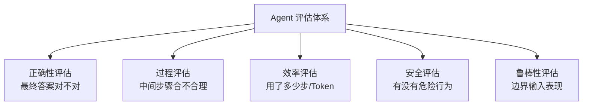
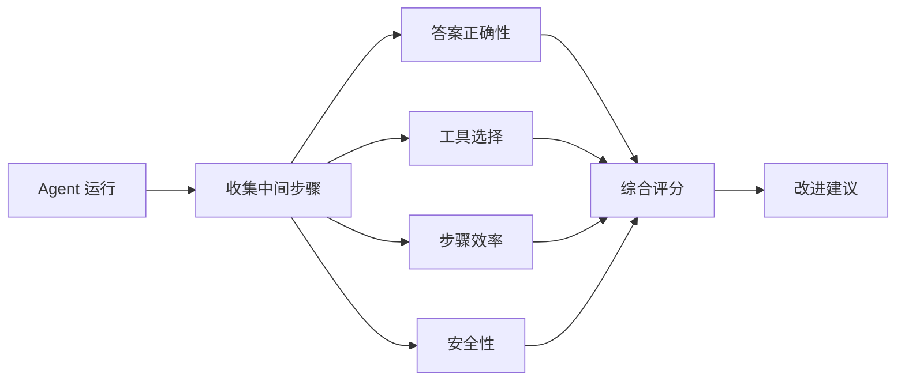
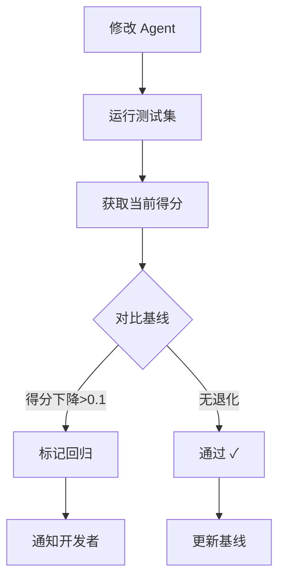
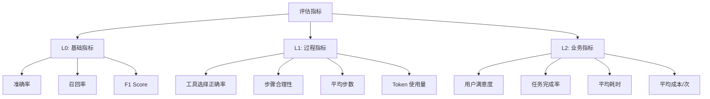
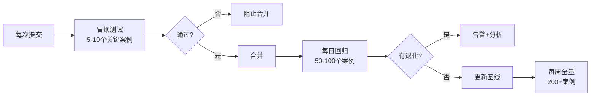

# Agent 评估与测试框架技术参考

> **定位**：技术参考手册 | **前置知识**：KB 06 评估测试与成本优化、KB 25 高级RAG优化 | **难度**：高级

---

## 1. Agent 评估全景

Agent 与传统链不同：**Agent 自主决策路径**，同一输入可能走完全不同路线，评估难度倍增。



| 评估维度 | 核心问题 | 指标 |
|---------|---------|------|
| 正确性 | 答案对不对 | 准确率、F1 |
| 过程 | 步骤合不合理 | 步骤合理性、工具选择正确率 |
| 效率 | 花了多少代价 | 平均步数、Token 用量 |
| 安全 | 有没有危险 | 越权行为次数 |
| 鲁棒性 | 边界输入表现 | 异常处理率 |

---

## 2. LangSmith 评估数据集构建

### 数据集结构

```python
from langsmith import Client

client = Client()

# 创建数据集
dataset = client.create_dataset(
    name="agent-eval-v1",
    description="Agent 多步推理评估集"
)

# 添加测试样例
examples = [
    {
        "question": "北京和上海今天的温差是多少？",
        "expected_answer": "需要查询两个城市天气并计算温差",
        "expected_steps": ["search_weather_beijing", "search_weather_shanghai", "calculate_diff"],
        "expected_tools": ["weather_api", "calculator"],
    },
    {
        "question": "比较 GPT-4 和 Claude 的上下文窗口",
        "expected_answer": "GPT-4 128K, Claude 200K，Claude更大",
        "expected_steps": ["search_gpt4_spec", "search_claude_spec", "compare"],
        "expected_tools": ["search_engine"],
    },
]

for ex in examples:
    client.create_example(
        inputs={"question": ex["question"]},
        outputs={
            "expected_answer": ex["expected_answer"],
            "expected_steps": ex["expected_steps"],
            "expected_tools": ex["expected_tools"],
        },
        dataset_id=dataset.id,
    )
```

### 数据集设计原则

| 原则 | 说明 |
|------|------|
| 多样性 | 覆盖不同任务类型 |
| 边界案例 | 包含模糊、歧义输入 |
| 可验证 | 答案可客观判定对错 |
| 分层 | 简单/中等/困难分层 |

---

## 3. 自定义评估器

### 答案正确性评估器

```python
from langsmith.evaluation import RunEvaluator, EvaluationResult

class AnswerCorrectnessEvaluator(RunEvaluator):
    """评估答案正确性"""
    
    def evaluate_run(self, run, example=None):
        prediction = run.outputs.get("answer", "")
        reference = example.outputs.get("expected_answer", "") if example else ""
        
        # 用 LLM 做语义比对
        eval_prompt = f"""
        判断以下回答是否正确:
        参考答案: {reference}
        实际回答: {prediction}
        返回: correct 或 incorrect
        """
        result = llm.invoke(eval_prompt).content.strip()
        score = 1.0 if result == "correct" else 0.0
        
        return EvaluationResult(
            key="answer_correctness",
            score=score,
            comment=f"Prediction: {prediction[:100]}..."
        )
```

### 工具选择正确性

```python
class ToolSelectionEvaluator(RunEvaluator):
    """评估 Agent 是否选对了工具"""
    
    def evaluate_run(self, run, example=None):
        # 从 run 的中间步骤提取使用的工具
        used_tools = []
        for step in run.inputs.get("intermediate_steps", []):
            if len(step) >= 2:
                tool_name = step[1].tool if hasattr(step[1], "tool") else "unknown"
                used_tools.append(tool_name)
        
        expected_tools = example.outputs.get("expected_tools", []) if example else []
        
        # 计算召回率：期望工具中使用了多少
        if expected_tools:
            matched = sum(1 for t in expected_tools if t in used_tools)
            score = matched / len(expected_tools)
        else:
            score = 1.0
        
        return EvaluationResult(
            key="tool_selection",
            score=score,
            comment=f"Used: {used_tools}, Expected: {expected_tools}"
        )
```

### 步数效率评估器

```python
class StepEfficiencyEvaluator(RunEvaluator):
    """评估 Agent 是否用了最少步骤"""
    
    def evaluate_run(self, run, example=None):
        steps = len(run.inputs.get("intermediate_steps", []))
        expected_steps = len(example.outputs.get("expected_steps", [])) if example else 0
        
        if expected_steps == 0:
            score = 1.0
        elif steps <= expected_steps:
            score = 1.0  # 比预期还少
        else:
            # 超出比例扣分
            ratio = expected_steps / steps
            score = max(0.0, ratio)
        
        return EvaluationResult(
            key="step_efficiency",
            score=score,
            comment=f"Took {steps} steps, expected {expected_steps}"
        )
```



---

## 4. Mock LLM 测试

测试时不需要真实调用 LLM，用 Mock 预设返回值。

```python
from unittest.mock import Mock
from langchain_core.language_models import BaseChatModel
from langchain_core.messages import AIMessage

class MockChatModel:
    """模拟 LLM 返回"""
    
    def __init__(self, responses: list):
        self.responses = responses
        self.call_count = 0
    
    def invoke(self, prompt, **kwargs):
        if self.call_count < len(self.responses):
            resp = self.responses[self.call_count]
            self.call_count += 1
            return AIMessage(content=resp)
        return AIMessage(content="mock exhausted")
    
    def bind_tools(self, tools, **kwargs):
        return self  # 返回自身，忽略工具绑定

# 测试 Agent 的工具选择
def test_agent_tool_selection():
    mock_llm = MockChatModel([
        "我需要搜索天气",           # 第一次调用：决定用搜索
        "北京今天25度",             # 搜索工具返回后
        "上海今天30度",             # 又搜索
        "北京和上海温差5度"          # 最终答案
    ])
    
    mock_tool = Mock()
    mock_tool.name = "weather_api"
    mock_tool.invoke = Mock(side_effect=[
        {"temp": 25, "city": "北京"},
        {"temp": 30, "city": "上海"},
    ])
    
    agent = create_react_agent(mock_llm, [mock_tool])
    result = agent.invoke({"messages": [{"role": "user", "content": "北京上海温差"}]})
    
    # 断言
    assert mock_tool.invoke.call_count == 2
    assert "5" in result["messages"][-1].content
```

---

## 5. 批量评估运行

```python
from langsmith.evaluation import evaluate

def agent_run(inputs):
    """被评估的 Agent 函数"""
    result = agent.invoke({"question": inputs["question"]})
    return {"answer": result["output"]}

# 批量运行评估
results = evaluate(
    agent_run,
    data="agent-eval-v1",  # 数据集名称
    evaluators=[
        AnswerCorrectnessEvaluator(),
        ToolSelectionEvaluator(),
        StepEfficiencyEvaluator(),
    ],
    experiment_prefix="agent-v1",
)

# results 含每条样例的得分
for r in results:
    print(f"Q: {r['question'][:30]}... | Score: {r['score']:.2f}")
```

---

## 6. 回归测试

每次修改 Agent 逻辑后跑回归，确保没有退化。

```python
import json
from datetime import datetime

class RegressionTestSuite:
    """Agent 回归测试套件"""
    
    def __init__(self, baseline_file="agent_baseline.json"):
        self.baseline_file = baseline_file
        self.baseline = self.load_baseline()
    
    def load_baseline(self):
        try:
            with open(self.baseline_file) as f:
                return json.load(f)
        except FileNotFoundError:
            return {}
    
    def save_baseline(self, results):
        with open(self.baseline_file, "w") as f:
            json.dump(results, f, indent=2, ensure_ascii=False)
    
    def compare(self, current_results):
        """对比当前结果与基线"""
        regressions = []
        for key, current in current_results.items():
            baseline = self.baseline.get(key)
            if baseline and current["score"] < baseline["score"] - 0.1:
                regressions.append({
                    "test": key,
                    "baseline_score": baseline["score"],
                    "current_score": current["score"],
                    "delta": current["score"] - baseline["score"],
                })
        return regressions
    
    def run_regression_check(self, agent, test_cases):
        """运行回归检查"""
        results = {}
        for case in test_cases:
            output = agent.invoke({"question": case["question"]})
            score = self.score(output, case["expected"])
            results[case["id"]] = {"score": score, "output": output}
        
        regressions = self.compare(results)
        if regressions:
            print(f"WARNING: {len(regressions)} regressions detected!")
            for r in regressions:
                print(f"  {r['test']}: {r['baseline_score']:.2f} -> {r['current_score']:.2f}")
        
        return results, regressions
```



---

## 7. A/B 测试对比

对比两个 Agent 版本的表现。

```python
def ab_test(agent_a, agent_b, test_cases, evaluator):
    """Agent A/B 测试"""
    results_a = []
    results_b = []
    
    for case in test_cases:
        # 跑 Agent A
        out_a = agent_a.invoke({"question": case["question"]})
        score_a = evaluator.evaluate(out_a, case["expected"])
        results_a.append(score_a)
        
        # 跑 Agent B
        out_b = agent_b.invoke({"question": case["question"]})
        score_b = evaluator.evaluate(out_b, case["expected"])
        results_b.append(score_b)
    
    avg_a = sum(results_a) / len(results_a)
    avg_b = sum(results_b) / len(results_b)
    
    return {
        "agent_a_avg": avg_a,
        "agent_b_avg": avg_b,
        "winner": "A" if avg_a > avg_b else "B",
        "improvement": abs(avg_a - avg_b),
    }
```

---

## 8. 评估指标体系

### 指标分层



| 层级 | 指标 | 计算方式 | 目标 |
|------|------|---------|------|
| L0 | 准确率 | 正确数/总数 | > 90% |
| L0 | F1 | 2*P*R/(P+R) | > 0.85 |
| L1 | 工具正确率 | 正确选择/总选择 | > 95% |
| L1 | 平均步数 | 总步数/总任务 | ≤ 预期步数 |
| L1 | Token用量 | 总Token/总任务 | ≤ 预算 |
| L2 | 完成率 | 完成数/总数 | > 85% |
| L2 | 满意度 | 评分均值 | > 4.0/5 |

---

## 9. CI/CD 集成

将评估纳入持续集成流水线。

```yaml
# .github/workflows/agent-eval.yml
name: Agent Evaluation
on: [push, pull_request]

jobs:
  evaluate:
    runs-on: ubuntu-latest
    steps:
      - uses: actions/checkout@v4
      - name: Install deps
        run: pip install langchain langsmith pytest
      - name: Run smoke tests
        run: pytest tests/smoke/ -v
      - name: Run regression
        run: python scripts/agent_regression.py --threshold 0.85
      - name: Upload results
        uses: actions/upload-artifact@v3
        with:
          name: eval-results
          path: results/
```

```python
# scripts/agent_regression.py
import sys
import argparse

def main():
    parser = argparse.ArgumentParser()
    parser.add_argument("--threshold", type=float, default=0.85)
    args = parser.parse_args()
    
    suite = RegressionTestSuite()
    results, regressions = suite.run_regression_check(agent, TEST_CASES)
    
    avg_score = sum(r["score"] for r in results.values()) / len(results)
    
    if avg_score < args.threshold:
        print(f"FAIL: avg score {avg_score:.2f} < threshold {args.threshold}")
        sys.exit(1)
    
    if regressions:
        print(f"FAIL: {len(regressions)} regressions")
        sys.exit(1)
    
    print(f"PASS: avg score {avg_score:.2f}")

if __name__ == "__main__":
    main()
```

---

## 10. 评估最佳实践

| 实践 | 说明 | 优先级 |
|------|------|--------|
| 建立基线 | 首次评估结果作为基线 | 高 |
| 分层测试 | 冒烟/回归/全量分层 | 高 |
| Mock 优先 | CI 用 Mock，生产用真实 LLM | 高 |
| 成本预算 | 评估也要控制 LLM 调用成本 | 中 |
| 持续更新 | 定期补充新测试样例 | 中 |
| 失败分析 | 分析失败案例找出模式 | 中 |
| 可视化 | LangSmith 仪表盘追踪 | 中 |

### 评估频率


