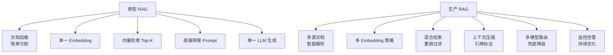
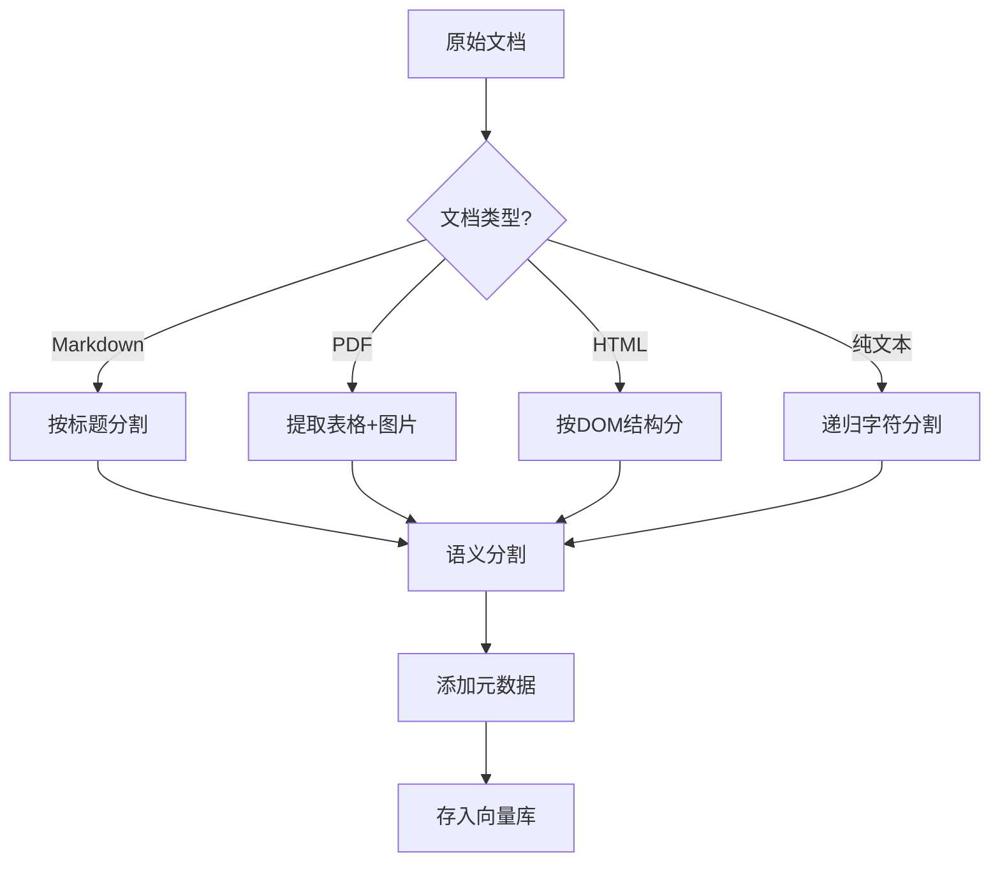
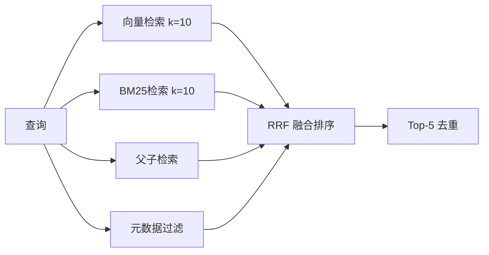
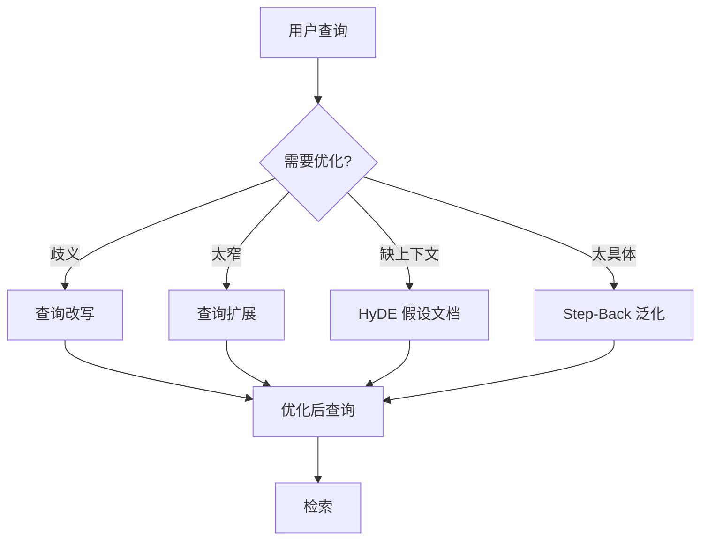
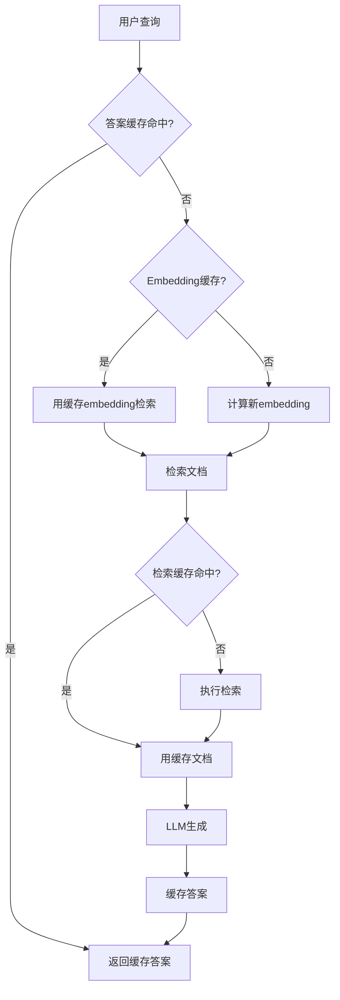
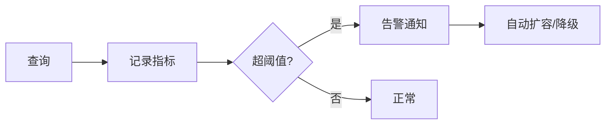
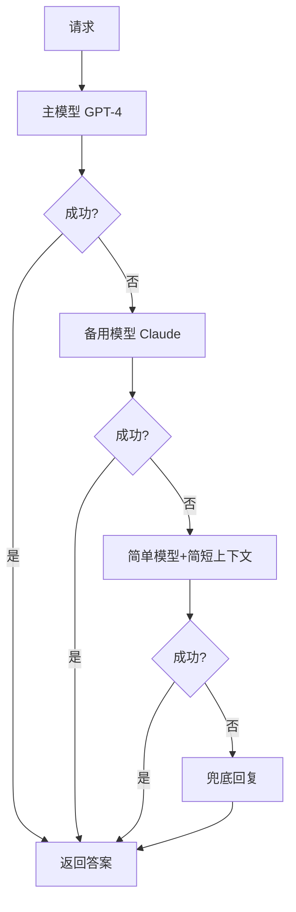

# 生产级 RAG 系统调优技术参考

> **定位**：技术参考手册 | **前置知识**：KB 09 高级RAG、KB 19 RAG架构模式、KB 25 高级RAG优化 | **难度**：高级

---

## 1. 生产 RAG 与原型 RAG 的差距



| 维度 | 原型 | 生产级 |
|------|------|--------|
| 文档处理 | 固定 500 字分割 | 语义分割+表格/图片提取 |
| 检索 | 单一向量 Top-K | 混合检索+重排+过滤 |
| 生成 | 直接拼接 | 上下文压缩+引用标注 |
| 监控 | 无 | 全链路追踪 |
| 兜底 | 无 | 降级+缓存+人工兜底 |
| 成本 | 不计 | Token 预算控制 |

---

## 2. 文档处理调优

### 智能分割策略

```python
from langchain_text_splitters import RecursiveCharacterTextSplitter
from langchain_text_splitters import MarkdownHeaderTextSplitter

def create_smart_splitter():
    """创建智能分割器"""
    # Markdown 按标题分割
    md_splitter = MarkdownHeaderTextSplitter(
        headers_to_split_on=[
            ("#", "Section"),
            ("##", "Subsection"),
            ("###", "Subsubsection"),
        ]
    )
    
    # 递归字符分割（保留语义边界）
    char_splitter = RecursiveCharacterTextSplitter(
        chunk_size=500,
        chunk_overlap=50,
        separators=["\n\n", "\n", "。", "！", "？", ".", "!", "?", " "],
    )
    
    return md_splitter, char_splitter

def process_document(doc):
    """处理文档：先按结构分，再按语义分"""
    md_splitter, char_splitter = create_smart_splitter()
    
    # 第一步：按 Markdown 标题分
    sections = md_splitter.split_text(doc.page_content)
    
    # 第二步：每个 section 再按字符分
    chunks = []
    for section in sections:
        sub_chunks = char_splitter.split_documents([section])
        chunks.extend(sub_chunks)
    
    # 为每个 chunk 添加元数据
    for chunk in chunks:
        chunk.metadata["doc_source"] = doc.metadata.get("source", "unknown")
        chunk.metadata["chunk_id"] = f"{chunk.metadata['doc_source']}_{hash(chunk.page_content[:50])}"
    
    return chunks
```

### 表格与图片处理

```python
from langchain_community.document_loaders import UnstructuredPDFLoader

def load_pdf_with_tables(file_path):
    """加载 PDF 并保留表格结构"""
    loader = UnstructuredPDFLoader(
        file_path,
        strategy="hi_res",
        extract_images_in_pdf=True,
        infer_table_structure=True,
    )
    docs = loader.load()
    
    processed = []
    for doc in docs:
        # 表格转为 Markdown 格式
        if "table" in doc.metadata.get("category", ""):
            doc.page_content = f"表格:\n{doc.page_content}"
        processed.append(doc)
    
    return processed
```



---

## 3. 混合检索策略

### 向量+关键词混合

```python
from langchain_community.retrievers import BM25Retriever
from langchain_community.vectorstores import FAISS
from langchain_core.runnables import RunnablePassthrough

class HybridRetriever:
    """混合检索：向量 + BM25 关键词"""
    
    def __init__(self, vector_store, docs, weight_vector=0.7, weight_bm25=0.3):
        self.vector_retriever = vector_store.as_retriever(search_kwargs={"k": 10})
        self.bm25_retriever = BM25Retriever.from_documents(docs)
        self.bm25_retriever.k = 10
        self.w_v = weight_vector
        self.w_b = weight_bm25
    
    def get_relevant_documents(self, query):
        # 向量检索
        vector_docs = self.vector_retriever.invoke(query)
        # BM25 检索
        bm25_docs = self.bm25_retriever.invoke(query)
        
        # 融合排序（Reciprocal Rank Fusion）
        fused = self.reciprocal_rank_fusion(vector_docs, bm25_docs)
        return fused[:5]  # 取 Top-5
    
    def reciprocal_rank_fusion(self, list_a, list_b, k=60):
        """RRF 融合排序"""
        scores = {}
        for rank, doc in enumerate(list_a):
            content = doc.page_content
            scores[content] = scores.get(content, 0) + self.w_v / (k + rank + 1)
        for rank, doc in enumerate(list_b):
            content = doc.page_content
            scores[content] = scores.get(content, 0) + self.w_b / (k + rank + 1)
        
        # 按分数排序
        all_docs = {d.page_content: d for d in list_a + list_b}
        sorted_contents = sorted(scores.keys(), key=lambda x: -scores[x])
        return [all_docs[c] for c in sorted_contents]
```

### 多路检索

```python
class MultiRouteRetriever:
    """多路检索：不同策略并行"""
    
    def __init__(self, vector_store, docs):
        self.hybrid = HybridRetriever(vector_store, docs)
        self.parent_child = ParentChildRetriever(vector_store)
        self.metadata_filter = MetadataFilterRetriever(vector_store)
    
    def invoke(self, query, metadata=None):
        results = []
        
        # 路径1：混合检索
        results.extend(self.hybrid.get_relevant_documents(query))
        
        # 路径2：父子检索（小chunk检索，大chunk返回）
        results.extend(self.parent_child.invoke(query))
        
        # 路径3：元数据过滤检索
        if metadata:
            results.extend(self.metadata_filter.invoke(query, metadata))
        
        # 去重
        seen = set()
        unique = []
        for doc in results:
            if doc.page_content not in seen:
                seen.add(doc.page_content)
                unique.append(doc)
        
        return unique[:5]
```



---

## 4. 查询优化

### 查询改写与扩展

```python
class QueryOptimizer:
    """查询优化器"""
    
    def rewrite_query(self, query):
        """查询改写：消除歧义"""
        prompt = f"""将以下用户问题改写为更清晰的检索查询:
        原始: {query}
        改写(只输出改写后的查询):"""
        return llm.invoke(prompt).content.strip()
    
    def expand_query(self, query):
        """查询扩展：生成多个变体"""
        prompt = f"""为以下查询生成3个不同角度的检索变体:
        原始: {query}
        变体1: 
        变体2: 
        变体3: """
        result = llm.invoke(prompt).content
        variants = [line.split(": ", 1)[1] for line in result.strip().split("\n") if ": " in line]
        return [query] + variants  # 原始+变体
    
    def hyde(self, query):
        """HyDE：假设性文档嵌入"""
        prompt = f"""为以下问题写一段假设性回答(用于检索):
        问题: {query}
        回答:"""
        hypothetical = llm.invoke(prompt).content
        
        # 用假设性回答做向量检索
        return self.vector_store.similarity_search(hypothetical, k=5)
    
    def step_back(self, query):
        """Step-Back：抽象到更泛化的问题"""
        prompt = f"""将以下具体问题抽象为更泛化的概念性问题:
        具体: {query}
        泛化:"""
        return llm.invoke(prompt).content.strip()
```



---

## 5. 重排模型

```python
from langchain.retrievers import ContextualCompressionRetriever
from langchain.retrievers.document_compressors import LLMListExtractor

class RerankerPipeline:
    """重排流水线"""
    
    def __init__(self, base_retriever, rerank_model="bge-reranker"):
        self.base_retriever = base_retriever
        self.rerank_model = rerank_model
    
    def retrieve_and_rerank(self, query, top_k=20, final_k=5):
        # 第一步：粗排检索更多候选
        candidates = self.base_retriever.invoke(query)[:top_k]
        
        # 第二步：LLM 重排
        reranked = self.llm_rerank(query, candidates)
        
        return reranked[:final_k]
    
    def llm_rerank(self, query, documents):
        """用 LLM 对文档打分排序"""
        scored = []
        for doc in documents:
            prompt = f"""评估以下文档对查询的相关性(0-10分):
            查询: {query}
            文档: {doc.page_content[:200]}
            分数:"""
            score_text = llm.invoke(prompt).content.strip()
            try:
                score = float(score_text)
            except ValueError:
                score = 5.0
            scored.append((doc, score))
        
        scored.sort(key=lambda x: -x[1])
        return [doc for doc, _ in scored]
```

---

## 6. 上下文管理

### 上下文压缩

```python
class ContextCompressor:
    """压缩检索到的上下文"""
    
    def compress(self, query, documents, max_tokens=2000):
        total = sum(len(d.page_content) for d in documents)
        
        if total <= max_tokens * 4:  # 粗略 1 token ≈ 4 字符
            return documents
        
        # 按相关度截断每个文档
        compressed = []
        budget_per_doc = max_tokens * 4 // len(documents)
        for doc in documents:
            if len(doc.page_content) > budget_per_doc:
                # 保留最相关段落
                compressed_content = self.extract_relevant(
                    query, doc.page_content, budget_per_doc
                )
                doc.page_content = compressed_content
            compressed.append(doc)
        
        return compressed
    
    def extract_relevant(self, query, text, max_length):
        """提取最相关段落"""
        sentences = text.replace("。", "。\n").split("\n")
        # 简单实现：保留含查询关键词的句子
        keywords = set(query.split())
        scored = [(s, sum(1 for kw in keywords if kw in s)) for s in sentences]
        scored.sort(key=lambda x: -x[1])
        
        result = ""
        for sent, _ in scored:
            if len(result) + len(sent) <= max_length:
                result += sent
        return result
```

### 引用标注

```python
class CitationAnnotator:
    """为生成答案添加引用标注"""
    
    def annotate(self, answer, source_documents):
        """在后添加引用来源"""
        citations = []
        for i, doc in enumerate(source_documents):
            source = doc.metadata.get("source", f"来源{i+1}")
            page = doc.metadata.get("page", "")
            citations.append(f"[{i+1}] {source}" + (f" p.{page}" if page else ""))
        
        citation_text = "\n\n---\n参考来源:\n" + "\n".join(citations)
        return answer + citation_text
```


---

## 7. 缓存层

### 多级缓存

```python
from langchain_core.caches import InMemoryCache
import hashlib
import json

class RAGCache:
    """RAG 多级缓存"""
    
    def __init__(self):
        self.query_cache = {}       # 查询→答案缓存
        self.embedding_cache = {}   # 查询→embedding缓存
        self.retrieval_cache = {}   # 查询→文档缓存
    
    def get_cached_answer(self, query):
        key = self._hash(query)
        return self.query_cache.get(key)
    
    def set_cached_answer(self, query, answer):
        key = self._hash(query)
        self.query_cache[key] = answer
    
    def get_cached_embedding(self, query):
        key = self._hash(query)
        return self.embedding_cache.get(key)
    
    def set_cached_embedding(self, query, embedding):
        key = self._hash(query)
        self.embedding_cache[key] = embedding
    
    def _hash(self, text):
        return hashlib.md5(text.encode()).hexdigest()
```



---

## 8. 监控与告警

### 关键指标

```python
class RAGMonitor:
    """RAG 系统监控"""
    
    def __init__(self):
        self.metrics = {
            "query_count": 0,
            "avg_latency": 0,
            "avg_retrieval_time": 0,
            "avg_generation_time": 0,
            "cache_hit_rate": 0,
            "avg_relevance_score": 0,
            "error_count": 0,
        }
    
    def record_query(self, query, latency, retrieval_time, 
                     generation_time, cache_hit, relevance, error=False):
        self.metrics["query_count"] += 1
        n = self.metrics["query_count"]
        
        # 滑动平均
        self.metrics["avg_latency"] = (
            self.metrics["avg_latency"] * (n-1) + latency
        ) / n
        self.metrics["avg_retrieval_time"] = (
            self.metrics["avg_retrieval_time"] * (n-1) + retrieval_time
        ) / n
        self.metrics["avg_generation_time"] = (
            self.metrics["avg_generation_time"] * (n-1) + generation_time
        ) / n
        
        if error:
            self.metrics["error_count"] += 1
    
    def check_alerts(self):
        alerts = []
        if self.metrics["avg_latency"] > 5.0:
            alerts.append("HIGH_LATENCY")
        if self.metrics["error_count"] / max(1, self.metrics["query_count"]) > 0.05:
            alerts.append("HIGH_ERROR_RATE")
        return alerts
```

| 指标 | 告警阈值 | 说明 |
|------|---------|------|
| 平均延迟 | > 5秒 | 用户体验差 |
| 错误率 | > 5% | 需立即排查 |
| 缓存命中率 | < 30% | 缓存策略需优化 |
| 检索相关度 | < 0.7 | 需调优检索 |
| Token 消耗 | > 预算 | 需压缩上下文 |



---

## 9. 降级与兜底

```python
class RAGFallback:
    """RAG 降级策略"""
    
    def __init__(self, primary_llm, fallback_llm, simple_llm):
        self.primary = primary_llm
        self.fallback = fallback_llm
        self.simple = simple_llm
    
    def generate_with_fallback(self, query, context):
        """分级降级"""
        # 第一级：主模型
        try:
            return self._safe_invoke(self.primary, query, context)
        except Exception as e:
            print(f"Primary failed: {e}")
        
        # 第二级：备用模型
        try:
            return self._safe_invoke(self.fallback, query, context)
        except Exception as e:
            print(f"Fallback failed: {e}")
        
        # 第三级：简单模型+简短上下文
        try:
            short_context = context[:1]  # 只用1个文档
            return self._safe_invoke(self.simple, query, short_context)
        except Exception as e:
            print(f"Simple failed: {e}")
        
        # 最终兜底
        return "抱歉，系统暂时无法处理您的请求，请稍后重试。"
    
    def _safe_invoke(self, llm, query, context):
        context_text = "\n".join(d.page_content for d in context)
        prompt = f"基于以下信息回答:\n{context_text}\n\n问题: {query}"
        return llm.invoke(prompt).content
```



---

## 10. 生产调优检查清单

| 检查项 | 说明 | 状态 |
|--------|------|------|
| 文档分割 | 语义分割+表格保留 | □ |
| 多路检索 | 向量+关键词+元数据 | □ |
| 查询优化 | 改写+扩展+HyDE | □ |
| 重排模型 | 粗排+精排 | □ |
| 上下文压缩 | Token 预算控制 | □ |
| 引用标注 | 答案标来源 | □ |
| 多级缓存 | 答案+embedding+文档 | □ |
| 监控告警 | 延迟+错误+相关度 | □ |
| 降级兜底 | 多模型+简短上下文 | □ |
| 成本控制 | Token 预算+缓存 | □ |

### 性能基线参考

| 指标 | 可接受 | 良好 | 优秀 |
|------|--------|------|------|
| 端到端延迟 | < 5s | < 3s | < 1.5s |
| 检索准确率 | > 70% | > 85% | > 95% |
| 答案准确率 | > 75% | > 88% | > 93% |
| 缓存命中率 | > 20% | > 40% | > 60% |
| 错误率 | < 5% | < 2% | < 0.5% |
