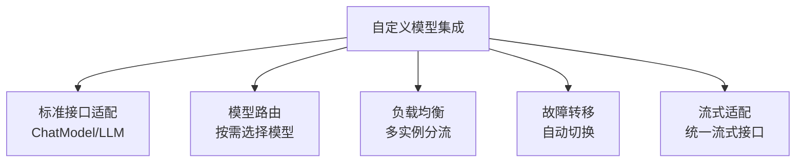
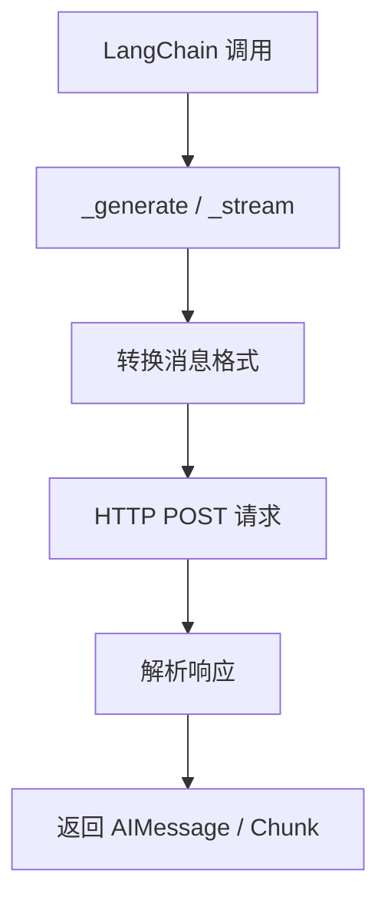
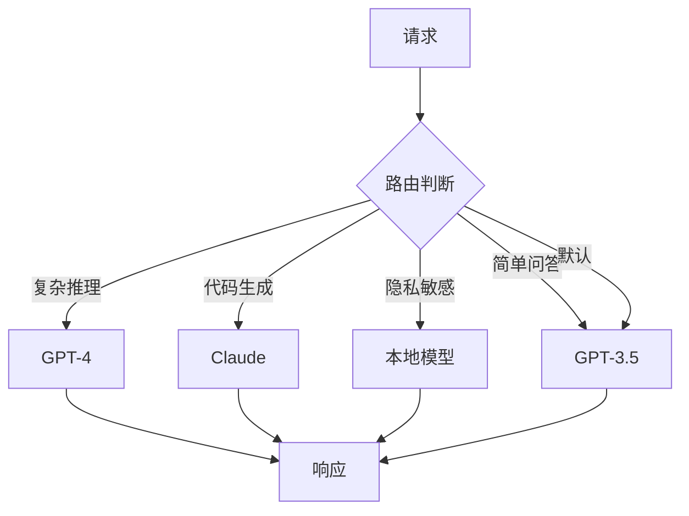
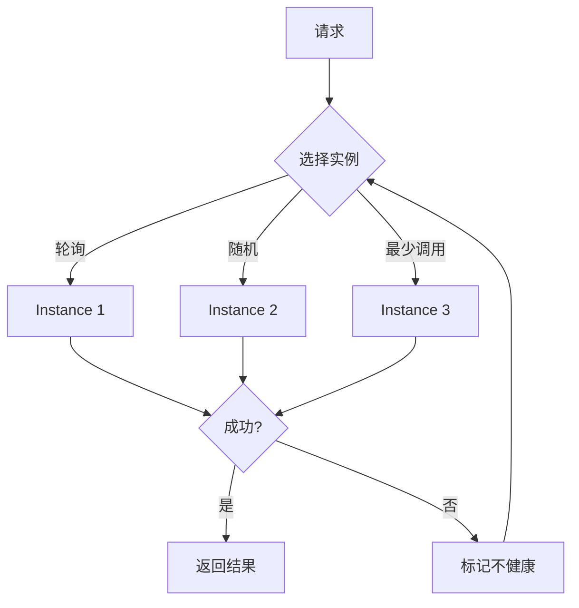
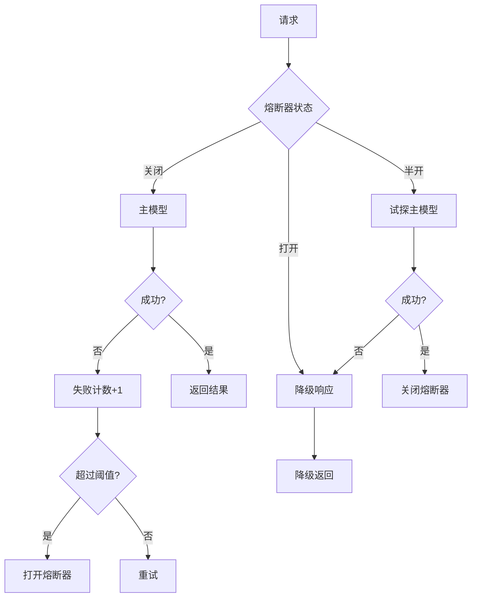
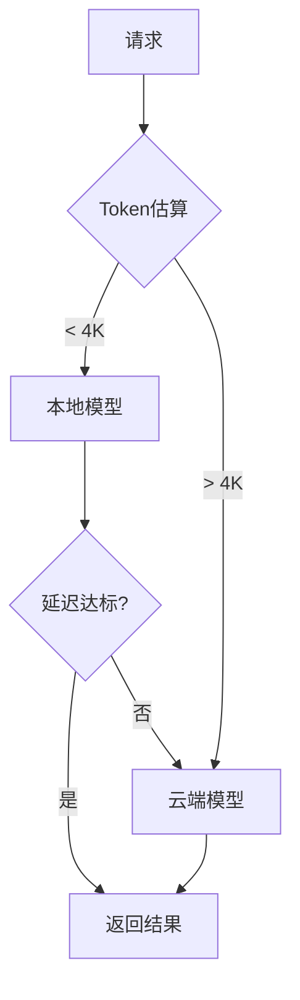
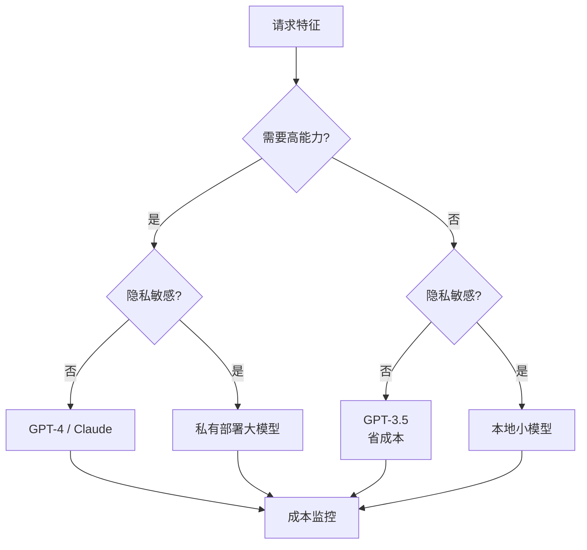

# 自定义模型集成与路由技术手册

> **定位**：技术参考手册 | **前置知识**：KB 01 模型IO基础、KB 10 安全防护 | **难度**：高级

---

## 1. 自定义模型集成概述

生产环境中常需接入**非 LangChain 原生支持**的模型：私有部署模型、自研模型、第三方 API。



---

## 2. 自定义 ChatModel

### 基础实现

```python
from langchain_core.language_models import BaseChatModel
from langchain_core.messages import AIMessage, BaseMessage
from langchain_core.outputs import ChatGeneration, ChatResult
from typing import List, Optional, Any, Dict
import requests

class CustomAPIChatModel(BaseChatModel):
    """自定义 API ChatModel"""
    
    api_url: str = "https://my-model-api.com/v1/chat"
    api_key: str = "your-api-key"
    model_name: str = "my-custom-model"
    temperature: float = 0.7
    
    def _generate(
        self,
        messages: List[BaseMessage],
        stop: Optional[List[str]] = None,
        run_manager=None,
        **kwargs,
    ) -> ChatResult:
        # 将 LangChain 消息转为 API 格式
        api_messages = []
        for msg in messages:
            role = "user" if msg.type == "human" else "assistant" if msg.type == "ai" else "system"
            api_messages.append({"role": role, "content": msg.content})
        
        # 调用 API
        response = requests.post(
            self.api_url,
            headers={"Authorization": f"Bearer {self.api_key}"},
            json={
                "model": self.model_name,
                "messages": api_messages,
                "temperature": self.temperature,
                "stop": stop,
            },
            timeout=30,
        )
        response.raise_for_status()
        data = response.json()
        
        # 构造返回
        content = data["choices"][0]["message"]["content"]
        ai_message = AIMessage(content=content)
        
        return ChatResult(
            generations=[ChatGeneration(message=ai_message)],
            llm_output={
                "token_usage": data.get("usage", {}),
                "model_name": self.model_name,
            }
        )
    
    @property
    def _llm_type(self) -> str:
        return "custom-api-chat"
    
    @property
    def _identifying_params(self) -> Dict[str, Any]:
        return {"model": self.model_name, "api_url": self.api_url}
```

### 流式实现

```python
from langchain_core.messages import AIMessageChunk
from langchain_core.outputs import ChatGenerationChunk
from typing import Iterator

class CustomStreamingChatModel(CustomAPIChatModel):
    """支持流式的自定义模型"""
    
    def _stream(
        self,
        messages: List[BaseMessage],
        stop: Optional[List[str]] = None,
        run_manager=None,
        **kwargs,
    ) -> Iterator[ChatGenerationChunk]:
        api_messages = self._convert_messages(messages)
        
        response = requests.post(
            self.api_url,
            headers={"Authorization": f"Bearer {self.api_key}"},
            json={
                "model": self.model_name,
                "messages": api_messages,
                "stream": True,
                "stop": stop,
            },
            stream=True,
            timeout=60,
        )
        
        for line in response.iter_lines():
            if line:
                chunk_data = json.loads(line.decode("utf-8").replace("data: ", ""))
                if "content" in chunk_data.get("choices", [{}])[0].get("delta", {}):
                    content = chunk_data["choices"][0]["delta"]["content"]
                    yield ChatGenerationChunk(
                        message=AIMessageChunk(content=content)
                    )
    
    def _convert_messages(self, messages):
        result = []
        for msg in messages:
            role = "user" if msg.type == "human" else "assistant" if msg.type == "ai" else "system"
            result.append({"role": role, "content": msg.content})
        return result
```



---

## 3. 工具调用适配

```python
class CustomToolCallingModel(CustomAPIChatModel):
    """支持工具调用的自定义模型"""
    
    def bind_tools(self, tools, **kwargs):
        """绑定工具"""
        return CustomToolBoundModel(
            model=self,
            tools=[self._convert_tool(t) for t in tools],
        )
    
    def _convert_tool(self, tool):
        """将 LangChain 工具转为 API 格式"""
        if hasattr(tool, "args_schema"):
            return {
                "type": "function",
                "function": {
                    "name": tool.name,
                    "description": tool.description,
                    "parameters": tool.args_schema.schema(),
                }
            }
        return {
            "type": "function",
            "function": {
                "name": tool.name,
                "description": tool.description,
                "parameters": {"type": "object", "properties": {}},
            }
        }
    
    def _generate(self, messages, stop=None, run_manager=None, **kwargs):
        # 如果绑定了工具，加到请求中
        tools = kwargs.get("tools", [])
        api_messages = self._convert_messages(messages)
        
        payload = {
            "model": self.model_name,
            "messages": api_messages,
            "temperature": self.temperature,
        }
        if tools:
            payload["tools"] = tools
        
        response = requests.post(
            self.api_url,
            headers={"Authorization": f"Bearer {self.api_key}"},
            json=payload,
            timeout=30,
        )
        data = response.json()
        
        choice = data["choices"][0]["message"]
        
        # 处理工具调用
        if "tool_calls" in choice:
            ai_message = AIMessage(
                content=choice.get("content", ""),
                tool_calls=choice["tool_calls"],
            )
        else:
            ai_message = AIMessage(content=choice["content"])
        
        return ChatResult(generations=[ChatGeneration(message=ai_message)])


class CustomToolBoundModel:
    """工具绑定后的模型包装"""
    
    def __init__(self, model, tools):
        self.model = model
        self.tools = tools
    
    def invoke(self, messages, **kwargs):
        return self.model._generate(
            messages if isinstance(messages, list) else [messages],
            tools=self.tools,
            **kwargs
        )
```

---

## 4. 模型路由

### 基于规则的路由

```python
from langchain_core.language_models import BaseChatModel
from langchain_core.messages import AIMessage

class ModelRouter:
    """基于规则的路由器"""
    
    def __init__(self, models: dict[str, BaseChatModel], routing_rules: list):
        self.models = models  # {"gpt4": model, "claude": model, "local": model}
        self.rules = routing_rules
    
    def invoke(self, prompt, **kwargs):
        selected = self._route(prompt)
        return self.models[selected].invoke(prompt, **kwargs)
    
    def _route(self, prompt) -> str:
        """根据规则选择模型"""
        prompt_text = prompt if isinstance(prompt, str) else str(prompt)
        
        for rule in self.rules:
            if rule["condition"](prompt_text):
                return rule["model"]
        
        return "default"  # 默认模型
    
    def add_rule(self, condition, model_name, priority=0):
        self.rules.append({
            "condition": condition,
            "model": model_name,
            "priority": priority,
        })
        # 按优先级排序
        self.rules.sort(key=lambda x: -x["priority"])
```

### 常见路由策略

```python
router = ModelRouter(
    models={
        "gpt4": ChatOpenAI(model="gpt-4"),
        "gpt35": ChatOpenAI(model="gpt-3.5-turbo"),
        "claude": ChatAnthropic(model="claude-3-sonnet"),
        "local": CustomAPIChatModel(api_url="http://localhost:8080/v1/chat"),
    },
    routing_rules=[
        # 复杂推理任务用 GPT-4
        {"condition": lambda p: any(kw in p for kw in ["分析", "推理", "推导"]),
         "model": "gpt4", "priority": 10},
        # 代码生成用 Claude
        {"condition": lambda p: any(kw in p for kw in ["代码", "编程", "函数"]),
         "model": "claude", "priority": 10},
        # 隐私敏感用本地模型
        {"condition": lambda p: any(kw in p for kw in ["密码", "密钥", "隐私"]),
         "model": "local", "priority": 20},
        # 简单问答用 GPT-3.5（省成本）
        {"condition": lambda p: len(p) < 50,
         "model": "gpt35", "priority": 5},
    ],
)
# 默认用 GPT-3.5
router.models["default"] = router.models["gpt35"]
```



### LLM 路由

```python
class LLMRouter:
    """用 LLM 决定路由"""
    
    def __init__(self, router_llm, models: dict):
        self.router_llm = router_llm
        self.models = models
    
    def invoke(self, prompt, **kwargs):
        # 让路由 LLM 选择最合适的模型
        routing_prompt = f"""根据用户请求选择最合适的模型。
        可选模型: {list(self.models.keys())}
        用户请求: {prompt}
        请只输出模型名称:"""
        
        model_name = self.router_llm.invoke(routing_prompt).content.strip()
        
        if model_name in self.models:
            return self.models[model_name].invoke(prompt, **kwargs)
        else:
            # 回退到默认
            return self.models["default"].invoke(prompt, **kwargs)
```

---

## 5. 负载均衡

```python
import random
from collections import defaultdict

class LoadBalancer:
    """多实例负载均衡"""
    
    def __init__(self, instances: dict, strategy="round_robin"):
        self.instances = instances  # {"model_1": llm, "model_2": llm}
        self.strategy = strategy
        self.round_robin_idx = 0
        self.call_counts = defaultdict(int)
        self.health_status = {k: True for k in instances}
    
    def invoke(self, prompt, **kwargs):
        available = [k for k, healthy in self.health_status.items() if healthy]
        if not available:
            raise RuntimeError("No healthy instances")
        
        selected = self._select(available)
        self.call_counts[selected] += 1
        
        try:
            result = self.instances[selected].invoke(prompt, **kwargs)
            return result
        except Exception as e:
            self.health_status[selected] = False
            # 标记不健康，重试其他
            return self.invoke(prompt, **kwargs)
    
    def _select(self, available):
        if self.strategy == "round_robin":
            idx = self.round_robin_idx % len(available)
            self.round_robin_idx += 1
            return available[idx]
        elif self.strategy == "random":
            return random.choice(available)
        elif self.strategy == "least_calls":
            return min(available, key=lambda k: self.call_counts[k])
        else:
            return available[0]
    
    def health_check(self):
        """健康检查"""
        for name, instance in self.instances.items():
            try:
                instance.invoke("ping")
                self.health_status[name] = True
            except:
                self.health_status[name] = False
        return self.health_status
```



---

## 6. 故障转移

```python
import time

class FailoverManager:
    """故障转移管理"""
    
    def __init__(self, primary, fallbacks: list, max_retries=3, retry_delay=1):
        self.primary = primary
        self.fallbacks = fallbacks  # [model1, model2, ...]
        self.max_retries = max_retries
        self.retry_delay = retry_delay
    
    def invoke(self, prompt, **kwargs):
        """带故障转移的调用"""
        models = [self.primary] + self.fallbacks
        
        for i, model in enumerate(models):
            for attempt in range(self.max_retries):
                try:
                    result = model.invoke(prompt, **kwargs)
                    if i > 0:
                        print(f"WARNING: Used fallback model {i}")
                    return result
                except Exception as e:
                    if attempt < self.max_retries - 1:
                        time.sleep(self.retry_delay * (attempt + 1))
                    else:
                        print(f"Model {i} failed: {e}")
        
        raise RuntimeError("All models failed")
    
    def invoke_with_circuit_breaker(self, prompt, **kwargs):
        """带熔断器的调用"""
        if self.circuit_open:
            if time.time() - self.last_failure_time > self.recovery_timeout:
                self.circuit_open = False  # 半开
                print("Circuit breaker: half-open")
            else:
                return self._fallback_response(prompt)
        
        try:
            result = self.primary.invoke(prompt, **kwargs)
            self.failure_count = 0
            return result
        except Exception as e:
            self.failure_count += 1
            self.last_failure_time = time.time()
            if self.failure_count >= self.failure_threshold:
                self.circuit_open = True
                print("Circuit breaker: OPEN")
            return self._fallback_response(prompt)
    
    def _fallback_response(self, prompt):
        """熔断时的降级响应"""
        return AIMessage(content="服务暂时不可用，请稍后重试。")
```



---

## 7. 本地部署模型集成

### vLLM/Ollama 集成

```python
# Ollama 本地模型
from langchain_community.chat_models import ChatOllama

local_model = ChatOllama(
    base_url="http://localhost:11434",
    model="llama3:8b",
    temperature=0.7,
)

# vLLM 服务（OpenAI 兼容 API）
from langchain_openai import ChatOpenAI

vllm_model = ChatOpenAI(
    base_url="http://localhost:8000/v1",
    api_key="EMPTY",
    model="meta-llama/Meta-Llama-3-8B-Instruct",
    temperature=0.7,
)

# 将本地模型加入路由
router = ModelRouter(
    models={
        "local": vllm_model,
        "cloud": ChatOpenAI(model="gpt-4"),
    },
    routing_rules=[
        {"condition": lambda p: True, "model": "local", "priority": 1},
    ],
)
```

### 本地+云端混合策略

```python
class HybridModelStrategy:
    """本地优先，云端兜底"""
    
    def __init__(self, local_model, cloud_model, 
                 local_max_tokens=4096, latency_threshold=3.0):
        self.local = local_model
        self.cloud = cloud_model
        self.local_max_tokens = local_max_tokens
        self.latency_threshold = latency_threshold
    
    def invoke(self, prompt, **kwargs):
        # 判断是否用本地
        estimated_tokens = len(prompt) // 4
        
        if estimated_tokens <= self.local_max_tokens:
            try:
                start = time.time()
                result = self.local.invoke(prompt, **kwargs)
                latency = time.time() - start
                if latency < self.latency_threshold:
                    return result
            except:
                pass  # 本地失败，走云端
        
        return self.cloud.invoke(prompt, **kwargs)
```



---

## 8. 配置管理

```python
import yaml
from pathlib import Path

class ModelConfig:
    """模型配置管理"""
    
    def __init__(self, config_path="models.yaml"):
        with open(config_path) as f:
            self.config = yaml.safe_load(f)
    
    def get_model(self, name: str):
        """根据名称获取模型实例"""
        cfg = self.config["models"][name]
        
        if cfg["provider"] == "openai":
            from langchain_openai import ChatOpenAI
            return ChatOpenAI(
                model=cfg["model"],
                temperature=cfg.get("temperature", 0.7),
                max_tokens=cfg.get("max_tokens", 2000),
            )
        elif cfg["provider"] == "anthropic":
            from langchain_anthropic import ChatAnthropic
            return ChatAnthropic(
                model=cfg["model"],
                temperature=cfg.get("temperature", 0.7),
            )
        elif cfg["provider"] == "custom":
            return CustomAPIChatModel(
                api_url=cfg["api_url"],
                model_name=cfg["model"],
            )
        else:
            raise ValueError(f"Unknown provider: {cfg['provider']}")
    
    def get_all_models(self):
        return {name: self.get_model(name) for name in self.config["models"]}
```

```yaml
# models.yaml
models:
  gpt4:
    provider: openai
    model: gpt-4
    temperature: 0.7
    max_tokens: 4096
  gpt35:
    provider: openai
    model: gpt-3.5-turbo
    temperature: 0.3
  claude:
    provider: anthropic
    model: claude-3-sonnet
    temperature: 0.5
  local:
    provider: custom
    api_url: http://localhost:8080/v1/chat
    model: my-local-model
```

---

## 9. 成本控制

```python
class CostController:
    """模型调用成本控制"""
    
    COST_PER_1K_TOKENS = {
        "gpt-4": {"input": 0.03, "output": 0.06},
        "gpt-3.5-turbo": {"input": 0.0015, "output": 0.002},
        "claude-3-sonnet": {"input": 0.003, "output": 0.015},
    }
    
    def __init__(self, daily_budget=10.0):
        self.daily_budget = daily_budget
        self.daily_spent = 0.0
    
    def estimate_cost(self, model_name, input_tokens, output_tokens):
        rates = self.COST_PER_1K_TOKENS.get(model_name, {"input": 0.01, "output": 0.02})
        cost = (input_tokens / 1000 * rates["input"]) + (output_tokens / 1000 * rates["output"])
        return cost
    
    def check_budget(self, estimated_cost):
        if self.daily_spent + estimated_cost > self.daily_budget:
            return False
        return True
    
    def record_usage(self, model_name, input_tokens, output_tokens):
        cost = self.estimate_cost(model_name, input_tokens, output_tokens)
        self.daily_spent += cost
        return cost
```

| 模型 | 输入$/1K | 输出$/1K | 适合场景 |
|------|---------|---------|---------|
| GPT-4 | 0.03 | 0.06 | 复杂推理 |
| GPT-3.5 | 0.0015 | 0.002 | 日常问答 |
| Claude Sonnet | 0.003 | 0.015 | 代码生成 |
| 本地模型 | 0 | 0 | 隐私/省钱 |

---

## 10. 集成最佳实践

| 实践 | 说明 | 优先级 |
|------|------|--------|
| 统一接口 | 所有模型实现 BaseChatModel | 高 |
| 配置外置 | 模型配置放 YAML/环境变量 | 高 |
| 故障转移 | 至少一个 fallback | 高 |
| 健康检查 | 定期探活 | 中 |
| 成本监控 | 每日预算控制 | 高 |
| 本地优先 | 能用本地先本地 | 中 |
| 熔断保护 | 避免级联故障 | 高 |
| 流式统一 | 所有模型支持 stream | 中 |

### 模型选型决策


