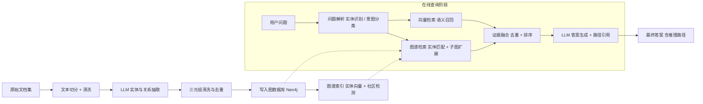
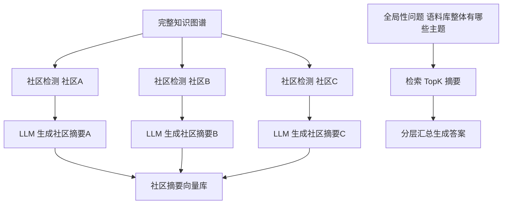

# GraphRAG 知识图谱增强检索技术手册

> 定位：知识库第 30 篇 · v8.0 · 37 课完整版系列
> 前置要求：已完成 RAG 基础、高级 RAG 优化、向量数据库选型
> 学习目标：理解 GraphRAG 的原理、架构与实现路径，掌握"向量检索 + 知识图谱"双通道融合模式

---

## 1. 为什么需要 GraphRAG

传统基于向量的 RAG（VectorRAG）把文档切块后向量化，靠语义相似度检索。它有三个结构性弱点：

| 弱点 | 表现形式 | 后果 |
| --- | --- | --- |
| 跨块信息断裂 | 一条信息拆散在多段文本中，相似度检索各取片段 | 答案不完整、自相矛盾 |
| 缺乏关系推理 | 检索结果无法表达"A 是 B 的子公司、B 向 C 供货"这类关联 | 多跳问题（multi-hop）答错 |
| 全局性问题薄弱 | "这本书讲了哪几种疗法""整个语料库的主题分布" | 聚合统计类问题几乎失效 |

GraphRAG 的思路：**先用 LLM 从文档中抽取结构化知识（实体、关系、属性），构建知识图谱；回答问题时先在图谱上定位实体与子图，再结合原文片段生成答案。** 它不替代向量检索，而是与其组成双通道。

核心价值对比：

```
VectorRAG 回答："X 公司成立于 2012 年。"（单点事实）
GraphRAG 回答："X 公司成立于 2012 年，由 A 基金投资，现隶属 Y 集团，
其中 A 基金同时是 Z 公司的股东——两家公司在资本层面有间接关联。"
                         （单点事实 + 关系链 + 可解释的推理路径）
```

---

## 2. 核心概念与数据模型

### 2.1 图谱三要素

知识图谱以 **三元组（triple）** 为基本单位：

```
实体(Entity) —— 关系(Relation) —— 实体(Entity)
  e.g.  LangChain  —— 基于 ——  LLM
        属性(Property)：LangChain.Author = "Harrison Chase"
```

- **实体节点**：文档中的具体对象（公司、人物、产品、技术名词、药物等）
- **关系边**：实体间的语义连接（投资、创立、隶属、治疗、使用）
- **属性**：附属于实体或关系的键值描述

### 2.2 与图数据库的对应关系

| 图谱概念 | Neo4j 实现 | Cypher 语法示例 |
| --- | --- | --- |
| 实体 | 节点（Node） | `(c:Company &#123;name:'LangChain'&#125;)` |
| 关系 | 关系（Relationship） | `-[r:INVESTED_IN]->` |
| 属性 | 键值对 | `{since: 2022}` |
| 子图 | 路径/模式匹配 | `MATCH (a)-[*1..3]-(b)` |

### 2.3 本体（Ontology）与 Schema

抽取前先定义实体与关系的类型体系，可大幅提升抽取质量：

```yaml
本体定义示例：
实体类型: Company, Person, Product, Technology, Event, Drug, Disease
关系类型: FOUNDED_BY, INVESTED_IN, PART_OF, ACQUIRED, TREATS, CAUSES
约束:     每个 Company 至少有一个 name；INVESTED_IN 必须有金额或时间属性
```

---

## 3. 系统架构

整体管线分为 **离线构建** 与 **在线查询** 两个阶段：



阶段一（构建）要点：抽取质量决定图谱质量，投入成本最高的环节是实体消歧与关系去重。
阶段二（查询）要点：图谱检索与向量检索并行执行，融合后交给生成模型。

---

## 4. 技术实现

### 4.1 依赖安装

```bash
pip install langchain neo4j graphdatascience  # 以实际为准
pip install langchain-experimental  # LLMGraphTransformr 所在包
```

> 说明：包名随版本变化，请以当前 LangChain 文档为准；LangMGraphTransformr 在 langchain-experimental 中，可将图谱转换结果导出为 neo4j 兼容格式。

### 4.2 实体抽取与图谱构建

```python
from langchain_experimental.graph_transformers import LLMGraphTransformer
from langchain_openai import ChatOpenAI
from langchain_community.graphs import Neo4jGraph

# 1. 定义本体（schema）
allowed_nodes = ["Company", "Person", "Product", "Technology", "Drug", "Disease"]
allowed_rels = ["FOUNDED_BY", "INVESTED_IN", "PART_OF", "ACQUIRED", "TREATS", "CAUSES"]

# 2. 构建图转换器
llm = ChatOpenAI(model="gpt-4o", temperature=0)
transformer = LLMGraphTransformer(
    llm=llm,
    allowed_nodes=allowed_nodes,
    allowed_rels=allowed_rels,
    node_properties=True,     # 保留节点属性
    relationship_properties=True,  # 保留关系属性
)

# 3. 文档 -> 图谱元素
graph_documents = transformer.convert_to_graph_documents(documents)

# 4. 写入 Neo4j
graph = Neo4jGraph(url="bolt://localhost:7687", username="neo4j", password="password")
graph.add_graph_documents(graph_documents, baseEntityLabel=True, include_source=True)
```

### 4.3 检索与生成（双通道融合）

```python
from langchain_community.vectorstores import Neo4jVector
from langchain_openai import OpenAIEmbeddings

# 通道一：图谱检索 —— 实体链接 + 邻域扩展（Cypher 查询）
entity_query = """
MATCH (e)
WHERE e.name CONTAINS $entity_name OR toLower(e.name) = toLower($entity_name)
MATCH (e)-[r]-(neighbor)
RETURN e.name AS entity, type(r) AS rel, neighbor.name AS neighbor
LIMIT 50
"""

# 通道二：向量检索
vector_store = Neo4jVector.from_existing_index(
    OpenAIEmbeddings(),
    url="bolt://localhost:7687",
    index_name="entity_vector_index",
)

def graphrag_query(question: str):
    entities = extract_entities(question)   # 用 LLM 识别问题中的实体
    graph_evidences = []
    for ent in entities:
        graph_evidences += graph.query(entity_query, params={"entity_name": ent})
    vector_evidences = vector_store.similarity_search(question, k=6)
    combined = dedupe_and_rank(graph_evidences, vector_evidences)
    return generate_answer(question, combined)
```

### 4.4 社区检测与全局问题（可选进阶）

对图执行社区检测（如 Leiden/Louvain），把社区摘要写入向量库，可支持"全局性问题"：



---

## 5. 检索策略详解

| 策略 | 适用问题 | 实现方式 | 成本 |
| --- | --- | --- | --- |
| 精确实体匹配 | 实体明确 | name/别名 精确或模糊匹配 | 低 |
| 邻域扩展（1-3跳） | 多跳推理 | `MATCH (e)-[*1..3]-(n)` 广度优先 | 中 |
| 关系类型过滤 | 定向追问 | 指定 `type(r) IN [...]` | 低 |
| 社区摘要检索 | 全局/主题问题 | 社区摘要向量化后相似检索 | 中 |
| 路径查询 | 因果链/供需链 | 最短路径、多模式路径 | 高 |

选择建议：默认使用"实体匹配 + 2 跳邻域扩展"；问题含"之间关系、整个体系、整体分布"等表述时升级到社区摘要检索。

---

## 6. GraphRAG vs VectorRAG 决策矩阵

| 维度 | VectorRAG | GraphRAG | 双通道融合 |
| --- | --- | --- | --- |
| 单点事实问答 | 优秀 | 良好 | 最佳 |
| 多跳关系推理 | 弱 | 优秀 | 最佳 |
| 全局聚合问题 | 弱 | 优秀（社区摘要） | 最佳 |
| 构建成本 | 低 | 高（LLM 抽取开销大） | 高 |
| 维护成本 | 低 | 中（图谱质量需维护） | 中高 |
| 可解释性 | 中（相似度无解释） | 高（路径可视） | 最高 |
| 适合语料规模 | 任意 | 中大型、关系密集语料 | 中大型 |

**选型结论**：
- 语料以关系密集为主（金融股权、生物医药、企业供应链、科研文献）→ 优先 GraphRAG 或融合
- 语料为松散常识（FAQ、通用文档）→ VectorRAG 性价比更高
- 预算充足且需要可解释推理 → 双通道融合是当前生产级最优解

---

## 7. 质量与性能优化清单

- [ ] 本体预先定义 5-10 个实体类型、6-12 个关系类型，避免抽取失控
- [ ] 抽取使用低温度模型（temperature=0），关系数量上限约束
- [ ] 实体消歧：同名实体合并（别名表、embedding 相似度判定）
- [ ] 关系去重：`(A)-[r]->(B)` 重复边合并，保留最新属性
- [ ] 图数据库建索引：实体 name、alias 字段建索引，否则查询全表扫描
- [ ] 查询超时保护：设置 Cypher 查询超时与结果条数上限（LIMIT）
- [ ] 缓存：图检索结果按"实体名+跳数"缓存，减少重复查询
- [ ] 监控：跟踪"图路径命中率、答案引用路径有效性"两个指标
- [ ] 评估：构造多跳问答测试集，对比融合前后准确率

---

## 8. 完整工程骨架

```text
graphrag_project/
├── config.yaml            # 本体定义、模型配置、数据库连接
├── build_pipeline.py      # 离线构建：切分 -> 抽取 -> 写图
├── community_summary.py   # 社区检测 + 摘要生成（可选）
├── retriever.py           # 双通道检索器（图 + 向量）
├── fusion.py              # 证据融合与排序
├── chain.py               # 完整 GraphRAG Chain
└── evaluate.py            # 多跳评测集评估
```

```python
# config.yaml 摘要
ontology:
  nodes: [Company, Person, Product, Technology, Drug, Disease]
  rels: [FOUNDED_BY, INVESTED_IN, PART_OF, ACQUIRED, TREATS, CAUSES]
graph:
  url: bolt://localhost:7687
  index_fields: [name, aliases]
retrieval:
  hops: 2
  vector_k: 6
  cache_ttl: 3600
```

**实战建议**：先用 100 篇小规模语料跑通全链路，人工抽查 50 条三元组质量，再放量构建；图谱构建成本与语料规模近似线性增长，务必先小后大。

---

## 9. 相关主题导航

| 相关章节 | 内容 |
| --- | --- |
| 附录E 端到端项目实战 | 完整 RAG 项目骨架 |
| 附录F 生态地图 | 图数据库生态 Neoj/Neptune |
| 第32课 RAG 调优 | 检索链路优化方法论 |
| 附录D 错误排查 | 连接串/依赖问题排查 |