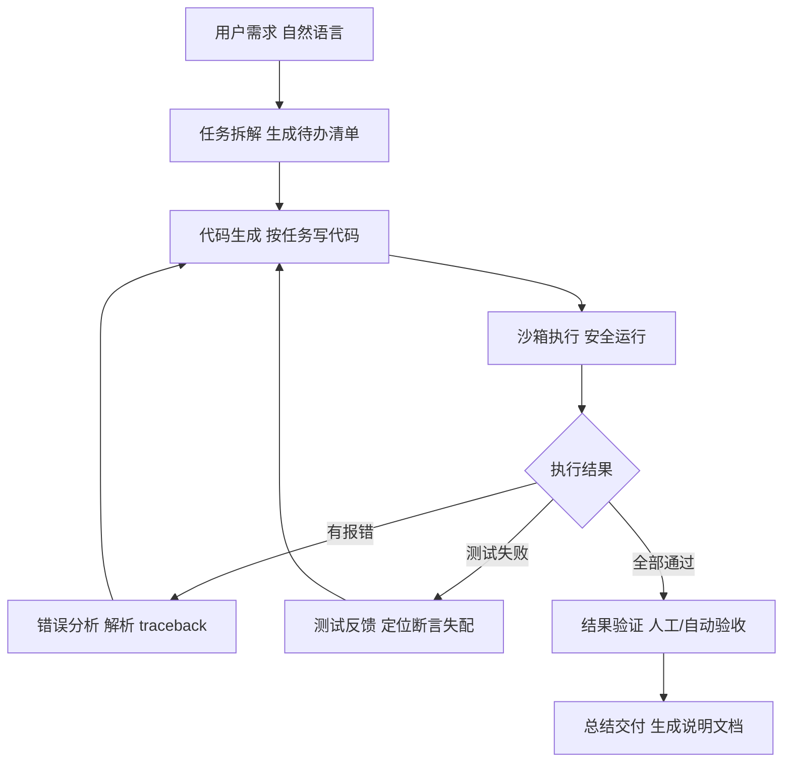
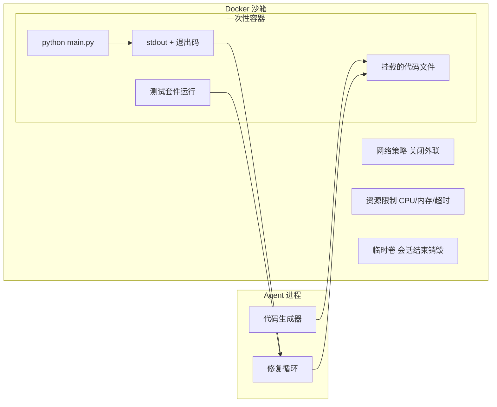
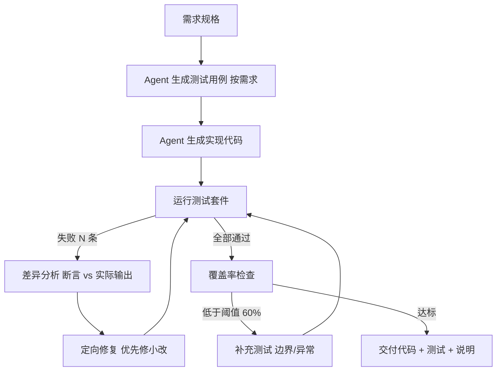
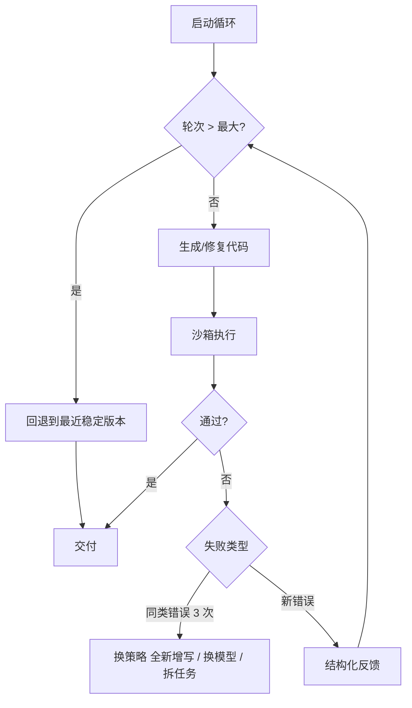

# 代码 Agent 开发技术手册

> 定位：知识库第 31 篇 · v8.0 · 37 课完整版系列
> 前置要求：已完成 Agent 基础、工具集成与自定义工具开发、LangGraph 状态管理
> 学习目标：掌握代码生成型 Agent 的完整闭环——生成、执行、测试、修复、反思

---

## 1. 代码 Agent 的本质

代码 Agent（Code Agent / Coding Agent）是**以"代码起草 - 执行 - 验证 - 修复"循环为核心**的智能体。它与普通对话式 Agent 的最大区别：

| 维度 | 普通 Agent | 代码 Agent |
| --- | --- | --- |
| 主要动作 | 调用工具/查资料 | 写代码 + 跑代码 + 读报错 |
| 反馈来源 | LLM 自身判断 | 真实执行结果（编译错误、测试失败、覆盖率） |
| 闭环动力 | 用户追问 | 测试失败自动触发修复 |
| 典型场景 | 客服、检索问答 | 自动编程、数据分析、算法求解 |

关键洞察：**执行环境是代码 Agent 的"外部事实源"。** LLM 生成代码后，由沙箱真实运行，用运行结果（报错信息、测试断言、输出比对）作为下一轮迭代的输入，形成"模型幻觉 → 环境纠错"的信任机制。

---

## 2. 核心循环架构



循环终止条件（三选一）：
1. 所有测试通过且无 lint 错误
2. 达到最大迭代轮次（建议 3-5 轮，防止死循环烧钱）
3. 用户主动叫停

---

## 3. 沙箱执行模型

### 3.1 为什么必须沙箱

LLM 生成的代码不可信因素：读取敏感文件、执行系统命令、无限循环、占满内存、外发数据。**沙箱隔离是安全红线，不可省略。**

### 3.2 三层沙箱方案

| 层级 | 实现 | 隔离强度 | 适用场景 |
| --- | --- | --- | --- |
| 纯 Python 层 | `exec` + 受限命名空间 + 资源限制 | 弱（可被绕出） | 教学 demo |
| 子进程层 | 子进程 + timeout + 内存上限 + 只读目录 | 中 | 本地工具型 Agent |
| 容器层 | Docker 一次性容器、无网络、临时卷 | 强 | 生产级 |



### 3.3 执行器接口设计

```python
import subprocess, resource

def run_code_in_sandbox(code: str, timeout: int = 30) -> dict:
    """子进程沙箱执行：返回输出、退出码、错误摘要。"""
    result = subprocess.run(
        ["python", "-c", code],
        capture_output=True, text=True, timeout=timeout,
        env={"PATH": "/usr/bin:/bin"},   # 精简环境
    )
    return {
        "stdout": result.stdout[-2000:],   # 只保留尾部输出
        "stderr": result.stderr[-3000:],
        "exit_code": result.returncode,
        "timed_out": False,
    }
```

Docker 沙箱示例（生产级）:

```bash
docker run --rm \
  --network none \
  --memory 512m \
  --cpus 1 \
  --read-only \
  -v "$(pwd)/agent_work:/work" \
  -w /work \
  python:3.12-slim \
  python main.py
```

---

## 4. 测试驱动闭环（TDD 循环）

代码 Agent 的可靠性核心是**自动测试**。标准模式：Agent 同时产出实现代码 + 测试用例，用测试结果驱动修复。



### 4.1 测试反馈结构化

把报错转化为结构化反馈比贴原文更有用：

```python
def build_test_feedback(failures: list[dict]) -> str:
    """把 pytest 输出压缩为结构化反馈。"""
    lines = []
    for f in failures[:5]:  # 最多反馈5条，控制 token
        lines.append(f"- TEST {f['name']}: 期望 {f['expected']}，实际 {f['actual']}")
    return "\n".join(lines)
```

> 技巧：只回传最近 3-5 条失败与最相关 stderr 尾部，避免上下文爆炸；同时把"已修过的方案"记入记忆，防止重复犯错。

---

## 5. 上下文管理策略

代码 Agent 最大的工程难点是上下文窗口。策略清单：

| 问题 | 策略 |
| --- | --- |
| 代码文件太大 | 只注入"符号表 + 相关函数"而非全文 |
| 报错栈太长 | 截断只保留首尾 + 定位文件:行号 |
| 历史修复无进展 | 记录"已尝试方案黑名单" |
| 多文件工程 | 首轮生成骨架，后续按需读文件 |
| 测试文件增长 | 测试文件单独存，不进主上下文 |

实现示例（符号表抽取）：

```python
import ast

def extract_symbols(code: str) -> list[str]:
    """提取函数签名与类定义，供 Agent 选择性加载。"""
    tree = ast.parse(code)
    symbols = []
    for node in tree.body:
        if isinstance(node, (ast.FunctionDef, ast.ClassDef)):
            symbols.append(f"{type(node).__name__}: {node.name}({args_to_str(node)})")
    return symbols
```

---

## 6. 典型失败模式与应对

| 失败模式 | 表现 | 应对策略 |
| --- | --- | --- |
| 幻觉 API | 调用不存在的库函数 | 沙箱执行立即暴露 ImportError；注入"已安装包清单" |
| 修复循环发散 | 越改越乱 | 设最大轮次；超限回退到上一稳定版本 |
| 上下文污染 | 旧错误信息干扰新判断 | 每轮清洗反馈；只保留最新错误 |
| 测试写得太松 | 测试通过但没验到点 | 覆盖率检查 + 边界用例补充 |
| 死循环/高消耗 | 无限循环、超长输出 | 执行超时 + 输出截断 + 资源限制 |



---

## 7. 生产级代码 Agent 检查清单

- [ ] 沙箱：容器隔离、无网络、资源限制、超时保护（必须）
- [ ] 反馈：结构化错误反馈，只回传关键信息（必须）
- [ ] 终止：最大迭代轮次 3-5、超时兜底（必须）
- [ ] 测试：交付物含测试套件、覆盖率阈值（建议 60%+）
- [ ] 记忆：已尝试方案黑名单，防重复错误（建议）
- [ ] 输出限制：单次输出 ≤ 阈值、stdout 截断（建议）
- [ ] 审计日志：记录每轮代码、执行结果、修复动作（生产必选）
- [ ] 权限：工作目录隔离、敏感路径清单拦截（生产必选）
- [ ] 回落机制：失败时回退上一稳定版本并告知用户（建议）

---

## 8. 相关主题导航

| 相关章节 | 内容 |
| --- | --- |
| 第22课 工具集成 | 自定义工具开发规范 |
| 第29课 自定义模型 | 模型接入与路由 |
| 附录J 版本迁移 | API 变化应对 |
| 附录D 错误排查 | 运行期问题定位 |