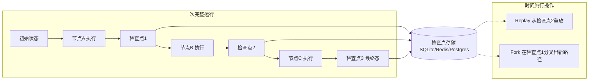
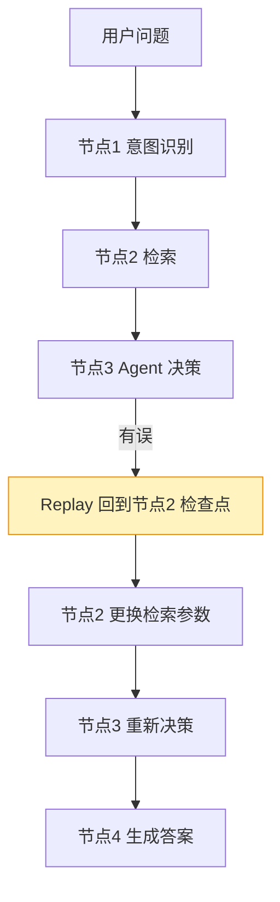
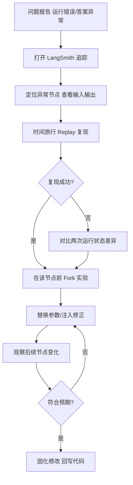
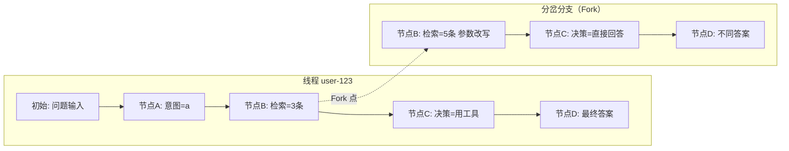

# LangGraph 时间旅行与调试技术手册

> 定位：知识库第 32 篇 · v8.0 · 37 课完整版系列
> 前置要求：已完成 LangGraph 状态管理、检查点、复杂工作流模式
> 学习目标：掌握基于检查点的回放（replay）、分支（fork）与时间旅行调试，构建可观测、可回溯的图应用

---

## 1. 为什么需要时间旅行

LangGraph 应用是**有状态**的：每次运行都在状态上叠加更新。生产环境中常遇到：

- 某次运行在步骤 3 出错，重跑一遍代价高（调用多个 LLM 与外部 API）
- Agent 决策链出现"错误分支"，想从出错的步骤点回退重试
- 需要审计：某次回答是基于什么中间状态得出的
- 想实验："如果第 2 步换成另一种检索方式，后面会怎样？"

时间旅行（Time Travel）基于**检查点（Checkpoint）机制**提供三个能力：

| 能力 | 英文 | 含义 |
| --- | --- | --- |
| 回放 | Replay | 从历史某检查点重新执行，保留该点之前的全部状态 |
| 分支 | Fork | 在历史某检查点"分岔"出一条新路径继续执行 |
| 回溯审计 | Audit | 列出运行的所有检查点与状态快照 |

---

## 2. 检查点机制原理



每个检查点保存：`状态值 + 元数据（时间戳、运行ID、父节点）`。通过 `thread_id` 定位运行历史，通过 `checkpoint_id` 定位具体步骤。



---

## 3. 核心实现

### 3.1 启用检查点（持久化）

```python
from langgraph.checkpoint.sqlite import SqliteSaver
from langgraph.graph import StateGraph

with SqliteSaver.from_conn_string("checkpoints.sqlite") as saver:
    graph = StateGraph(MyState)
    # ... 定义节点与边 ...
    app = graph.compile(checkpointer=saver)
```

生产环境建议用 `AsyncSqliteSaver` 或 Postgres/Redis 检查点，支持多实例共享：

```bash
# 依赖示例（以实际版本为准）
pip install langgraph-checkpoint-sqlite
```

### 3.2 获取检查点列表（回溯审计）

```python
config = {"configurable": {"thread_id": "user-123"}}
# 查看该线程的所有状态快照（倒序）
states = list(app.get_state_history(config))
for s in states[:5]:
    print(s.values, "->", s.config["configurable"]["checkpoint_id"])
```

### 3.3 回放（Replay）—— 从历史节点重跑

```python
# 找到目标 checkpoint_id 后，从该点重放
replay_config = {
    "configurable": {
        "thread_id": "user-123",
        "checkpoint_id": target_checkpoint_id,
    }
}
result = app.invoke({"user_query": "重新问一次"}, config=replay_config)
```

回放语义：**从指定检查点之后重新执行**，检查点之前的节点结果不再重复计算（不重复调用 LLM/API），直接使用历史状态。

### 3.4 分支（Fork）—— 分岔出新路径

```python
# Fork：在当前串上分岔，产生新的运行线，不污染原历史
fork_config = {
    "configurable": {
        "thread_id": "user-123",
        "checkpoint_id": fork_point_id,
        # 从该点注入新的状态覆盖
        "override": {"retrieval_query": "新的检索改写"}
    }
}
# 注入覆盖状态后继续执行
result = app.invoke({"user_query": "继续"}, config=fork_config)
```

| 操作 | 是否修改原历史 | 典型用途 |
| --- | --- | --- |
| Replay | 否（只读重放） | 排查错误、复现问题 |
| Fork | 否（产生并行分支线） | A/B 实验、干预调参、人工接管 |
| 直接 Update 状态 | 是（修改当前线程） | 手工修正中间结果 |

---

## 4. 调试工作流（与 LangSmith 结合）



调试要点：

1. **先快照后动手**：Fork 前先记录当前 checkpoint_id 作为安全回退点
2. **小步实验**：一次只改一个输入维度，观察状态变化
3. **善用 override**：直接注入你认为正确的中间结果，验证下游逻辑
4. **日志分级**：节点内打点记录关键输入输出摘要，便于事后回溯

```python
# 节点内的轻量日志约定
def my_node(state):
    log.append({ "node": "my_node", "input_summary": summarize(state["query"]), "ts": now() })
    # ... 业务逻辑
    log.append({ "node": "my_node", "output_summary": summarize(result), "ts": now() })
    return {"result": result}
```

---

## 5. 状态演化可视化



> 注意：上图为分支示意图，Fork 实际不会修改原运行的历史记录，而是派生新的线程记录；生产实现中可通过 `thread_id` 前缀隔离实验分支。

---

## 6. 生产级实践清单

- [ ] 每个线程开启持久化检查点（thread 级 + checkpoint 级）
- [ ] 配置保留策略：检查点按时间窗口/条数裁剪，防止存储膨胀
- [ ] Replay/Fork 操作前记录当前 checkpoint_id 以便回退
- [ ] 敏感数据在检查点中脱敏（状态包含密钥时该字段不持久化）
- [ ] 与 LangSmith 关联：trace 与 thread_id 打通，一键跳转
- [ ] 分支实验使用独立 thread_id 命名空间，避免污染线上历史
- [ ] 为 Replay 提供只读模式：实验时不写回生产存储
- [ ] 监控检查点写入延迟与存储磁盘占用

> 补充：检查点会保存状态全量（含工具返回值、中间消息），存储设计按"高频小步"原则切分，避免单点过大。

---

## 7. 典型场景速查

| 场景 | 推荐操作 | 说明 |
| --- | --- | --- |
| 答案错了想重试 | Fork + override 中间结果 | 精准干预 |
| 节点报错想复现 | Replay 定位点 | 不重跑昂贵步骤 |
| 想对比两种策略 | 两个 Fork 分支并行跑 | A/B 对照 |
| 审计用户会话 | get_state_history 遍历 | 全量回溯 |
| 状态损坏想修复 | update_state 直接修订 | 仅限受控场景 |

相关章节：附录I Callback 事件、第26课 LangGraph 复杂工作流、第31课 Agent 评估。