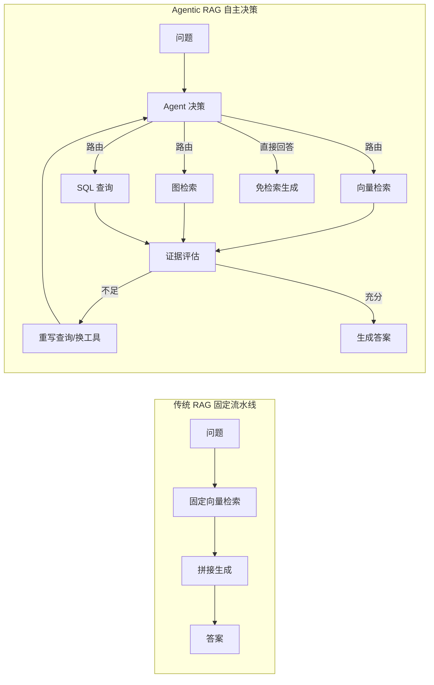
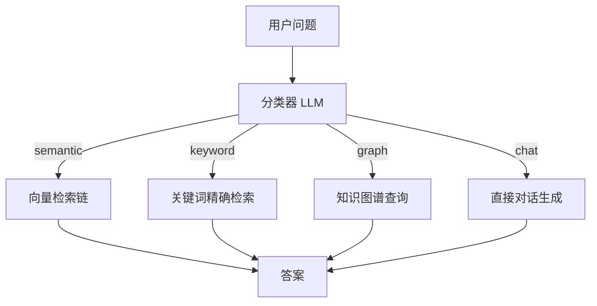
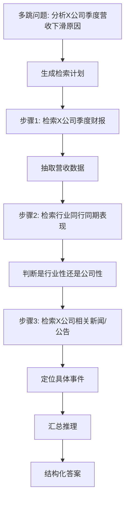
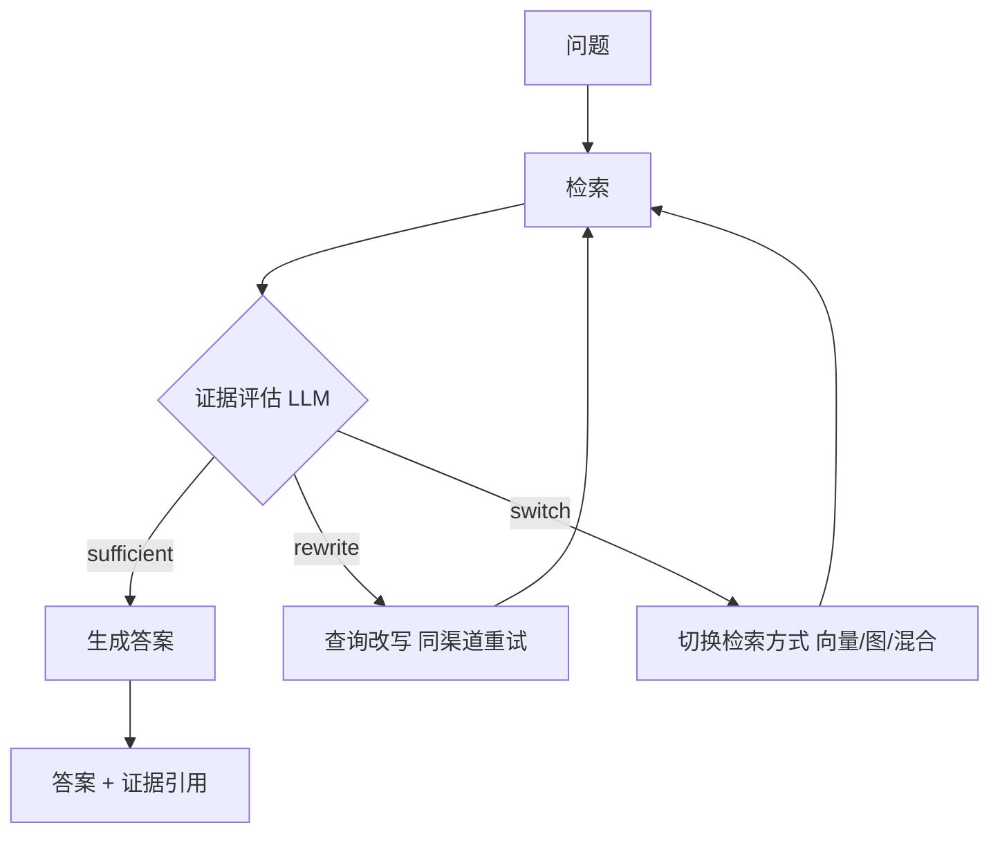
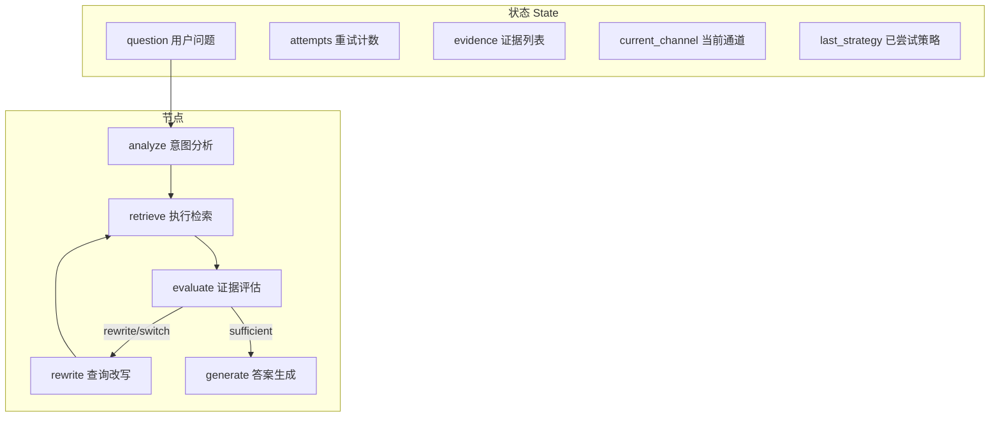

# Agentic RAG 自主检索技术手册

> 定位：知识库第 33 篇 · v8.0 · 37 课完整版系列
> 前置要求：已完成 RAG 基础、Agent 基础、多 Agent 编排、高级 RAG 优化
> 学习目标：理解 RAG 从"流水线"到"自主决策"的进化，掌握路由、规划、反思三类 Agentic RAG 模式

---

## 1. 从流水线 RAG 到 Agentic RAG

传统 RAG 是**固定的数据流水线**：检索 → 拼接 → 生成。它对所有问题一视同仁，问题类型一变就表现下降。

Agentic RAG（智能代理式 RAG）把检索决策交给 Agent：**先判断应该怎么做，再去做**。它引入 4 种新能力：

| 能力 | 解决的问题 | 传统 RAG 对应 |
| --- | --- | --- |
| 路由（Routing） | 该用向量检索、图检索、SQL 还是直接回答？ | 固定单一检索器 |
| 规划（Planning） | 复杂问题拆成多步，逐步检索与推理 | 一次检索到底 |
| 工具调用（Tool Use） | 检索器只是众多工具之一，Agent 自主选择 | 检索器是唯一输入源 |
| 反思（Reflection） | 检索结果不够就换策略重试 | 拿什么用什么 |



一句话总结：**传统 RAG 是"问一次、查一次、答一次"；Agentic RAG 是"边查边想，不够再查，直至能答"。**

---

## 2. 三种核心模式

### 模式一：路由器（Router）—— 让问题走对通道

```python
from langchain_core.prompts import ChatPromptTemplate
from langchain_core.runnables import RunnableBranch

classify_prompt = ChatPromptTemplate.from_template("""
将用户问题分类到以下通道之一（只输出通道名）：
- keyword：关键词明确，如产品名、人名、型号
- semantic：需要理解语义找相似内容
- graph：涉及实体间关系、多跳推理
- chat：闲聊或通用知识，无需检索

用户问题：{question}
""")

router = classify_prompt | llm | StrOutputParser()

branch = RunnableBranch(
    (lambda x: x == "keyword", keyword_chain),
    (lambda x: x == "semantic", vector_chain),
    (lambda x: x == "graph", graph_chain),
    chat_chain,  # 默认
)
router_chain = {"question": itemgetter("question"),
                "channel": router} | branch
```

路由决策流程：



### 模式二：规划器（Planner）—— 复杂问题分步解决



```python
# 规划器核心：让 Agent 生成步骤序列再逐步执行
plan = planner.invoke({"question": question})   # 得到 list[step]
intermediate = {}
for step in plan:
    result = execute_step(step, intermediate)    # 每步可复用前步结果
    intermediate[step.key] = result
answer = synthesizer.invoke({"plan": plan, "results": intermediate})
```

### 模式三：反思器（Reflector）—— 检索不足主动补救

```python
evaluator_prompt = ChatPromptTemplate.from_template("""
基于检索证据评估能否回答问题。
证据：{evidence}
问题：{question}
如果证据足以回答，输出 "sufficient"；
如果部分相关但不足，输出 "rewrite"（建议改写查询）；
如果证据与问题无关，输出 "switch"（建议更换检索方式）。
""")
```

反思循环：



---

## 3. 系统架构与状态设计（LangGraph 实现）

Agentic RAG 天然适合用 LangGraph 表达。核心状态与节点：



```python
from typing import Literal
from typing_extensions import TypedDict
from langgraph.graph import StateGraph, START, END

class AgenticRAGState(TypedDict):
    question: str
    attempts: int
    evidence: list
    channel: str
    last_strategy: list        # 已尝试策略，防重复

MAX_ATTEMPTS = 3

def should_continue(state) -> Literal["rewrite", "generate", "end"]:
    if state["attempts"] >= MAX_ATTEMPTS:
        return "end"           # 给用户"尽力回答+证据不足"说明
    if len(state["evidence"]) < 2:
        return "rewrite"
    return "generate"

builder = StateGraph(AgenticRAGState)
builder.add_node("analyze", analyze_node)
builder.add_node("retrieve", retrieve_node)
builder.add_node("evaluate", evaluate_node)
builder.add_node("rewrite", rewrite_node)
builder.add_node("generate", generate_node)
builder.add_edge(START, "analyze")
builder.add_edge("analyze", "retrieve")
builder.add_edge("retrieve", "evaluate")
builder.add_conditional_edges("evaluate", should_continue,
                              {"rewrite": "rewrite", "generate": "generate", "end": END})
builder.add_edge("rewrite", "retrieve")
app = builder.compile(checkpointer=saver)
```

---

## 4. 与高级 RAG 技术的关系

Agentic RAG 不是替代而是**编排**已有的高级技术：

| 已有技术 | 在 Agentic RAG 中的角色 |
| --- | --- |
| 查询改写（Query Rewriting） | 反思循环的 rewrite 动作 |
| 混合检索（Hybrid Search） | 某通道内部的融合策略 |
| 重排序（Rerank） | 证据评估前的精排 |
| 多查询分解（Multi-Query） | 规划器的子步骤工具 |
| 上下文压缩 | 证据送入生成前的清洗 |
| Self-RAG | 反思模式的代表实现（按需检索+按需生成） |

**分层设计**：Agentic 决策层（浅层、廉价 LLM）负责路由/评估，RAG 执行层（深层、强模型）负责生成。这能把复杂逻辑做对，同时控制成本。

---

## 5. 成本与延迟控制

| 手段 | 效果 |
| --- | --- |
| 用轻量模型（小模型/分类器）做路由与评估 | 单轮决策成本下降一个数量级 |
| 缓存检索结果（问题哈希） | 重复问题秒回 |
| 限制最大轮次（3）与总 token 预算 | 防止失控重试 |
| 评估节点用规则预筛（证据数量、相似度阈值）| 少一轮 LLM 调用 |
| 并行检索（通道并行） | 延迟摊薄 |
| 早期退出：证据充分立即生成 | 减少无谓轮次 |

---

## 6. 评估指标扩展

传统 RAG 指标之外，Agentic RAG 需额外衡量：

| 指标 | 含义 | 度量方式 |
| --- | --- | --- |
| 路由准确率 | 问题走对了通道 | 标注测试集 |
| 轮次分布 | 多少问题 1/2/3 轮解决 | 运行统计 |
| 检索挽救率 | 反思后答案质量提升比例 | 对照实验 |
| 无效重试率 | 换了策略仍无改进的次数占比 | 日志统计 |
| 每问题成本 | 平均 token/费用 | LangSmith 汇总 |

---

## 7. 上线检查清单

- [ ] 明确每个通道的服务对象与边界（什么不查）
- [ ] MAX_ATTEMPTS 与总预算设定（防止死循环）
- [ ] 所有 Agent 决策节点用低延迟模型，生成节点用强模型
- [ ] 检索结果引用来源，反思改动后更新引用
- [ ] 记录每次路由/反思决策，供评估与调优
- [ ] 降级链路：Agent 层故障时回退到固定流水线 RAG
- [ ] 评估集覆盖 4 类问题（闲聊、单跳、多跳、全局）

---

## 8. 相关主题导航

| 相关章节 | 内容 |
| --- | --- |
| 知识库26 复杂工作流 | 图状态与条件边 |
| 知识库30 GraphRAG | 图谱通道实现 |
| 附录K LangServe | Agentic RAG 服务化部署 |
| 附录N 数据库Agent | SQL 通道与结构化查询 |