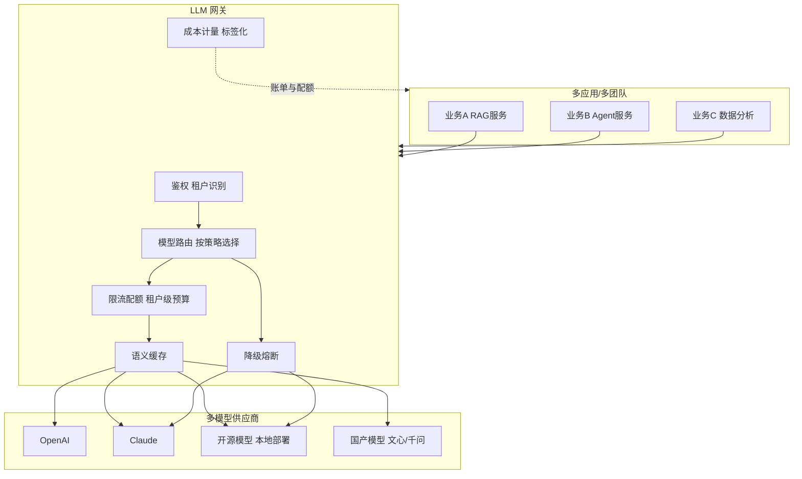
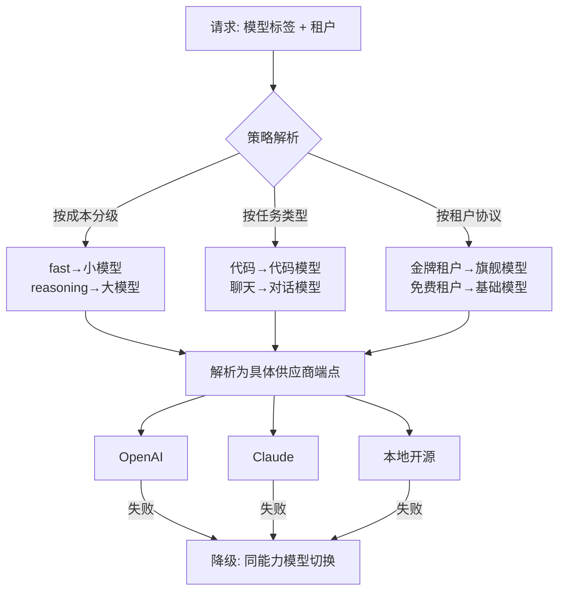

# 多租户 LLM 网关与统一接入架构手册

> 定位：知识库第 35 篇 · v9.0 · 41 课完整版系列
> 前置要求：已完成自定义模型集成与路由（KB29）、LangServe 部署（附录K）
> 学习目标：掌握生产级 LLM 流量治理——统一接入、模型路由、限流配额、成本分摊与降级策略

---

## 1. 为什么需要 LLM 网关

当应用从单个链走向多团队、多应用、多模型时，直接各自调模型 API 会失控：

| 问题 | 后果 |
| --- | --- |
| 模型 API 散落在各应用 | 无法统一更换/升级模型 |
| 无统一鉴权与配额 | 成本失控、被恶意刷量 |
| 无降级机制 | 单模型故障全线瘫痪 |
| 无法分摊成本 | 不知道谁花了多少钱 |
| 无统一观测 | 每应用一套日志 |

**LLM 网关 = 所有模型调用的统一入口**，负责路由、治理、观测三大职责。



---

## 2. 网关核心能力

### 2.1 统一接入（OpenAI 兼容协议）

网关对外暴露**统一接口**，内部适配各供应商。最实用的是 OpenAI 兼容格式——所有主流框架（LangChain 等）都能直接对接：

```text
POST /v1/chat/completions      # 聊天补全
POST /v1/embeddings            # 向量生成
POST /v1/responses             # 响应流

请求头: Authorization: Bearer <租户密钥>
       X-Tenant-Id: team-a
       X-Model-Tag: fast        # 逻辑模型名
```

### 2.2 模型路由策略



**关键设计：逻辑模型名 vs 物理模型名**。应用只声明"我要 fast"，网关决定"fast 映射到 gpt-4o-mini 还是 qwen-turbo"——换模型不动应用代码。

### 2.3 限流与配额（租户维度）

```python
# 三类限流失效示例（防刷量 + 成本控制）
rules = {
    "team-a": {"rpm": 600, "tpm": 1000000, "daily_cost_cap": 500.0},
    "team-b": {"rpm": 100, "tpm": 200000,  "daily_cost_cap": 100.0},
}

def check_quota(tenant: str) -> bool:
    bucket = rate_limiters[tenant]
    if not bucket.allow():                       # 限流
        return False
    if cost_meter.daily_cost(tenant) >= rules[tenant]["daily_cost_cap"]:
        return False                              # 成本封顶
    return True
```

### 2.4 语义缓存（省钱利器）

相同或近似请求可命中缓存，吞吐提升、成本下降：

```python
from langchain_core.caches import InMemoryCache

# 用 embedding 相似度做语义缓存，相似度 > 0.95 直接返回缓存结果
def smart_cache(query, model, tenant):
    key = embed(query)
    hit = vector_cache.search(key, top_k=1)
    if hit and hit.similarity > 0.95 and hit.model == model:
        track("cache_hit", tenant=tenant)
        return hit.answer
    return None
```

注意事项：缓存只对**确定性请求**开启（不缓存个性化、实时数据类请求）；缓存键需包含租户，防止跨租户数据泄露。

---

## 3. 成本计量与分摊

每个请求打标签（Tenant / App / Feature / Model / User），聚合成账单：

| 标签维度 | 示例 | 分摊用途 |
| --- | --- | --- |
| 租户 | team-a | 部门成本 |
| 应用 | rag-service | 应用成本 |
| 模型 | gpt-4o | 模型成本对比 |
| 功能 | chat, summary | 功能 ROI |
| 用户 | user-123 | 异常用户定位 |

```text
每日成本报表示例（按租户）:
team-a  tokens=2,100,000   cost=¥318.50  cache_hit=43%
team-b  tokens=640,000    cost=¥96.20   cache_hit=12%
合计    tokens=2,740,000   cost=¥414.70
```

---

## 4. 网关技术选型

| 方案 | 特点 | 适用 |
| --- | --- | --- |
| LangSmith / 托管平台 | 观测与网关结合 | 预算充足、快速起步 |
| LiteLLM（开源库） | OpenAI 兼容代理、多供应商 | 小团队快速搭建 |
| Higress/Apache APISIX + AI 插件 | 云原生网关扩展 | 已有网关基础设施 |
| 自研（FastAPI + Redis） | 完全可控、深度定制 | 大规模专用场景 |
| 云厂商 API Gateway | 免运维、弹性 | 云原生环境 |

选型建议：**先挂 LiteLLM 快速打通，规模与管控需求复杂后再自研或上云网关**；网关层保持薄，业务逻辑不放网关。

---

## 5. 生产清单

- [ ] 对外统一 OpenAI 兼容接口；逻辑模型名与物理模型名分离（必须）
- [ ] 租户鉴权（API Key/签名）+ 租户级限流配额 + 成本封顶（必须）
- [ ] 降级/熔断：模型故障秒级切换备用模型，失败重试有上限（必须）
- [ ] 语义缓存命中率监控（建议目标 20-40%）
- [ ] 全量请求标签化（Tenant/App/Model/Feature）与成本报表（建议）
- [ ] 敏感内容过滤（安全网关，见 KB34）与 PII 脱敏（必须）
- [ ] 流式透传与超时控制（必须）
- [ ] 审计：请求级日志可回放（建议）

---

## 6. 相关主题导航

| 相关章节 | 内容 |
| --- | --- |
| KB29 自定义模型集成与路由 | 网关底层路由实现 |
| 附录K LangServe | 单应用服务化 |
| KB34 Agent 安全 | 网关层安全管控 |
| 附录O 监控告警 | 网关指标监控 |