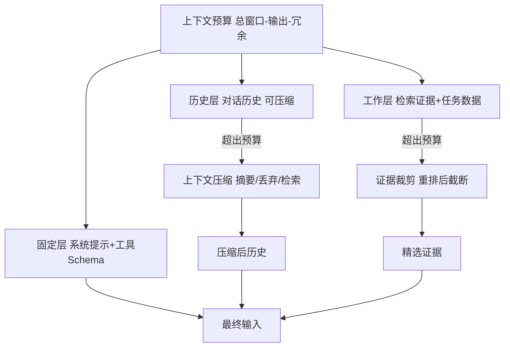
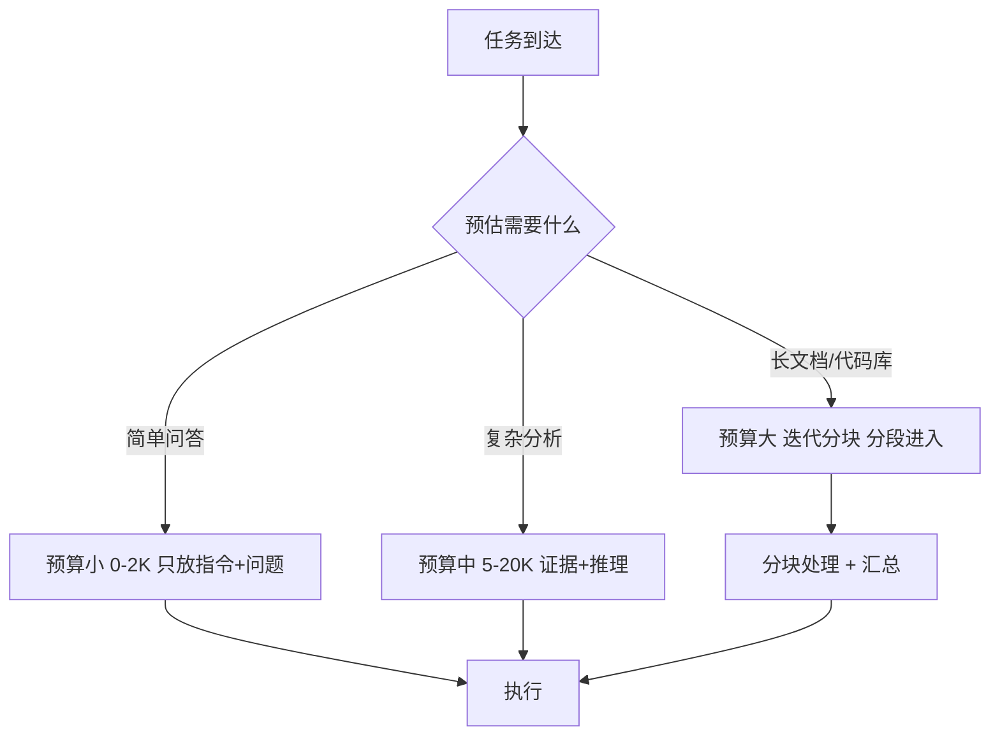

# 上下文工程与长上下文优化技术手册

> 定位：知识库第 36 篇 · v9.0 · 41 课完整版系列
> 前置要求：已完成 Prompt 工程基础、Agent 工具、上下文管理（KB31 第5节）
> 学习目标：把上下文当作"受控资源"系统化管理，掌握压缩、注入、规划与长上下文应用方法

---

## 1. 上下文的本质：最昂贵的记忆

大模型的上下文窗口就像一块**有限的、按 token 计费的画布**。你放进去什么，模型就只能用什么；放得越多，越贵、越慢、越容易"淹没"关键信息（Lost in the Middle）。

上下文工程（Context Engineering）把它当作系统资源管理：

```
输入预算 = 模型窗口 - 输出预留 - 安全冗余

窗口 128K 时:
  输出预留 2K + 安全冗余 2K = 4K
  可用输入预算 = 124K
  每次请求必须在这 124K 里塞下: 系统提示 + 历史 + 检索证据 + 工具定义 + 指令
```



---

## 2. 上下文管理四件套

### 2.1 压缩（Compression）

三类主流方法：

| 方法 | 思路 | 适合 |
| --- | --- | --- |
| 摘要压缩 | LLM 把旧对话浓缩成摘要 | 对话历史 |
| 检索压缩 | 按相关性裁掉文档中无用段落 | RAG 证据 |
| 截断策略 | 保留首尾，丢中间（或反之） | 简单兜底 |

```python
from langchain_core.prompts import ChatPromptTemplate

summarize_history = ChatPromptTemplate.from_template("""
把以下对话历史压缩成不超过 {max_tokens} token 的摘要，
保留: 用户目标、已确认的事实、未解决的请求、关键数字。
丢失: 寒暄、重复表达、已完成无用的细节。
历史:
{history}
摘要:
""")
```

> 注意：摘要会丢细节，且摘要链会累积误差（摘要的摘要）。混合策略：近 N 轮保留原文 + 更早的压缩成摘要。

### 2.2 注入（Injection）—— 关键信息前置

研究发现：模型对**开头和结尾**的内容记忆最好，中间段容易被忽略（Lost in the Middle）。按信息重要性排序：

```
第1位  系统指令与任务定义     （最高优先）
第2位  用户当前问题           （必须完整）
第3位  关键约束/输出格式       （重要）
第4位  检索证据与参考材料      （由重排决定顺序）
第5位  历史对话               （可压缩）
```

```python
def assemble_context(query, evidence, history, system_prompt):
    # 手动排序: 系统 > 问题 > 证据(按重排分) > 历史
    ranked = sorted(evidence, key=lambda d: d["score"], reverse=True)
    parts = [
        ("系统", system_prompt),
        ("任务", f"任务: {query}"),
        ("证据", format_evidence(ranked[:TOPK])),
        ("历史", summarize_if_needed(history)),
    ]
    return join_with_delimiters(parts)
```

### 2.3 规划（Planning）—— 用多少、怎么用



对超长文档，一次性塞进窗口不合理（贵且质量差）。**分块-处理-汇总**模式：先对每个块做局部处理（提取、摘要、问答），再汇总结果。

### 2.4 检索（Retrieval-Augmented Context）

长对话/长文档场景下上下文不一定全在窗口里：把"过去"变成"可检索的记忆"。典型实现：

```python
# 对话记忆向量化: 超出窗口的旧消息写入向量库，需要时检索回填
def get_history_for(question, recent_messages, memory_store):
    recent = recent_messages[-8:]                     # 最近8轮原文
    recalled = memory_store.search(question, k=5)     # 更早的按需检索
    return recent + recalled
```

这是 RAG 思想在对话历史上的应用，也叫"记忆即检索"。

---

## 3. 长上下文专项（128K+ 窗口）

窗口变大不意味着可以无脑塞：

| 场景 | 正确做法 | 错误做法 |
| --- | --- | --- |
| 长文档问答 | 分块+定位检索+引用 | 全文塞入 |
| 代码库分析 | 符号表+相关函数+AST摘要 | 丢整仓代码 |
| 多文件对比 | 两两差分 | 全部拼接 |
| 超长对话 | 滚动压缩+记忆检索 | 全量历史 |

**长上下文的核心心法：窗口是给模型的，不是给你的垃圾箱。** 主动管理比依赖大窗口更可靠、更便宜。

### 内容定位口诀

```text
进入上下文的每一段内容都要能回答：
1. 它服务当前哪个任务？      （否则不进）
2. 它是最新/最准的版本吗？   （版本去重）
3. 它的信息密度够高吗？      （摘要代替全文）
4. 它放在哪个优先级位置？    （重要前置）
```

---

## 4. 工程清单（进入生产前核对）

- [ ] 上下文预算明确（窗口-输出-冗余），输入组装有字节/token 硬校验（必须）
- [ ] 系统提示 + 问题 + 约束前置；中间段只放可丢失内容（必须）
- [ ] 历史有压缩策略：近原文 + 远摘要 + 记忆检索（必须）
- [ ] 检索证据按重排分数排序，超预算时先裁低分（必须）
- [ ] 长文档走分块-处理-汇总，不全文硬塞（建议）
- [ ] 监控输入 token 分布（系统/证据/历史占比）与有效利用率（建议）
- [ ] 摘要链误差控制：摘要的摘要最多 2 层（建议）
- [ ] 评测：压缩后关键信息保留率抽样检查（建议）

---

## 5. 相关主题导航

| 相关章节 | 内容 |
| --- | --- |
| KB31 代码Agent 第5节 | 代码场景上下文管理 |
| KB25 高级RAG 查询变换 | 检索证据裁剪 |
| KB37 幻觉检测 | 上下文不全与幻觉的关系 |
| 附录O 监控告警 | 上下文用量监控 |