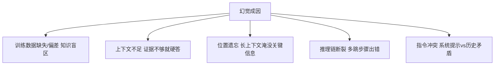
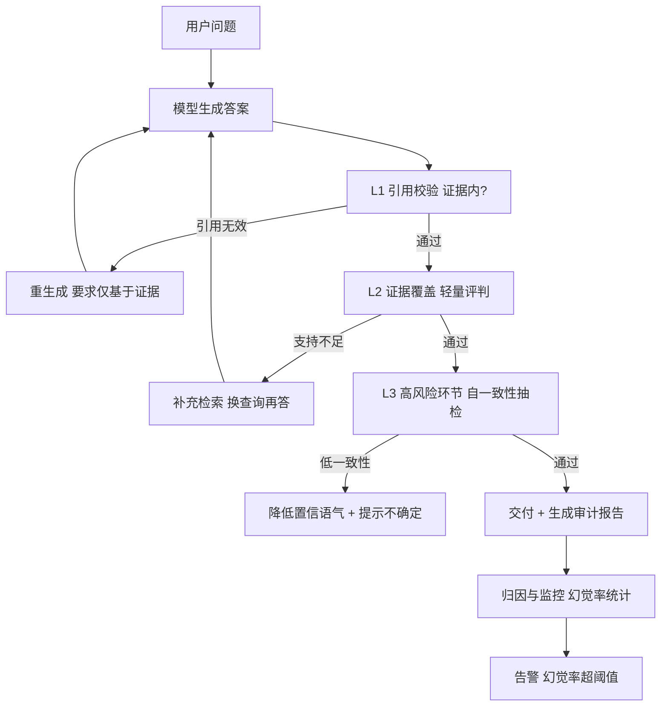

# 幻觉检测与可靠性工程技术手册

> 定位：知识库第 37 篇 · v9.0 · 41 课完整版系列
> 前置要求：已完成 RAG 评估（KB27）、测试策略（附录L）、上下文工程（KB36）
> 学习目标：理解幻觉成因与类型，掌握检测方法与可靠性工程体系，把"AI 说错话"变成"可发现、可拦截、可兜底"

---

## 1. 幻觉的本质

幻觉（Hallucination）指模型生成**看似合理但不符合事实**的内容。它本质上是**解码概率的副作用**：模型按概率续写，而不是查证事实。

关键认知：**幻觉无法 100% 消除，但可以被检测、拦截和兜底。** 可靠性工程的目标不是"模型永不犯错"，而是"错了能被发现"。



### 幻觉类型

| 类型 | 特征 | 示例 | 检测难度 |
| --- | --- | --- | --- |
| 事实性幻觉 | 与客观事实冲突 | "LangChain 由 OpenAI 开发" | 中（需知识库） |
| 上下文冲突 | 与提供的资料矛盾 | 资料写 A，回答 B | 低（对照证据即可） |
| 逻辑幻觉 | 推理链条站不住 | "结论如此，因为……"漏洞百出 | 高 |
| 统计幻觉 | 数字编造 | "准确率达 98.3%"（无来源） | 高 |

---

## 2. 检测方法体系

### 2.1 基于证据的检测（主要手段，适合 RAG）

核心思路：**答案必须能"追溯到证据"**，无法追溯即为可疑。

```python
from langchain_core.prompts import ChatPromptTemplate

claimer_detector = ChatPromptTemplate.from_template("""
你是事实核查器。判断答案中的每个论断是否被给定证据支持。

证据: {evidence}
答案: {answer}

对答案逐条输出:
论断 | 支持程度(fully/partial/none) | 证据引用或"无引用"

只输出上述清单，不要修改答案。
""")

def verify_answer(answer, evidence):
    result = claimer_detector.invoke({"evidence": evidence, "answer": answer})
    return parse_claims(result)      # -> [{"claim":..., "support":..., "ref":...}]
```

落地策略（LLM 评判 vs 规则）：

| 检测任务 | 工具 | 说明 |
| --- | --- | --- |
| 证据覆盖度 | 轻量 LLM 评判器 | 快、便宜、够用 |
| 引用有效性 | 规则（引用位置是否在证据内） | 零成本、确定 |
| 数值核查 | 规则 + 计算器 | 数字做算术验证 |
| 语义一致性 | 更强 LLM 评判 | 重点环节人工抽检 |

### 2.2 自一致性（Self-Consistency）

同一问题多次采样，答案一致则可信度高：

```python
def self_consistency(question, llm, n=5):
    answers = [llm.invoke(question + "\n请直接回答。") for _ in range(n)]
    groups = cluster_by_semantic(answers)   # 按语义聚类
    dominant = max(groups.values(), key=len)
    consistency = len(dominant) / n          # 0~1
    return dominant_representative, consistency
```

> 成本高（n 次调用），适合高风险环节（合同、医疗、审计类回答）抽样使用。

### 2.3 不确定性信号

模型暴露的不确定信号也可利用：

- 输出中带"可能、我不确定"等弱化词
- Token 概率均匀（无高置信 token）——高科技通过 logprobs 观测
- 温度高时答案漂移大

```python
# 通过 logprobs 检测低置信输出（示意）
resp = llm.invoke(prompt, logprobs=True, top_logprobs=5)
avg_confidence = mean(top_prob for token in resp)
if avg_confidence < 0.6:
    flag("low_confidence", avg_confidence)
```

---

## 3. 检测 → 拦截 → 兜底的完整链路



### 可靠性工程三原则

1. **让模型"可以承认不知道"**：Prompt 明确允许"证据不足时说不知道"，降低不懂装懂
2. **强制引用**：RAG 回答必须带引用（文档ID/页码），可疑之处让用户可验证
3. **分层兜底**：检测不过 → 重生成 / 补充检索 / 明示不确定，最后兜底是"明说不知道"

```python
def reliable_chain(question, retriever, llm, max_retry=2):
    for attempt in range(max_retry + 1):
        evidence = retriever.invoke(question)
        answer = llm.invoke(build_prompt(question, evidence, require_citation=True))
        report = verify_answer(answer, evidence)
        if report.rejection_rate() < 0.2:
            return answer, report
        question = rewrite_for_more_evidence(question, report)  # 换查询再试
    return "基于现有资料无法可靠回答该问题。", report
```

---

## 4. 幻觉率度量（指标体系）

| 指标 | 定义 | 度量方式 |
| --- | --- | --- |
| 幻觉率 | 含未支持论断的回答占比 | 评测集 + 评判器 |
| 引用有效率 | 引用指向真实存在的证据 | 规则检查 |
| 拒绝率 | 承认无法回答的占比 | 输出文本分析 |
| 重生成率 | 触发补救流程的占比 | 日志统计 |
| 用户反馈分 | 用户对回答的评分 | 产品埋点 |

基准建立：**不要用大盘平均百态，按领域/场景分别度量**（金融问答幻觉率 vs 闲聊幻觉率差异巨大）。

---

## 5. 生产清单

- [ ] RAG 回答强制引用机制（必须）
- [ ] L1 引用校验（规则）+ L2 证据覆盖（轻量评判）双层检测（必须）
- [ ] 高风险场景启用自一致性或人工复核（建议）
- [ ] Prompt 允许"不知道"，不强迫生成（必须）
- [ ] 幻觉率按场景建立基线与告警阈值（建议）
- [ ] 审计报告落盘：答案、证据、评判结果、补救动作（建议）
- [ ] 定期用注入的"幻觉测试集"回归（必须）
- [ ] 检测器本身评估：评判器与人工标注的吻合率（建议）

---

## 6. 相关主题导航

| 相关章节 | 内容 |
| --- | --- |
| KB27 Agent 评估 | 评测集构建 |
| KB36 上下文工程 | 证据质量与幻觉的关系 |
| 附录L 测试策略 | 回归测试 |
| KB34 Agent 安全 | 安全与可靠性协同 |