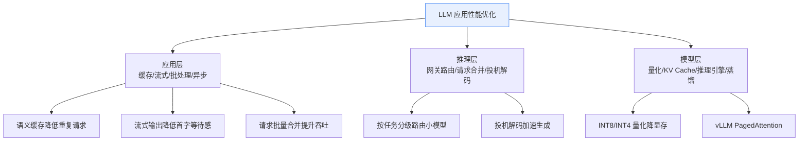
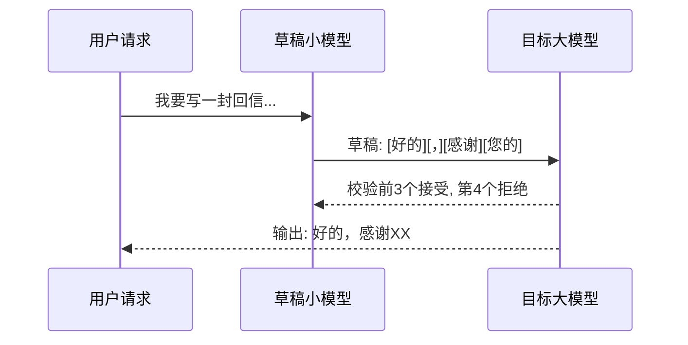
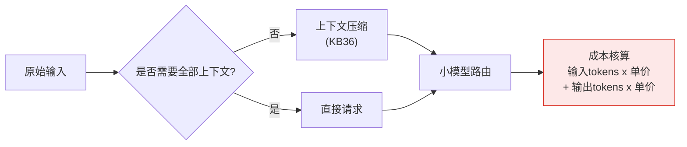

# 38_推理性能优化与延迟工程技术手册

> 系列：LangChain / LangGraph 系统学习 · 知识库 38（v10.0 第十轮）
> 定位：偏技术细节 — 代码、参数、指标与决策清单
> 前置：建议先完成第 39 课（LLM 网关）与附录 O（监控告警）

## 1 性能全景：延迟、吞吐、成本的三角平衡

生产级 LLM 应用优化，本质是在**延迟（Latency）**、**吞吐（Throughput）**与**成本（Cost）**三者之间做取舍。不存在"全都要"的免费午餐：压延迟通常牺牲吞吐或增加成本，压成本又往往拉高延迟。



### 1.1 三个必须吃透的指标

| 指标 | 全称 | 含义 | 体验影响 |
| --- | --- | --- | --- |
| TTFT | Time To First Token | 首 token 返回延迟 | 决定"是否卡住"的第一印象 |
| TPOT | Time Per Output Token | 每个输出 token 的平均时间 | 决定打字机速度 |
| E2E 延迟 | End-to-End Latency | 请求发出到全部返回 | 决定用户总等待时间 |

LangChain 中可通过 `CallbackHandler` 或 LangSmith（附录 H）直接测量这三项。

### 1.2 性能预算的黄金规则

- **交互型应用**（聊天/问答）：E2E 目标 < 3 秒，TTFT < 1 秒，配合流式把"感知延迟"压到 300ms 内。
- **批处理型应用**（日报生成/批量审核）：优先吞吐与成本，延迟可从宽。
- **总预算公式**：`单次请求成本 = 输入 token × 输入单价 + 输出 token × 输出单价`。优化目标永远围绕"减少不必要的 token"展开。

## 2 应用层优化（改代码就能见效）

### 2.1 缓存：三类缓存按需取用

| 缓存类型 | 键 | 命中效果 | 适用场景 |
| --- | --- | --- | --- |
| 精确缓存（dict / Redis） | 完整 prompt 哈希 | 秒回，零成本 | FAQ、固定查询 |
| 语义缓存（Embedding 相似度） | 向量相似度 > 阈值 | 相近问题复用 | 客服、检索类 |
| 链/子图结果缓存 | 中间节点输出 | 跳过重复计算 | 多步链公共步骤 |

```python
from langchain_core.caches import InMemoryCache
from langchain_core.globals import set_llm_cache
from langchain_openai import ChatOpenAI

set_llm_cache(InMemoryCache())          # 精确缓存：相同 prompt 直接命中
llm = ChatOpenAI(model="gpt-4o-mini", temperature=0)

# 第一次调用：真实请求
r1 = llm.invoke("朗格里格朗是什么意思")
# 第二次相同调用：命中缓存，零延迟零成本
r2 = llm.invoke("朗格里格朗是什么意思")
print("命中缓存速度极快, 结果一致:", r1.content == r2.content)
```

### 2.2 流式输出：把 3 秒变成 300 毫秒的"心理魔术"

用户感知延迟不是"全部返回时间"，而是"第一个字出现的时间"。`stream()` 让首字几乎立即出现：

```python
for chunk in llm.stream("用一句话介绍什么是向量数据库"):
    print(chunk.content, end="", flush=True)
```

生产建议：Web 端配合 SSE（Server-Sent Events）逐字推送；对话场景**默认开启流式**。

### 2.3 并发与批处理

| 方式 | LangGraph 实现 | 效果 |
| --- | --- | --- |
| 并行分支 | `Send` API / 图内并行节点 | 多个独立子任务同时跑 |
| 请求批处理 | 多轮循环合并为一次调用 | 减少往返次数 |
| 异步 | `async` 版本 invoke/astream | 释放线程，IO 密集场景吞吐翻倍 |

```python
from langgraph.constants import Send
from langgraph.graph import StateGraph, START, END

def fan_out(state):
    return [Send("summarize", {"doc": d}) for d in state["docs"]]

builder = StateGraph(State)
builder.add_node("summarize", summarize_node)
builder.add_edge(START, "fan_out")        # fan_out 节点返回 Send 列表
builder.add_conditional_edges("fan_out", fan_out, ["summarize"])
builder.add_edge("summarize", END)
```

## 3 推理层优化（平台与网关侧）

### 3.1 分级模型路由：让大模型只干大活

和知识库 35（LLM 网关）联动：按任务复杂度把请求路由到不同规格模型——简单分类用 mini 模型，复杂推理才上旗舰模型，成本可降 70%+。路由判据可来自关键词、意图分类器或小模型预判。

### 3.2 投机解码（Speculative Decoding）

用小模型**抢先草拟**后续 token，大模型一次校验多 token，单次前向生成 2-4 个 token。推理引擎（vLLM 等）已内建支持，对知识型生成（代码、结构化输出）加速明显，对随机创作类收益有限。



### 3.3 请求合并与连接复用

- 高并发场景用 HTTP 连接池 + 批处理 API 减少握手开销；
- LangChain `invoke` 换成 `batch`，框架内自动并行化。

## 4 模型层优化（引擎与权重视角）

| 技术 | 原理 | 收益 | 代价 |
| --- | --- | --- | --- |
| INT8 量化 | 权重 8bit 存储 | 显存减半 | 少数场景精度微降 |
| INT4 量化（GPTQ/AWQ） | 4bit 存储+反量化 | 显存 ¼ | 需校准集 |
| KV Cache 管理（PagedAttention） | 分页缓存连续显存 | 吞吐提升数倍 | 工程复杂度 |
| 蒸馏（Distillation） | 大模型教小模型 | 小模型近大模型效果 | 训练成本 |

落地建议：**先量化后优化**。若已有 vLLM / SGLang 推理服务，LangChain 只需把 `base_url` 指向该服务即可无缝接入。

## 5 Token 经济与成本控制



成本控制梯度（从易到难）：
1. 模型降级（mini 替代旗舰）— 收益 70%+，最省事；
2. 语义缓存 + 精确缓存 — 消除重复付费；
3. 上下文压缩与检索精简（KB36）— 减少输入 token；
4. 输出 token 限制（`max_tokens`）+ 结构化输出 — 减少计价更高的输出 token；
5. 按任务拆分链路 — 避免一个复杂链把全部能力都跑一遍。

## 6 性能测量与基准方法

### 6.1 压测前先立基线

| 维度 | 工具/方法 | 关注指标 |
| --- | --- | --- |
| 单请求 | LangSmith Trace | TTFT / TPOT / E2E |
| 并发压测 | `locust` / 自写脚本 | QPS、P95 延迟、错误率 |
| 成本审计 | 网关账单 + Tracing | 每请求成本分位 |

### 6.2 常见性能陷阱

- **提示词里塞大段历史**：每轮对话 prompt 膨胀，输入 token 指数增长 → 用记忆裁剪（KB23/KB36）；
- **未开流式**：TTFT 3 秒无感知反馈 → 开启 stream；
- **每次请求重新 Embedding**：检索库没做向量缓存 → 复用向量库；
- **串行调用可并行节点**：多文档总结逐个做 → 用 Send / batch。

## 7 决策清单（速查）

- [ ] 交互场景已开流式，TTFT < 1s
- [ ] 已评估并落地至少一类缓存（精确/语义）
- [ ] 独立子任务已用并行（Send/batch）
- [ ] 按任务复杂度配置了分级模型路由
- [ ] 显存紧张的推理服务已做量化评估
- [ ] 已用压测建立 QPS / P95 延迟基线
- [ ] 已核算每请求成本并定位 Top 3 成本项
- [ ] 优化改动已配 LangSmith/Tracing 回归对比

## 本手册要点回顾

1. 性能 = 延迟 / 吞吐 / 成本三角，先定目标再动手；
2. 应用层四件套：缓存、流式、并发、批处理，改代码即可见效；
3. 推理层靠路由与投机解码；模型层靠量化与推理引擎；
4. 成本控制梯度：降级 → 缓存 → 压缩 → 限输出 → 拆链路；
5. 一切优化以测量为前提，务必先立基线再改。

> 对应教学篇目：第 42 课《让 AI 应用跑得更快更省》。