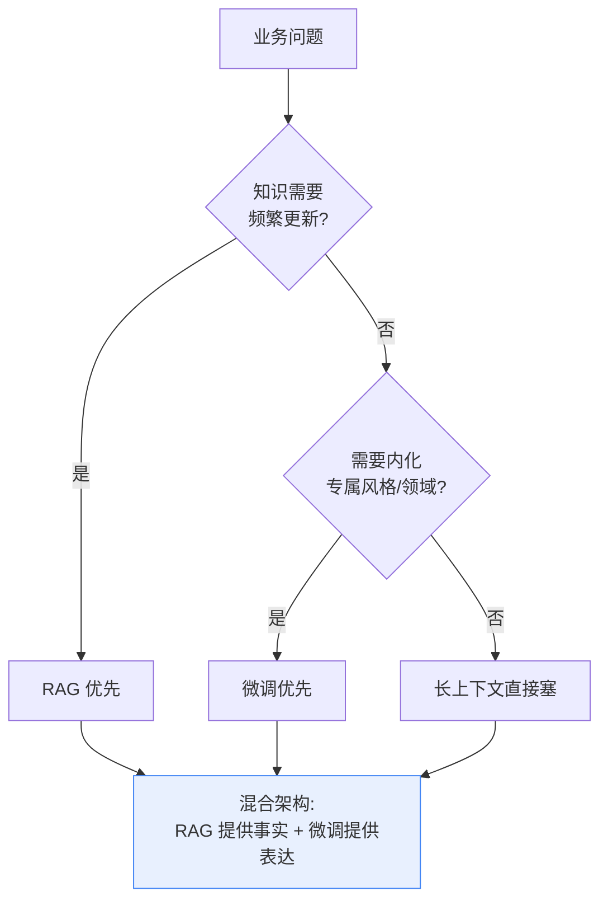
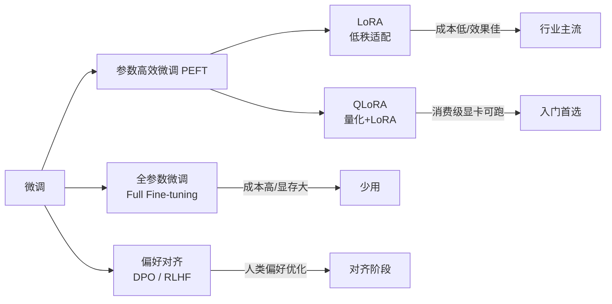
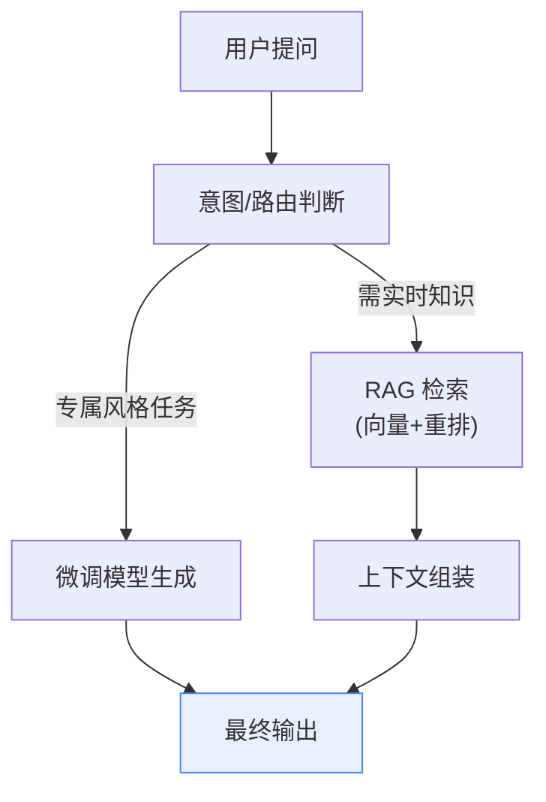

# 39_微调与RAG协同架构技术手册

> 系列：LangChain / LangGraph 系统学习 · 知识库 39（v10.0 第十轮）
> 定位：偏技术细节 — 架构模式、指标体系与决策流程
> 前置：建议先完成知识库 07-09（RAG 基础）、附录 D（项目模板）

## 1 三条技术路线：RAG、微调与长上下文

让 LLM 掌握"私有知识或专属风格"，业界有三条主干路线，**它们不是替代关系，而是组合关系**：

| 路线 | 原理 | 优势 | 短板 | 典型场景 |
| --- | --- | --- | --- | --- |
| RAG | 外部检索 + 上下文注入 | 知识可更新、可追溯、成本低 | 质量依赖检索、占上下文 | 企业知识问答、客服 |
| 微调 | 更新模型权重 | 风格/格式/领域深度内化 | 更新贵、易过时、不可追溯 | 语气、代码、医学案例格式 |
| 长上下文 | 一次性全塞入 | 最直接、零检索开发 | token 成本高、可能"迷失中间" | 单文档深度分析 |



### 1.1 判断口诀

- **问事实** → RAG（给模型"查到的依据"）；
- **学表达** → 微调（让模型"像行业专家一样说话"）；
- **一次性的长文档** → 长上下文（没必要建库）。

## 2 微调全景：从全参到 LoRA

### 2.1 微调方法谱系



- **全参微调**：更新全部权重，效果上限高但显存与成本高，数据少时易过拟合；
- **LoRA**：冻结原权重，只训练低秩增量矩阵（可插拔 adapter），显存与成本降一个量级，**行业事实标准**；
- **QLoRA**：LoRA + 4bit 量化，单张消费级显卡即可微调 70B 级模型；
- **DPO**：用偏好对（好的回答 vs 差的回答）直接优化，比 RLHF 更简单稳定，适合做"风格对齐"。

### 2.2 LangChain 侧接入微调模型

微调后拿到的是"新模型"（本地或云端），LangChain 完全透明：

```python
from langchain_openai import ChatOpenAI

# 接入本地 vLLM 部署的 LoRA 微调模型
llm_finetuned = ChatOpenAI(
    base_url="http://localhost:8000/v1",
    api_key="EMPTY",
    model="my-domain-lora-v1",   # 微调产物模型名
)

# 与 RAG 链同构：库里查事实 + 微调模型表达
from langchain_openai import OpenAIEmbeddings
from langchain_community.vectorstores import FAISS

retriever = FAISS.load_local("kb_index", OpenAIEmbeddings()).as_retriever()
```

## 3 RAG 的优化边界：什么情况下该补微调

RAG 单独扛不住的三类问题，正是微调的入场信号：

1. **检索到位但表达不对**：答案正确但语气/格式不是企业风格（客服话术、法律文书、医疗报告）；
2. **领域术语与缩写**：通用模型不认识企业内部黑话，微调让模型"懂行"；
3. **指令遵循弱**：模型偶尔不按固定 JSON 结构输出，需要格式内化。

> 反例提醒：如果问题是"检索不到正确文档"，微调帮不了——那是 RAG 管线（切块、Embedding、重排）的问题，先修检索本身。

## 4 混合架构模式（业界主流）

### 4.1 经典混合：RAG 提供事实 + 微调提供表达



### 4.2 增强模式

- **微调 + 记忆**：微调管"会回答"，记忆管"记得聊过什么"，各司其职；
- **检索增强微调（RAGFT 思路）**：先用 RAG 生成高质量（问题, 精炼回答）数据，再拿这些数据微调，模型学会"引用式回答"；
- **分级路由混合**：简单问题走微调小模型（快且省），难问题走 RAG+大模型（准且全）——与知识库 38 的模型路由结合。

### 4.3 数据飞轮

微调质量 > 数量。推荐的数据生产链路：

1. 线上 RAG 系统采集真实问题；
2. 人工/LLM 双重标注，构造（输入, 标准输出）对；
3. 产出三类数据集：指令集（通用）、领域集（知识问答）、偏好对（DPO）；
4. 小步迭代：先 LoRA 小试 + 评估集回归，再决定是否扩大。

## 5 评估对比方法论：选型不能拍脑袋

### 5.1 统一评测集

| 评测维度 | 指标 | 说明 |
| --- | --- | --- |
| 事实准确率 | F1 / 人工评分 | 答案是否与语料一致 |
| 引用可追溯率 | 引用命中率 | 是否给出对应文档出处 |
| 风格一致率 | 规则/人工 | 是否匹配目标话术格式 |
| 成本 | 每请求 token 成本 | 微调/路由后成本变化 |
| 延迟 | P95 E2E | 新增微调服务后延迟变化 |

### 5.2 演进路径建议

1. **先 RAG 基线**：零训练成本，快速上线，积累真实数据；
2. 数据量足够且出现"表达类"短板 → LoRA/QLoRA 小步试；
3. 偏好类问题 → 构造偏好对做 DPO 对齐；
4. **每步都跑同一评测集**，防止"优化了风格、劣化了事实"。

## 6 决策清单（速查）

- [ ] 已明确是"知识问题"还是"表达问题"，不混为一谈
- [ ] 先有 RAG 基线并跑通评测集
- [ ] 微调优先选 LoRA/QLoRA，不轻易全参
- [ ] 领域数据不足时先用 RAG 数据清洗构造训练集
- [ ] 混合架构中已定义路由规则（何时走 RAG / 何时走微调）
- [ ] 每次模型变更后统一评测集回归，记录指标
- [ ] 版本管理：LoRA adapter 与基座模型版本分开记录
- [ ] 已评估合规影响（数据出境、脱敏），见知识库 41

## 本手册要点回顾

1. RAG / 微调 / 长上下文是**组合拳**，不是单选题；
2. 口诀：问事实走 RAG，学表达走微调；RAG 难解决的就是微调的入场信号；
3. 微调事实标准是 LoRA/QLoRA，成本可控、可插拔；
4. 主流架构是"RAG 给事实 + 微调给表达 + 路由做分流"；
5. 任何优化必须以统一评测集回归为准绳。

> 对应教学篇目：第 43 课《查字典还是上培训班：微调与 RAG 怎么选》。