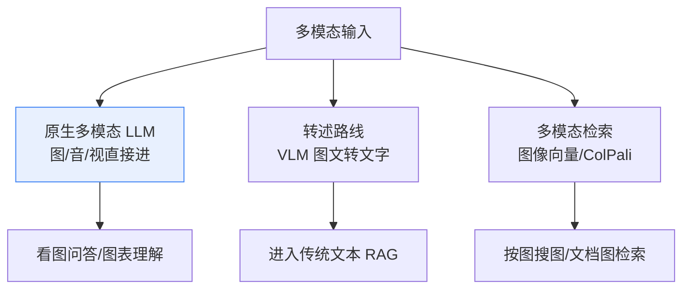
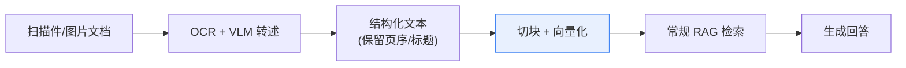
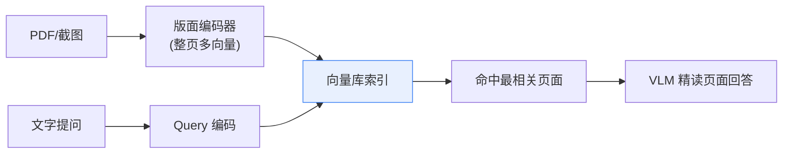
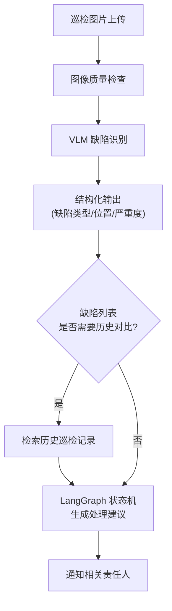

# 40_多模态Agent与多模态RAG技术手册

> 系列：LangChain / LangGraph 系统学习 · 知识库 40（v10.0 第十轮）
> 定位：偏技术细节 — 架构路线、代码模式与评估要点
> 前置：建议先完成知识库 06（模型调用）、KB16-17（RAG 架构）、附录 N（数据库 Agent）

## 1 多模态基础：让模型"看"得见的三种方式

多模态（图像 / 音频 / 视频）进入 LLM 应用有三条技术路线，决定后续架构走向：

| 路线 | 原理 | LangChain 形态 | 适用 |
| --- | --- | --- | --- |
| 原生多模态 LLM | 模型直接吃图像/音频 token | `ChatOpenAI(model="gpt-4o")` 传 image_url | 看图问答、图表理解 |
| 转述（Describe） | 先用 VLM 把图转成文字，再走纯文本 RAG | 离线批量转述入库 | 不以视觉为核心的检索 |
| 多模态嵌入（ColPali 类） | 图像直接向量化检索 | 向量库存图像嵌入 | 文档扫描件、截图检索 |



### 1.1 关键模型族谱速览

- **CLIP 系**（对比图文对齐）：图像 + 文本映射到同一向量空间，在线图像检索的基础；
- **VLM（视觉语言模型）**：如 GPT-4o、Qwen-VL、InternVL，能"看图说话"、图表推理；
- **ColPali 系**：把整页文档编码成多向量，直接检索"页面"而非切块文本，扫描件 PDF、表格图优势明显。

## 2 LangChain 多模态调用实战

### 2.1 图像直传（原生多模态）

```python
from langchain_openai import ChatOpenAI

llm = ChatOpenAI(model="gpt-4o", max_tokens=1024)
resp = llm.invoke([
    {"type": "text", "text": "这张商品图里有哪些安全隐患？请逐条列出。"},
    {"type": "image_url", "image_url": {"url": "https://example.com/goods.jpg"}},
])
print(resp.content)
```

生产注意：图像按 base64 data URL 内联或传公网 URL；注意传输体积（先压缩/缩图再传，省 token）。

### 2.2 图表理解与表格抽取

单据、报表、截图类图像，路径一般是"VLM 抽取结构化 → 走 Chains/Agent 处理"：

```python
extract_prompt = (
    "你是表格提取器。把这张图片里的表格逐行转成 JSON 数组，"
    "每行为一个对象，字段名用中文。不要遗漏任何一行。"
)
rows = llm.invoke([{"type": "text", "text": extract_prompt},
                   {"type": "image_url", "image_url": {"url": "data:image/png;base64,AAAA..."}}])
```

抽取结果可直接接 `JsonOutputParser`（知识库 18）做结构校验。

## 3 多模态 RAG：两条主流路线

### 3.1 路线 A：先转述再入库（推荐入门）



优点：复用全部现有 RAG 技能（切块、重排、Agentic RAG）；缺点：转述丢细节（图表精确数值）。

### 3.2 路线 B：图像原生检索（ColPali 系）



优点：保留原始版式、检索粒度是"页"，适合复杂表格与扫描文档；缺点：依赖专用模型与推理资源。

## 4 多模态 Agent：让 Agent 会"看"会"听"

### 4.1 视觉 Agent

在 LangGraph 中把"看图"封装成节点或工具：

```python
from langchain_core.tools import tool

@tool
def inspect_image(image_url: str) -> str:
    """分析图片内容（漏检/缺陷/场景描述），返回结构化结论。"""
    resp = llm.invoke([
        {"type": "text", "text": "描述图片中的异常与关键元素。"},
        {"type": "image_url", "image_url": {"url": image_url}},
    ])
    return resp.content
```

之后该工具可被 ReAct Agent（知识库 22）按需调用——Agent 自主决定"什么时候需要看图"。

### 4.2 语音 Agent

语音链路 = ASR（语音转文字）→ LangChain 文本 Agent → TTS（文字转语音）。LangChain 只管中间文本部分，前后两端用成熟服务：

| 环节 | 常用方案 | LangChain 集成点 |
| --- | --- | --- |
| ASR | Whisper / 云 ASR | 前置节点转文本 |
| 文本 Agent | LangGraph 多轮状态机 | 核心逻辑（KB26/29） |
| TTS | 云 TTS（如 baidu-text-to-speech） | 后置节点拼语音 |
| 音频检索 | 音频转文本后入库 | 沿用文本 RAG |

### 4.3 典型多模态工作流（巡检场景示例）



## 5 多模态的评估与四大挑战

### 5.1 评估要点

- **视觉事实准确率**：VLM 答非所问率、元素计数错误率、图表数字核对错误率；
- **转述损耗率**：转述文档与原图关键信息一致率（抽 20% 人工复核）；
- **检索命中率**：Recall@k（多模态检索是否真能按图找图/按文找图）；
- **端到端成本**：图像 token 计价通常高于文本，务必核算。

### 5.2 四大挑战（立项前先认清）

| 挑战 | 表现 | 缓解手段 |
| --- | --- | --- |
| 视觉幻觉 | 看图编造不存在的细节 | 强制"只引用图片可见内容"+ 人工抽检 |
| token 成本 | 图像输入 token 占比高 | 缩图/压缩 + 先粗筛再精读 |
| 检索粒度 | 切块破坏版面 | 用页级索引（ColPali）或版面感知切块 |
| 评估难 | 没有统一视觉评测集 | 自建业务样例集 + 人工标注 |

## 6 决策清单（速查）

- [ ] 已明确输入模态（图 / 音 / 视频）与三条技术路线的取舍
- [ ] 原生多模态 LLM 直传测试过效果与成本
- [ ] 转述路线已做"转述损耗"抽检
- [ ] 扫描件/图表类文档评估过 ColPali 类页级检索
- [ ] 多模态能力以工具形式封装，可被 Agent 按需调用
- [ ] 已建立多模态评测样例集并记录基线
- [ ] 图像传输前已压缩，token 成本已核算
- [ ] 视觉幻觉已设缓解机制（引用约束 + 抽检）

## 本手册要点回顾

1. 三条路线：原生多模态 / 转述 / 多模态检索，按业务选型；
2. 入门推荐"转述后进传统 RAG"，后续再评估 ColPali 页级检索；
3. 多模态能力封装成工具，LangGraph 节点里按需调用；
4. 语音 = ASR + 文本 Agent + TTS，LangChain 管中间；
5. 评估重点：视觉事实准确率、转述损耗、检索命中、成本。

> 对应教学篇目：第 44 课《让 AI 看懂世界：多模态入门》。