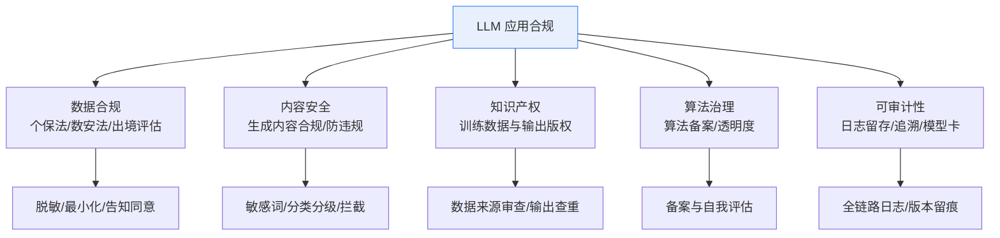
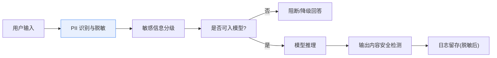
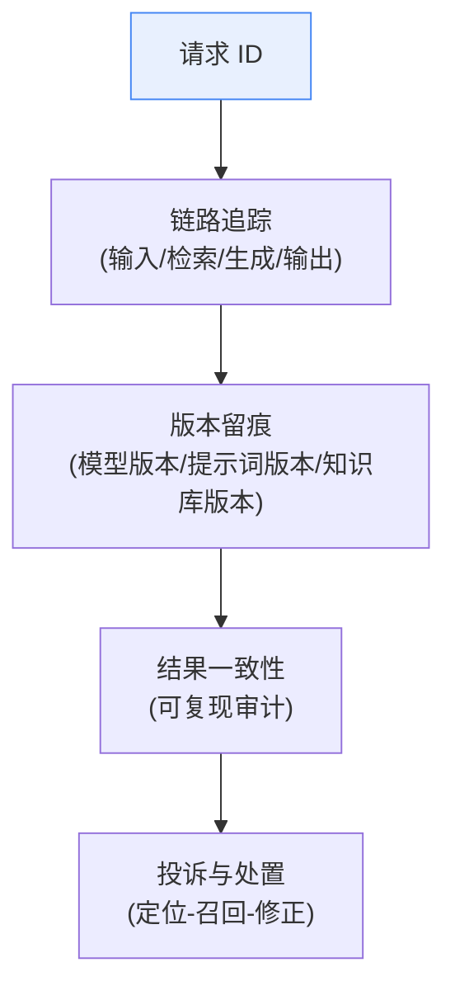

# 41_LLM应用合规、隐私与治理技术手册

> 系列：LangChain / LangGraph 系统学习 · 知识库 41（v10.0 第十轮）
> 定位：偏技术细节 — 法规地图、治理框架与落地清单
> 前置：建议先完成知识库 34（Agent 安全）、附录 O（监控告警）
> 注意：本文为通用技术参考，不构成法律意见；具体合规请咨询法务。

## 1 合规全景：一张地图看清"管什么"

LLM 应用上线前，合规问题集中在六个维度：**数据出境、个人信息、内容安全、知识产权、算法治理、可审计性**。



### 1.1 与技术直接相关的三条主线

| 主线 | 核心要求（概括） | 技术落地 |
| --- | --- | --- |
| 个人信息保护 | 最小必要、告知同意、脱敏 | 输入校验、PII 脱敏、画像限制 |
| 数据安全与出境 | 重要数据境内存储、出境需评估 | 区域化部署、数据不出域 |
| 内容安全 | 生成内容不得违法违规 | 生成前置过滤 + 后置检测 |

## 2 数据治理：从入口到出口

### 2.1 数据分层处理链路



### 2.2 脱敏三件套

1. **识别**：正则 + NER 模型识别身份证、手机号、邮箱、地址等 PII；
2. **替换**：占位符替换（如 `[PHONE_1]`），推理后再还原（仅限必要场景）；
3. **最小化**：能不问就不收集；能存短期就不存长期；能聚合就不存明细。

```python
# 脱敏示意：识别并替换手机号
import re
masked = re.sub(r'1[3-9]\d{9}', '[PHONE]', raw_text)
```

> 提示：上面正则仅为示意，生产请用成熟的 PII 检测库或脱敏服务，并配对"脱敏↔还原"的受控流程。

## 3 内容安全与出口管控

### 3.1 三层防线

| 层 | 位置 | 手段 | 目标 |
| --- | --- | --- | --- |
| 输入层 | 用户输入 | 敏感词表 + 意图检测 | 拦截恶意/违规输入 |
| 生成层 | 模型输出 | 分类器 + 规则检测 | 拦截违规生成内容 |
| 应用层 | 出口 | 人审 + 举报 | 兜底与申诉通道 |

### 3.2 提示注入与数据投毒联动

知识库 34 已覆盖攻击面；合规视角下，**提示注入可能被用于套取敏感信息或生成违规内容**，因此脱敏 + 输入隔离是合规与安全的共同底座。

## 4 算法治理与备案要点

- **算法备案**：部分面向公众的生成式 AI 服务需完成算法备案与安全评估（按所在地区法规执行）；
- **透明度**：向用户明示"内容由 AI 生成"；
- **自我评估**：上线前完成安全评测（对抗样本、违规语料命中率测试）。

## 5 可审计性：让每一条输出都有据可查



落地建议（与附录 O 联动）：

- 全链路 Tracing（LangSmith 或自建），请求 ID 贯通；
- 记录三元组：**模型版本、提示词版本、知识库版本**，保证可复现；
- 日志脱敏后留存，明确保留期限与访问权限；
- 建立"投诉 → 定位 → 召回 → 修正"的闭环流程与 SLA。

## 6 治理框架：三道闸门

1. **设计闸**：新功能上线前过合规检查表（数据流向、脱敏、备案）；
2. **测试闸**：上线前跑安全评测集（违规命中率、对抗样本通过率）；
3. **运营闸**：线上持续监控异常调用、敏感词命中波动、投诉率。

## 7 合规落地清单（速查）

- [ ] 已绘制数据流向图：输入 → 处理 → 存储 → 输出 → 日志
- [ ] 已识别 PII 并在必要时脱敏（含日志阶段）
- [ ] 涉及出境/重要数据已做区域化部署或出境评估
- [ ] 输入与输出均有内容安全检测层
- [ ] 对用户明示 AI 生成内容
- [ ] 上线前完成安全评测集测试并留档
- [ ] 三版本（模型/提示词/知识库）留痕可复现
- [ ] 日志脱敏、留存期限与访问权已定义
- [ ] 投诉处置闭环与 SLA 已建立
- [ ] 涉及公众服务已自查算法备案要求

## 本手册要点回顾

1. 合规六维度：数据、内容、知产、算法、审计、安全；
2. 技术底座是"脱敏 + 隔离 + 检测 + 留痕"四件事；
3. 可审计性关键是三版本留痕与请求 ID 贯通；
4. 治理靠三道闸门：设计闸、测试闸、运营闸；
5. 本文为技术参考，具体合规判断请咨询法务。

> 对应教学篇目：第 45 课《毕业实战：从 0 到 1 的完整项目》。