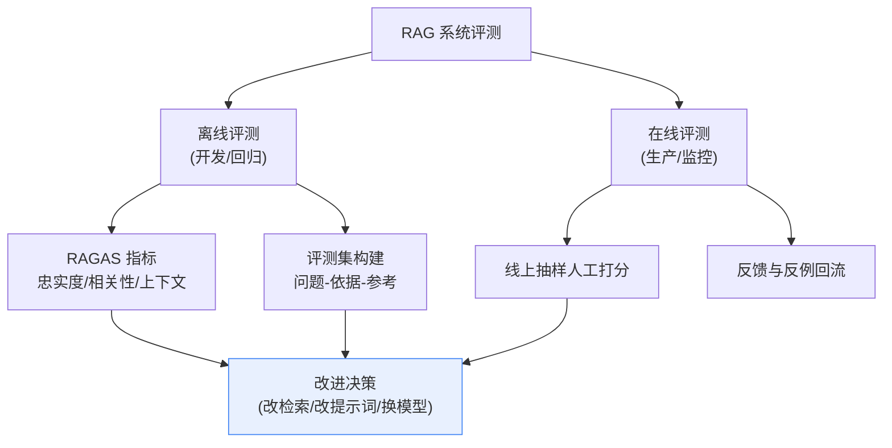
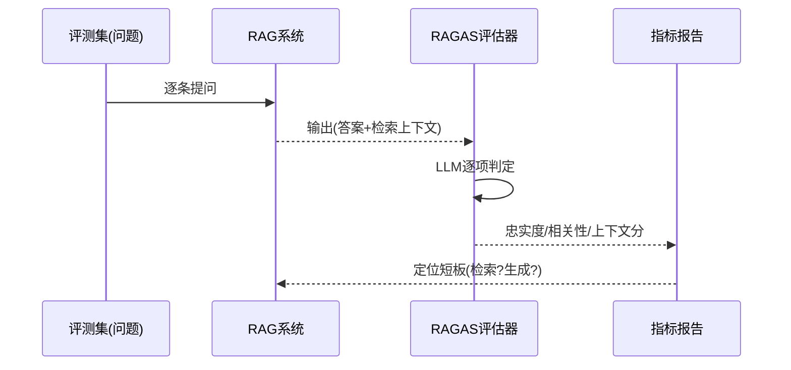
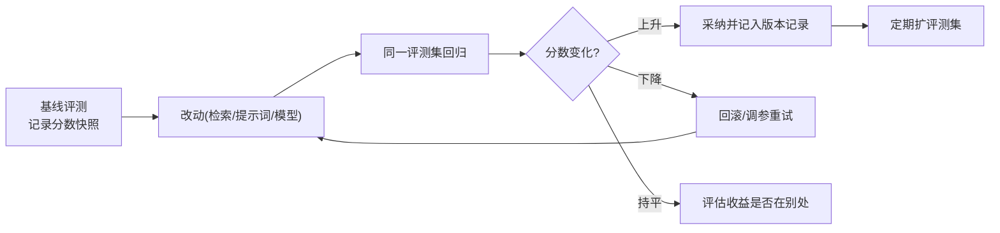

# 42_RAG评测体系与RAGAS实操技术手册

> 系列：LangChain / LangGraph 系统学习 · 知识库 42（v11.0 第十一轮）
> 定位：偏技术细节 — 评测指标、数据集构建、RAGAS 实操、回归流水线
> 前置：建议先完成知识库 09（评估与成本）、KB27（Agent 评估）、附录 O（监控）

## 1 为什么要单独建一套 RAG 评测

RAG 系统"看起来能用"和"真的能打"之间隔着一条鸿沟：**没有评测，就没有改进的坐标**。通用 LLM 评测（BLEU/ROUGE 等）衡量的是"像不像参考答案"，而 RAG 需要回答四个更本质的问题：

1. 检索到了对的依据吗？（检索质量）
2. 生成忠实于依据吗？（忠实度）
3. 回答覆盖了用户要问的吗？（相关性）
4. 回答被用户接受吗？（实用性）



## 2 评测指标分层：RAGAS 三大主轴

**RAGAS（Retrieval-Augmented Generation Assessment）** 是 RAG 评测的事实标准框架，核心三大指标（另有扩展指标）：

| 指标 | 衡量什么 | 公式思路 | 判定方式 |
| --- | --- | --- | --- |
| Faithfulness 忠实度 | 回答是否忠于检索上下文，不编造 | 回答中可由上下文支持的声明数 ÷ 总声明数 | LLM 判定每个声明是否可被依据支持 |
| Answer Relevance 答案相关性 | 回答是否切题、覆盖问题 | 生成若干"反向问题"与原始问题的相似度 | 深度提问 + 向量相似度 |
| Context Relevance 上下文相关性 | 检索到的上下文是否切题 | 相关句子占比 + 置信度加权 | LLM 判定句子相关性与位置权重 |

> 关键洞察：**忠实度先于一切**——答得再漂亮，只要编造就不可信；忠实度达标后再谈相关性与上下文质量。

### 2.1 三指标的改进指向

| 指标低 | 说明 | 优先修什么 |
| --- | --- | --- |
| 忠实度低 | 模型脱离依据乱答 | 提示词约束 + 生成后证据校验（KB37） |
| 答案相关性低 | 检索没抓准或生成跑题 | 检索质量（切块/嵌入/重排） |
| 上下文相关性低 | 检回来的文档不相关 | 检索本身：TopK、混合检索、查询变换 |

## 3 评测集构建：一切评测的地基

评测集质量决定指标可信度。构建遵循"三维三源"：

### 3.1 三维分层

| 维度 | 划分 | 说明 |
| --- | --- | --- |
| 难度 | 简单 / 中等 / 困难 | 简单=直接命中，困难=跨文档推理 |
| 类型 | 事实型 / 推理型 / 对比型 / 流程型 | 覆盖业务真实问法 |
| 边界 | 正常 / 边界 / 反例 | 反例=无答案问题，测"会不会硬编" |

### 3.2 三源采集

1. **线上真实问题**：日志、客服记录（最有价值，优先）；
2. **语料反推**：从文档自动生成 Q-A 对（LLM 生成 + 人工抽检）；
3. **专家构造**：领域专家写的高难度问题与标准答案。

### 3.3 最小可用规模

- 起步：50-100 条（每类 ≥10 条），够跑出趋势；
- 正式化：300-500 条，分层均衡；
- 每条含四要素：`问题、标准答案、期望出处、难度标签`。

## 4 RAGAS 实操：指标计算流水线

RAGAS 本质是"用 LLM 评测 LLM"，LangChain 生态可直接集成：

```python
from ragas import evaluate
from ragas.metrics import (
    faithfulness, answer_relevancy, context_relevancy,
)

result = evaluate(
    dataset,                                 # 评测集: question / contexts / answer 列
    metrics=[faithfulness, answer_relevancy, context_relevancy],
)

import pandas as pd
df = result.to_pandas()
print(df[["question", "faithfulness", "answer_relevancy", "context_relevancy"]].describe())
```

> 注意：RAGAS 判定本身调用 LLM，会有少量波动——同一评测集连续跑 2-3 次取均值/中位数，波动 > ±0.05 属正常。



## 5 回归流水线：让改进可复现



落地要点：

- 评测跑在 **CI 脚本**里，改代码自动触发；
- 版本三元组齐记录：**模型版本 / 提示词版本 / 知识库版本**（对齐 KB41）；
- 指标不是唯一标准：忠实度 + 人工抽检 20% 双保险；
- 分数要配**波动区间**，±0.02 内的变化不视为有效改进。

## 6 在线评测：生产环境的持续考试

| 手段 | 做法 | 产出 |
| --- | --- | --- |
| 抽样人工打分 | 每日抽 30-50 条，打"好/一般/差" | 质量趋势周报 |
| 反例回流 | 用户"踩/追问/投诉"的进入评测集 | 持续补短板 |
| 跟踪指标 | 检索召回率环比、答非所问率 | 早发现退化 |
| A/B 实验 | 同批次问题拆分新旧配置对比 | 决策依据 |

## 7 决策清单（速查）

- [ ] 已建立含四要素的分层评测集（≥50 条起步）
- [ ] 已跑通三主轴指标（忠实度 / 答案相关性 / 上下文相关性）
- [ ] 反例（无答案）样本已包含，验证"不乱编"
- [ ] 基线分数快照已存档，含模型/提示词/知识库版本
- [ ] CI 已接入评测回归，改动自动触发
- [ ] 指标波动区间已记录，不把噪音当有效改进
- [ ] 在线抽样人工打分机制已运行
- [ ] 反例回流链路已闭环（线上差评 → 评测集 → 改进）

## 本手册要点回顾

1. RAG 评测三主轴：忠实度、答案相关性、上下文相关性——**忠实度优先**；
2. 评测集三维三源，四要素齐备，先 50 条起步再迭代；
3. RAGAS 用 LLM 评 LLM，自带波动，多跑取均值；
4. 回归流水线要接 CI、记版本、看波动区间；
5. 离线评测 + 在线抽样 + 反例回流 = 完整评测闭环。

> 对应教学篇目：第 46 课《给 AI 打分：RAG 评测入门》。