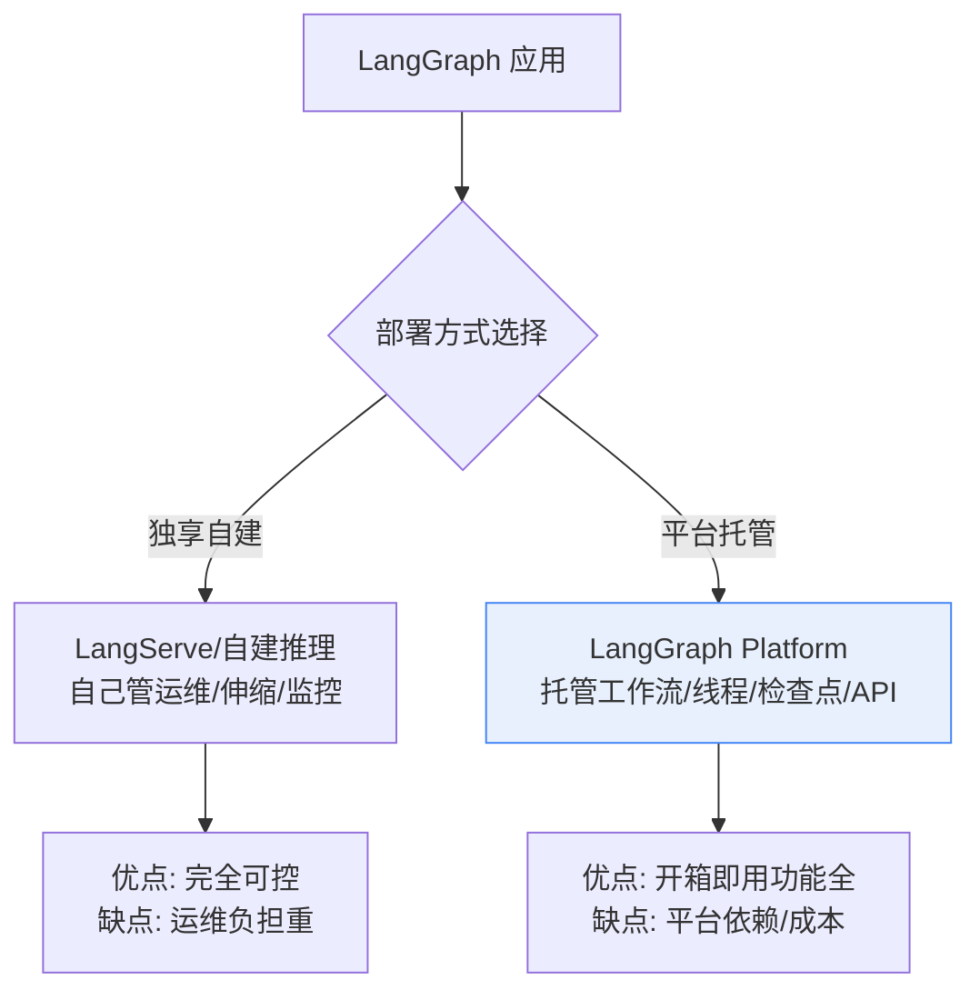
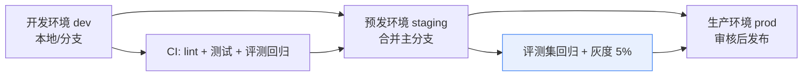

# 43_LangGraph云平台与团队协作部署技术手册

> 系列：LangChain / LangGraph 系统学习 · 知识库 43（v11.0 第十一轮）
> 定位：偏技术细节 — 云平台能力、CI/CD、版本管理、团队协作模式
> 前置：建议先完成附录 K（LangServe 部署）、附录 O（监控告警）、知识库 38（性能）

## 1 从自建服务到云平台：为什么需要这一步

前 45 课里，你用 LangServe 把链/图封装成 API 自建部署（附录 K）。自建模式的问题随着规模放大而出现：**运维责任全在自己、多人协作版本混乱、伸缩与监控要亲手搭**。LangGraph Platform（云/私有化）把这些沉淀为平台能力，团队只需要关心"图怎么画"。



## 2 平台核心能力地图

| 能力 | 说明 | 与主线衔接 |
| --- | --- | --- |
| 图即 API | 编译后的图自动生成 REST 接口（线程/状态/流式） | KB26 LangGraph |
| 持久化与检查点 | 线程级状态持久化，断点续跑、时间旅行 | KB24/KB32 |
| Assistant 多版本 | 一图多 Assistant 配置，灰度放量 | KB38 路由思想 |
| 任务队列与并发 | 异步任务、批处理、限流配额 | KB43 网关联动 |
| 内置可观测性 | 追踪 / 指标 / 成本直出 | 附录 O/H |
| 多用户访问控制 | 租户隔离、API Key 管理 | KB35 多租户 |

## 3 团队协作：把"画图"和"发布"分离

### 3.1 三个环境的工作流



### 3.2 角色分工建议

| 角色 | 在平台中的动作 |
| --- | --- |
| 应用开发 | 写图、定义 Assistant、提交 PR |
| 平台运维 | 环境管理、密钥、配额、告警 |
| 评测负责人 | 维护评测集、把关灰度放量 |
| 业务方 | 线上行为观察、反例反馈（KB42） |

### 3.3 版本管理与回滚

- 每次发布 = 一个**可复现快照**（图代码 + 模型版本 + 提示词 + 知识库版本）；
- Assistant 配置可独立升降级，不用改代码；
- 生产异常 → 一键切回上一版本 Assistant，同时保留现场快照供调试（KB32 时间旅行）。

## 4 CI/CD 流水线模板

```yaml
# 流水线示意（概念模板，非可执行配置）
stages:
  - test          # lint、单元测试、图结构测试
  - evaluate      # 评测集回归（RAGAS，见 KB42）
  - deploy_staging
  - gated_approve # 人工放行
  - deploy_prod
  - smoke         # 生产冒烟：探活 + 抽样人工
```

要点：

- **评测回归卡在发布前**：忠实度/相关性分数低于基线阈值即阻断；
- 灰度策略：5% → 30% → 100%，每档观察 15-30 分钟指标；
- 冒烟测试用**固定探针问题**（每条带期望断言），秒级发现部署事故。

## 5 与既有体系的衔接清单

| 已有资产 | 在云平台中的落位 |
| --- | --- |
| LangGraph 图（KB26/29） | 直接部署为 Assistant |
| 检查点/时间旅行（KB32） | 平台持久化默认支持 |
| 评测集（KB42） | 接入 CI 回归门槛 |
| 监控告警（附录 O） | 平台指标 + 外部告警联动 |
| 多租户网关（KB35） | 平台入口之上再叠统一网关做成本分摊 |
| 安全纵深（KB34） | 输入检测层放网关，平台内做权限与密钥隔离 |

## 6 成本与选型决策

| 场景 | 建议 |
| --- | --- |
| 团队一人、单应用、吞吐低 | 自建 LangServe 足够（附录 K） |
| 多人协作、多应用、要灰度 | LangGraph 云平台 |
| 私有化/合规严（KB41） | 私有化部署平台 + 区域隔离 |
| 已有 K8s 团队 | 平台自托管版本 |

决策三问：**我是否需要线程级持久化？是否需要多环境灰度？运维人力预算是否充足？** 有一个"是"就值得评估平台。

## 7 决策清单（速查）

- [ ] 已对比自建 vs 平台（持久化/灰度/运维三问）
- [ ] 图逻辑已抽离，Assistant 配置与代码分离
- [ ] dev/staging/prod 三环境流水线已建立
- [ ] 评测回归已卡进 CI 发布门槛
- [ ] 发布快照含四版本（图/模型/提示词/知识库）
- [ ] 灰度分档策略与观察指标已定义
- [ ] 生产冒烟探针已准备
- [ ] 密钥与权限按角色最小化配置
- [ ] 与网关/监控/安全体系已衔接（KB34/35、附录 O）

## 本手册要点回顾

1. 云平台的本质：把持久化、版本、灰度、观测沉淀为能力；
2. 团队协作核心是"环境分离 + 版本可复现 + 评测卡关"；
3. 灰度是质量与风险的平衡器，必须配观测与回滚；
4. 选型先做三问：持久化？灰度？运维预算？
5. 平台不是银弹——小团队低吞吐自建更务实。

> 对应教学篇目：第 47 课《把项目搬上云：团队协作与部署》。