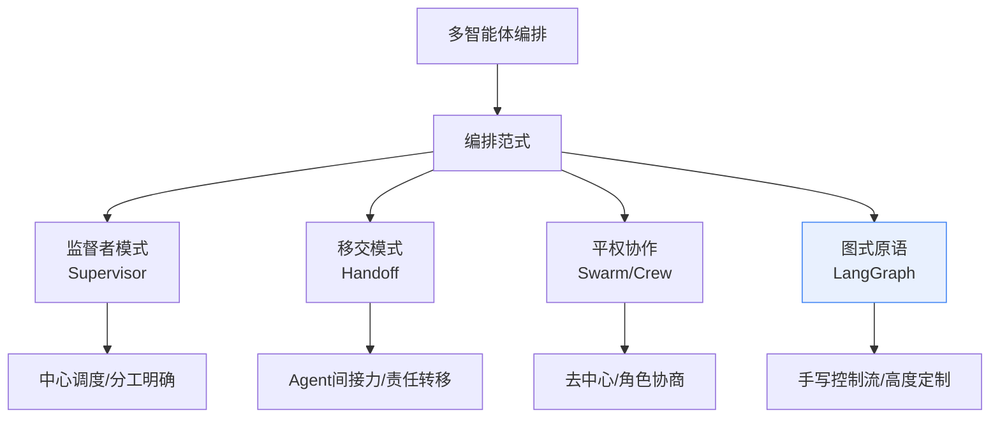
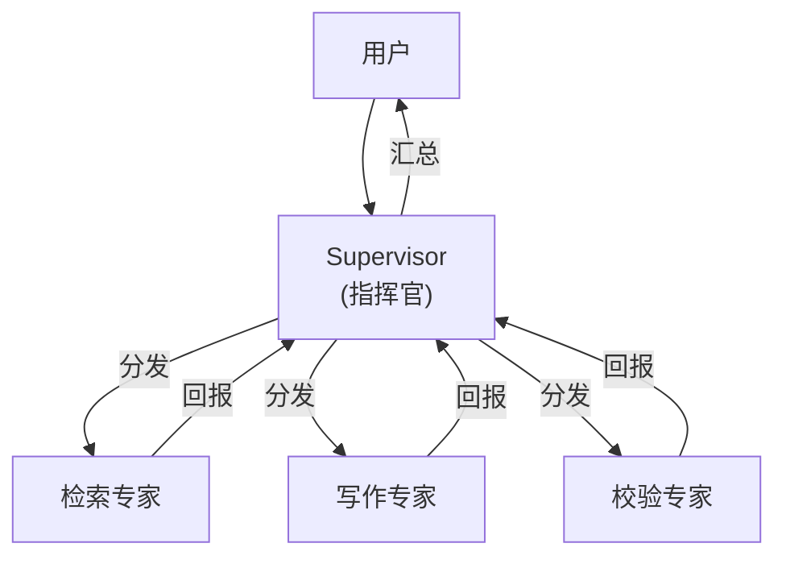
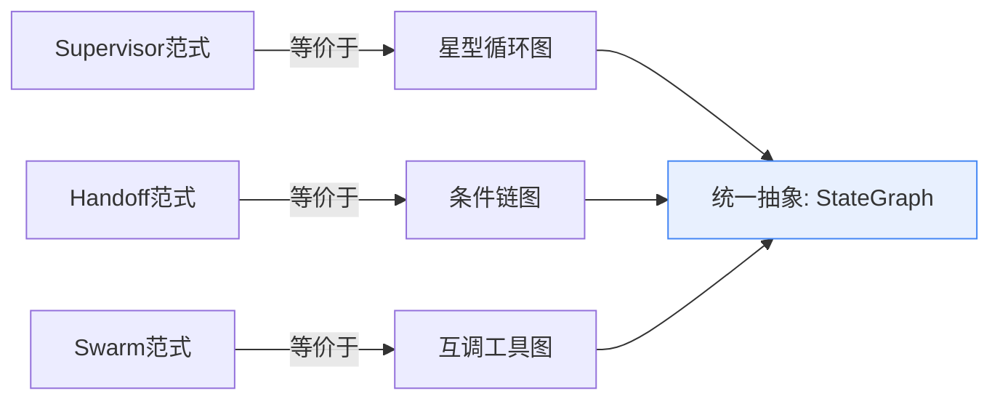
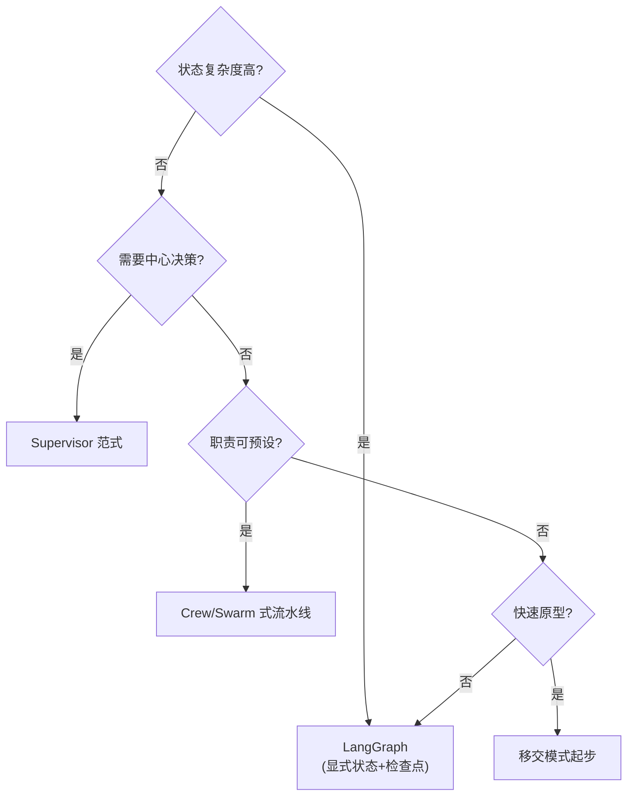

# 44_多智能体编排框架对比与选型技术手册

> 系列：LangChain / LangGraph 系统学习 · 知识库 44（v11.0 第十一轮）
> 定位：偏技术细节 — 框架对比表、编排原语、选型决策
> 前置：建议先完成知识库 20（多 Agent 编排）、KB26（复杂工作流）、KB24（状态管理）

## 1 问题背景：多智能体为什么需要"框架"

单 Agent 的能力边界在于"一个大脑处理所有事"。多智能体把任务拆给多个专职 Agent，但随之而来三个新问题：**谁来调度、状态放哪、消息怎么传**。不同框架对这三个问题的回答不同，就形成了风格迥异的编排范式。

## 2 主流框架与范式横评

| 维度 | LangGraph（图式） | Supervisor（监督者） | OpenAI Swarm（移交） | CrewAI（平权团队） |
| --- | --- | --- | --- | --- |
| 哲学 | 显式状态机，一切可绘 | 中心 Agent 调度多专家 | 轻量"函数式移交" | 角色 + 任务驱动的团队 |
| 状态管理 | 强（共享 State + 检查点） | 中（路由上下文） | 弱（会话级移交） | 中（任务上下文） |
| 控制流 | 手写，自由但需规划 | 声明式轮询/路由 | 移交即跳转 | 流程式任务编排 |
| 可观测/调试 | 强（检查点/时间旅行 KB32） | 中 | 弱 | 中 |
| 生产就绪 | 高（持久化/平台 KB43） | 高（企业级） | 实验性 | 中（新框架演进快） |
| 适合 | 复杂状态、关键生产 | 企业中台、专家分工 | 快速原型、轻交互 | 任务流水线团队 |

> 重要提醒：框架选择不是"哪个更好"，而是"哪个原语匹配你的状态与控制需求"。**复杂度守恒**：框架省下的代码会在概念复杂度上找回来。

## 3 四种范式的核心原语

### 3.1 监督者范式（Supervisor）

适用：任务边界清晰、需要中心决策的中台场景。LangGraph 实现：`add_conditional_edges` 循环路由（KB20/26）。

### 3.2 移交范式（Handoff）

Agent 间通过"转手"传递责任，最后一次移交者负责收尾。模式是"接力棒"：客服 Agent → 能让 Agent → 退款 Agent。实现要点：移交消息携带会话状态与理由。

### 3.3 平权协作范式（Swarm/Crew）

没有中心，Agent 通过工具互调/委托协作：写手 Agent 把"查数据"委托给检索 Agent。适合流程可预设、角色明确的流水线任务。

### 3.4 图式原语（LangGraph）

任何范式都是图的特例：Supervisor = 带循环的星型图；Handoff = 带条件的链；Swarm = 互连的工具节点。**LangGraph 是"元范式"：先想清楚状态与控制流，再画图**。

## 4 选型决策流程

关键判据三板斧：

1. **状态是否跨步骤共享**：是 → 必须图上（LangGraph），否 → 轻量范式即可；
2. **是否需要时间旅行/断点**：是 → 检查点能力优先（LangGraph/Supervisor）；
3. **团队维护能力**：图式代码更"看得见"，但对初学者也更重——从简单范式起步，地图复杂度再升级。

## 5 混搭实践：一个生产级示例

监督者 + 移交 + 图式组合的典型形态：中心 Supervisor 决策，任务委派给专职子 Agent，子 Agent 之间通过工具移交，全程状态由 LangGraph 持久化。

| 层 | 组件 | 范式 |
| --- | --- | --- |
| 入口 | 意图识别路由 | 监督者 |
| 任务层 | 检索/摘要/写作子 Agent | 移交 |
| 协作层 | 子 Agent 互调工具 | 平权 |
| 底座 | LangGraph StateGraph + 检查点 | 图式 |

## 6 决策清单（速查）

- [ ] 已明确状态复杂度与跨步骤共享需求
- [ ] 已考虑是否需要检查点/时间旅行/断点续跑
- [ ] 已对比监督者/移交/平权三种范式的适用域
- [ ] 未盲目跟风"多 Agent"：能单 Agent 解决的问题不上多 Agent
- [ ] 已评估团队维护能力与框架成熟度
- [ ] 生产场景优先 LangGraph/Supervisor 系（可观测、可回滚）
- [ ] 原型场景可用轻量移交快速验证，再决定是否升级
- [ ] 已为多 Agent 场景补充评测与监控（KB42、附录 O）

## 本手册要点回顾

1. 四种范式：监督者、移交、平权、图式——**复杂度守恒**；
2. LangGraph 是"元范式"，其余范式都是它的特例；
3. 选型三板斧：状态共享？检查点？维护力？
4. 生产混搭是常态：监督者决策 + 移交分工 + 图式底座；
5. 多 Agent 不是目的，是手段——单一能解决就绝不拆分。

> 对应教学篇目：第 48 课《指挥团队：多智能体框架怎么选》。