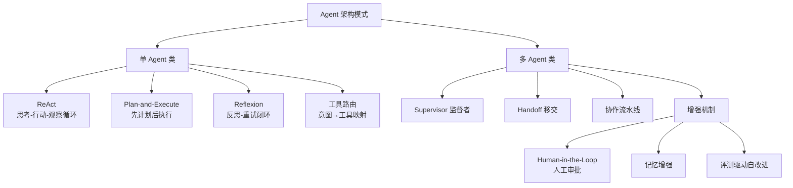
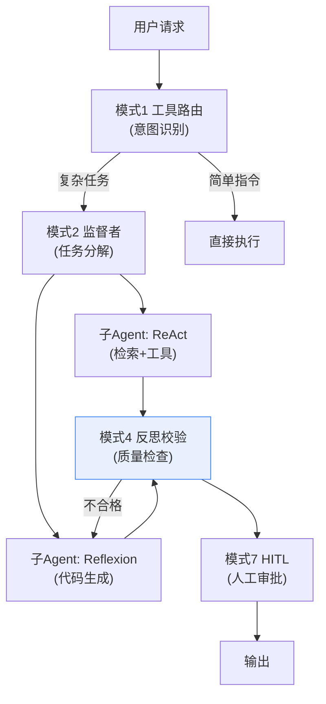

# 45_Agent架构模式大全技术手册

> 系列：LangChain / LangGraph 系统学习 · 知识库 45（v11.0 第十一轮压轴篇）
> 定位：偏技术细节 — 模式总览、组合选型、架构决策
> 前置：建议已通读知识库 20/22/26/29/33/44（Agent 全家桶）

## 1 一张图看懂 Agent 架构模式全家桶

单 Agent、多 Agent 的所有编排方式，都可以归结为**七种模式**。先看全景，再逐个展开。

## 2 七种模式逐个拆解

| 模式 | 一句话 | 控制流 | 适用 | 局限 |
| --- | --- | --- | --- | --- |
| ReAct | 想一步、做一步、看结果再想 | 循环 | 工具调用型 Agent | 步骤多了慢且易漂移 |
| Plan-and-Execute | 先列计划，再按计划执行 | 两阶段 | 多步骤任务 | 计划错了难自救 |
| Reflexion | 失败后自我反思、换个策略重试 | 循环+记忆 | 代码修复、改写 | 成本高、可能钻牛角尖 |
| 工具路由 | 意图分类后直接调对应工具 | 一跳 | 简单明确任务 | 无多步推理 |
| Supervisor | 中心调度多专家 | 星型循环 | 分工明确的中台 | 中心成瓶颈 |
| Handoff | 接力棒式责任转移 | 链/条件 | 客服流程类 | 状态容易丢 |
| 协作流水线 | 角色任务流水线 | 有向图 | 流程可预设 | 动态性弱 |

## 3 模式组合的逻辑：分层而不是堆叠

真正落地的系统很少只有一种模式，而是**分层组合**：

组合原则：

1. **外层管决策，内层管执行**：路由/监督在入口，ReAct/Reflexion 在叶子；
2. **反思只放关键环节**：不加节制地全链反思，成本爆炸；
3. **人工只在不可逆动作前**：发消息、写库、付款（KB26 HITL 原则）。

## 4 增强机制三件套

### 4.1 Human-in-the-Loop（KB26 细化）

| 介入点 | 时机 | 方式 |
| --- | --- | --- |
| 任务前 | 意图模糊时 | 澄清问题 |
| 执行中 | 需外部信息 | 中断等待输入 |
| 动作前 | 不可逆动作 | 二次确认 |
| 完成后 | 高风险输出 | 人工审阅 |

LangGraph 实现：`interrupt()` 挂起 + `Command(resume=...)` 恢复（KB32 时间旅行配套）。

### 4.2 记忆增强（KB23 细化）

工作记忆（对话轮内）→ 短期记忆（会话内持久）→ 长期记忆（跨会话画像/事实）。多 Agent 场景记忆归属要明确：**共享记忆放 State，私有记忆放 Agent 内部**。

### 4.3 评测驱动自改进（KB42 细化）

- 离线：评测集回归，分数作准入门槛；
- 在线：反例回流，差评自动进评测集；
- 反馈回路：每周根据增量评测集决定是否调提示词/路由/模式。

## 5 架构决策总表：接到需求先问五句

| 问题 | 答案指向 |
| --- | --- |
| 任务是否单步/简单？ | 工具路由即可，别上多 Agent |
| 是否有明确多步骤流程？ | Plan-and-Execute 或协作流水线 |
| 是否依赖外部工具且结果不确定？ | ReAct + 反思 |
| 是否多领域专家分工？ | Supervisor / Handoff |
| 是否有失败风险与不可逆动作？ | Reflexion + HITL + 评测兜底 |

## 6 性能与成本预警

| 模式 | 单次调用成本 | 延迟趋势 | 注意 |
| --- | --- | --- | --- |
| 工具路由 | 低 | 低 | 别用大模型做简单分类 |
| ReAct | 中 | 中 | 最长循环次数要设上限 |
| Reflexion | 高 | 高 | 反思轮次 ≥2 后收益递减 |
| Supervisor | 中高 | 中高 | 中心消息量是瓶颈 |
| 多 Agent 全家桶 | 高 | 高 | 先仿真再上线（KB42 评测） |

## 7 决策清单（速查）

- [ ] 已根据"五问"确定主导模式，而非直接堆多 Agent
- [ ] 模式分层：外层决策、内层执行、反思只在关键环节
- [ ] HITL 只放在不可逆动作前，且已实现中断/恢复
- [ ] 记忆归属明确（共享 State / 私有内部）
- [ ] 循环/反思设置上限，防失控与成本爆炸
- [ ] 多 Agent 场景已先做小规模仿真评测
- [ ] 每次架构调整跑统一评测集回归（KB42）
- [ ] 架构决策记录理由，写入版本可复现（KB43）

## 本手册要点回顾

1. 七种模式：ReAct / Plan-Execute / Reflexion / 工具路由 / Supervisor / Handoff / 流水线；
2. 落地是"分层组合"：路由管入口，反思放关键，人工管不可逆；
3. 增强三件套：HITL、记忆、评测驱动；
4. 选型五问决定主导模式，**能简单绝不上多 Agent**；
5. 架构决策要记理由、要评测、要可回滚。

> 对应教学篇目：第 49 课《Agent 架构模式大全》（全系列收官课）。