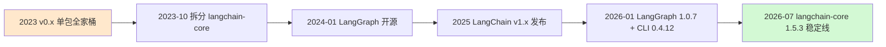
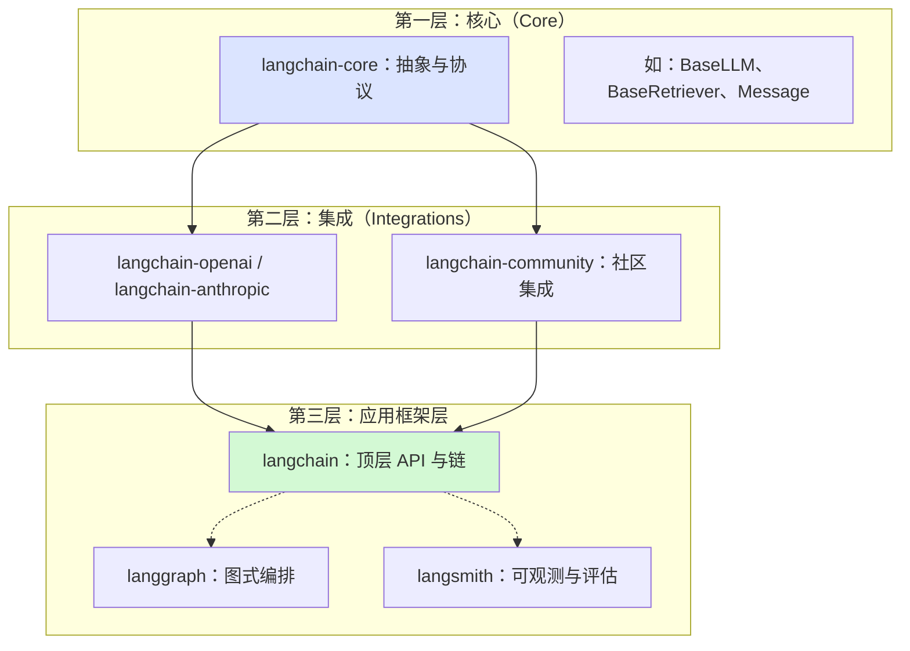
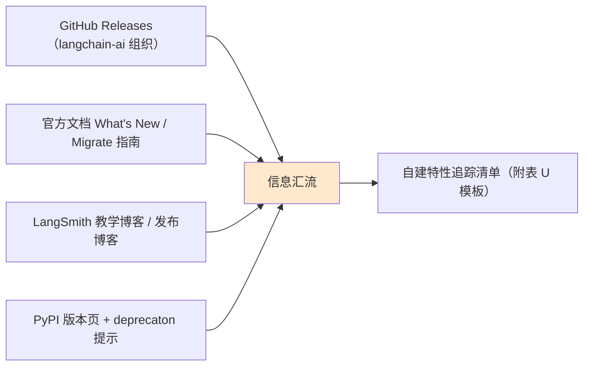

# LangChain 新特性全景追踪技术手册（知识库 46）

> 定位：技术细节参考手册。聚焦 LangChain 框架在 v0.x → v1.x 演进中的架构变化、新特性清单与版本追踪方法，供学习者按图索骥。
> 配套学习课程：第 50 课《新特性追踪：跟上框架的脚步》。

---

## 1. 为什么需要"新特性跟进"专题

LangChain 生态（LangChain Core、LangGraph、LangSmith）从 2023 年的单一库，发展到 2026 年成为"框架 + 运行时 + 可观测平台"三位一体的智能体工程栈。框架每 1—2 个月就有一次 minor 版本迭代，每一年左右有一次破坏性变更（breaking change）。

对零基础学习者，这带来两类问题：

- **学旧了**：教程写的是 v0.x 的写法，而官方已迁移到 v1.x 的新 API；
- **学怕了**：看到版本号快速跳动，以为"还没学会就过时"。

本专题给出可操作的答案：新版本到底"新"在哪、哪些只是改名、哪些是真正的架构变化、以及怎么持续追踪。

##2. 版本时间线：从 v0.x 到 v1.x

以下为已确认的官方里程碑（截至 2026-08）：

| 时间 | 事件 | 意义 |
| --- | --- | --- |
| 2023 年初 | LangChain 0.0.x 发布 | 首个大模型应用开发框架，全家桶单包 |
| 2023-10 | langchain-core 拆分 | 核心抽象独立成包，为生态分层铺路 |
| 2024-01 | LangGraph 开源 | 有状态图式编排框架诞生 |
| 2024-11 | LangGraph v0.2 发布 | 引入检查点（checkpointers）、持久化 |
| 2025-06 | LangGraph v0.3 发布 | 子图（subgraph）、流式改进 |
| 2025-12 | LangGraph.js 金融搜索工作流演示 | 前端生态成熟信号 |
| 2026-01-23 | LangGraph 核心框架 v1.0.7、CLI v0.4.12 | 官方定位"低级别编排框架"，企业级特性定型 |
| 2026-07-30 | langchain-core v1.5.3 | v1.x 线持续稳定迭代 |
| 2026 | LangGraph v0.6 引入 Runtime/Context API | 运行时上下文注入方式重构，config_schema 弃用 |

> 说明：v0.x → v1.x 是**框架主线**的版本跃迁；LangGraph 的 v0.6/v1.0 是其自身进度，两者各自独立编号，不要混为一谈。

##3. 架构变化一：包结构从"全家桶"到"三层拆分"

v0 时代的痛点：`langchain` 一个包塞满一切，集成代码（对各家模型/向量库/工具的适配）与核心逻辑（提示词、链、记忆、输出解析）耦合，导致包体积大、发版节奏互相拖累。

v1 的拆法（示意）：

分层收益：

- **核心稳定**：`langchain-core` 一旦进 1.x，破坏性变更极少，生态可以放心依赖；
- **集成独立**：模型厂商更新 SDK 不再阻塞框架主线，`langchain-community` 吸收大多数新适配；
- **按需取用**：只装自己用到的包，依赖树更干净。

##4. 架构变化二：LCEL 成为声明式组合的"通用语言"

LCEL（LangChain Expression Language）从 v0.1 实验性语法，到 v1.x 成为官方推荐的链组合方式，地位稳定。它的价值：

- 用 `|` 管道符把组件串成链；
- 延迟求值：链定义与链执行分离；
- 天然兼容流式、异步、批处理；
- 任意一段链都可以作为另一段链的组件（可组合）。

新特性的"低层次变化"大多发生在组件内部，而 `|` 组合语法是长期稳定的——这是学习者可以放心投入的部分。

##5. 新特性清单（截至 2026-08 主线值得关注）

以下特性划分为"已进入稳定线/值得学习"与"仍属演进中"两类：

| 领域 | 新特性 | 状态 | 学习建议 |
| --- | --- | --- | --- |
| 核心 | langchain-core v1.x 稳定化 | 稳定 | 重点，课程 01-53 覆盖 |
| 核心 | LCEL 声明式组合 | 稳定 | 已掌握即可跟进 |
| 编排 | LangGraph Context/Runtime API | 新（v0.6+） | 知识库 47 详讲 |
| 编排 | 子图（subgraph）复用 | 稳定 | 知识库 48 |
| 工具 | MCP 协议统一接入 | 主流化 | 知识库 49 详讲 |
| 智能体 | Deep Agnts（规划+子智能体+文件系统） | 演进中 | 知识库 49 |
| 平台 | LangGraph Platform：部署/持久化/任务队列 | 稳定 | 知识库 48 |
| 平台 | LangSmith Studio 可视化原型 | 演进中 | 知识库 49 |
| 平台 | LangSmith Deployment | 演进中 | 知识库 49 |

##6. 新特性成熟度模型：别急着学所有新东西

新特性发布 ≠ 应该立刻生产使用。给出四阶段判断框架（**G-A-T-E**）：

| 阶段 | 名称 | 特征 | 行动 |
| --- | --- | --- | --- |
| G | 实验（Lab） | 官方标注实验性 API，可能随时改 | 了解概念即可 |
| A | 可用（Availble） | 发布说明中宣布进入稳定 | 可用于新项目 |
| T | 迁移（Transition） | 旧 API 标弃用，新 API 为主 | 自己项目择机迁移 |
| E | 终态（End-state） | 旧 API 移除，写进文档 | 需立即迁移 |

判断方法：看官方 release notes 中 "Deprecatons" 与 "Breaking changes" 两节；文档页面若出现"（Deprecated）"标签即属 T/E 阶段。

##7. 版本追踪方法论：四个信息源

- **GitHub Releases**：最权威的变更明细，含 breaking change 列表；
- **官方迁移指南（Migrate guide）**：官方替你整理了"旧写法 → 新写法"对照表，升级前必读；
- **发布博客**：解释"为什么要改"（动机），这比 changelog 的机械列表更有价值；
- **PyPI 与本地工具**：`pip index versions langchain-core` 可查全部已发布版本；本地跑旧代码时，DeprecatonWarning 是免费升级提示。

##8. 沉淀方式：对"新特性"做一份个人跟踪表

建议在每次学习新特性时填写下表（附录 U 提供现成模板）：

| 字段 | 填写示例 |
| --- | --- |
| 特性名 | LangGraph Runtime/Context API |
| 出现版本 | langgraph v0.6.0 |
| 取代对象 | config['configurable'] 注入模式 |
| 是否破坏 | 向后兼容，config_schema 弃用（v2.0 移除） |
| 适配项目里的哪些代码 | 无（学习项目） |
| 学习状态 | 已读 release notes，写知识库 47 |
| 备注 | 迁移时注意 context_schema 命名 |

##9. 小结与自查

- LangChain 主线已到 v1.x（langchain-core 1.5.3，2026-07）；LangGraph 到 v1.0.7，两者版本独立；
- v0 → v1 的核心变化是包分层（core/集成/应用层），LCEL 组合语法保持稳定；
- 新特性分四阶段判断（实验/可用/迁移/终态），不是所有新东西都值得立刻学；
- 四个信息源：GitHub Releases、迁移指南、发布博客、PyPI，配套个人追踪表。

**自查**：① 能解释 langchain-core 为什么独立成包？② 能说出 GATE 四阶段各自行动？③ 能说出两个"新特性"各自版本号与取代对象？

---

> 下一站：知识库 47《LangGraph 新版 Runtime 上下文技术手册》学习 v0.6 Context API 的具体写法与迁移。