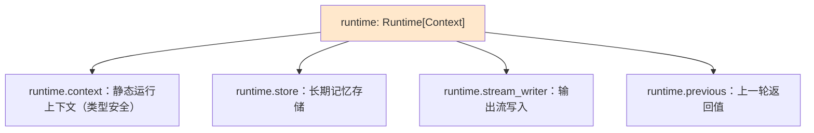
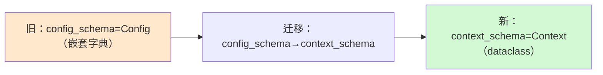
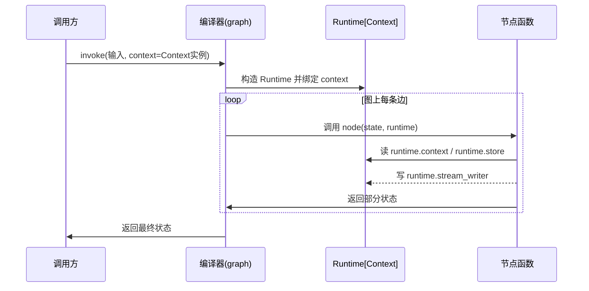

# LangGraph 新版 Runtime 上下文技术手册（知识库 47）

> 定位：技术细节参考手册。详解 LangGraph v0.6 引入的 Runtime/Context API：为什么改、怎么用、怎么迁移。
> 配套学习课程：第 51 课《Runtime 新写法：一行看懂 Context》。

---

## 1. 背景：运行时可访问的"五样东西"

LangGraph 的节点函数（node）在执行时会需要一些**每次运行不同**的信息，统称为"运行时上下文"。在 v0.6 之前，它们各自通过不同参数注入节点：

| 信息 | 旧注入方式 | 含义 |
| --- | --- | --- |
| 用户 ID、连接对象等静态配置 | `config['configurable']`（嵌套字典） | 本次运行开始时固定传入 |
| 长期记忆存储 | `store` 参数 | 跨线程持久化的键值存储 |
| 输出流 | `stream_writer` 参数 | 向图输出流写自定义数据 |
| 上一轮返回值 | `previous` 参数（函数式 API） | 同一线程上一次调用结果 |

旧模式的问题：`config['configurable']` 一层层 `config.get("configurable", {}).get("user_id")` 的取值写法繁琐易错，且语法噪音大、类型不安全。

##2. 新 API：Runtime 类统一入口

v0.6 起，节点函数只多一个 `runtime: Runtime[Context]` 参数，就能拿到全部运行时信息：

关键点：

- **类型化上下文**：开发者自己定义 `Context` 数据类（dataclass），`runtime.context.user_id` 可直接补全与校验，不再手写带引号的字符串键；
- **单一入口**：config、store、stream_writer、previous 全收敛进一个 `runtime` 参数，节点签名更简洁；
- **向后兼容**：旧参数形态仍可用（有弃用警告），不必一次改完。

##3. 定义方式：context_schema 取代 config_schema

具体事实（来自官方 v0.6.0 发布说明）：

- `config_schema` 被弃用，改为 `context_schema`；
- 新写法在构建图时用 `StateGraph(state_schema=..., context_schema=Context)` 声明上下文类型；
- 调用时把上下文作为顶级参数传入：`graph.invoke(输入, context=Context(user_id='123', db_connection='conn'))`，而不是塞进 `config['configurable']`；
- `config_schema` 将在 v2.0.0 移除，但迁移期内旧代码仍可运行。

##4. 迁移对照表（旧写法 → 新写法）

| 环节 | 旧写法（v0.5-） | 新写法（v0.6+） |
| --- | --- | --- |
| 定义 schema | 用嵌套 dict + config_schema | 自定义 `@dataclass class Context`，用 context_schema |
| 节点取用 | `user_id = config.get("configurable", {}).get("user_id")` | `user_id = runtime.context.user_id` |
| 构建图 | `StateGraph(state_schema=State, config_schema=Config)` | `StateGraph(state_schema=State, context_schema=Context)` |
| 调用 | `graph.invoke(&#123;"input":"abc"&#125;, config={"configurable": {...&#125;&#125;)` | `graph.invoke(&#123;"input":"abc"&#125;, context=Context(...))` |
| 其他运行时信息 | store / stream_writer 单独传参 | `runtime.store`、`runtime.stream_writer` |
| 函数式 API | previous 单独体现 | `runtime.previous` |

##5. 数据流全景：一次图的调用发生了什么

要点：`context` 是**本次运行开始时固定**的静态数据；`store` 是持久的；`stream_writer` 用于把中间产出推给调用方（如令牌流）；`previous` 只对函数式 API 有意义。

##6. 为什么这么改：三个收益

- **可读性**：节点签名一眼看出依赖哪些运行时能力（`runtime: Runtime[Context]`）；
- **类型安全**：IDE 补全 + 静态检查替代"魔法字符串"；
- **演进空间**：未来运行时新增能力（如可观测注入）不需要再给每个节点加参数，追加到 Runtime 即可——这正是"统一入口"架构的价值。

##7. 最佳实践清单

1. 长期稳定的配置（用户 ID、租户 ID、连接对象）放 `Context`；会跨轮变化的数据放 State；
2. 仅当节点需要时才声明 `runtime` 参数，不需要的节点保持 `node(state)` 精简签名；
3. 列表字段作为上下文时用不可变容器（如 tuple），避免被检查点序列化时意外变更；
4. ️迁移顺序：新写的图直接用 context_schema；老图在升级到 v0.6+ 时顺手改，不必一次性全改完；
5. 在迁移期间留意左右弃用警告，不要"眼不见为净"直接忽略。

##8. 与 State 的分工：Context ≠ State

| 维度 | State（状态） | Context（上下文） |
| --- | --- | --- |
| 生命周期 | 随图执行流流转、跨节点变更 | 本次运行内固定不变 |
| 是否参与检查点 | 是（持久化保存） | 否（不持久化） |
| 典型内容 | 消息列表、中间结果、计数器 | user_id、db 连接、租户配置 |
| 变更方式 | 节点返回新状态覆盖 | 只读 |

记住一句话：**State 是会变的业务过程数据，Context 是不能变的运行环境信息。**

##9. 小结与自查

- v0.6 起节点通过 `runtime: Runtime[Context]` 统一访问上下文、store、stream_writer、previous；
- `config_schema` 弃用为 `context_schema`（v2.0 移除），旧代码兼容运行但给警告；
- 迁移收益：可读性、类型安全、演进空间。

**自查**：① 能写出新写法节点签名的三要素（图/节点/调用）？② 能说出 State 与 Context 的三个区别？③ 迁移时 `config['configurable']` 应替换成什么？

---

> 下一站：知识库 48《LangGraph 平台与 CLI 技术手册》学习部署与工程化。