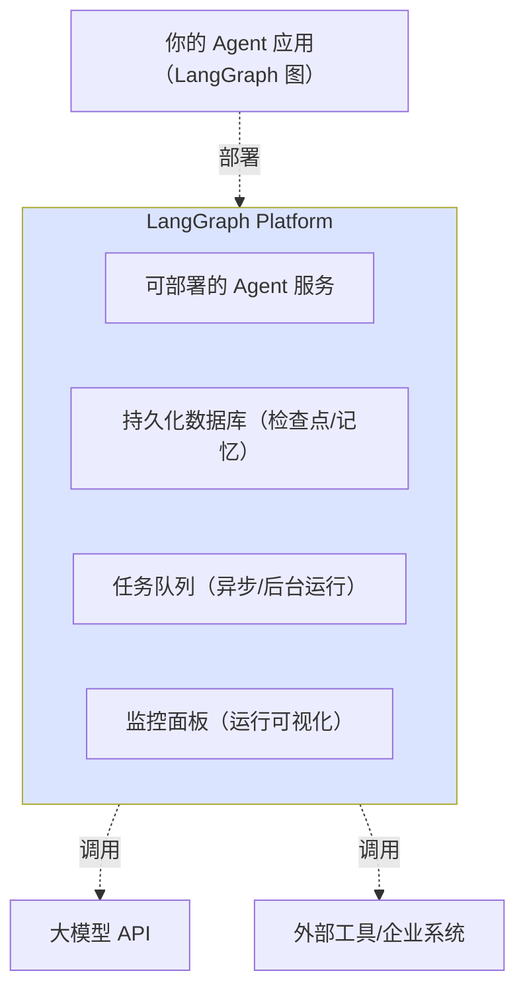
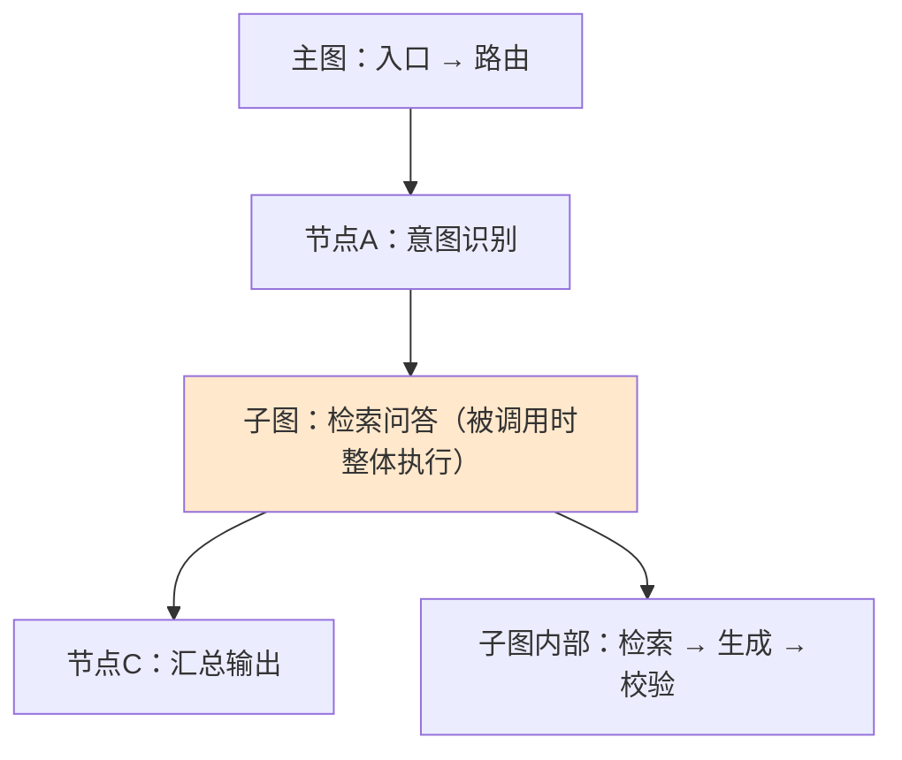
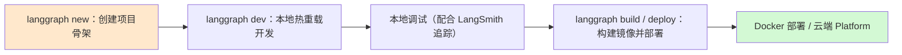
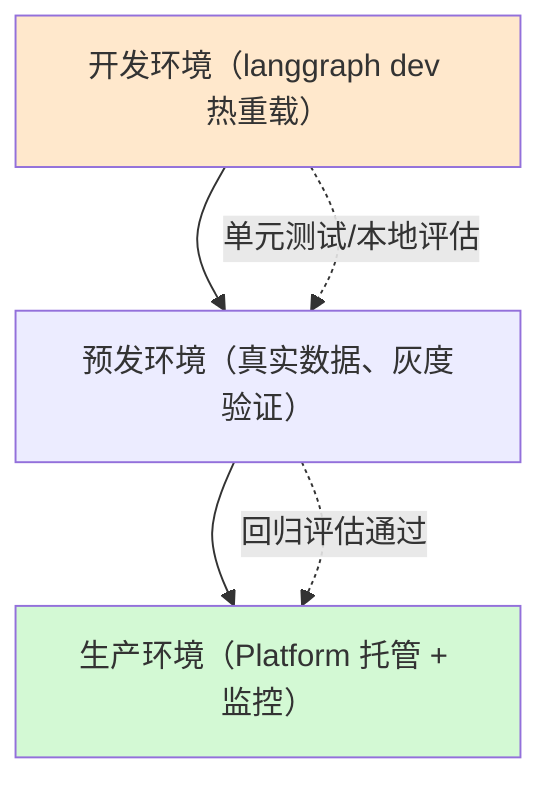

# LangGraph 平台与 CLI 技术手册（知识库 48）

> 定位：技术细节参考手册。覆盖 LangGraph 1.0 核心框架、LangGraph Platform（部署平台）与 LangGraph CLI 0.4.x 工具链。
> 配套学习课程：第 52 课《平滑升级：老代码迁移指南》与第 47 课《云平台部署》。

---

## 1. LangGraph 1.0：官方定位再确认

2026-01-23 发布 LangGraph 核心框架 v1.0.7，官方明确其定位：

> 低级别（low-level）编排框架，用于构建、管理和部署长期运行（long-running）、有状态（stateful）的 Agent。

企业级特性的四个关键词：

| 关键词 | 对应能力 | 已学入口 |
| --- | --- | --- |
| 持久执行（Durable execution） | 失败恢复、从断点续跑 | 学习课程 08、29 检查点知识 |
| 人在循环（Human-in-the-loop） | 执行中暂停、检查、修改状态 | 学习课程 11、27 |
| 全面记忆（Comprehensive memory） | 短期工作记忆 + 跨会话长期记忆 | 知识库 25（记忆系统） |
| 生产就绪部署 | Platform 提供可扩展基础设施 | 本篇 |

同时发布官方命令行工具 **LangGraph CLI v0.4.12**，提供"项目创建 → 开发热重载 → Docker 部署"的全套工具链。

##2. LangGraph Platform：从"库"到"运行时平台"

2025 年底 LangChain 推出 LangGraph Platform，它把开源框架的能力包装成托管部署形态：

组件说明：

- **Agent 服务**：把编译好的图变成可对外提供 HTTP 服务的端点，支持并发与扩缩容；
- **持久化数据库**：托管检查点与记忆存储，跨会话状态归平台管理；
- **任务队列**：长耗时、异步的图执行（如后台批处理、定时任务）进入队列调度；
- **监控面板**：运行轨迹、状态流转、令牌/延迟等指标可视化（与 LangSmith 观察打通）。

学习价值：理解"图 + 平台"两层——本地开发时图是纯代码对象；部署后它变成一项运行中的服务，状态、队列、监控都由平台托管。

##3. 子图（Subgraph）：把大图拆成可复用函数

子图自 LangGraph v0.3 起稳定，是 1.0 的标配能力，等价于"图里套图"：

子图的要点：

- 复用：同一子图可被多个主图/多个节点调用，像调用函数一样；
- 隔离：子图拥有自己的状态 schema 与检查点，可以独立编译测试；
- 通信：通过输入输出映射与主图交换数据，子图内部状态对外不可见（默认）；
- 适用：检索问答、意图识别、代码执行等**边界清晰**的模块，拆成子图后主图可读性大增。

##4. LangGraph CLI 0.4.x：一条命令贯穿开发到部署

| 命令 | 作用 | 说明 |
| --- | --- | --- |
| `langgraph new` | 初始化项目 | 生成标准目录结构与配置模板 |
| `langgraph dev` | 本地开发服务器 | 代码改动热重载，无需手动重启 |
| `langgraph build` | 构建部署产物 | 产出可部署镜像/包 |
| `langgraph deploy` | 部署 | 可对接 LangGraph Platform 或自管 Docker 环境 |

CLI 的出现显著降低门槛：零基础学习者用 `langgraph new` 就能得到一个可运行的项目骨架，再逐步填节点。

##5. 三环境工作流（开发 → 预发 → 生产）

- 开发：本地热重载 + LangSmith 追踪 + 小样本评估；
- 预发：接入真实数据源、跑回归评测集（对应知识库 42 的 CI 流水线）；
- 生产：Platform 托管、任务队列、监控告警，发生异常时靠检查点回滚与断点恢复。

##6. 部署选型三问（学习阶段用得上）

| 问题 | 答案含义 |
| --- | --- |
| 我的图需要长期状态吗？ | 需要 → Platform/持久化检查点价值大 |
| 流量与并发规模多大？ | 小 → CLI + Docker 自管足够；大 → Platform 托管 |
| 团队需要可视化运维吗？ | 需要 → LangSmith/监控面板 |
| （学习者角度）我在学还是在上线？ | 学 → 本地 `langgraph dev` 即可，不急着部署 |

##7. 从知识库到动手：一条建议路径

1. 用 `langgraph new` 建一个空项目，跑通 `langgraph dev`；
2. 把知识库 47 的 Context 示例写进改造后的第一个节点；
3. 把一个已有示例拆成子图，体会状态隔离；
4. 本地跑通后，再研究部署（先 Docker，再 Platform），配合第 47 课逐步理解。

##8. 小结与自查

- LangGraph 1.0 定位低级别、长运行、有状态编排框架；CLI 0.4.12 提供全流程工具链；
- Platform = 服务 + 持久化 + 任务队列 + 监控，把图变成托管服务；
- 子图是图级复用单元，适合拆"边界清晰"的模块；
- 开发先用 `langgraph dev` 本地热重载，再按"开发→预发→生产"推进。

**自查**：① 能说出 Platform 四个组件与各自职责？② 能解释子图状态隔离的含义？③ 你能把"三环境工作流"用自己的话说给同学听吗？

---

> 下一站：知识库 49《MCP 协议与新特性生态整合技术手册》。