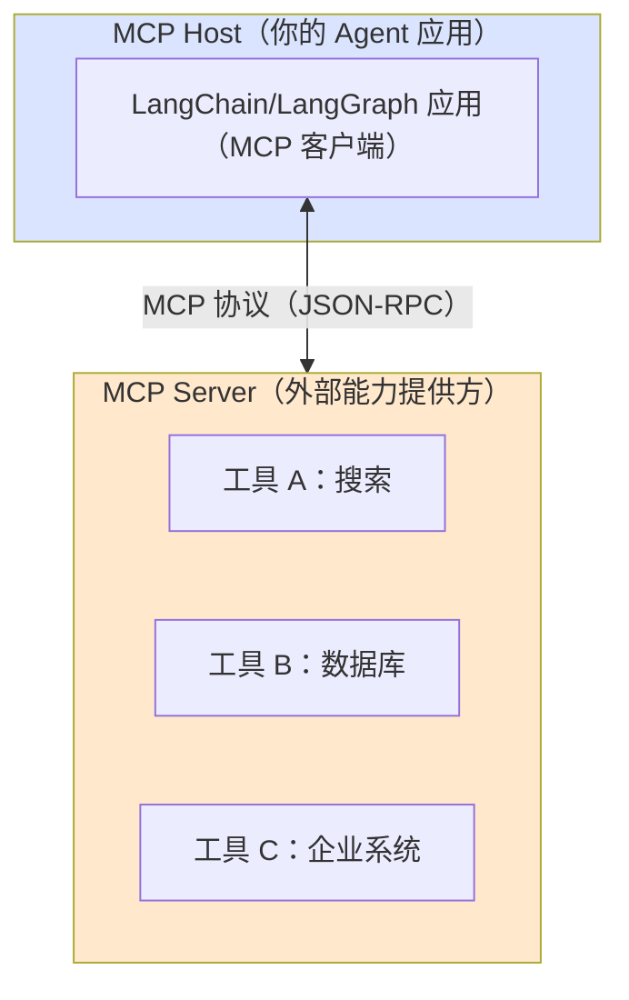
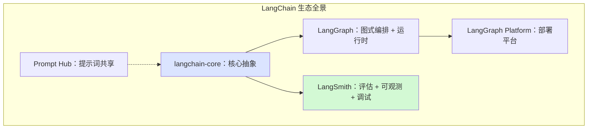
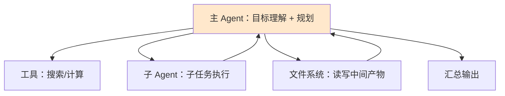
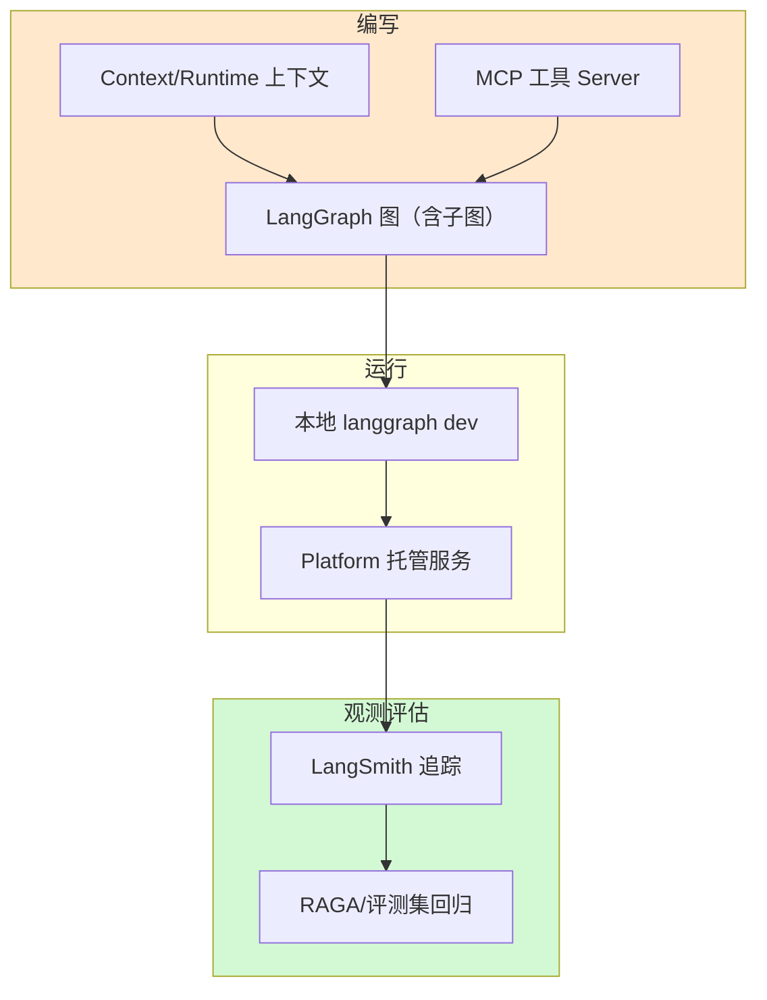

# MCP 协议与新特性生态整合技术手册（知识库 49）

> 定位：技术细节参考手册。梳理 LangChain 生态在 2025—2026 年的关键新特性：MCP 工具协议、Deep Agents、LangSmith 新能力，以及它们如何整合成完整智能体工程栈。
> 配套学习课程：第 53 课《收官展望：未来学习路线图》。

---

## 1. MCP：工具接入的"统一插座"

MCP（Model Context Protocol）是 Anthropic 于 2024 年末提出的开放协议，目标是让模型应用接入外部工具/数据像 USB 插头一样标准化。到 2026 年，MCP 已成为 LangChain 工具生态的主流接入方式之一。

要点：

- 一个 Host 可同时对接多个 Server，每个 Server 暴露"工具 + 资源 + 提示"；
- LangChain/LangGraph 通过 MCP 适配层把 Server 暴露的工具转成本地工具，接入既有 Tool 节点；
- 收益：**一次编写协议**，各框架、各模型、各企业系统都能互操作，生态从"每家公司一套 SDK"走向"一套协议"。

学习主线（对应已有课程）：知识库 21（Agent 工具集成）讲的是"注册工具"；MCP 讲的是"工具从外部 Server 动态发现"。两者组合后，Agent 可访问的工具集合不再编译期写死，而是运行期挂载。

##2. LangChain 生态产品矩阵（2026 现状）

| 组件 | 定位 | 对应学习文档 |
| --- | --- | --- |
| langchain-core | 底层抽象与协议 | 知识库 01、07 |
| LangGraph | 有状态图编排 | 知识库 05、18、26 等 |
| LangSmith | 追踪、评测、监控 | 知识库 09、42 |
| LangGraph Platform | 托管部署 | 知识库 48 |
| Prompt Hub | 提示词管理与复用 | 知识库 03（提示词工程） |

##3. Deep Agents：新一代智能体工作范式

官方推荐的 Deep Agents 思路：**让 Agent 具备规划（plan）、使用子智能体（subagents）、操作文件系统（file systems）**三大能力，处理复杂任务时"想清楚再动手"。

对学习者的意义：第 49 课（Agent 架构模式）讲的是"模式库"，Deep Agents 则是官方力推的**默认打法**——先规划、再分层执行、善用文件与环境。它与多智能体（知识库 44）的区别：Deep Agents 是"单 Agent + 子任务分解"，多智能体是"多角色协作"。

##4. LangSmith 新能力：Studio 与 Deployment

- **LangSmith Studio**：可视化原型环境，可以在界面里搭建、配置、复用 Agent，再导出到代码/部署——把"配 Agent"这件事从纯编码变成"低代码拼装 + 代码深化"；
- **LangSmith Deployment**：面向长运行、有状态工作负载的专用部署平面，可发现、复用、配置、共享 Agent，团队间迭代更快。

把这些与知识库 42（评估）、知识库 43（云平台）串起来：**LangSmith 管"看得懂、评得准"，LangGraph 管"跑得稳"，Platform 管"部署得出去"**。

##5. 特性整合参考架构（学习者视角）

一句话串联：**用 Context 保持上下文干净（47）→ 用子图组织复杂逻辑（48）→ 用 MCP 拓展工具（本篇）→ 本地 dev 再部署 Platform（48）→ LangSmith 观察评估（09/42）。**

##6. 学习优先级建议

| 特性 | 优先级 | 理由 |
| --- | --- | --- |
| MCP 概念与接入 | 高 | 已成为主流，面试/工作高频 |
| Deep Agents 思路 | 高 | 官方推荐的默认模式 |
| LangSmith Studio | 中 | 偏企业效率工具 |
| LangSmith Deployment | 低→中 | 需要一定规模才有用 |
| Prompt Hub | 低 | 概念简单，用到再学 |

##7. 小结与自查

- MCP 让工具接入标准化，"一套协议、随处接入"；
- 生态矩阵：core（抽象）+ LangGraph（编排）+ LangSmith（观测评估）+ Platform（部署）；
- Deep Agents = 规划 + 子智能体 + 文件系统；
- 整合主线：Context → 子图 → MCP → dev/Platform → 评估。

**自查**：① 能画出 MCP 的 Host/Server 结构？② 能区分 Deep Agents 与多智能体？③ 能把 LangSmith、LangGraph、Platform 三者的分工用一句话讲清？

---

> 专题知识库完毕，进入学习课程第 50—53 课（对应四篇技术手册的教学版）。