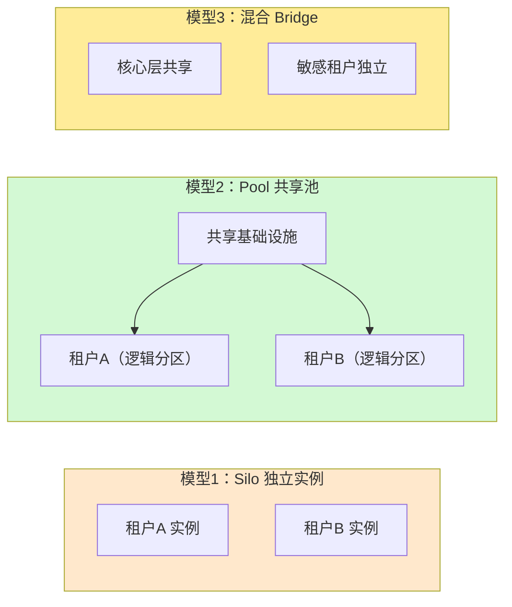
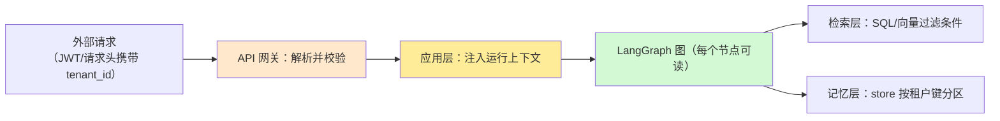

# 多租户架构与隔离策略技术手册（知识库 50）

> 定位：技术细节参考手册。讲清"多租户"是什么、三种隔离模型怎么选、租户标识如何贯穿 LangGraph 应用。
> 配套学习课程：第 54 课《多租户入门：一个平台服务许多客户》。
> 前置知识：知识库 47（Runtime/Context）、知识库 28（状态与检查点）、知识库 35（LLM 网关）。

---

## 1. 什么是多租户

多租户（Multi-tenancy）是 SaaS 的核心形态：**一套基础设施，服务许多"租户"（tenant）**。租户可以是公司、部门或个人——关键是一个租户拥有自己的数据与配置，且**与其他租户完全隔离**。

反例（单租户/私有化）：为每个客户单独部署一套系统。数据绝对隔离，但成本高、升级靠人工、资源浪费。
正例（多租户）：一套系统服务所有客户，客户之间看不到彼此的数据。你使用的微信、网盘、企业协作软件，背后几乎都是多租户架构。

对 LLM 应用的启发：当你要把 RAG/Agent 能力"卖"给多个客户时，多租户是绕不开的课题——**不能因为应用了 AI，就把"租户隔离"这个基本功丢掉**。

## 2. 三种隔离模型



### 2.1 Silo（每租户一套资源）

- 每个租户拥有独立数据库/向量库/（甚至）独立模型实例；
- **优点**：隔离最强、故障不会扩散、可定制化强；
- **缺点**：成本随租户数量线性增长、资源利用率低、运维复杂（每套都要升级）。
- **适用**：金融、政务等高合规租户；少量大客户。

### 2.2 Pool（共享资源 + 逻辑隔离）

- 所有租户共享同一套数据库/向量库/服务，用 `tenant_id` 等字段做**逻辑隔离**；
- **优点**：成本低、资源利用率高、升级一次全量受益；
- **缺点**：隔离依赖代码正确性，一旦漏传租户标识就会串数据（最危险）；
- **适用**：多数 SaaS 场景、中小客户、平台内部多部门。

### 2.3 混合（Bridge）

- 默认 Pool，对特殊租户（大客户/高合规）升级为 Silo；
- 工程上最常见的落地形态：**"共享逻辑隔离 + 例外租户独立"**。

## 3. 选择决策表

| 决策因素 | 倾向 Silo | 倾向 Pool |
| --- | --- | --- |
| 租户数量 | 少（< 20） | 多（上百/上千） |
| 合规要求 | 极高（金融、政务） | 中等 |
| 定制化需求 | 强 | 弱 |
| 预算模式 | 客户按独占付费 | 订阅制共享 |
| 运维能力 | 成熟（能管多套） | 追求低成本 |
| 数据量级 | 单租户业界大 | 单租户中等 |

一句话：**小而贵的合规场景用 Silo，大而多的普通场景用 Pool，两者兼有选混合。**

## 4. 租户标识贯穿全链路

多租户应用的第一工程问题：**租户标识（tenant_id）如何从请求入口传到最底层**。



### 4.1 与 LangGraph 的对接：tenant_id 放 Context 而非 State

呼应知识库 47：租户标识是**运行环境信息**（不变），应放在 `context` 而不是 `state`：

- **错误示范**：把 tenant_id 塞进 State，随每个节点流转——既污染检查点持久化，又容易在跨节点时被覆盖；
- **正确示范**：在 `Context` 数据类中定义 `tenant_id: str`，节点通过 `runtime.context.tenant_id` 读取。

```python
@dataclass
class Context:
    tenant_id: str          # 租户标识：运行内不变
    user_id: str
    db_connection: str

def retrieve_node(state, runtime: Runtime[Context]):
    ten = runtime.context.tenant_id      # 读租户
    # 检索时强制加租户过滤
    docs = retriever.invoke(state["question"],
                            filter={"tenant_id": ten})
    return {"docs": docs}
```

### 4.2 检查点与 store 的租户分区

- **检查点（checkpointer）**：存储时键中加入 `tenant_id`，确保不同租户的会话历史互不可见；
- **记忆存储（store）**：命名空间按租户分层，如 `("tenant", ten, "thread", thread_id)`——呼应知识库 25 的命名空间设计。

### 4.3 默认值陷阱

**永远不要给 tenant_id 设默认值**。设默认值 = 允许漏传时"悄悄进共享桶"。- 必须显式传入，校验失败直接拒绝请求；
- 网关层统一解析 JWT/头，应用层不再信任外部传入的参数。

## 5. 租户生命周期

| 阶段 | 动作 | 注意点 |
| --- | --- | --- |
| 开通 | 创建租户、分配 tenant_id、初始化资源分区 | 一次性初始化配置模板 |
| 配置 | 模型、提示词模板、知识库绑定 | 配置快照，支持回滚 |
| 使用 | 正常请求，计量用量 | 全链路打 tenant 标签 |
| 变更 | 配额调整、模型升级 | 灰度验证再全量 |
| 停用/迁移 | 数据导出后停用，或迁至独立实例 | 审计留存、可彻底删除 |

## 6. 多租户的测试要点（必须写进验收）

- **串租户测试**：用租户 A 的凭证查询，断言返回数据中绝无租户 B 的内容（检索 + 记忆双层验证）；
- **缺标识测试**：构造不带 tenant_id 的请求，断言被拒绝而非降级；
- **并发隔离测试**：多租户同时写入/读取，断言互不干扰；
- **清理测试**：租户删除后，其数据不可被其他租户检索到。

## 7. 小结与自查

- 多租户 = 一套基础设施服务多个客户且数据隔离；
- 三类模型：Silo / Pool / 混合，按数量、合规、成本选型；
- 租户标识必须显式、全链路传递，LangGraph 中放 Context（不放 State）；
- 网关强制校验、不设默认值、双层（检索+记忆）隔离测试。

**自查**：① 能说出三种隔离模型的优缺点与适用场景？② 为什么 tenant_id 放 Context 而非 State？③ 串租户测试要验证哪两个层面？

---

> 下一站：知识库 51《租户级数据隔离与检索安全技术手册》。