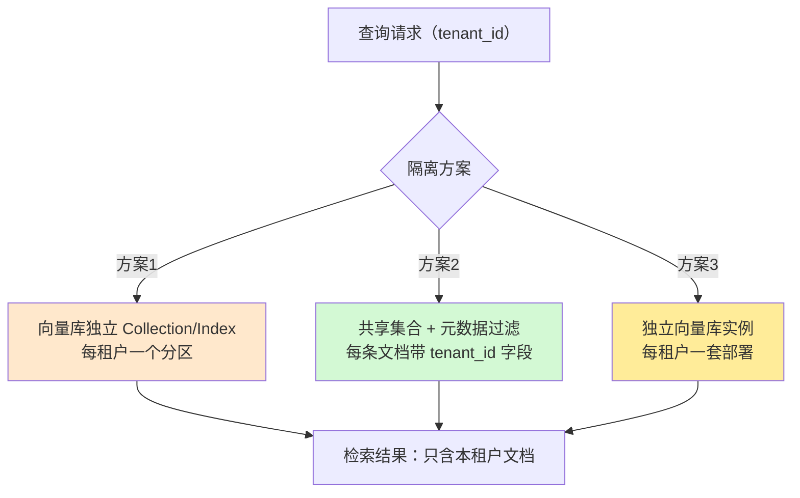
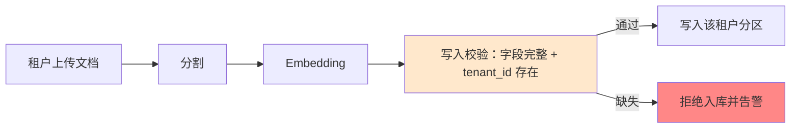

# 租户级数据隔离与检索安全技术手册（知识库 51）

> 定位：技术细节参考手册。聚焦多租户下 RAG/Agent 的"数据隔离"：隔离发生在哪几层、向量检索怎么过滤、怎么防串租户。
> 配套学习课程：第 55 课《租户隔离：数据不能串门》。
> 前置知识：知识库 04（检索与向量存储）、知识库 08（高级 RAG）、知识库 50（多租户架构）。

---

## 1. 隔离的四个层面

多租户 LLM 应用的数据隔离，可以从四个层面逐层收紧：

| 层面 | 隔离对象 | 手段 | 强度 |
| --- | --- | --- | --- |
| 模型层 | 模型实例/微调权值 | 每租户独立模型路由（贵） | 强 |
| 提示词层 | Prompt 模板与指令 | 租户级模板配置隔离 | 中 |
| 知识层 | 文档/向量库/检索结果 | 分区 + 过滤（核心） | 强 |
| 记忆层 | 会话历史/长期记忆 | store 命名空间分区 | 强 |

对绝大多数 RAG 应用，**知识层 + 记忆层**是隔离主战场（模型层一般共享，除非大客户定制）。

## 2. 知识层隔离的三种实现



### 2.1 独立 Collection/Index（推荐起点）

- 每个租户一个向量集合（collection），集合内全是该租户数据；
- 优点：天然隔离，检索逻辑简单（根本不用过滤条件）；
- 缺点：集合数量多时管理成本上升；跨租户统一检索不可能（一般也不需要）。
- 适用：租户数量几十以内、每个租户数据量相近。

### 2.2 元数据过滤（最灵活）

- 全部文档进同一个集合，但每条文档的元数据（metadata）中写入 `tenant_id`；
- 检索时强制附加过滤条件：`filter={"tenant_id": ten}`；
- 优点：单集合好管理，可按租户弹性扩容；
- 缺点：**漏传过滤条件 = 串租户事故**，必须在网关层兜底校验；
- 适用：租户多、数据量弹性大、需要跨租户统计的场景。

### 2.3 独立实例（最强也最贵）

- 每租户独立向量库服务/实例；
- 适用：高合规租户（呼应 50 的 Silo 模型）。

## 3. LangChain 落地：retriever 注入租户过滤

在 LangGraph 的检索节点中，用 `runtime.context.tenant_id` 构造过滤条件：

```python
def retrieve_node(state, runtime: Runtime[Context]):
    ten = runtime.context.tenant_id          # 1. 从上下文取租户
    retriever = vectorstore.as_retriever(
        search_kwargs={"filter": {"tenant_id": ten}}   # 2. 强制过滤
    )
    docs = retriever.invoke(state["question"])
    # 3. 兜底：结果再校验一次（纵深防御）
    docs = [d for d in docs if d.metadata.get("tenant_id") == ten]
    return {"docs": docs}
```

纵深防御三层：
1. **入口**：Context 携带合法 tenant_id（网关解析，不信任前端传参）；
2. **检索**：filter 强制带上租户条件；
3. **出口**：返回前二次校验每条文档的 metadata，不一致即丢弃并告警——防"漏网之鱼"。

## 4. 记忆层隔离：store 命名空间

呼应知识库 25 与 47：长期记忆存储按租户分命名空间：

```
("tenant", <tenant_id>, "thread", <thread_id>)
```

要点：
- 命名空间第一维放 tenant_id，天然把租户"隔墙"；
- 读取记忆时只允许当前租户命名空间；
- 会话历史的检查点存储同样把 tenant_id 编入键，见知识库 50 §4.2。

## 5. 提示词层隔离：租户模板

- 提示词模板按租户配置（品牌话术、行业术语），存于配置中心；
- 渲染 Prompt 时从"租户模板 + 系统安全指令"拼接，**安全指令永远在租户内容之后**（呼应知识库 34 防注入排序）；
- 租户模板变化不影响其他租户，配置即改即生效。

## 6. 索引管道的租户边界

文档入库（ingestion）同样要隔离，否则"进错了门"：



- 入库管理器从租户元数据取 tenant_id，**不得信任文档内容里的自报字段**；
- 批量导入任务同理：每个任务绑定租户，防止跨租户误导入。

## 7. 串租户测试与验收

| 测试 | 做法 | 通过标准 |
| --- | --- | --- |
| 检索串访 | 租户A问题在租户B空间查询 | 0 条 B 文档出现在 A 结果 |
| 记忆串访 | 读取其他租户命名空间 | 被拒绝/为空 |
| 缺标识 | 无 tenant_id 请求 | 网关 4xx 拒绝 |
| 伪造标识 | 修改 token 中租户 | 签名校验失败拒绝 |
| 删除清理 | 删除租户后再次检索 | 无残留数据 |

## 8. 小结与自查

- 隔离四层面：模型/提示词/知识/记忆，重点是知识层与记忆层；
- 知识层三方案：独立 Collection、元数据过滤、独立实例；检索强制 filter + 出口二次校验；
- 记忆层按租户命名空间；入库必须显式绑定租户；
- 隔离的正确性靠**测试验证**而非自觉。

**自查**：① 元数据过滤方案最大的风险点是什么？怎么兜底？② 记忆层隔离靠什么实现？③ 索引管道校验哪两步？

---

> 下一站：知识库 52《成本计量配额与用量治理技术手册》。