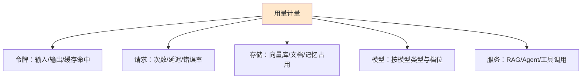
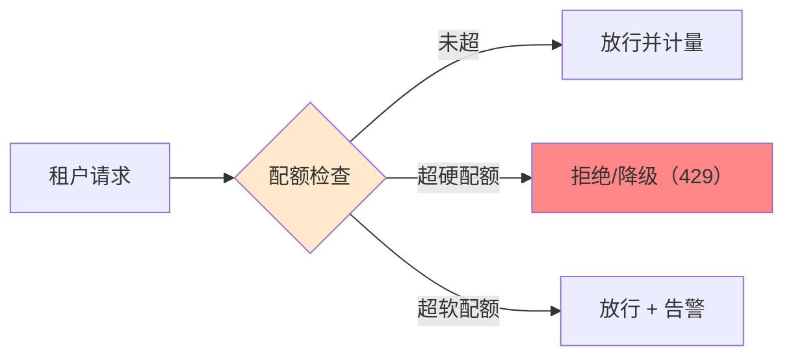

# 成本计量配额与用量治理技术手册（知识库 52）

> 定位：技术细节参考手册。多租户 LLM 平台的"钱"怎么算得清：计量哪些维度、配额怎么设、限流怎么降级、成本怎么分摊。
> 配套学习课程：第 56 课《成本配额：钱要算得明白》。
> 前置知识：知识库 35（LLM 网关）、知识库 38（推理性能与成本）、知识库 50（多租户架构）。

---

## 1. 为什么多租户必须做计量

单租户应用，成本是"自己的账"；多租户平台，成本必须**拆到每个租户头上**，否则三个问题避不开：

- **财务问题**：按用量收费的 SaaS 没有账单就无法计费；
- **公平问题**：一个租户的疯狂调用拖慢所有人（"噪声邻居"），没有配额就无法限流；
- **治理问题**：不知道哪个租户在用哪些模型，就无法做预算与优化。

一句话：**无计量，不治理。**

## 2. 计量维度清单



| 维度 | 计什么 | 典型单位 |
| --- | --- | --- |
| 令牌 | 输入 token、输出 token、缓存命中 token | 每 1K token |
| 请求 | 调用次数、并并发峰值、重试次数 | 次数 / QPS |
| 模型 | 按模型来源计费（高速/标准/便宜档） | 每模型单价 |
| 存储 | 向量索引、文档数、会话记录 | 每 GB / 条 |
| 增值能力 | RAG 检索次数、工具调用次数、Agent 步数 | 次 |

计量数据来源：网关日志（每请求一行，含 tenant_id + 模型 + token 数 + 缓存命中标记）——呼应知识库 35 网关统一入口的价值。

## 3. 配额（Quota）：从"允许用多少"到"用到多少报警"

配额回答：**租户在时间窗口内最多用多少**。



| 配额类型 | 粒度 | 超限行为 |
| --- | --- | --- |
| 硬配额 | 每分钟/每天/每月 | 拒绝（429）或降级到备用模型 |
| 软配额 | 百分比阈值（80%/100%） | 告警通知租户管理员，不阻断 |
| 并发配额 | 同时运行的任务数 | 排队或拒绝 |

配额维度示例（按租户 × 模型 × 时段）：
- 每租户每日 100 万 token（硬）；
- 每租户每分钟 60 请求（硬）；
- 每租户每月预算 500 元折算用量（软，超 80% 告警）。

## 4. 限流与降级策略

配额超限后怎么"优雅地拒绝"，比直接抛错专业：

| 策略 | 做法 | 适用 |
| --- | --- | --- |
| 429 直拒 | 返回限流错误 + Retry-After | 峰值控制 |
| 排队 | 请求进队列，有空隙再处理 | 异步长任务 |
| 降级模型 | 切到更便宜/更快的模型 | 预算保护 |
| 降级缓存 | 命中缓存直接返回 | 读多写少场景 |
| 熔断 | 模型供应商异常时快速失败 | 保护下游 |

注意：降级策略要**向用户明示**（响应头/文档说明），避免"悄悄换了模型结果变差还不自知"。

## 5. 缓存与计量的关系

呼应知识库 38 的语义缓存：命中缓存的请求**成本极低**，计量时区分对待：

- 全命中：按缓存 token 计（通常远低于正常价）或免费；
- 部分命中：输入扣减缓存部分，输出全额计；
- 口径统一：在网关层定义"命中判定"，否则账单对不上。

## 6. 成本分摊模型

| 模型 | 做法 | 适用 |
| --- | --- | --- |
| 直充（Pay-as-you-go） | 每租户按实际用量计费 | 外部客户 SaaS 计费 |
| 额度包（Allocation） | 租户按月买断额度，超量加购 | 订阅制产品 |
| 共享池（Shared pool） | 全平台一个池，按部门/项目分录 | 内部平台 |
| 混合 | 基础包 + 超出直充 | 主流 SaaS 通用 |

分摊的落地依赖 §2 的计量数据 + 台账（billing ledger）持久化，月末对账、导出账单。

## 7. 预算告警与封顶


- 告警渠道：邮件/如流/Webhook（呼应附录 O 告警体系）；
- 封顶后租户仍可发起"申请临时加码"流程，人工审批后放行——**治理要有温度，不能一拒了之**。

## 8. 计量系统架构示意

```
请求 → 网关（解析 tenant_id、模型、token）→ 计量写入（异步、批量）
                                        → 配额检查（缓存高频计数值）
                                        → 告警引擎（阈值触发）
                                        → 账单生成（月末）
```

要点：计量走**异步批量**（不阻塞请求路径），配额检查走**高频缓存**（读写快），两者分离。

## 9. 小结与自查

- 计量维度：令牌/请求/模型/存储/增值能力，数据源在网关日志；
- 配额：硬配额拒绝、软配额告警、并发配额排队；
- 降级四件套：429/排队/降级模型/缓存兜底；
- 分摊模型：直充/额度包/共享池/混合；预算封顶 + 人工审批通道。

**自查**：① 说出至少四个计量维度？② 硬配额和软配额超限后行为有何不同？③ 缓存命中在计量上怎么处理？

---

> 下一站：知识库 53《企业级 LLM 平台合规运营技术手册》。