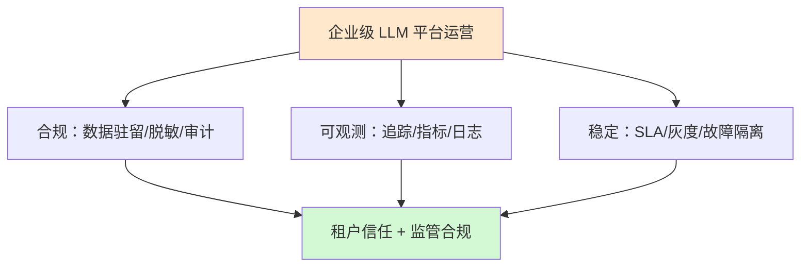
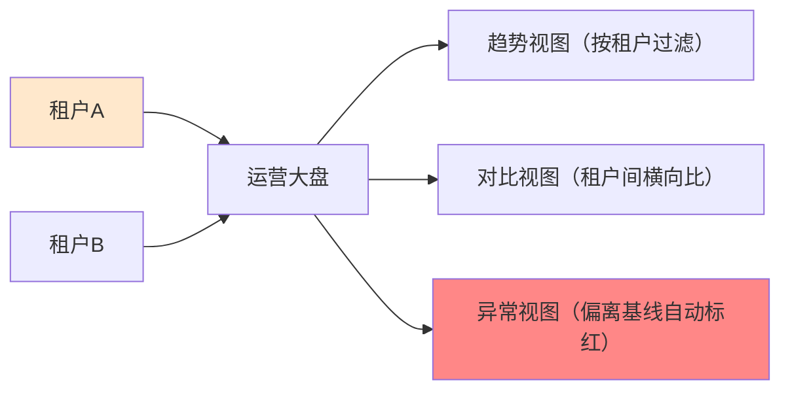
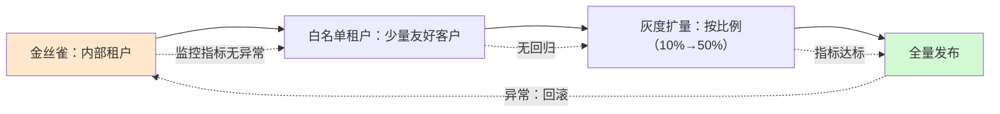
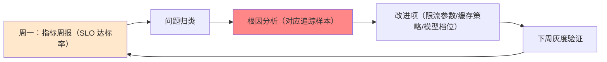

# 企业级 LLM 平台合规运营技术手册（知识库 53）

> 定位：技术细节参考手册。把前面所有知识收拢成"运营一台企业级 LLM 平台"的全景：合规底线、可观测、SLA、灰度发布、故障隔离。
> 配套学习课程：第 57 课《平台运营：从单应用走向企业平台》（收官课）。
> 前置知识：知识库 41（合规隐私治理）、知识库 43（云平台部署）、知识库 52（成本计量）。

---

## 1. 平台运营的三个支柱

一台面向多租户的 LLM 平台，运营 = 合规 + 可观测 + 稳定。三者缺一不可：

## 2. 合规运营（呼应知识库 41，压实到平台运营）

| 合规项 | 平台级做法 | 租户视角 |
| --- | --- | --- |
| 数据驻留 | 租户绑定数据区域，模型调用路由到区域内服务商 | 数据不出指定区域 |
| 脱敏 | 网关统一脱敏（PII/密钥/手机号），入 LLM 前过滤 | 敏感信息不进模型 |
| 审计 | 全请求留痕：tenant/模型/输入输出/耗时/成本（符合法务保留期） | 可导出审计日志 |
| 内容安全 | 统一安全过滤器 + 租户自定义策略叠加 | 平台底线 + 租户策略 |
| 算法备案/合规声明 | 平台文档与界面告知用途与边界 | 知情与同意 |

> 注：具体合规要求因地域行业而变，落地以法务与监管为准，本表提供工程框架。

## 3. 可观测：三大数据 + 租户维度切分

运营必须能回答："某个租户，最近一小时，发生了什么。"

三大数据源（呼应附录 O）：
- **追踪（Traces）**：一次请求的完整链路（LangSmith 等），含节点级耗时与 LLM 调用；
- **指标（Metrics）**：QPS、延迟 p50/p95/p99、错误率、token 消耗、缓存命中率；
- **日志（Logs）**：请求明细、告警事件、审计记录。

多租户运营的关键：**所有数据按 tenant_id 打标签，可随时切片**。

## 4. SLA：把"稳定"变成可量化的承诺

SLA（Service Level Agreement）三件套：**指标 → 目标 → 违背时的补偿**。

| 指标 | 定义 | 典型目标（示例） |
| --- | --- | --- |
| 可用性 | 正常响应请求占比 | 99.9%（月度） |
| 延迟 | p95 响应时间 | ≤ 3 秒 |
| 错误率 | 5xx/严重错误占比 | ≤ 0.5% |
| 吞吐 | 每分钟处理请求数 | 随扩容承诺 |

- **SLI（实际指标）→ SLO（目标）→ SLA（合同承诺）**三层：合同里写 SLA，日常盯 SLO，底层量 SLI；
- 违背处理：降级补偿（退款/延长服务期），同时触发告警与复盘；
- 多租户注意：大租户可与平台签更严的 SLO；平台需有能力"按租户粒度"统计达标率。

## 5. 灰度发布与租户白名单

平台升级（新模型/新版本知识库/路由策略）不能"一把梭"：

要点：
- 每个发布单元可回滚（配置快照 + 模型版本回退，呼应知识库 39/43）；
- 灰度期同时盯"指标"与"真实用户反馈"（如投诉率、满意度）；
- 破坏性变更（如模型切换）必须有"新旧并行 + 对比评估"期。

## 6. 故障隔离与降级优先级

多租户故障最大的敌人是"**雪崩**"：一个租户的突发流量拖垮整个平台。

隔离手段矩阵：

| 手段 | 作用 | 对应知识 |
| --- | --- | --- |
| 租户级限流/配额 | 阻断单租户打爆平台 | 知识库 52 |
| 独立队列/资源池 | 大租户占用不影响小租户 | 知识库 48 任务队列 |
| 熔断器 | 下游模型/服务异常时快速失败 | 知识库 52 §4 |
| 舱壁（Bulkhead） | Silo 租户用独立资源 | 知识库 50 |
| 降级清单 | 明确"哪个功能先降级" | 知识库 35 |

降级优先级示例（从先降级到后降级）：
1. 非核心功能（闲聊、推荐）先降；
2. 缓存直接返回（牺牲新鲜度保可用）；
3. 备用模型（便宜档）顶上；
4. 核心交易/合规功能最后降。

## 7. 运营周的例行闭环

## 8. 小结与自查

- 三支柱：合规 + 可观测 + 稳定；
- 合规：驻留/脱敏/审计/内容安全/声明，压实到平台层；
- 可观测：三数据源按租户切片；SLA = 指标 + 目标 + 补偿；
- 灰度四步：金丝雀→白名单→扩量→全量，可回滚；
- 防雪崩：配额 + 队列 + 熔断 + 舱壁 + 降级优先级。

**自查**：① SLI/SLO/SLA 三者的关系？② 灰度发布四阶段与回滚时机？③ 防故障雪崩的五种手段？

---

> 知识库 50-53 完毕。学习课程第 54—57 课为对应教学版，附录 W-X 为工程速查。