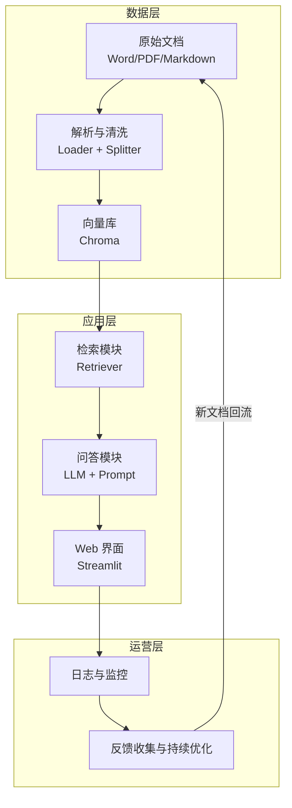
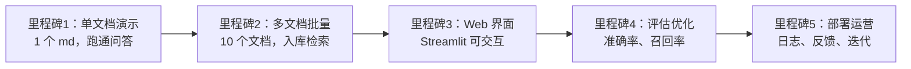

# 知识库 54 端到端实战：从零搭建企业知识库问答系统

> 定位：技术手册。把前面 53 篇知识库的知识串成一个完整项目：用一个"企业内部文档问答系统"的实战案例，覆盖需求分析、架构设计、数据管线、检索问答、部署运营全流程。
> 配套学习课程：第 58、59、60、61 课；对应附录：Y、Z。

---

## 1. 实战项目背景

我们要搭建一个**企业内部知识库问答系统**：员工上传内部文档（制度、操作手册、产品资料），系统能回答"报销流程是什么""某某服务器的 IP 是多少"这类问题。

### 1.1 用户故事（需求从哪来）

| 角色 | 痛点 | 期望 |
| --- | --- | --- |
| 新员工 | 找不到制度文档、问人被打扰 | 直接问系统 3 秒得答案 |
| 老员工 | 文档散落在网盘/邮件/群里 | 一个入口检索所有资料 |
| 行政/HR | 重复回答同样的问题 | 系统自动回答，人工只处理异常 |

### 1.2 技术选型原则

零基础起步、快速验证，遵循三条原则：

1. **先小后大**：先用一个小数据集跑通全链路，再扩展；
2. **默认选项优先**：凡是可选的组件，先选生态最成熟、文档最多的（LangChain + Chroma + OpenAI 兼容接口）；
3. **留替换口子**：用接口抽象（如 `vectorstore` 统一接口），后面换 Milvus/PGVector 不影响上层。

---

## 2. 系统架构总览



**分层解读**（每层对应前面的知识）：

- **数据层**：文档进、向量出，对应知识库《文档解析与预处理》《向量数据库选型》；
- **应用层**：检索 + 生成，对应《高级 RAG 与检索策略》《LCEL 表达式语言》；
- **运营层**：监控和反馈，对应《生产部署》《可观测性》。

---

## 3. 核心代码骨架（Mini 版本）

### 3.1 数据管线：文档入库

```python
from langchain_community.document_loaders import DirectoryLoader
from langchain_text_splitters import RecursiveCharacterTextSplitter
from langchain_community.embeddings import HuggingFaceEmbeddings
from langchain_community.vectorstores import Chroma

# 1. 加载目录下所有 md 文档
loader = DirectoryLoader("./docs", glob="**/*.md")
docs = loader.load()

# 2. 分块：每块 800 字符、重叠 150
splitter = RecursiveCharacterTextSplitter(
    chunk_size=800, chunk_overlap=150,
    separators=["\n\n", "\n", "。", "！", "？", " ", ""]
)
chunks = splitter.split_documents(docs)

# 3. 向量化并写入 Chroma（首次运行会下载模型）
embeddings = HuggingFaceEmbeddings(model_name="BAAI/bge-small-zh-v1.5")
vectorstore = Chroma.from_documents(
    documents=chunks, embedding=embeddings,
    persist_directory="./chroma_db"
)
```

### 3.2 问答链路：检索增强生成

```python
from langchain.prompts import ChatPromptTemplate
from langchain_openai import ChatOpenAI

# 检索器：默认取 TopK=4
retriever = vectorstore.as_retriever(search_kwargs={"k": 4})

# 提示词模板：强制"据文档回答 + 不知道就说不知道"
prompt = ChatPromptTemplate.from_template(
    "你是企业知识库助手。仅根据以下资料回答：\n"
    "{context}\n\n"
    "问题：{question}\n"
    "回答（若资料中没有，请明确说'资料中未找到'）："
)

llm = ChatOpenAI(model="gpt-4o-mini", temperature=0)

def ask(question: str) -> str:
    chunks = retriever.invoke(question)
    context = "\n\n".join(d.page_content for d in chunks)
    return llm.invoke(prompt.format(context=context, question=question)).content
```

---

## 4. 分阶段落地路线（里程碑划分）



**每个里程碑的验收标准**：

| 里程碑 | 验收标准 | 预计半天 |
| --- | --- | --- |
| M1 | 对单个文档提问 3 个问题，2 个以上答对 | 0.5 |
| M2 | 10 个文档入库，跨文档检索有结果 | 0.5 |
| M3 | 浏览器中输入问题可得到回答 | 1 |
| M4 | 评测集准确率 ≥ 70%，找出失败案例 | 1 |
| M5 | 有日志、有反馈按钮、可增量更新 | 1 |

---

## 5. 常见坑与对策（实战踩坑清单）

| 坑 | 现象 | 对策 |
| --- | --- | --- |
| 分块大小不合适 | 答案被截断 / 检索不到关键句 | chunk 800-1500 字符，先跑评测再调 |
| Embedding 模型与语言不匹配 | 英文模型答中文差 | 用中文优化模型（bge-small-zh 等） |
| 提示词不约束来源 | 模型自由发挥瞎编 | 强制"仅根据资料 + 未找到声明" |
| 向量库重跑丢失 | 每次 from_documents 重建 | 用 persist_directory 持久化 |
| 冷启动慢 | 首次下载模型很慢 | 预下载到本地，离线加载 |

---

## 6. 小结与自查

- 能画出"数据层-应用层-运营层"三层架构并说明每层的职责；
- 能说出五大里程碑及各自的验收标准；
- 能默写文档入库和问答链路的两段核心代码；
- 能说出至少 3 个实战踩坑点及对策。

**下一步**：进入第 58 课，把架构用"积木"的方式拆开理解，再动手搭 M1。