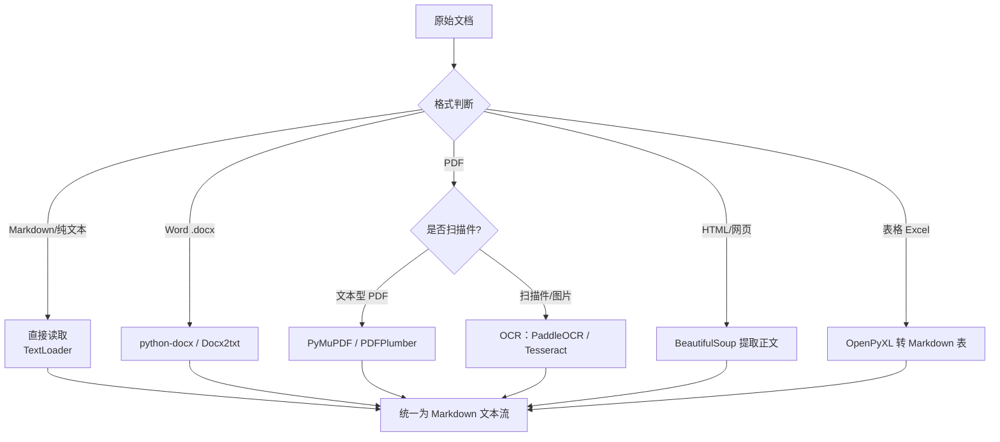
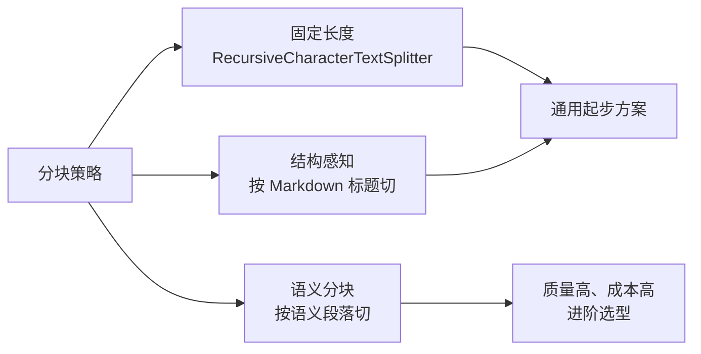

# 知识库 55 企业知识库的文档治理与数据管线实战

> 定位：技术手册。知识库问答系统的"地基"：文档格式繁多、质量参差、权限复杂，如何把"原始素材"变成"干净、可检索、有权限的知识"。
> 配套学习课程：第 59 课；对应知识库：54；对应附录：Y。

---

## 1. 为什么文档治理决定系统上限

> 谚语："垃圾进，垃圾出（Garbage In, Garbage Out）。"RAG 系统的回答质量，**至少有一半**由入库文档决定。

### 1.1 企业文档的典型问题

| 问题 | 具体表现 | 影响 |
| --- | --- | --- |
| 格式多样 | Word/PDF/PPT/扫描件/表格 | 解析率低、内容丢失 |
| 版本混乱 | v1、最终版、改改最终版.docx | 检索到过期内容 |
| 重复冗余 | 同一制度多个部门各存一份 | 答案矛盾 |
| 含噪音 | 页眉页脚、水印、批注、导航 | 分块里混入无关文本 |
| 权限敏感 | 薪资、战略、客户名单 | 泄露风险 |

---

## 2. 文档解析策略（Loader 选型）



### 2.1 各格式解析要诀

| 格式 | 首选方案 | 注意 |
| --- | --- | --- |
| .md / .txt | TextLoader | 注意编码（utf-8） |
| .docx | Docx2txt | 表格会乱，要单独处理 |
| .pdf（文本） | PyMuPDF | 双栏文档要按栏序读取 |
| .pdf（扫描） | PaddleOCR | 质量差时先做图像增强 |
| .html | BeautifulSoup | 去脚本/样式/nav |
| .xlsx | OpenPyXL | 转成 markdown 表格 |

---

## 3. 清洗与标准化（清洗管线）

```python
import re

def clean_text(text: str) -> str:
    """企业文档常见噪音清洗"""
    # 1. 去掉页眉页脚常见模式（如"第X页 / 共X页"）
    text = re.sub(r"第\s*\d+\s*页\s*/*\s*共\s*\d+\s*页", "", text)
    # 2. 去掉水印/占位（如内部资料、机密字样行内重复）
    text = re.sub(r"[\s]*（?内部资料.*?）?[\s]*", "", text, flags=re.S)
    # 3. 折叠多余空行和空格
    text = re.sub(r"\n{3,}", "\n\n", text)
    text = re.sub(r"[ \t]{2,}", " ", text)
    # 4. 统一换行符
    text = text.replace("\r\n", "\n").replace("\r", "\n")
    return text.strip()
```

**清洗优先级**：格式噪音 → 页眉页脚 → 批注/修订痕迹（docx 需解析 comments）→ 空行折叠 → 统一换行。

---

## 4. 元数据设计（Metadata Schema）

每个 chunk 挂上元数据，后续可按元数据过滤和溯源：

| 字段 | 示例 | 用途 |
| --- | --- | --- |
| source | docs/制度/报销制度_v3.docx | 溯源引用 |
| doc_type | 制度/手册/FAQ | 分域检索 |
| department | 财务部 | 权限过滤 |
| version | v3 | 版本管理 |
| updated_at | 2026-05-01 | 时效过滤 |
| owner | 张三 | 责任人 |
| is_confidential | false | 权限控制 |

> **关键设计**：元数据不放进向量的正文，而是 `Document.metadata` 的一部分；检索时用 `filter={"department": "财务部"}` 先过滤再检索。

---

## 5. 分块策略进阶



### 5.1 推荐起点：Markdown 结构感知分块

```python
from langchain_text_splitters import MarkdownHeaderTextSplitter

# 先按标题层级切，再对每个大块按长度切
headers_to_split_on = [
    ("#", "H1"), ("##", "H2"), ("###", "H3"),
]
splitter = MarkdownHeaderTextSplitter(headers_to_split_on)
sections = splitter.split_text(md_text)

# 大节内再按 800 字符二次切分
body_splitter = RecursiveCharacterTextSplitter(
    chunk_size=800, chunk_overlap=100,
    separators=["\n\n", "\n", "。", "；", " ", ""]
)
chunks = []
for sec in sections:
    chunks.extend(body_splitter.split_documents([sec]))
```

**要点**：标题越长的文档，结构分块收益越明显；表格类内容建议"一行一 chunk"或"一个表格一 chunk"。

---

## 6. 版本管理与去重

### 6.1 去重三层防线

| 层 | 方法 | 场景 |
| --- | --- | --- |
| 入库前 | 文件名/正文哈希去重 | 同一文件重复上传 |
| 入库中 | 向量相似度去重（阈值 0.95） | 内容近似的版本 |
| 入库后 | 定期批次扫描 | 历史脏数据 |

### 6.2 版本策略

- 只保留**唯一有效版本**：同标题文档以 `version` 元数据最新者为准；
- 历史版本归档进"冷存储"，不参与检索；
- 更新时用 `vectorstore.delete(ids=旧chunk_ids)` + 重插新版本。

---

## 7. 数据管线测试与验收

| 检查项 | 方法 | 通过标准 |
| --- | --- | --- |
| 解析完整率 | 对比原文与解析后字符数 | ≥ 95% |
| 分块质量 | 随机抽 20 块人工看 | 无截断、无跨主题 |
| 检索覆盖率 | 20 条标准问题，看 Top5 是否含答案 | ≥ 80% |
| 元数据完整 | 抽样查 metadata 字段 | 100% 关键字段齐全 |
| 权限过滤 | 模拟无权限租户检索敏感词 | 0 命中 |

---

## 8. 小结与自查

- 能说出企业文档六大问题和对应的解析方案；
- 能写出清洗函数并说出清洗优先级；
- 能设计一套完整的 metadata schema 并说明用途；
- 能解释"先结构切分再长度切分"的两级分块法；
- 能列出数据管线五条验收标准。

**下一步**：第 59 课会用"把书变成知识卡片"的比喻带你动手跑通数据管线。