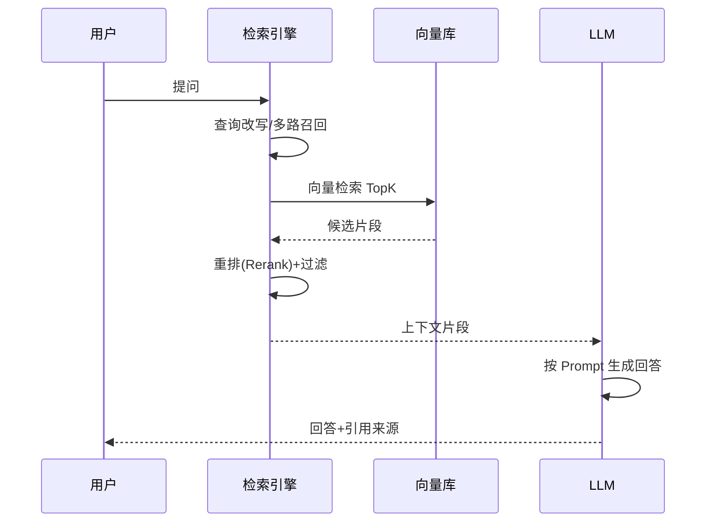
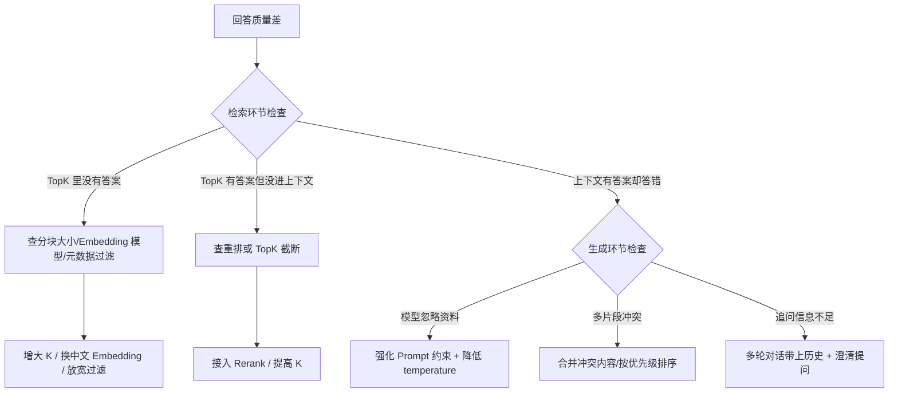

# 知识库 56 检索问答链路实战与质量评测

> 定位：技术手册。问答系统的心脏：检索（Retriever）与生成（LLM 调用）如何配合，如何评测回答质量、定位失败原因并逐步调优，让系统从"能用"走向"好用"。
> 配套学习课程：第 60 课；对应知识库：54、55；对应附录：Y、Z。

---

## 1. 问答链路全景



**理解要点**：问题从"进来"到"回答出去"，中间经过了**检索**和**生成**两个环节。两环各自都可能出错——检索不到、检索到但不对、生成了但不准。评测要分环节定位。

---

## 2. 检索质量评测（Retrieval 环节）

### 2.1 三个核心指标

| 指标 | 含义 | 怎么算 |
| --- | --- | --- |
| Recall@K | 答案是否在 TopK 里 | 有答案的查询数 / 总查询数 |
| MRR | 答案排得靠不靠前 | 1/排名 的平均值 |
| Hit@1 | 第一个就命中 | 答案在 Top1 的查询占比 |

### 2.2 评测集建设（黄金标准）

```python
# 每条标准问题记录：问题 + 期望答案片段来源 + 期望回答要点
eval_set = [
    {
        "question": "报销流程的第一步是什么？",
        "source_doc": "报销制度_v3.docx",
        "gold_answer": "填写报销单并提交直属上级审批",
    },
    # ... 每个主题至少 5 条，共 20-50 条
]
```

**建设原则**：从真实用户问题里收集，按主题分层覆盖；短期用 20 条起步，逐步扩充。

### 2.3 评测脚本骨架

```python
def evaluate_retrieval(eval_set, retriever, k=5):
    hits, rr, recalls = 0, 0.0, 0
    for item in eval_set:
        docs = retriever.invoke(item["question"])[:k]
        sources = [d.metadata["source"] for d in docs]
        rank = sources.index(item["source_doc"]) + 1 if item["source_doc"] in sources else None
        if rank:
            hits += 1
            rr += 1.0 / rank
        if int(rank) <= k if rank else False:
            recalls += 1
    n = len(eval_set)
    return {
        "Recall@5": recalls / n,
        "MRR": rr / n,
        "Hit@1": sum(1 for i in eval_set if i["source_doc"]
                     in [d.metadata["source"] for d in retriever.invoke(i["question"])[:1]]) / n,
    }
```

---

## 3. 生成质量评测（Generation 环节）

### 3.1 人工评测（LLM-as-Judge 辅助）

| 维度 | 提问（给评测人或 LLM） | 打分 |
| --- | --- | --- |
| 忠实度 | 回答是否完全基于给定资料？有无编造？ | 0-5 |
| 相关性 | 回答是否正面回应了问题？ | 0-5 |
| 完整性 | 关键要点是否都覆盖？ | 0-5 |
| 引用规范 | 是否给出资料出处？ | 0-5 |

### 3.2 使用 LLM 做初筛（LLM-as-Judge）

```python
judge_prompt = """你是评测专家。请判断以下回答是否忠实于资料。
资料：{context}
回答：{answer}
如果回答包含资料中没有的信息，输出"不忠实"并指出；否则输出"忠实"。"""

# 用 GPT 批量判分，人工只复审"不忠实"的样本，大幅节省人力
```

> 注意：LLM-as-Judge 适合**初筛**，离线的关键样本请保留人工二审，避免"模型自己夸自己"的偏差。

---

## 4. 失败模式与调优路径（诊断树）



### 4.1 调优优先级清单（按性价比排序）

1. **提高 K 值**（3→5）：免费且立竿见影；
2. **换中文 Embedding**：中文场景提升明显；
3. **加 Rerank 重排**：成本略高，精排效果显著；
4. **优化分块**：结构分块 / 调整 chunk 大小；
5. **Prompt 工程**：约束来源、要求结构化输出；
6. **加查询改写**：扩写同义词、拆复杂问题。

---

## 5. 质量评测看板（持续跟踪）

| 版本 | Recall@5 | MRR | 忠实度 | 相关性 | 备注 |
| --- | --- | --- | --- | --- | --- |
| v0.1 基线 | 0.55 | 0.38 | 3.2 | 3.5 | 初始配置 |
| v0.2 K=5 | 0.70 | 0.42 | 3.4 | 3.6 | 提高 K |
| v0.3 换 Embedding | 0.82 | 0.55 | 3.8 | 3.9 | bge-small-zh |
| v0.4 加 Rerank | 0.90 | 0.68 | 4.1 | 4.3 | bge-reranker |
| v0.5 Prompt 优化 | 0.90 | 0.68 | 4.5 | 4.6 | 约束来源 |

**规则**：每改一个配置，重跑同一评测集，记录到看板；没有指标提升的改动及时回滚。

---

## 6. 小结与自查

- 能画出检索→生成的完整时序图；
- 能说出评测集"问题+来源+要点"三要素；
- 能解释 Recall@K、MRR、Hit@1 并手写评测脚本；
- 能按诊断树定位"检索问题"和"生成问题"；
- 能列出按性价比排序的六步调优清单。

**下一步**：第 60 课手把手带你建 20 条评测集，跑出第一版指标并完成一轮调优。