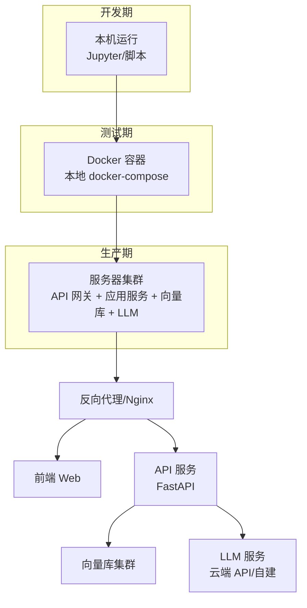
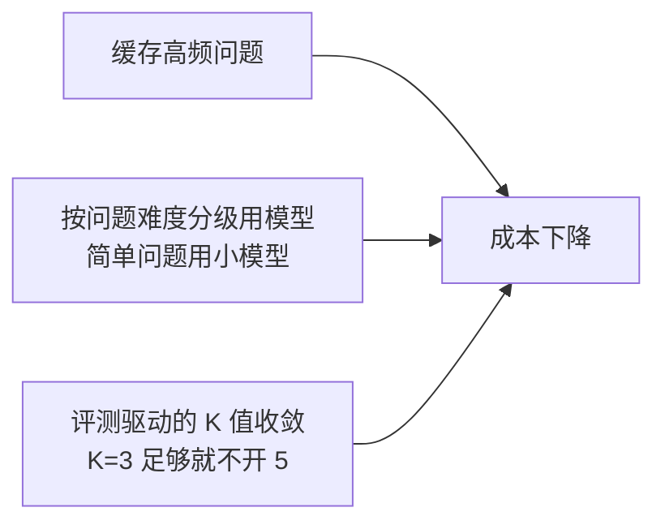
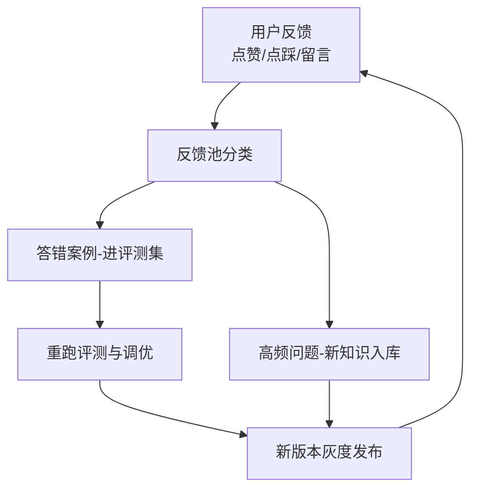

# 知识库 57 系统部署、运营与持续迭代实战

> 定位：技术手册。从"本机能跑"到"上线能用"的最后一段路：部署架构、性能保障、安全基线、监控告警、用户反馈闭环，以及如何让系统持续变好。
> 配套学习课程：第 61 课（毕业实战收官）；对应附录：Y、Z。

---

## 1. 部署架构演进

**分阶段迁移原则**：先在本机跑通逻辑，再容器化保证环境一致，最后上服务器做多实例与运维。

---

## 2. 性能与成本保障

### 2.1 性能优化的四个抓手

| 抓手 | 做法 | 收益 |
| --- | --- | --- |
| 缓存 | 相同问题命中缓存（哈希 + 时间窗） | 减少 70% LLM 调用 |
| 并发 | FastAPI 异步 + 连接池 | QPS 提高 3-5 倍 |
| 批量 | 入库时批量向量化 | 建档提速 10 倍 |
| 降级 | LLM 不可用时返回检索摘要 | 兜底可用 |

### 2.2 成本控制三板斧

**成本观测**：按"问题数 × 输入 token × 单价"估算，每版本对比成本看板。

---

## 3. 安全基线（上线必查清单）

| 类别 | 检查项 | 验收 |
| --- | --- | --- |
| 注入防护 | 提示词是否防"忽略以上指令" | 渗透测试通过 |
| 数据隔离 | 用户 A 能否查到 B 的私有文档 | 0 泄露 |
| 敏感内容 | 输出是否经过内容安全网关 | 拦截率达预期 |
| 密钥管理 | API Key 不入代码、不入日志 | 扫描 0 命中 |
| 权限模型 | 检索是否带用户上下文过滤 | 按角色过滤 |

**原则**：安全不是上线后补救，而是"入口校验 → 过程中过滤 → 出口复核"三道锁。

---

## 4. 监控与告警

### 4.1 三大监控数据

| 数据 | 采集方式 | 关键指标 |
| --- | --- | --- |
| 指标 Metrics | Prometheus + FastAPI 中间件 | QPS、延迟 P50/P95/P99、错误率 |
| 日志 Logs | JSON 结构化日志 | 请求参数、耗时、回答摘要、trace_id |
| 追踪 Traces | LangSmith/OpenTelemetry | 检索耗时、LLM 耗时、token 数 |

### 4.2 告警规则（起步版）

| 告警 | 触发条件 | 级别 | 动作 |
| --- | --- | --- | --- |
| 延迟恶化 | P95 超 5s 持续 10 分钟 | P2 | 排查与扩容 |
| 错误率飙升 | 错误率 > 5% 持续 5 分钟 | P1 | 熔断评估 |
| LLM 配额耗尽 | 429 响应占比 > 20% | P1 | 切换备用通道 |
| 检索空结果激增 | 空结果占比 > 30% | P2 | 检查索引与数据源 |

---

## 5. 用户反馈与持续迭代闭环

**迭代节奏建议**：

- **每天**：看反馈池，抽取新的评测样本；
- **每周**：跑一次全量评测，更新指标看板；
- **每两周**：发布一次版本（灰度 10% → 50% → 100%）；
- **每月**：复盘成本、准确率、用户量，定下月优化主题。

---

## 6. 灰度发布与回滚

| 步骤 | 操作 | 灰度比例 |
| --- | --- | --- |
| 1 | 新版本部署到灰度环境 | 内部 5% |
| 2 | 观察指标与反馈，对比基线版本 | 10% |
| 3 | 无异常逐步放量 | 30% → 60% |
| 4 | 确认稳定全量 | 100% |
| 异常 | 一键回滚到上一版本（保留镜像与数据库快照） | - |

---

## 7. 上线检查清单（Checklist）

- [ ] 评测集 ≥ 50 条，关键指标达标（Recall@5 ≥ 0.85、忠实度 ≥ 4.0）
- [ ] 安全基线六项全部通过
- [ ] 监控三大数据已接入，告警已配置并有值班人
- [ ] 备份与回滚方案验证过（演练过至少一次）
- [ ] 成本估算在预算内，有成本看板
- [ ] 用户反馈入口已上线（点赞/点踩/留言）
- [ ] 文档与答疑手册交付给运营同事

---

## 8. 小结与自查

- 能画开发期→测试期→生产期的部署演进图；
- 能说出性能优化四个抓手和成本控制三板斧；
- 能背出安全基线六项检查；
- 能配置起步版监控与四条告警规则；
- 能描述"反馈→评测→优化→灰度"的持续迭代闭环。

**下一步**：第 61 课（全系列收官）将带你走完"立项→上线→迭代"全流程毕业项目，并做全系列知识盘点。