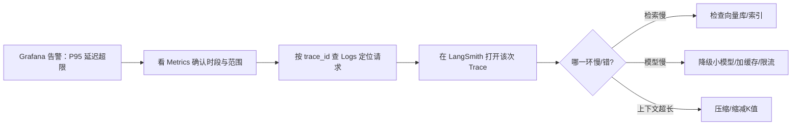

# 知识库 58 生产可观测性实战：日志、指标与追踪

> 定位：技术手册。系统上线后"看不见"就是"失控"：请求为什么慢、错误出在哪一环、token 消耗了多少——都需要可观测性回答。本篇讲透三大支柱（Logs/Metrics/Traces）在 LLM 应用里的落地方法。
> 配套学习课程：第 62 课；对应附录：AA。

---

## 1. 可观测性为什么对 LLM 应用特别重要

传统应用看"接口错误码"就够了，LLM 应用有三层不确定：

1. **模型输出不确定**：同一问题两轮回答不同，需要对比才能发现；
2. **链路环节多**：检索 → 重排 → 拼Prompt → 模型调用 → 后处理，任一环节都可能慢/错；
3. **成本敏感**：token 消耗是钱，必须能按请求/按用户计量。

### 1.1 三大支柱速览

| 支柱 | 回答的问题 | 典型工具 |
| --- | --- | --- |
| Metrics（指标） | 整体健康吗？延迟/错误率/QPS | Prometheus + Grafana |
| Logs（日志） | 这条请求发生了什么？ | 结构化日志 + ELK/Loki |
| Traces（追踪） | 这条请求在哪一环慢/出错？ | LangSmith / OpenTelemetry |

---

## 2. 指标（Metrics）：先有"仪表盘"

### 2.1 核心指标清单（LLM 应用定制版）

| 指标 | 定义 | 告警阈值（起步） |
| --- | --- | --- |
| QPS | 每秒请求数 | 无（观察趋势） |
| 延迟 P50/P95/P99 | 端到端耗时分位 | P95 > 5s 告警 |
| 错误率 | 5xx+业务错误/总请求 | > 1% 告警 |
| 检索耗时 | 检索环节耗时 | P95 > 500ms 关注 |
| 模型调用耗时 | LLM 调用耗时 | P95 > 4s 告警 |
| token 消耗 | 每请求 input/output tokens | 趋势观察 |
| 缓存命中率 | 命中/总请求 | < 20% 关注 |
| 上下文长度 | 平均 prompt tokens | 接近上限告警 |

### 2.2 指标怎么埋（FastAPI 示例）

```python
import time
from prometheus_client import Histogram, Counter, generate_latest

REQ_LATENCY = Histogram("qa_request_latency_seconds", "问答请求延迟",
                        buckets=(0.1, 0.5, 1, 2, 4, 8, 16))
REQ_TOTAL = Counter("qa_requests_total", "请求总数", ["status"])
LLM_TOKENS = Counter("qa_llm_tokens_total", "token消耗", ["type"])

@app.middleware("http")
async def metrics_middleware(request, call_next):
    start = time.time()
    resp = await call_next(request)
    REQ_LATENCY.observe(time.time() - start)
    REQ_TOTAL.labels(status=resp.status_code).inc()
    return resp
```

---

## 3. 日志（Logs）：每条请求可回溯

### 3.1 结构化日志规范

```python
import logging, json, uuid

logging.basicConfig(level=logging.INFO)
log = logging.getLogger("qa")

def log_request(question, answer, docs, tokens, latency_ms):
    entry = {
        "event": "qa_request",
        "trace_id": uuid.uuid4().hex[:12],   # 关联追踪
        "question": question[:200],
        "answer_preview": answer[:100],
        "sources": [d.metadata.get("source") for d in docs],
        "tokens": tokens,
        "latency_ms": latency_ms,
    }
    log.info(json.dumps(entry, ensure_ascii=False))
```

> **铁律**：①每条日志带 trace_id；②敏感信息（含 key、用户隐私）一律脱敏；③全字段可查询（不打印裸文本碎片）。

---

## 4. 追踪（Traces）：看清链路每一环

### 4.1 LangSmith 快速接入

```python
from langsmith import Client
from langchain_openai import ChatOpenAI

# 设置环境变量后自动上报
# LANGCHAIN_TRACING_V2=true
# LANGACCH_CLIENT_API_KEY=...
llm = ChatOpenAI(model="gpt-4o-mini", temperature=0)

# 在 LangSmith 后台可看到：检索耗时/模型调用/token 用量/每一步输入输出
```

### 4.2 OTel（OpenTelemetry）自定义 span

```python
from opentelemetry import trace

tracer = trace.get_tracer("qa.app")

def retrieve_with_trace(question):
    with tracer.start_as_current_sapn("retrieve") as span:
        docs = retriever.invoke(question)
        span.set_attribute("retrieved_count", len(docs))
        span.set_attribute("elapsed_ms", 123)
        return docs
```

### 4.3 关键 span 设计

| Span | 记录 | 判断 |
| --- | --- | --- |
| load_docs | 文档数/大小 | 入库是否超时 |
| split | 分块数/平均长度 | 分块是否合理 |
| embed | 向量化耗时 | 是否有性能热点 |
| retrive | TopK/命中来源 | 返回是否为空 |
| llm_call | 模型/token/温度 | 成本与延迟 |
| post_rocess | 后处理耗时 | 是否需优化 |

---

## 5. 指标→日志→追踪怎么配合（排障工作流）



---

## 6. 落地三步走

| 步骤 | 动作 | 产出 |
| --- | --- | --- |
| 1 | 接 Metrics（Prometheus+告警） | 仪表盘+告警规则 |
| 2 | 加结构化日志（带 trace_id） | 可回溯的日志流 |
| 3 | 接 Trace（LangSmith/OTel） | 链路视图 |

**优先级**：先 Metrics（要能发现"坏了"）→ 再 Logs（要能定位"谁的请求"）→ 最后 Trace（要能看清"哪一环"）。不要三步并行铺开，一步到位。

---

## 7. 小结与自查

- 能说出三大支柱各自回答什么问题；
- 能列出一份 LLM 应用核心指标清单（≥8 项）；
- 能写出带 trace_id 的结构化日志；
- 能画出"告警→指标→日志→追踪"的排障工作流；
- 能遵守两条铁律：链路全带溯体系、字段全脱敏。

**下一步**：课程 62 会用"给汽车装仪表盘"的比喻，教你一步步把仪表盘+日志+链路视图装到自己项目上。