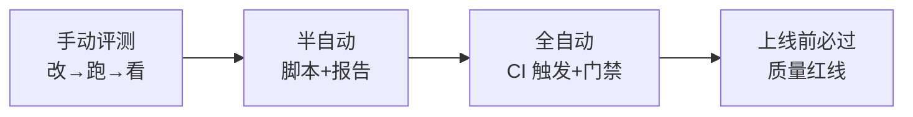
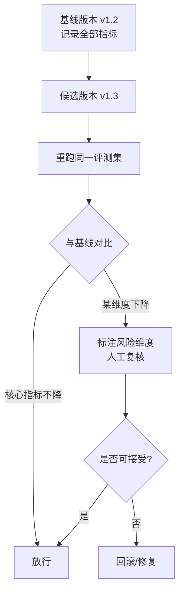

# 知识库 59 评测自动化与 CI/CD 门禁实战

> 定位：技术手册。评测不能只在"改完代码后手动跑一次"，要变成每次变更自动触发的"质量门禁"：不合格就不允许上线。本篇讲评测集体系的工程化与 CI 集成。
> 配套学习课程：第 63 课；对应附录：AA、AB。

---

## 1. 从"手动评测"到"自动化门禁"



### 1.1 为什么必须自动化

| 问题 | 手动评测 | 自动化门禁 |
| --- | --- | --- |
| 回归遗漏 | 改参数忘了重跑 | 每次提交必跑 |
| 结果口径不一 | 各人理解不同 | 固定脚本+固定阈值 |
| 反馈太慢 | 上线前才发现 | 提交即反馈 |
| 无人为把关 | 凭感觉放行 | 卡住不合格变更 |

---

## 2. 评测集体系建设（自动化地基）

### 2.1 三层评测集

| 层 | 内容 | 数量 | 用途 |
| --- | --- | --- | --- |
| 冒烟集 | 每主题 1-2 题 | 10-20 | 极快反馈（<1分钟） |
| 回归集 | 全主题覆盖 | 50-200 | 每次变更必跑 |
| 冠军集 | 精选高价值案例 | 20-50 | 版本对比/上线把关 |

### 2.2 评测集管理规范

```text
eval_sets/
├── smoke.json          # 冒烟集
├── regression.json     # 回归集
└── champion.json       # 冠军集
```

字段规范（沿用第 56 课三要素）：

```json
{
  "question": "报销上限是多少？",
  "source": "制度/报销制度_v3.docx",
  "gold": "单笔不超过5000元",
  "category": "制度",
  "severity": "high"
}
```

---

## 3. 自动化评测脚本（可跑可报告）

### 3.1 评测入口（`eval_runner.py`）

```python
import argparse, json, sys
from .metrics import recall_at_k, mrr, faithfulness

def run(eval_file, retriever, llm, k=5):
    suite = json.load(open(eval_file, encoding="utf-8"))
    results = {
        "suite": eval_file,
        "n": len(suite),
        "recall@5": recall_at_k(suite, retriever, k),
        "mrr": mrr(suite, retriever, k),
        "faithfulness": faithfulness(suite, retriever, llm),
    }
    return results

def main():
    parser = argparse.ArgumentParser()
    parser.add_argument("--suite", default="evals/regression.json")
    parser.add_argument("--k", type=int, default=5)
    parser.add_argument("--threshold-recall", type=float, default=0.85)
    args = parser.parse_args()
    results = run(args.suite, retriever, llm, args.k)
    print(json.dumps(results, ensure_ascii=False, indent=2))
    # 门禁判定：低于阈值则退出码非 0，CI 拦截
    if results["recall@5"] < args.threshold_recall:
        sys.exit("FAIL: recall 低于门禁")
    print("PASS")

if __name__ == "__main__":
    main()
```

### 3.2 结果输出与持久化

```python
# 每次结果追加到历史记录，用于趋势对比
import csv, datetime
with open("eval_history.csv", "a", newline="", encoding="utf-8") as f:
    writer = csv.DictWriter(f, fieldnames=["time","suite","recall@5","mrr","faithfulness"])
    writer.writerow({"time": datetime.date.today().isoformat(), **{k: round(v,3) for k,v in results.items() if k!="suite"}})
```

---

## 4. GitHub Actions CI 集成

### 4.1 工作流文件（`.github/workflows/eval.yml`）

```yaml
name: Eval Gate
on:
  pull_request:
    paths: ["src/**", "prompts/**", "config/**"]
jobs:
  eval:
    runs-on: ubuntu-latest
    steps:
      - uses: actions/checkout@v4
      - uses: actions/setup-python@v5
        with: { python-version: "3.11" }
      - run: pip install -r requirements-dev.txt
      - name: 跑回归集评测
        run: python eval_runner.py --suite evals/regression.json --k 5
```

> 关键点：`pull_request` 触发 + 路径过滤（只动文档不重跑）+ 非零退出码拦截合并。

### 4.2 门禁阈值建议

| 环境 | 冒烟集 | 回归集 | 冠军集 |
| --- | --- | --- | --- |
| PR 合并前 | 必过 | 必过 | 预警不拦截 |
| 灰度发布前 | 必过 | 必过 | 必过 |
| 全量上线 | - | 必过 | 必过 |

---

## 5. 版本对比与回归报告



**对比维度**：Recall@K、MRR、忠实度、相关性、成本（tokens/请求）、延迟 P95。

---

## 6. 门禁误报与治理（防"狼来了"）

| 问题 | 原因 | 对策 |
| --- | --- | --- |
| 频频告警没人看 | 阈值过严 | 先设"预警线"再压到"门禁线" |
| 评测波动大 | LLM 随机性 | temperature=0 + 同 seed + 多次取均值 |
| 套件失真 | 评测集偏离真实需求 | 每两周从反馈池补充新案例 |
| 跑得太慢 | 集过大 | 分层：冒烟快跑、回归慢跑 |

---

## 7. 小结与自查

- 能说出冒烟/回归/冠军三层评测集的定位与数量；
- 能写出带门禁判定的 `eval_runner.py`；
- 能配置 GitHub Actions 在 PR 时自动跑评测；
- 能解释"版本对比"如何防止指标回退；
- 能说出 4 类门禁误报及对策。

**下一步**：课程 63 手把手带你搭"评测→CI 门禁→报告"的最小闭环。