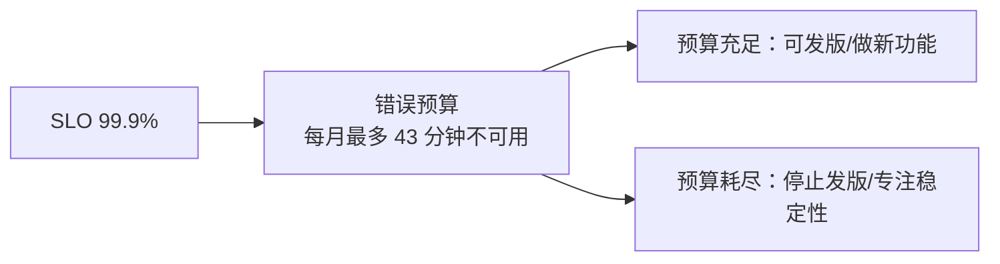

# 知识库 60 可靠性工程实战：SLO、熔断与故障演练

> 定位：技术手册。可靠性不是"祈祷别出事"，而是：用 SLO 定目标、用熔断限流扛冲击、用故障演练提前暴露问题。本篇给你一套 LLM 应用可靠性工程的完整工具箱。
> 配套学习课程：第 64 课；对应附录：AB。

---

## 1. 可靠性三件套：目标 → 保护 → 演练

| 环节 | 工具 | 回答的问题 |
| --- | --- | --- |
| 定目标 | SLO / 错误预算 | 多稳才算合格？ |
| 加保护 | 超时/重试/熔断/限流/降级 | 出问题怎么扛？ |
| 常演练 | 故障注入/混沌演练 | 扛不住时怎么办？ |

---

## 2. 用 SLO 和错误预算定目标

### 2.1 SLI → SLO → SLA 一次说清

| 层 | 含义 | 示例 |
| --- | --- | --- |
| SLI | 实际测的指标 | 可用性 99.92%、P95 2.8s |
| SLO | 内部承诺目标 | 可用性 ≥ 99.9%、P95 ≤ 3s |
| SLA | 对外合同承诺 | 低于 99.5% 赔偿 |

### 2.2 错误预算（Error Budget）



**计算**：每月 43,200 分钟 × (1 - 0.999) ≈ 43 分钟。

### 2.3 关键 SLO 设计（LLM 应用）

| SLI | SLO 建议 | 说明 |
| --- | --- | --- |
| 可用性 | ≥ 99.9% | 排除客户端错误 |
| P95 延迟 | ≤ 5s | 端到端含检索+生成 |
| 错误率 | ≤ 1% | 5xx+业务错误 |
| 答案质量（忠实度） | ≥ 4.0/5 | 抽测或 LLM-as-Judge |

---

## 3. 保护层：超时、重试、熔断、限流

### 3.1 超时（Timeout）

```python
from langchain_openai import ChatOpenAI

# 单项超时：防止模型拖死整条请求
llm = ChatOpenAI(
    model="gpt-4o-mini",
    temperature=0,
    timeout=30,          # 单次调用 30s 上限
    max_retries=2,       # 失败最多重试 2 次
)
```

### 3.2 重试策略（Retry with Backoff）

```python
import time, random

def call_with_retry(fn, retries=3, base_delay=0.5):
    for i in range(retries):
        try:
            return fn()
        except Exception as e:
            if i == retries - 1:
                raise
            # 指数退避 + 抖动，避免重试风暴
            delay = base_delay * (2 ** i) + random.uniform(0, 0.2)
            time.sleep(delay)
```

**重试的禁忌**：只对"可重试错误"重试（网络抖动、429、5xx）；对"业务性错误"（如校验失败）重试无意义。

### 3.3 熔断器（Circuit Breaker）

```python
class CircuitBreaker:
    def __init__(self, fail_threshold=5, open_seconds=30):
        self.fail_threshold = fail_threshold
        self.open_seconds = open_seconds
        self.fails = 0
        self.state = "closed"   # closed / open / half-open
        self.opened_at = None

    def call(self, fn):
        if self.state == "open":
            if time.time() - self.opened_at > self.open_seconds:
                self.state = "half-open"    # 试探恢复
            else:
                raise RuntimeError("熔断开启，拒绝调用")
        try:
            result = fn()
            self.fails = 0
            if self.state == "half-open":
                self.state = "closed"       # 试探成功，恢复
            return result
        except Exception:
            self.fails += 1
            if self.fails >= self.fail_threshold:
                self.state = "open"
                self.opened_at = time.time()
            raise
```

**状态机**：`closed（正常）→ open（熔断）→ half-open（试探）→ closed（恢复）`。

### 3.4 限流与降级

| 手段 | 做法 | 适用 |
| --- | --- | --- |
| 令牌桶限流 | 每秒限量请求 | 保护模型配额 |
| 队列削峰 | 请求进队列排队 | 高峰缓冲 |
| 降级到小模型 | 大模型超时用小模型答 | 保可用性 |
| 降级到检索摘要 | LLM 挂了只回检索片段 | 极端保底 |

---

## 4. 故障演练：让问题提前暴露

### 4.1 演练清单（从易到难）

| 演练 | 注入什么 | 验证什么 |
| --- | --- | --- |
| 模型超时 | mock 模型延时 60s | 超时+降级路径是否生效 |
| 模型 500 | mock 返回 500 | 重试+熔断是否正确 |
| 向量库不可用 | 停掉 Chroma | 检索失败有兜底 |
| 限流触发 | 压测打到配额上限 | 429 处理是否友好 |
| 缓存失效 | 清空缓存 | 冷启动不挂 |

### 4.2 演练流程（模板）

```markdown
# 故障演练单
演练名称：模型服务超时演练
目标：验证超时+降级路径
影响面评估：预计 2 分钟延迟上升，无数据丢失
计划时长：30 分钟（含恢复+复盘）
回滚方案：关闭注入开关
```
（注：示例中"markdown"为笔误，应为 markdown；实际记录用 md 文档即可）

---

## 5. 复盘五问（事后必做）

1. ​**发生了什么**？时间线完整还原；
2. ​**影响了什么**？用户/成本/合规范围；
3. ​**为什么**？根因要挖到"动作层"而非"表面层"；
4. ​**如何避免再发**？改代码 or 改流程 or 加监控；
5. ​**怎么验证改好了**？用故障演练重放一次。

---

## 6. 可靠性成熟度自查

| 等级 | 特征 | 你的系统？ |
| --- | --- | --- |
| L0 | 无监控、无重试、无降级 | ☐ |
| L1 | 有时限/重试，无熔断/降级 | ☐ |
| L2 | 有超时/重试/熔断/限流 | ☐ |
| L3 | 以上+降级链路全 | ☐ |
| L4 | 以上+例行故障演练+复盘闭环 | ☐ |

---

## 7. 小结与自查

- 能说清 SLI/SLO/SLA 与错误预算；
- 能手写超时+重试+熔断器最小实现；
- 能列出 5 个 LLM 应用故障演练场景；
- 能按"五问"完成一次故障复盘；
- 能对照成熟度表给自己的系统定级。

**下一步**：课程 64 用"给过山车装保险丝"的比喻，实操给问答系统加全套保护层。