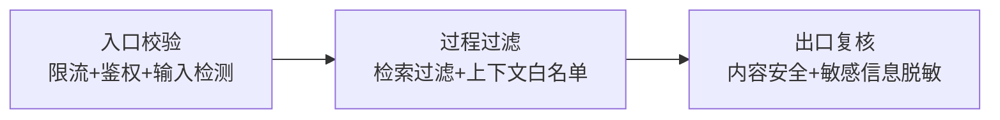
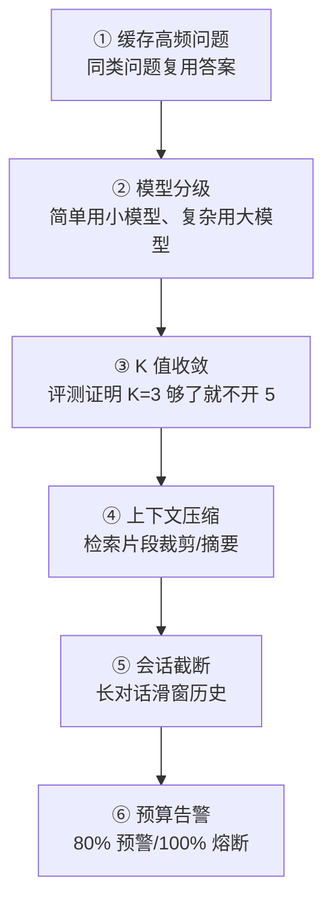

# 知识库 61 生产安全与成本治理实战

> 定位：技术手册。上线最容易踩的两个坑：安全出漏洞（数据泄露、恶意注入）和成本失控（token 账单爆炸）。本篇给一套 LLM 应用在生产环境的安全基线，和一套能算清、能控制成本的治理方法。
> 配套学习课程：第 65 课（收官）；对应附录：AA、AB。

---

## 1. 安全基线：三道锁 + 五个必查

### 1.1 三道锁（从输入到输出）



| 锁 | 防什么 | 手段 |
| --- | --- | --- |
| 入口 | 未授权访问、注入攻击 | JWT 鉴权、限流、输入长度限制 |
| 过程 | 越权检索、上下文污染 | 元数据过滤、Prompt 加固 |
| 出口 | 敏感数据外泄、违法内容 | 内容安全网关、关键词/正则脱敏 |

### 1.2 五个必查项

| 检查 | 具体做法 | 验收 |
| --- | --- | --- |
| 密钥管理 | API Key 用环境变量/密钥服务，不入代码 | 仓库扫描 0 命中 |
| 数据脱敏 | 日志/答案中的手机号、身份证打码 | 抽查 0 泄露 |
| 越权测试 | 用户 A 能否查 B 的私有文档 | 渗透测试通过 |
| 注入防护 | 测试"忽略以上指令"类提示词 | 系统拒绝 |
| 供应链 | 依赖锁定版本 + 漏洞扫描 | 高危 0 残留 |

---

## 2. 成本计算：先算清再治理

### 2.1 成本公式（每请求）

```
单请求成本 = 输入tokens × 输入单价 + 输出tokens × 输出单价
月成本 ≈ 平均单请求成本 × 日均请求数 × 30
```

### 2.2 成本构成拆解（LLM 应用特有）

| 成本项 | 说明 | 占比（典型） |
| --- | --- | --- |
| 模型调用 | 输入+输出 tokens | 60-80% |
| Embedding | 入库+查询向量化 | 5-15%（入库一次性） |
| 向量库 | 存储与检索资源 | 5-10% |
| 基础设施 | 服务器/带宽 | 10-20% |

### 2.3 计量埋点

```python
import json, logging

def log_cost(model, input_tokens, output_tokens, price_in, price_out):
    cost = input_tokens * price_in + output_tokens * price_out
    logging.info(json.dumps({
        "event": "cost",
        "model": model,
        "input_tokens": input_tokens,
        "output_tokens": output_tokens,
        "cost_usd": round(cost, 4),
    }))
# 接入成本看板：按模型/按天/按租户聚合
```

---

## 3. 成本治理六板斧



| 手段 | 效果 | 成本 |
| --- | --- | --- |
| 缓存 | 省 30-70% | 低 |
| 模型分级 | 省 20-50% | 中 |
| K 值收敛 | 省 10-30% | 低 |
| 上下文压缩 | 省 15-40% | 中 |
| 会话截断 | 防长对话爆炸 | 低 |
| 预算告警 | 防失控 | 低 |

---

## 4. 成本看板与告警

### 4.1 看板字段

| 维度 | 报表 |
| --- | --- |
| 按天 | 日成本、日请求数、单请求均价 |
| 按模型 | 各模型占比、最高成本 Top3 |
| 按租户 | 各租户成本、环比变化 |
| 按端点 | 哪些功能最烧钱 |

### 4.2 告警阶梯

| 水位 | 动作 |
| --- | --- |
| 预算 60% | 通知负责人，评估降本措施 |
| 预算 80% | 开启小模型降级、加大缓存 |
| 预算 100% | 熔断非核心功能，仅保核心 |

---

## 5. 安全报表与成本报表（运营例行）

| 频率 | 安全 | 成本 |
| --- | --- | --- |
| 每日 | 拦截事件数、异常请求 | 日成本、异常突增 |
| 每周 | 漏洞扫描、权限复核 | 周成本、Top3 消耗 |
| 每月 | 渗透测试、安全复盘 | 月预算达成、优化效果 |

---

## 6. 小结与自查

- 能画出"入口-过程-出口"三道锁并说明各防什么；
- 能列出五个必查项并各说出做法；
- 能写出单请求成本公式和六大成本治理手段；
- 能配置成本看板与 60/80/100% 三级告警；
- 能排一份"安全+成本"运营例行表。

**下一步**：课程 65（收官）将带你做一次"安全+成本"双体检，并给出升级为生产级工程师的进阶路线图。