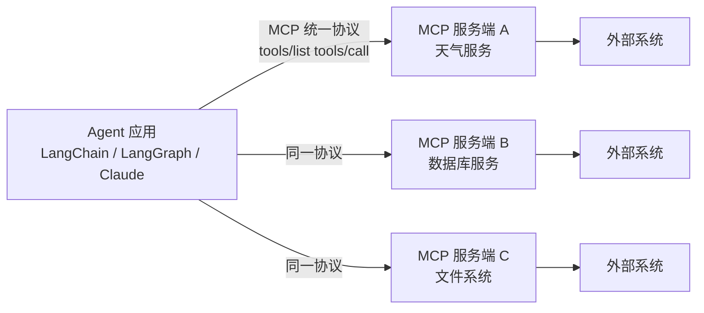

# 知识库 62 MCP 协议深入：消息、握手与工具发现机制

> 定位：技术细节。从"MCP 是什么"深挖到"MCP 协议怎么跑"：JSON-RPC 信封、生命周期握手、三种消息类型、核心方法清单，以及和 Function Calling / LangChain Tool 的对比。配套学习课程 66。

---

## 1. 为什么需要 MCP

在 MCP 之前，同一个工具要接三种平台就要写三套适配器，Agent 与外部能力之间满是"点对点"的胶水代码。MCP（Model Context Protocol，模型上下文协议）把"工具/资源/提示词的暴露与调用"标准化：服务端只需实现协议，任意兼容客户端通用复用。



> 一句话：MCP = Agent 世界的 USB-C 接口——能力方实现一个标准口，消费方拿一个口全都能插。

---

## 2. 协议分层与消息信封

MCP 建立在 JSON-RPC 2.0 之上，HTTP 传输时以信封包裹：

```text
POST /mcp HTTP/1.1
Content-Type: application/json
Mcp-Protocol-Version: 2026-03-26
Content-Length: ...

{"jsonrpc":"2.0","id":1,"method":"tools/list","params":{}}
```

要点：

| 层 | 内容 | 说明 |
| --- | --- | --- |
| 应用层 | JSON-RPC 2.0 消息体 | method/params/id 语义 |
| 协议头 | Mcp-Protocol-Version | 客户端/服务端协商版本 |
| 传输层 | stdio 或 Streamable HTTP | 进程管道 或 HTTP 通道 |

---

## 3. 三种消息类型

| 类型 | 方向 | 是否需要 id | 谁发起 | 例子 |
| --- | --- | --- | --- | --- |
| request | 双向 | 必须 | 客户端或服务端 | tools/list、tools/call、ping |
| response | 双向 | 复用请求 id | 任意一方 | tools/call 的结果 |
| notification | 双向 | 不能带 id | 任意一方 | initialized、logging/message、已完成通知 |

规则：request 必须有唯一 id 并收到对应 response；notification 无 id、无需应答、允许丢失。

---

## 4. 生命周期握手

一次会话的完整节奏（四步）：

```mermaid
sequenceDiagram
    participant C as 客户端
    participant S as 服务端
    C->>S: initialize（含协议版本+能力）
    S-->>C: response（协商版本+服务端能力）
    C-->>S: notifications/initialized
    C->>S: tools/list
    S-->>C: 工具清单 JSON schema
    C->>S: tools/call（参数）
    S-->>C: 结构化结果
    Note over C,S: 可选 streamableHttp 时支持会话能力协商```

> 版本不匹配时：双方各自声明支持版本，客户端选择交集里的最新版；无法协商则初始化失败。

---

## 5. 核心方法清单

| 方法 | 方向 | 作用 |
| --- | --- | --- |
| initialize / initialized | C→S | 握手与能力协商 |
| ping | 双向 | keepalive |
| tools/list | C→S | 发现工具（含 JSON Schema） |
| tools/call | C→S | 调用工具 |
| tools/listChanged | S→C | 通知工具清单变化 |
| resources/list / read | C→S | 发现/读取资源 |
| prompts/get | C→S | 取提示词模板 |
| logging/setLevel | C→S | 设置日志级别 |
| completion/complete | C→S | 参数自动补全 |

---

## 6. 工具发现与调用的完整数据流

1. 客户端首次 connect 后发 tools/list；服务端返回工具名、描述、参数 JSON Schema；
2. 客户端把描述交给 LLM 做工具选择判断；
3. LLM 决定调用并填好参数；客户端发 tools/call；
4. 服务端执行并返回结果；客户端把结果回填给 LLM 继续推理。

对比：Function Calling 里这套逻辑由每家平台私有实现，MCP 把它变成公开协议，且支持"运行时重新拉取清单"以适应工具热更新。

---

## 7. 传输方式对比

| 特性 | stdio | Streamable HTTP |
| --- | --- | --- |
| 载体 | 子进程标准 io | HTTP 请求/响应（可 SSE） |
| 适用 | 本机/容器内 | 跨机、多客户端 |
| 会话 | 每个进程一个 | 可管理者会话（可选） |
| 调试 | 简单 | 需要会话与生命周期管理 |
| 生产推荐 | 接入方同机部署 | 独立服务、多租户 |

---

## 8. 与既有生态的定位对比

| 机制 | 谁定义 | 工具发现 | 运行时热更新 | 跨平台 |
| --- | --- | --- | --- | --- |
| OpenAI Function Calling | OpenAI | API 内参数 | 弱 | 跟随平台 |
| LangChain Tool | LangChain | 包装对象 | 弱 | 仅 LangChain |
| MCP | 开放规范 | tools/list 标准方法 | 支持(listChanged) | 任意兼容端 |

---

## 9. 动手观察一次握手（调试路径）

```bash
# 方式一：MCP Inspector 图形界面
npx @modelcontextprotocol/inspector

# 方式二：对已知服务直接发原始请求（示例为本地 stdio 服务）
python -m mcp.cli tools/list
```

> 铁律：凡"新工具接入"先跑 tools/list 看 Schema，再调一次 tools/call 手压验证，最后才交给 LLM 自动选择——禁止把未验证的工具直接暴露给模型。

**配套**：知识库 63（服务端）、学习课程 66（比喻式入门）。