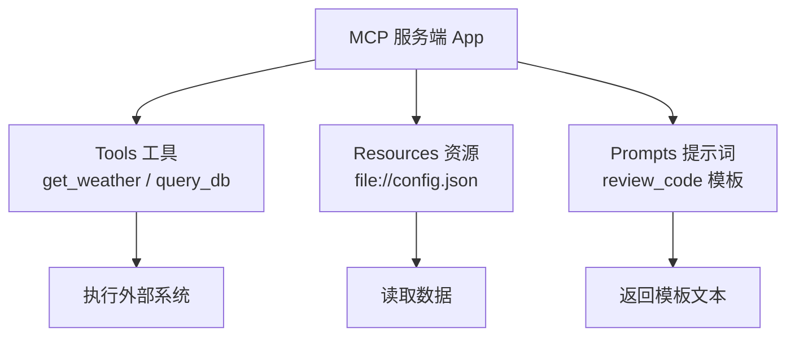

# 知识库 63 MCP 服务端开发实战：Python SDK 自建工具服务

> 定位：技术细节。用官方 Python SDK（`mcp` 包）从零实现一个可用服务端：FastMCP 快速上手、工具/资源/提示词三种能力、stdio 与 HTTP 两种跑法、工程化与调试。配套学习课程 67。

---

## 1. 三种能力与服务端结构

一个 MCP 服务端最多暴露三类能力：

| 能力 | 语义 | 客户端如何获得 |
| --- | --- | --- |
| Tools（工具） | 让 LLM 执行动作（有副作用） | tools/list + tools/call |
| Resources（资源） | 提供上下文数据（只读） | resources/list + resources/read |
| Prompts（提示词） | 提供可复用模板 | prompts/list + prompts/get |



> 新手直觉：工具负责"做事"，资源负责"给料"，提示词负责"教模型怎么开口"。

---

## 2. 环境准备

```bash
# 推荐 uv（同一环境管理 Python 与依赖）
uv venv .venv
uv pip install "mcp[cli]"

# 或原生 pip
pip install "mcp[cli]"
```

SDK 包名：`mcp`（Python），NPM 包名：`@modelcontextprotocol/sdk`（TypeScript）。

---

## 3. FastMCP 快速上手（最小服务）

```python
from mcp.server.fastmcp import FastMCP

mcp = FastMCP("Demo Server")

@mcp.tool()
def add(a: int, b: int) -> int:
    """两个整数相加（工具的 docstring 会成为给 LLM 的工具描述）"""
    return a + b

if __name__ == "__main__":
    mcp.run()  # 默认 stdio 传输
```

跑法：`python server.py`，客户端即可发现 `add` 工具。

---

## 4. 写一个真实工具（天气服务）

```python
from mcp.server.fastmcp import FastMCP
import httpx

mcp = FastMCP("Weather Service")

@mcp.tool()
async def get_weather(city: str, unit: str = "celsius") -> dict:
    """查询指定城市的实时天气。

    Args:
        city: 城市名，如"北京"
        unit: 温度单位 celsius/fahrenheit
    """
    async with httpx.AsyncClient(timeout=5) as client:
        r = await client.get("https://api.example.com/weather",
                             params={"city": city, "unit": unit})
        r.raise_for_status()
        return r.json()
```

要点：
- 类型注解（str/int/float/bool/list/dict）自动生成 JSON Schema；
- docstring 即工具说明，认真写——LLM 靠它决定何时调用；
- 异步或同步函数都支持，天然适配网络 IO。

---

## 5. 资源与提示词示例

```python
# 资源：静态文本 + 动态读取
@mcp.resource("config://prompt-rules")
def get_rules() -> str:
    """系统级提示规则（供客户端注入上下文）"""
    return "回答须简明，先给结论。"

# 资源：文件子系统
@mcp.resource("file://docs/guide.md")
def get_guide() -> str:
    return open("docs/guide.md", encoding="utf-8").read()

# 提示词模板
@mcp.prompt()
def review_code(language: str) -> str:
    return f"请以资深 {language} 工程师视角审查以下代码并给出问题清单："
```

---

## 6. 两种运行方式

| 方式 | 代码 | 启动命令 | 适用 |
| --- | --- | --- | --- |
| stdio | `mcp.run()` | `python server.py` | 被 Agent 本机拉起 |
| HTTP | `mcp.run(transport="streamable-http")` | `python -m uvicorn server:app --port 8000`（需提供 ASGI app） | 独立服务，跨机调用 |

HTTP 模式示例：

```python
from mcp.server.fastmcp import FastMCP
from mcp.server.sse import SseServerTransport  # 旧版 SSE 参考

mcp = FastMCP("HTTP Weather")
app = mcp.streamable_http_app()  # 获取 ASGI 应用
# uvicorn server:app --port 8000
```

---

## 7. 工程化要点

- **配置外置**：API Key 等经环境变量或配置文件注入，严禁写死进源码；
- **错误处理**：工具内部捕获异常并返回 `isError: true` + 人类可读信息，避免裸堆栈；
- **日志**：`mcp.run(logging_level="INFO")`，或接入 logging 输出到结构化日志；
- **注册组织**：按业务域拆多个工具装饰器，工具名前缀约定（如 `db_query_*`）；
- **版本管理**：服务端`initialize`返回值上报版本；工具 Schema 变更要通知客户端（tools/listChanged）。

---

## 8. 调试三板斧

```bash
# 1) Inspector 交互式调试（能看到握手、Schema、调用结果）
npx @modelcontextprotocol/inspector python server.py

# 2) 命令行直调
python -m mcp.cli tools/list
python -m mcp.cli tools/call get_weather '{"city": "北京"}'

# 3) 抓包/stdout 日志
mcp.run(logging_level="DEBUG")
```

> 铁律：服务端发布前必须过一遍"tools/list → tools/call"两个命令的实测，Schema 与真实行为对齐后再交付。

**配套**：知识库 64（客户端集成）、学习课程 67（保姆级上手）。