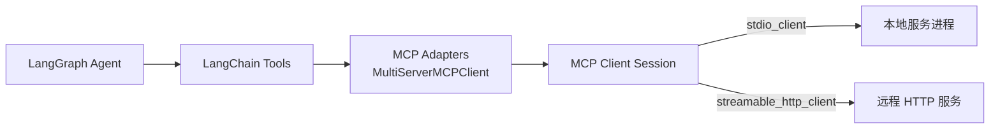
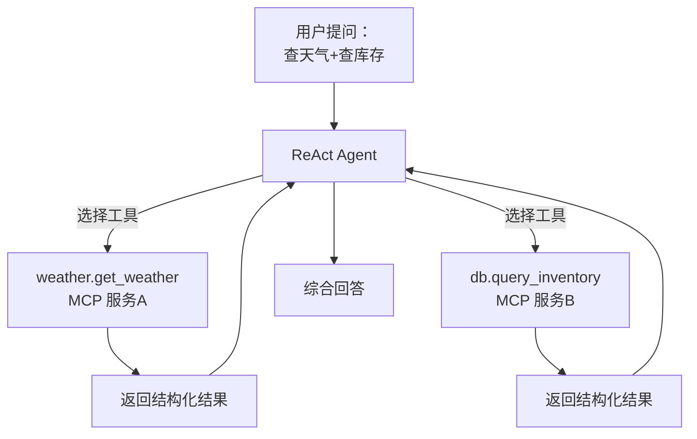

# 知识库 64 MCP 客户端集成实战：LangChain/LangGraph 接入 MCP

> 定位：技术细节。站在消费方：用 python-sdk 客户端直连、经 langchain-mcp-adapters 挂进 LangChain、再放进 LangGraph 的 ReAct Agent；多服务编排与会话管理。配套学习课程 68。

---

## 1. 三种集成层次

| 层次 | 手段 | 场景 |
| --- | --- | --- |
| 裸客户端 | `mcp.client`（stdio_client / streamable_http_client） | 需要精细控制调用 |
| LangChain 层 | `langchain-mcp-adapters` 的 MultiServerMCPClient | 快速把工具喂给 Chain |
| LangGraph 层 | tools 直接绑定 create_react_agent | 让 Agent 自主决策调用 |



---

## 2. 裸客户端：stdio_client

```python
import asyncio
from mcp import ClientSession, StdioServerParameters
from mcp.client.stdio import stdio_client

async def main():
    params = StdioServerParameters(command="python", args=["server.py"])
    async with stdio_client(params) as (read, write):
        async with ClientSession(read, write) as session:
            await session.initialize()
            tools = await session.list_tools()      # 发现工具
            print([t.name for t in tools])
            res = await session.call_tool(          # 调用工具
                "get_weather", {"city": "北京"})
            print(res.content)

asyncio.run(main())
```

---

## 3. 裸客户端：streamable_http_client

```python
from mcp import ClientSession
from mcp.client.streamable_http import streamable_http_client

async def main():
    async with streamable_http_client("http://localhost:8000/mcp") as (read, write):
        async with ClientSession(read, write) as session:
            await session.initialize()
            res = await session.call_tool("get_weather", {"city": "上海"})
            print(res.content[0].text)

asyncio.run(main())
```

> 注意：HTTP 模式需服务端支持会话才能跨请求保持上下文；短连接场景每次 initialize 是允许的开销。

---

## 4. LangChain 集成：MultiServerMCPClient（主力方案）

```python
from langchain_mcp_adapters.client import MultiServerMCPClient

client = MultiServerMCPClient(
    {
        "weather": {
            "command": "python", "args": ["mcp_weather.py"],
            "transport": "stdio",
        },
        "db": {
            "url": "http://localhost:8000/mcp",
            "transport": "streamable-http",
        },
    }
)

async with client as mcp_client:   # 一次性建全部会话并拉取工具
    tools = mcp_client.get_tools()
    for t in tools:                 # 工具已被转成 LangChain BaseTool
        print(t.name, t.description[:60])
```

返回的 tools 可直接喂给任何 LangChain/LangGraph 组件。

---

## 5. LangGraph 中装载（ReAct Agent）

```python
from langgraph.prebuilt import create_react_agent
from langchain_openai import ChatOpenAI

model = ChatOpenAI(model="gpt-4o-mini")

async def build_agent(mcp_client):
    tools = mcp_client.get_tools()
    agent = create_react_agent(model, tools)
    result = await agent.ainvoke({
        "messages": [{"role": "user",
                      "content": "北京今天多少度？顺便查一下库存表里缺货的商品。"}]})
    return result["messages"][-1].content
```

1. 客户端连接两个服务（weather + db）；
2. 工具合并进一个 Agent；模型自主决定调哪个、按什么顺序；
3. 一次 query 触发多次 tools/call，全链路可在 LangSmith 中追踪。

---

## 6. 多服务编排全景



---

## 7. 会话管理与工具刷新

- **热更新**：服务端发 `notifications/tools/list_changed` → 客户端调 `session.list_tools()` 重新拉取，再 `client.refresh_tools()`；
- **生命周期**：`async with client` 统一管理连接与关闭，避免泄漏子进程；
- **健壮性**：stdio 子进程崩溃 → 会话异常 → 捕获后重启客户端；HTTP 服务不可达 → 指数退避重连；
- **超时**：`call_tool` 指定 read_timeout，防止 LLM 等待工具无限挂起。

---

## 8. 集成检查清单

| 检查项 | 说明 |
| --- | --- |
| 先 start 后工具 | initialize 失败则拒绝继续 |
| 工具名冲突 | 多服务同名工具按服务前缀改名 |
| 参数校验 | Schema 与真实参数对齐，先手压一次 call |
| 敏感数据 | 结果中脱敏，不入日志与 prompt |
| 错误上抛 | isError 结果转成可读文本给 LLM |
|（格式串行备注）|
| 追踪 | 每次 call 记录 tool/耗时/入参出参摘要 |

> 铁律：凡是 Agent 要用的工具，先走一遍"manual call → 结果检查 → 才允许自动决策"，防止把坏工具交给模型反复折腾。

**配套**：知识库 65（安全上线）、学习课程 68（逐步实操）。